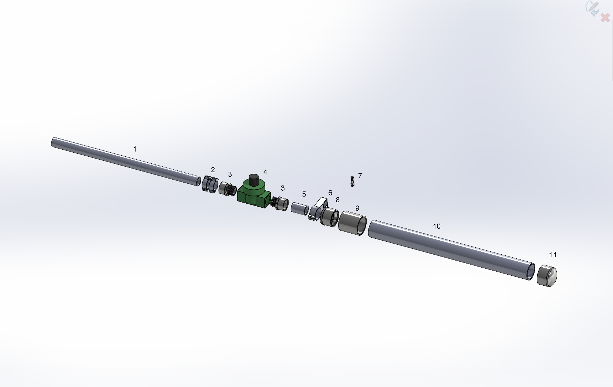

# Pneumatic Antenna Launcher

My design for a pneunatic antenna launcher.

Based on the many pre-existing designs on the web (see links at end). 
My goals were minimal component cost and simplicity, not necessarily maximum performance.

This repository contains a detailed description of construction, plus Solidworks and STL files for a few 3d-printed components.


> [!CAUTION]
> Plenty of people have successfully built and used similar launchers.\
> Then again, there are also people who warn against using PVC pipe in compressed-air applications.\
> The Schedule 40 PVC pipe used in the air tank of this design is rated at 280 psi, and I generally charge it to 25-50 psi.\
> Review cautionary material such as the following before proceeding:  [Can PVC Pipe Be Used for Compressed Air?](https://fluidairedynamics.com/blogs/articles/can-pvc-pipe-be-used-for-compressed-air)


## Construction



| | Qty | Desc | Source |
| :---: | :---: | --- | --- |
| 1 | 20in | 1" PVC pipe, Sch 40 | Home Depot, etc.  $2.96 |
| 2 | 2 | Reel clamp | Reel_Clamp.STL |
| 3 | 2 | PVC Male Adapter, MNPT x Socket, 1 in | Zoro G5275094 $0.67 |
| 4 | 1 | Orbit 57461 1" FPT Jar Top Automatic Sprinkler Valve | Amazon $16.48 |
| 5 | 2in | 1" PVC pipe, Sch 40 |  |
| 6 | 1 | Connector clamp | Connector_Clamp.STL |
| 7 | 1 | GASHER 1/8" NPT Tank Valve, Brass | Amazon $6.95 (pkg of 2) |
| 8 | 1 | PVC Reducing Bushing, Spigot x Socket, 2 in x 1 in Pipe Size | Zoro G5278752 $1.45 |
| 9 | 1 | PVC Coupling, Socket x Socket, 2 in | Zoro G5276433 $2.25 |
| 10 | 24in | 2" PVC pipe, Sch 40 | Home Depot, etc.  $4.94 |
| 11 | 1 | PVC Cap, Socket, 2 in Pipe Size | Zoro G5275225 $1.49 |


Assemble PVC components with the appropriate primer and cement. I used `Weld-On 15900 Twin Pack 780 PVC Regular-Bodied Plumbing Solvent Cement and Purple Plumbing Primer` (Amazon $8.34).

Use yellow Teflon tape on threaded connections. e.g. `Eastman 1/2 Inch x 260 Inch Teflon Pipe Thread for Gas Lines, 4 mil` (Amazon $2.20).


## Projectile ("Spud")


| | Qty | Desc | Source |
| :---: | :---: | --- | --- |
| 1 | 2 | End cap | End_Cap_v3a.STL |
| 2 | 2.5in | 1/2" PVC pipe, Sch 40 | Home Depot, etc.  $1.56 / 24in |

I attached the end caps using self-tapping screws to allow experimenting with additional weight.\
I haven't found this to be necessary, though; the basic 0.7oz spud seems to work fine.

Material cost for each projectile is around $0.25, so you can afford to lose a few in the trees....

The end caps feature a loop to tie the fishing line to without any additional hardware.


Photos of completed launcher:
details of reel, connector, switch box, battery

Performance (height reached?)

Links

## Gratuitous Inclusion of STL Viewer
I just discovered that github allows you to display STL files within your markdown documents, so I'm doing that.

```stl
solid End_Cap_v3a_Ascii
   facet normal 0.000000e+00 -1.000000e+00 0.000000e+00
      outer loop
         vertex 1.150000e+01 0.000000e+00 1.050000e+01
         vertex 1.350000e+01 0.000000e+00 1.050000e+01
         vertex 1.150000e+01 0.000000e+00 1.450000e+01
      endloop
   endfacet
   facet normal 0.000000e+00 -1.000000e+00 0.000000e+00
      outer loop
         vertex 1.150000e+01 0.000000e+00 1.450000e+01
         vertex 1.350000e+01 0.000000e+00 1.050000e+01
         vertex 1.350000e+01 0.000000e+00 1.450000e+01
      endloop
   endfacet
   facet normal -0.000000e+00 -1.000000e+00 0.000000e+00
      outer loop
         vertex 2.448737e+01 0.000000e+00 8.956995e+00
         vertex 1.950000e+01 0.000000e+00 1.050000e+01
         vertex 2.404067e+01 0.000000e+00 7.697616e+00
      endloop
   endfacet
   facet normal -0.000000e+00 -1.000000e+00 0.000000e+00
      outer loop
         vertex 2.404067e+01 0.000000e+00 7.697616e+00
         vertex 1.950000e+01 0.000000e+00 1.050000e+01
         vertex 2.346209e+01 0.000000e+00 6.493117e+00
      endloop
   endfacet
   facet normal 0.000000e+00 -1.000000e+00 -0.000000e+00
      outer loop
         vertex 7.765042e-01 0.000000e+00 1.683701e+01
         vertex 3.805254e-01 0.000000e+00 1.556077e+01
         vertex 5.500000e+00 0.000000e+00 1.450000e+01
      endloop
   endfacet
   facet normal -0.000000e+00 -1.000000e+00 0.000000e+00
      outer loop
         vertex 5.500000e+00 0.000000e+00 1.450000e+01
         vertex 3.805254e-01 0.000000e+00 1.556077e+01
         vertex 1.230435e-01 0.000000e+00 1.424956e+01
      endloop
   endfacet
   facet normal 0.000000e+00 -1.000000e+00 0.000000e+00
      outer loop
         vertex 1.433032e+01 0.000000e+00 2.486527e+01
         vertex 1.299990e+01 0.000000e+00 2.499000e+01
         vertex 1.299078e+01 0.000000e+00 2.490444e+01
      endloop
   endfacet
   facet normal 0.000000e+00 -1.000000e+00 -0.000000e+00
      outer loop
         vertex 1.230435e-01 0.000000e+00 1.424956e+01
         vertex 7.002614e-03 0.000000e+00 1.291835e+01
         vertex 5.500000e+00 0.000000e+00 1.450000e+01
      endloop
   endfacet
   facet normal 0.000000e+00 -1.000000e+00 0.000000e+00
      outer loop
         vertex 5.500000e+00 0.000000e+00 1.450000e+01
         vertex 7.002614e-03 0.000000e+00 1.291835e+01
         vertex 3.372785e-02 0.000000e+00 1.158236e+01
      endloop
   endfacet
   facet normal 0.000000e+00 -1.000000e+00 -0.000000e+00
      outer loop
         vertex 5.500000e+00 0.000000e+00 1.450000e+01
         vertex 3.372785e-02 0.000000e+00 1.158236e+01
         vertex 5.500000e+00 0.000000e+00 1.050000e+01
      endloop
   endfacet
   facet normal -0.000000e+00 -1.000000e+00 0.000000e+00
      outer loop
         vertex 5.500000e+00 0.000000e+00 1.050000e+01
         vertex 3.372785e-02 0.000000e+00 1.158236e+01
         vertex 2.029138e-01 0.000000e+00 1.025686e+01
      endloop
   endfacet
   facet normal 0.000000e+00 -1.000000e+00 0.000000e+00
      outer loop
         vertex 5.500000e+00 0.000000e+00 1.050000e+01
         vertex 2.029138e-01 0.000000e+00 1.025686e+01
         vertex 5.126270e-01 0.000000e+00 8.956995e+00
      endloop
   endfacet
   facet normal 0.000000e+00 -1.000000e+00 -0.000000e+00
      outer loop
         vertex 3.632361e+00 0.000000e+00 2.130994e+01
         vertex 2.742590e+00 0.000000e+00 2.031300e+01
         vertex 1.150000e+01 0.000000e+00 1.450000e+01
      endloop
   endfacet
   facet normal 0.000000e+00 -1.000000e+00 0.000000e+00
      outer loop
         vertex 1.150000e+01 0.000000e+00 1.450000e+01
         vertex 2.742590e+00 0.000000e+00 2.031300e+01
         vertex 1.964323e+00 0.000000e+00 1.922678e+01
      endloop
   endfacet
   facet normal 0.000000e+00 -1.000000e+00 0.000000e+00
      outer loop
         vertex 1.150000e+01 0.000000e+00 1.450000e+01
         vertex 1.964323e+00 0.000000e+00 1.922678e+01
         vertex 5.500000e+00 0.000000e+00 1.450000e+01
      endloop
   endfacet
   facet normal 0.000000e+00 -1.000000e+00 0.000000e+00
      outer loop
         vertex 5.500000e+00 0.000000e+00 1.450000e+01
         vertex 1.964323e+00 0.000000e+00 1.922678e+01
         vertex 1.306456e+00 0.000000e+00 1.806368e+01
      endloop
   endfacet
   facet normal 0.000000e+00 -1.000000e+00 0.000000e+00
      outer loop
         vertex 5.500000e+00 0.000000e+00 1.450000e+01
         vertex 1.306456e+00 0.000000e+00 1.806368e+01
         vertex 7.765042e-01 0.000000e+00 1.683701e+01
      endloop
   endfacet
   facet normal 0.000000e+00 -1.000000e+00 0.000000e+00
      outer loop
         vertex 1.258573e+01 0.000000e+00 2.450740e+01
         vertex 1.350000e+01 0.000000e+00 1.450000e+01
         vertex 1.266892e+01 0.000000e+00 2.452940e+01
      endloop
   endfacet
   facet normal 0.000000e+00 -1.000000e+00 0.000000e+00
      outer loop
         vertex 1.266892e+01 0.000000e+00 2.452940e+01
         vertex 1.350000e+01 0.000000e+00 1.450000e+01
         vertex 1.950000e+01 0.000000e+00 1.450000e+01
      endloop
   endfacet
   facet normal 0.000000e+00 -1.000000e+00 0.000000e+00
      outer loop
         vertex 1.266892e+01 0.000000e+00 2.452940e+01
         vertex 1.950000e+01 0.000000e+00 1.450000e+01
         vertex 1.274711e+01 0.000000e+00 2.456533e+01
      endloop
   endfacet
   facet normal 0.000000e+00 -1.000000e+00 0.000000e+00
      outer loop
         vertex 1.274711e+01 0.000000e+00 2.456533e+01
         vertex 1.950000e+01 0.000000e+00 1.450000e+01
         vertex 1.281798e+01 0.000000e+00 2.461414e+01
      endloop
   endfacet
   facet normal 0.000000e+00 -1.000000e+00 -0.000000e+00
      outer loop
         vertex 1.258573e+01 0.000000e+00 2.450740e+01
         vertex 1.250000e+01 0.000000e+00 2.450000e+01
         vertex 1.350000e+01 0.000000e+00 1.450000e+01
      endloop
   endfacet
   facet normal 0.000000e+00 -1.000000e+00 0.000000e+00
      outer loop
         vertex 1.350000e+01 0.000000e+00 1.450000e+01
         vertex 1.250000e+01 0.000000e+00 2.450000e+01
         vertex 1.241427e+01 0.000000e+00 2.450740e+01
      endloop
   endfacet
   facet normal 0.000000e+00 -1.000000e+00 0.000000e+00
      outer loop
         vertex 1.350000e+01 0.000000e+00 1.450000e+01
         vertex 1.241427e+01 0.000000e+00 2.450740e+01
         vertex 1.233108e+01 0.000000e+00 2.452940e+01
      endloop
   endfacet
   facet normal -0.000000e+00 -1.000000e+00 0.000000e+00
      outer loop
         vertex 1.200922e+01 0.000000e+00 2.490444e+01
         vertex 1.200010e+01 0.000000e+00 2.499000e+01
         vertex 1.066968e+01 0.000000e+00 2.486527e+01
      endloop
   endfacet
   facet normal 0.000000e+00 -1.000000e+00 0.000000e+00
      outer loop
         vertex 7.314062e+00 0.000000e+00 1.126520e+00
         vertex 8.557785e+00 0.000000e+00 6.379206e-01
         vertex 1.350000e+01 0.000000e+00 1.050000e+01
      endloop
   endfacet
   facet normal 0.000000e+00 -1.000000e+00 0.000000e+00
      outer loop
         vertex 1.350000e+01 0.000000e+00 1.050000e+01
         vertex 8.557785e+00 0.000000e+00 6.379206e-01
         vertex 9.846559e+00 0.000000e+00 2.848767e-01
      endloop
   endfacet
   facet normal 0.000000e+00 -1.000000e+00 0.000000e+00
      outer loop
         vertex 1.350000e+01 0.000000e+00 1.050000e+01
         vertex 9.846559e+00 0.000000e+00 2.848767e-01
         vertex 1.116566e+01 0.000000e+00 7.142313e-02
      endloop
   endfacet
   facet normal 0.000000e+00 -1.000000e+00 0.000000e+00
      outer loop
         vertex 1.116566e+01 0.000000e+00 7.142313e-02
         vertex 1.250000e+01 0.000000e+00 0.000000e+00
         vertex 1.350000e+01 0.000000e+00 1.050000e+01
      endloop
   endfacet
   facet normal 0.000000e+00 -1.000000e+00 -0.000000e+00
      outer loop
         vertex 1.350000e+01 0.000000e+00 1.050000e+01
         vertex 1.250000e+01 0.000000e+00 0.000000e+00
         vertex 1.383435e+01 0.000000e+00 7.142313e-02
      endloop
   endfacet
   facet normal 0.000000e+00 -1.000000e+00 0.000000e+00
      outer loop
         vertex 1.350000e+01 0.000000e+00 1.050000e+01
         vertex 1.383435e+01 0.000000e+00 7.142313e-02
         vertex 1.515344e+01 0.000000e+00 2.848767e-01
      endloop
   endfacet
   facet normal -0.000000e+00 -1.000000e+00 0.000000e+00
      outer loop
         vertex 2.346209e+01 0.000000e+00 6.493117e+00
         vertex 1.950000e+01 0.000000e+00 1.050000e+01
         vertex 2.275823e+01 0.000000e+00 5.357263e+00
      endloop
   endfacet
   facet normal 0.000000e+00 -1.000000e+00 0.000000e+00
      outer loop
         vertex 2.275823e+01 0.000000e+00 5.357263e+00
         vertex 1.950000e+01 0.000000e+00 1.050000e+01
         vertex 1.350000e+01 0.000000e+00 1.050000e+01
      endloop
   endfacet
   facet normal -0.000000e+00 -1.000000e+00 0.000000e+00
      outer loop
         vertex 2.275823e+01 0.000000e+00 5.357263e+00
         vertex 1.350000e+01 0.000000e+00 1.050000e+01
         vertex 2.193715e+01 0.000000e+00 4.303033e+00
      endloop
   endfacet
   facet normal 0.000000e+00 -1.000000e+00 0.000000e+00
      outer loop
         vertex 5.126270e-01 0.000000e+00 8.956995e+00
         vertex 9.593284e-01 0.000000e+00 7.697616e+00
         vertex 5.500000e+00 0.000000e+00 1.050000e+01
      endloop
   endfacet
   facet normal 0.000000e+00 -1.000000e+00 0.000000e+00
      outer loop
         vertex 5.500000e+00 0.000000e+00 1.050000e+01
         vertex 9.593284e-01 0.000000e+00 7.697616e+00
         vertex 1.537913e+00 0.000000e+00 6.493117e+00
      endloop
   endfacet
   facet normal 0.000000e+00 -1.000000e+00 -0.000000e+00
      outer loop
         vertex 5.500000e+00 0.000000e+00 1.050000e+01
         vertex 1.537913e+00 0.000000e+00 6.493117e+00
         vertex 1.150000e+01 0.000000e+00 1.050000e+01
      endloop
   endfacet
   facet normal 0.000000e+00 -1.000000e+00 0.000000e+00
      outer loop
         vertex 1.150000e+01 0.000000e+00 1.050000e+01
         vertex 1.537913e+00 0.000000e+00 6.493117e+00
         vertex 2.241769e+00 0.000000e+00 5.357263e+00
      endloop
   endfacet
   facet normal 0.000000e+00 -1.000000e+00 0.000000e+00
      outer loop
         vertex 1.150000e+01 0.000000e+00 1.050000e+01
         vertex 2.241769e+00 0.000000e+00 5.357263e+00
         vertex 3.062854e+00 0.000000e+00 4.303033e+00
      endloop
   endfacet
   facet normal 0.000000e+00 -1.000000e+00 0.000000e+00
      outer loop
         vertex 1.296713e+01 0.000000e+00 2.482170e+01
         vertex 2.037653e+01 0.000000e+00 2.220620e+01
         vertex 1.929541e+01 0.000000e+00 2.299154e+01
      endloop
   endfacet
   facet normal -0.000000e+00 -1.000000e+00 0.000000e+00
      outer loop
         vertex 1.225289e+01 0.000000e+00 2.456533e+01
         vertex 1.218202e+01 0.000000e+00 2.461414e+01
         vertex 5.704588e+00 0.000000e+00 2.299154e+01
      endloop
   endfacet
   facet normal -0.000000e+00 -1.000000e+00 0.000000e+00
      outer loop
         vertex 1.218202e+01 0.000000e+00 2.461414e+01
         vertex 1.212057e+01 0.000000e+00 2.467437e+01
         vertex 5.704588e+00 0.000000e+00 2.299154e+01
      endloop
   endfacet
   facet normal 0.000000e+00 -1.000000e+00 0.000000e+00
      outer loop
         vertex 5.704588e+00 0.000000e+00 2.299154e+01
         vertex 1.212057e+01 0.000000e+00 2.467437e+01
         vertex 1.207036e+01 0.000000e+00 2.474425e+01
      endloop
   endfacet
   facet normal 0.000000e+00 -1.000000e+00 0.000000e+00
      outer loop
         vertex 5.704588e+00 0.000000e+00 2.299154e+01
         vertex 1.207036e+01 0.000000e+00 2.474425e+01
         vertex 1.203287e+01 0.000000e+00 2.482170e+01
      endloop
   endfacet
   facet normal 0.000000e+00 -1.000000e+00 0.000000e+00
      outer loop
         vertex 2.448737e+01 0.000000e+00 8.956995e+00
         vertex 2.479709e+01 0.000000e+00 1.025686e+01
         vertex 1.950000e+01 0.000000e+00 1.050000e+01
      endloop
   endfacet
   facet normal 0.000000e+00 -1.000000e+00 0.000000e+00
      outer loop
         vertex 1.950000e+01 0.000000e+00 1.050000e+01
         vertex 2.479709e+01 0.000000e+00 1.025686e+01
         vertex 2.496627e+01 0.000000e+00 1.158236e+01
      endloop
   endfacet
   facet normal 0.000000e+00 -1.000000e+00 0.000000e+00
      outer loop
         vertex 1.950000e+01 0.000000e+00 1.050000e+01
         vertex 2.496627e+01 0.000000e+00 1.158236e+01
         vertex 1.950000e+01 0.000000e+00 1.450000e+01
      endloop
   endfacet
   facet normal 0.000000e+00 -1.000000e+00 0.000000e+00
      outer loop
         vertex 1.950000e+01 0.000000e+00 1.450000e+01
         vertex 2.496627e+01 0.000000e+00 1.158236e+01
         vertex 2.499300e+01 0.000000e+00 1.291835e+01
      endloop
   endfacet
   facet normal 0.000000e+00 -1.000000e+00 0.000000e+00
      outer loop
         vertex 1.950000e+01 0.000000e+00 1.450000e+01
         vertex 2.499300e+01 0.000000e+00 1.291835e+01
         vertex 2.487696e+01 0.000000e+00 1.424956e+01
      endloop
   endfacet
   facet normal 0.000000e+00 -1.000000e+00 0.000000e+00
      outer loop
         vertex 2.487696e+01 0.000000e+00 1.424956e+01
         vertex 2.461948e+01 0.000000e+00 1.556077e+01
         vertex 1.950000e+01 0.000000e+00 1.450000e+01
      endloop
   endfacet
   facet normal 0.000000e+00 -1.000000e+00 0.000000e+00
      outer loop
         vertex 1.950000e+01 0.000000e+00 1.450000e+01
         vertex 2.461948e+01 0.000000e+00 1.556077e+01
         vertex 2.422350e+01 0.000000e+00 1.683701e+01
      endloop
   endfacet
   facet normal 0.000000e+00 -1.000000e+00 0.000000e+00
      outer loop
         vertex 1.950000e+01 0.000000e+00 1.450000e+01
         vertex 2.422350e+01 0.000000e+00 1.683701e+01
         vertex 2.369354e+01 0.000000e+00 1.806368e+01
      endloop
   endfacet
   facet normal 0.000000e+00 -1.000000e+00 0.000000e+00
      outer loop
         vertex 3.062854e+00 0.000000e+00 4.303033e+00
         vertex 3.991783e+00 0.000000e+00 3.342477e+00
         vertex 1.150000e+01 0.000000e+00 1.050000e+01
      endloop
   endfacet
   facet normal 0.000000e+00 -1.000000e+00 0.000000e+00
      outer loop
         vertex 1.150000e+01 0.000000e+00 1.050000e+01
         vertex 3.991783e+00 0.000000e+00 3.342477e+00
         vertex 5.017940e+00 0.000000e+00 2.486570e+00
      endloop
   endfacet
   facet normal 0.000000e+00 -1.000000e+00 -0.000000e+00
      outer loop
         vertex 1.150000e+01 0.000000e+00 1.050000e+01
         vertex 5.017940e+00 0.000000e+00 2.486570e+00
         vertex 1.350000e+01 0.000000e+00 1.050000e+01
      endloop
   endfacet
   facet normal 0.000000e+00 -1.000000e+00 0.000000e+00
      outer loop
         vertex 1.350000e+01 0.000000e+00 1.050000e+01
         vertex 5.017940e+00 0.000000e+00 2.486570e+00
         vertex 6.129602e+00 0.000000e+00 1.745094e+00
      endloop
   endfacet
   facet normal 0.000000e+00 -1.000000e+00 0.000000e+00
      outer loop
         vertex 1.350000e+01 0.000000e+00 1.050000e+01
         vertex 6.129602e+00 0.000000e+00 1.745094e+00
         vertex 7.314062e+00 0.000000e+00 1.126520e+00
      endloop
   endfacet
   facet normal 0.000000e+00 -1.000000e+00 0.000000e+00
      outer loop
         vertex 1.515344e+01 0.000000e+00 2.848767e-01
         vertex 1.644222e+01 0.000000e+00 6.379206e-01
         vertex 1.350000e+01 0.000000e+00 1.050000e+01
      endloop
   endfacet
   facet normal 0.000000e+00 -1.000000e+00 0.000000e+00
      outer loop
         vertex 1.350000e+01 0.000000e+00 1.050000e+01
         vertex 1.644222e+01 0.000000e+00 6.379206e-01
         vertex 1.768594e+01 0.000000e+00 1.126520e+00
      endloop
   endfacet
   facet normal 0.000000e+00 -1.000000e+00 0.000000e+00
      outer loop
         vertex 1.350000e+01 0.000000e+00 1.050000e+01
         vertex 1.768594e+01 0.000000e+00 1.126520e+00
         vertex 1.887040e+01 0.000000e+00 1.745094e+00
      endloop
   endfacet
   facet normal 0.000000e+00 -1.000000e+00 0.000000e+00
      outer loop
         vertex 1.887040e+01 0.000000e+00 1.745094e+00
         vertex 1.998206e+01 0.000000e+00 2.486570e+00
         vertex 1.350000e+01 0.000000e+00 1.050000e+01
      endloop
   endfacet
   facet normal 0.000000e+00 -1.000000e+00 0.000000e+00
      outer loop
         vertex 1.350000e+01 0.000000e+00 1.050000e+01
         vertex 1.998206e+01 0.000000e+00 2.486570e+00
         vertex 2.100822e+01 0.000000e+00 3.342477e+00
      endloop
   endfacet
   facet normal 0.000000e+00 -1.000000e+00 0.000000e+00
      outer loop
         vertex 1.350000e+01 0.000000e+00 1.050000e+01
         vertex 2.100822e+01 0.000000e+00 3.342477e+00
         vertex 2.193715e+01 0.000000e+00 4.303033e+00
      endloop
   endfacet
   facet normal -0.000000e+00 -1.000000e+00 -0.000000e+00
      outer loop
         vertex 1.233108e+01 0.000000e+00 2.452940e+01
         vertex 1.225289e+01 0.000000e+00 2.456533e+01
         vertex 1.350000e+01 0.000000e+00 1.450000e+01
      endloop
   endfacet
   facet normal 0.000000e+00 -1.000000e+00 0.000000e+00
      outer loop
         vertex 1.350000e+01 0.000000e+00 1.450000e+01
         vertex 1.225289e+01 0.000000e+00 2.456533e+01
         vertex 5.704588e+00 0.000000e+00 2.299154e+01
      endloop
   endfacet
   facet normal 0.000000e+00 -1.000000e+00 0.000000e+00
      outer loop
         vertex 1.350000e+01 0.000000e+00 1.450000e+01
         vertex 5.704588e+00 0.000000e+00 2.299154e+01
         vertex 1.150000e+01 0.000000e+00 1.450000e+01
      endloop
   endfacet
   facet normal 0.000000e+00 -1.000000e+00 0.000000e+00
      outer loop
         vertex 1.150000e+01 0.000000e+00 1.450000e+01
         vertex 5.704588e+00 0.000000e+00 2.299154e+01
         vertex 4.623469e+00 0.000000e+00 2.220620e+01
      endloop
   endfacet
   facet normal 0.000000e+00 -1.000000e+00 0.000000e+00
      outer loop
         vertex 1.150000e+01 0.000000e+00 1.450000e+01
         vertex 4.623469e+00 0.000000e+00 2.220620e+01
         vertex 3.632361e+00 0.000000e+00 2.130994e+01
      endloop
   endfacet
   facet normal -0.000000e+00 -1.000000e+00 -0.000000e+00
      outer loop
         vertex 2.037653e+01 0.000000e+00 2.220620e+01
         vertex 1.296713e+01 0.000000e+00 2.482170e+01
         vertex 2.136764e+01 0.000000e+00 2.130994e+01
      endloop
   endfacet
   facet normal 0.000000e+00 -1.000000e+00 0.000000e+00
      outer loop
         vertex 2.136764e+01 0.000000e+00 2.130994e+01
         vertex 1.296713e+01 0.000000e+00 2.482170e+01
         vertex 1.292964e+01 0.000000e+00 2.474425e+01
      endloop
   endfacet
   facet normal -0.000000e+00 -1.000000e+00 -0.000000e+00
      outer loop
         vertex 2.136764e+01 0.000000e+00 2.130994e+01
         vertex 1.292964e+01 0.000000e+00 2.474425e+01
         vertex 2.225741e+01 0.000000e+00 2.031300e+01
      endloop
   endfacet
   facet normal 0.000000e+00 -1.000000e+00 -0.000000e+00
      outer loop
         vertex 1.066968e+01 0.000000e+00 2.486527e+01
         vertex 9.360174e+00 0.000000e+00 2.459924e+01
         vertex 1.200922e+01 0.000000e+00 2.490444e+01
      endloop
   endfacet
   facet normal 0.000000e+00 -1.000000e+00 0.000000e+00
      outer loop
         vertex 1.200922e+01 0.000000e+00 2.490444e+01
         vertex 9.360174e+00 0.000000e+00 2.459924e+01
         vertex 8.086551e+00 0.000000e+00 2.419493e+01
      endloop
   endfacet
   facet normal 0.000000e+00 -1.000000e+00 -0.000000e+00
      outer loop
         vertex 1.200922e+01 0.000000e+00 2.490444e+01
         vertex 8.086551e+00 0.000000e+00 2.419493e+01
         vertex 1.203287e+01 0.000000e+00 2.482170e+01
      endloop
   endfacet
   facet normal 0.000000e+00 -1.000000e+00 0.000000e+00
      outer loop
         vertex 1.203287e+01 0.000000e+00 2.482170e+01
         vertex 8.086551e+00 0.000000e+00 2.419493e+01
         vertex 6.863362e+00 0.000000e+00 2.365698e+01
      endloop
   endfacet
   facet normal 0.000000e+00 -1.000000e+00 0.000000e+00
      outer loop
         vertex 1.203287e+01 0.000000e+00 2.482170e+01
         vertex 6.863362e+00 0.000000e+00 2.365698e+01
         vertex 5.704588e+00 0.000000e+00 2.299154e+01
      endloop
   endfacet
   facet normal 0.000000e+00 -1.000000e+00 0.000000e+00
      outer loop
         vertex 1.929541e+01 0.000000e+00 2.299154e+01
         vertex 1.813664e+01 0.000000e+00 2.365698e+01
         vertex 1.296713e+01 0.000000e+00 2.482170e+01
      endloop
   endfacet
   facet normal 0.000000e+00 -1.000000e+00 0.000000e+00
      outer loop
         vertex 1.296713e+01 0.000000e+00 2.482170e+01
         vertex 1.813664e+01 0.000000e+00 2.365698e+01
         vertex 1.691345e+01 0.000000e+00 2.419493e+01
      endloop
   endfacet
   facet normal 0.000000e+00 -1.000000e+00 0.000000e+00
      outer loop
         vertex 1.296713e+01 0.000000e+00 2.482170e+01
         vertex 1.691345e+01 0.000000e+00 2.419493e+01
         vertex 1.299078e+01 0.000000e+00 2.490444e+01
      endloop
   endfacet
   facet normal 0.000000e+00 -1.000000e+00 0.000000e+00
      outer loop
         vertex 1.299078e+01 0.000000e+00 2.490444e+01
         vertex 1.691345e+01 0.000000e+00 2.419493e+01
         vertex 1.563983e+01 0.000000e+00 2.459924e+01
      endloop
   endfacet
   facet normal 0.000000e+00 -1.000000e+00 0.000000e+00
      outer loop
         vertex 1.299078e+01 0.000000e+00 2.490444e+01
         vertex 1.563983e+01 0.000000e+00 2.459924e+01
         vertex 1.433032e+01 0.000000e+00 2.486527e+01
      endloop
   endfacet
   facet normal 0.000000e+00 -1.000000e+00 0.000000e+00
      outer loop
         vertex 1.281798e+01 0.000000e+00 2.461414e+01
         vertex 1.950000e+01 0.000000e+00 1.450000e+01
         vertex 1.287943e+01 0.000000e+00 2.467437e+01
      endloop
   endfacet
   facet normal 0.000000e+00 -1.000000e+00 0.000000e+00
      outer loop
         vertex 1.287943e+01 0.000000e+00 2.467437e+01
         vertex 1.950000e+01 0.000000e+00 1.450000e+01
         vertex 2.369354e+01 0.000000e+00 1.806368e+01
      endloop
   endfacet
   facet normal 0.000000e+00 -1.000000e+00 0.000000e+00
      outer loop
         vertex 1.287943e+01 0.000000e+00 2.467437e+01
         vertex 2.369354e+01 0.000000e+00 1.806368e+01
         vertex 1.292964e+01 0.000000e+00 2.474425e+01
      endloop
   endfacet
   facet normal 0.000000e+00 -1.000000e+00 0.000000e+00
      outer loop
         vertex 1.292964e+01 0.000000e+00 2.474425e+01
         vertex 2.369354e+01 0.000000e+00 1.806368e+01
         vertex 2.303568e+01 0.000000e+00 1.922678e+01
      endloop
   endfacet
   facet normal 0.000000e+00 -1.000000e+00 0.000000e+00
      outer loop
         vertex 1.292964e+01 0.000000e+00 2.474425e+01
         vertex 2.303568e+01 0.000000e+00 1.922678e+01
         vertex 2.225741e+01 0.000000e+00 2.031300e+01
      endloop
   endfacet
   facet normal 9.334169e-02 0.000000e+00 9.956341e-01
      outer loop
         vertex 1.299990e+01 5.000000e+00 2.499000e+01
         vertex 1.299990e+01 0.000000e+00 2.499000e+01
         vertex 1.433032e+01 0.000000e+00 2.486527e+01
      endloop
   endfacet
   facet normal 9.334169e-02 0.000000e+00 9.956341e-01
      outer loop
         vertex 1.299990e+01 5.000000e+00 2.499000e+01
         vertex 1.433032e+01 0.000000e+00 2.486527e+01
         vertex 1.433032e+01 5.000000e+00 2.486527e+01
      endloop
   endfacet
   facet normal 1.990907e-01 0.000000e+00 9.799811e-01
      outer loop
         vertex 1.433032e+01 5.000000e+00 2.486527e+01
         vertex 1.433032e+01 0.000000e+00 2.486527e+01
         vertex 1.563983e+01 0.000000e+00 2.459924e+01
      endloop
   endfacet
   facet normal 1.990907e-01 0.000000e+00 9.799811e-01
      outer loop
         vertex 1.433032e+01 5.000000e+00 2.486527e+01
         vertex 1.563983e+01 0.000000e+00 2.459924e+01
         vertex 1.563983e+01 5.000000e+00 2.459924e+01
      endloop
   endfacet
   facet normal 3.025635e-01 0.000000e+00 9.531292e-01
      outer loop
         vertex 1.563983e+01 5.000000e+00 2.459924e+01
         vertex 1.563983e+01 0.000000e+00 2.459924e+01
         vertex 1.691345e+01 0.000000e+00 2.419493e+01
      endloop
   endfacet
   facet normal 3.025635e-01 0.000000e+00 9.531292e-01
      outer loop
         vertex 1.563983e+01 5.000000e+00 2.459924e+01
         vertex 1.691345e+01 0.000000e+00 2.419493e+01
         vertex 1.691345e+01 5.000000e+00 2.419493e+01
      endloop
   endfacet
   facet normal 4.025792e-01 0.000000e+00 9.153851e-01
      outer loop
         vertex 1.691345e+01 5.000000e+00 2.419493e+01
         vertex 1.691345e+01 0.000000e+00 2.419493e+01
         vertex 1.813664e+01 0.000000e+00 2.365698e+01
      endloop
   endfacet
   facet normal 4.025792e-01 0.000000e+00 9.153851e-01
      outer loop
         vertex 1.691345e+01 5.000000e+00 2.419493e+01
         vertex 1.813664e+01 0.000000e+00 2.365698e+01
         vertex 1.813664e+01 5.000000e+00 2.365698e+01
      endloop
   endfacet
   facet normal 4.979938e-01 0.000000e+00 8.671806e-01
      outer loop
         vertex 1.813664e+01 5.000000e+00 2.365698e+01
         vertex 1.813664e+01 0.000000e+00 2.365698e+01
         vertex 1.929541e+01 0.000000e+00 2.299154e+01
      endloop
   endfacet
   facet normal 4.979938e-01 0.000000e+00 8.671806e-01
      outer loop
         vertex 1.813664e+01 5.000000e+00 2.365698e+01
         vertex 1.929541e+01 0.000000e+00 2.299154e+01
         vertex 1.929541e+01 5.000000e+00 2.299154e+01
      endloop
   endfacet
   facet normal 5.877175e-01 0.000000e+00 8.090662e-01
      outer loop
         vertex 1.929541e+01 5.000000e+00 2.299154e+01
         vertex 1.929541e+01 0.000000e+00 2.299154e+01
         vertex 2.037653e+01 0.000000e+00 2.220620e+01
      endloop
   endfacet
   facet normal 5.877175e-01 0.000000e+00 8.090662e-01
      outer loop
         vertex 1.929541e+01 5.000000e+00 2.299154e+01
         vertex 2.037653e+01 0.000000e+00 2.220620e+01
         vertex 2.037653e+01 5.000000e+00 2.220620e+01
      endloop
   endfacet
   facet normal 6.707258e-01 0.000000e+00 7.417054e-01
      outer loop
         vertex 2.037653e+01 5.000000e+00 2.220620e+01
         vertex 2.037653e+01 0.000000e+00 2.220620e+01
         vertex 2.136764e+01 0.000000e+00 2.130994e+01
      endloop
   endfacet
   facet normal 6.707258e-01 0.000000e+00 7.417054e-01
      outer loop
         vertex 2.037653e+01 5.000000e+00 2.220620e+01
         vertex 2.136764e+01 0.000000e+00 2.130994e+01
         vertex 2.136764e+01 5.000000e+00 2.130994e+01
      endloop
   endfacet
   facet normal 7.460687e-01 0.000000e+00 6.658690e-01
      outer loop
         vertex 2.136764e+01 5.000000e+00 2.130994e+01
         vertex 2.136764e+01 0.000000e+00 2.130994e+01
         vertex 2.225741e+01 0.000000e+00 2.031300e+01
      endloop
   endfacet
   facet normal 7.460687e-01 0.000000e+00 6.658690e-01
      outer loop
         vertex 2.136764e+01 5.000000e+00 2.130994e+01
         vertex 2.225741e+01 0.000000e+00 2.031300e+01
         vertex 2.225741e+01 5.000000e+00 2.031300e+01
      endloop
   endfacet
   facet normal 8.128851e-01 0.000000e+00 5.824240e-01
      outer loop
         vertex 2.225741e+01 5.000000e+00 2.031300e+01
         vertex 2.225741e+01 0.000000e+00 2.031300e+01
         vertex 2.303568e+01 0.000000e+00 1.922678e+01
      endloop
   endfacet
   facet normal 8.128851e-01 0.000000e+00 5.824240e-01
      outer loop
         vertex 2.225741e+01 5.000000e+00 2.031300e+01
         vertex 2.303568e+01 0.000000e+00 1.922678e+01
         vertex 2.303568e+01 5.000000e+00 1.922678e+01
      endloop
   endfacet
   facet normal 8.704132e-01 0.000000e+00 4.923220e-01
      outer loop
         vertex 2.303568e+01 5.000000e+00 1.922678e+01
         vertex 2.303568e+01 0.000000e+00 1.922678e+01
         vertex 2.369354e+01 0.000000e+00 1.806368e+01
      endloop
   endfacet
   facet normal 8.704132e-01 0.000000e+00 4.923220e-01
      outer loop
         vertex 2.303568e+01 5.000000e+00 1.922678e+01
         vertex 2.369354e+01 0.000000e+00 1.806368e+01
         vertex 2.369354e+01 5.000000e+00 1.806368e+01
      endloop
   endfacet
   facet normal 9.179939e-01 0.000000e+00 3.965944e-01
      outer loop
         vertex 2.369354e+01 5.000000e+00 1.806368e+01
         vertex 2.369354e+01 0.000000e+00 1.806368e+01
         vertex 2.422350e+01 0.000000e+00 1.683701e+01
      endloop
   endfacet
   facet normal 9.179939e-01 0.000000e+00 3.965944e-01
      outer loop
         vertex 2.369354e+01 5.000000e+00 1.806368e+01
         vertex 2.422350e+01 0.000000e+00 1.683701e+01
         vertex 2.422350e+01 5.000000e+00 1.683701e+01
      endloop
   endfacet
   facet normal 9.550841e-01 0.000000e+00 2.963347e-01
      outer loop
         vertex 2.422350e+01 5.000000e+00 1.683701e+01
         vertex 2.422350e+01 0.000000e+00 1.683701e+01
         vertex 2.461948e+01 0.000000e+00 1.556077e+01
      endloop
   endfacet
   facet normal 9.550841e-01 0.000000e+00 2.963347e-01
      outer loop
         vertex 2.422350e+01 5.000000e+00 1.683701e+01
         vertex 2.461948e+01 0.000000e+00 1.556077e+01
         vertex 2.461948e+01 5.000000e+00 1.556077e+01
      endloop
   endfacet
   facet normal 9.812599e-01 0.000000e+00 1.926891e-01
      outer loop
         vertex 2.461948e+01 5.000000e+00 1.556077e+01
         vertex 2.461948e+01 0.000000e+00 1.556077e+01
         vertex 2.487696e+01 0.000000e+00 1.424956e+01
      endloop
   endfacet
   facet normal 9.812599e-01 0.000000e+00 1.926891e-01
      outer loop
         vertex 2.461948e+01 5.000000e+00 1.556077e+01
         vertex 2.487696e+01 0.000000e+00 1.424956e+01
         vertex 2.487696e+01 5.000000e+00 1.424956e+01
      endloop
   endfacet
   facet normal 9.962222e-01 0.000000e+00 8.684040e-02
      outer loop
         vertex 2.487696e+01 5.000000e+00 1.424956e+01
         vertex 2.487696e+01 0.000000e+00 1.424956e+01
         vertex 2.499300e+01 0.000000e+00 1.291835e+01
      endloop
   endfacet
   facet normal 9.962222e-01 0.000000e+00 8.684040e-02
      outer loop
         vertex 2.487696e+01 5.000000e+00 1.424956e+01
         vertex 2.499300e+01 0.000000e+00 1.291835e+01
         vertex 2.499300e+01 5.000000e+00 1.291835e+01
      endloop
   endfacet
   facet normal 9.998000e-01 0.000000e+00 -2.000010e-02
      outer loop
         vertex 2.499300e+01 5.000000e+00 1.291835e+01
         vertex 2.499300e+01 0.000000e+00 1.291835e+01
         vertex 2.496627e+01 0.000000e+00 1.158236e+01
      endloop
   endfacet
   facet normal 9.998000e-01 0.000000e+00 -2.000010e-02
      outer loop
         vertex 2.499300e+01 5.000000e+00 1.291835e+01
         vertex 2.496627e+01 0.000000e+00 1.158236e+01
         vertex 2.496627e+01 5.000000e+00 1.158236e+01
      endloop
   endfacet
   facet normal 9.919523e-01 0.000000e+00 -1.266120e-01
      outer loop
         vertex 2.496627e+01 5.000000e+00 1.158236e+01
         vertex 2.496627e+01 0.000000e+00 1.158236e+01
         vertex 2.479709e+01 0.000000e+00 1.025686e+01
      endloop
   endfacet
   facet normal 9.919523e-01 0.000000e+00 -1.266120e-01
      outer loop
         vertex 2.496627e+01 5.000000e+00 1.158236e+01
         vertex 2.479709e+01 0.000000e+00 1.025686e+01
         vertex 2.479709e+01 5.000000e+00 1.025686e+01
      endloop
   endfacet
   facet normal 9.727690e-01 0.000000e+00 -2.317770e-01
      outer loop
         vertex 2.479709e+01 5.000000e+00 1.025686e+01
         vertex 2.479709e+01 0.000000e+00 1.025686e+01
         vertex 2.448737e+01 0.000000e+00 8.956995e+00
      endloop
   endfacet
   facet normal 9.727690e-01 0.000000e+00 -2.317770e-01
      outer loop
         vertex 2.479709e+01 5.000000e+00 1.025686e+01
         vertex 2.448737e+01 0.000000e+00 8.956995e+00
         vertex 2.448737e+01 5.000000e+00 8.956995e+00
      endloop
   endfacet
   facet normal 9.424690e-01 0.000000e+00 -3.342936e-01
      outer loop
         vertex 2.448737e+01 5.000000e+00 8.956995e+00
         vertex 2.448737e+01 0.000000e+00 8.956995e+00
         vertex 2.404067e+01 0.000000e+00 7.697616e+00
      endloop
   endfacet
   facet normal 9.424690e-01 0.000000e+00 -3.342936e-01
      outer loop
         vertex 2.448737e+01 5.000000e+00 8.956995e+00
         vertex 2.404067e+01 0.000000e+00 7.697616e+00
         vertex 2.404067e+01 5.000000e+00 7.697616e+00
      endloop
   endfacet
   facet normal 9.013988e-01 0.000000e+00 -4.329899e-01
      outer loop
         vertex 2.404067e+01 5.000000e+00 7.697616e+00
         vertex 2.404067e+01 0.000000e+00 7.697616e+00
         vertex 2.346209e+01 0.000000e+00 6.493117e+00
      endloop
   endfacet
   facet normal 9.013988e-01 0.000000e+00 -4.329899e-01
      outer loop
         vertex 2.404067e+01 5.000000e+00 7.697616e+00
         vertex 2.346209e+01 0.000000e+00 6.493117e+00
         vertex 2.346209e+01 5.000000e+00 6.493117e+00
      endloop
   endfacet
   facet normal 8.500280e-01 0.000000e+00 -5.267374e-01
      outer loop
         vertex 2.346209e+01 5.000000e+00 6.493117e+00
         vertex 2.346209e+01 0.000000e+00 6.493117e+00
         vertex 2.275823e+01 0.000000e+00 5.357263e+00
      endloop
   endfacet
   facet normal 8.500280e-01 0.000000e+00 -5.267374e-01
      outer loop
         vertex 2.346209e+01 5.000000e+00 6.493117e+00
         vertex 2.275823e+01 0.000000e+00 5.357263e+00
         vertex 2.275823e+01 5.000000e+00 5.357263e+00
      endloop
   endfacet
   facet normal 7.889427e-01 0.000000e+00 -6.144668e-01
      outer loop
         vertex 2.275823e+01 5.000000e+00 5.357263e+00
         vertex 2.275823e+01 0.000000e+00 5.357263e+00
         vertex 2.193715e+01 0.000000e+00 4.303033e+00
      endloop
   endfacet
   facet normal 7.889427e-01 0.000000e+00 -6.144668e-01
      outer loop
         vertex 2.275823e+01 5.000000e+00 5.357263e+00
         vertex 2.193715e+01 0.000000e+00 4.303033e+00
         vertex 2.193715e+01 5.000000e+00 4.303033e+00
      endloop
   endfacet
   facet normal 7.188422e-01 0.000000e+00 -6.951733e-01
      outer loop
         vertex 2.193715e+01 5.000000e+00 4.303033e+00
         vertex 2.193715e+01 0.000000e+00 4.303033e+00
         vertex 2.100822e+01 0.000000e+00 3.342477e+00
      endloop
   endfacet
   facet normal 7.188422e-01 0.000000e+00 -6.951733e-01
      outer loop
         vertex 2.193715e+01 5.000000e+00 4.303033e+00
         vertex 2.100822e+01 0.000000e+00 3.342477e+00
         vertex 2.100822e+01 5.000000e+00 3.342477e+00
      endloop
   endfacet
   facet normal 6.405268e-01 0.000000e+00 -7.679358e-01
      outer loop
         vertex 2.100822e+01 5.000000e+00 3.342477e+00
         vertex 2.100822e+01 0.000000e+00 3.342477e+00
         vertex 1.998206e+01 0.000000e+00 2.486570e+00
      endloop
   endfacet
   facet normal 6.405268e-01 0.000000e+00 -7.679358e-01
      outer loop
         vertex 2.100822e+01 5.000000e+00 3.342477e+00
         vertex 1.998206e+01 0.000000e+00 2.486570e+00
         vertex 1.998206e+01 5.000000e+00 2.486570e+00
      endloop
   endfacet
   facet normal 5.548913e-01 0.000000e+00 -8.319229e-01
      outer loop
         vertex 1.998206e+01 5.000000e+00 2.486570e+00
         vertex 1.998206e+01 0.000000e+00 2.486570e+00
         vertex 1.887040e+01 0.000000e+00 1.745094e+00
      endloop
   endfacet
   facet normal 5.548913e-01 0.000000e+00 -8.319229e-01
      outer loop
         vertex 1.998206e+01 5.000000e+00 2.486570e+00
         vertex 1.887040e+01 0.000000e+00 1.745094e+00
         vertex 1.887040e+01 5.000000e+00 1.745094e+00
      endloop
   endfacet
   facet normal 4.629154e-01 0.000000e+00 -8.864025e-01
      outer loop
         vertex 1.887040e+01 5.000000e+00 1.745094e+00
         vertex 1.887040e+01 0.000000e+00 1.745094e+00
         vertex 1.768594e+01 0.000000e+00 1.126520e+00
      endloop
   endfacet
   facet normal 4.629154e-01 0.000000e+00 -8.864025e-01
      outer loop
         vertex 1.887040e+01 5.000000e+00 1.745094e+00
         vertex 1.768594e+01 0.000000e+00 1.126520e+00
         vertex 1.768594e+01 5.000000e+00 1.126520e+00
      endloop
   endfacet
   facet normal 3.656487e-01 0.000000e+00 -9.307530e-01
      outer loop
         vertex 1.768594e+01 5.000000e+00 1.126520e+00
         vertex 1.768594e+01 0.000000e+00 1.126520e+00
         vertex 1.644222e+01 0.000000e+00 6.379206e-01
      endloop
   endfacet
   facet normal 3.656487e-01 0.000000e+00 -9.307530e-01
      outer loop
         vertex 1.768594e+01 5.000000e+00 1.126520e+00
         vertex 1.644222e+01 0.000000e+00 6.379206e-01
         vertex 1.644222e+01 5.000000e+00 6.379206e-01
      endloop
   endfacet
   facet normal 2.642039e-01 0.000000e+00 -9.644668e-01
      outer loop
         vertex 1.644222e+01 5.000000e+00 6.379206e-01
         vertex 1.644222e+01 0.000000e+00 6.379206e-01
         vertex 1.515344e+01 0.000000e+00 2.848767e-01
      endloop
   endfacet
   facet normal 2.642039e-01 0.000000e+00 -9.644668e-01
      outer loop
         vertex 1.644222e+01 5.000000e+00 6.379206e-01
         vertex 1.515344e+01 0.000000e+00 2.848767e-01
         vertex 1.515344e+01 5.000000e+00 2.848767e-01
      endloop
   endfacet
   facet normal 1.597401e-01 0.000000e+00 -9.871591e-01
      outer loop
         vertex 1.515344e+01 5.000000e+00 2.848767e-01
         vertex 1.515344e+01 0.000000e+00 2.848767e-01
         vertex 1.383435e+01 0.000000e+00 7.142313e-02
      endloop
   endfacet
   facet normal 1.597401e-01 0.000000e+00 -9.871591e-01
      outer loop
         vertex 1.515344e+01 5.000000e+00 2.848767e-01
         vertex 1.383435e+01 0.000000e+00 7.142313e-02
         vertex 1.383435e+01 5.000000e+00 7.142313e-02
      endloop
   endfacet
   facet normal 5.345022e-02 0.000000e+00 -9.985705e-01
      outer loop
         vertex 1.383435e+01 5.000000e+00 7.142313e-02
         vertex 1.383435e+01 0.000000e+00 7.142313e-02
         vertex 1.250000e+01 0.000000e+00 0.000000e+00
      endloop
   endfacet
   facet normal 5.345022e-02 0.000000e+00 -9.985705e-01
      outer loop
         vertex 1.383435e+01 5.000000e+00 7.142313e-02
         vertex 1.250000e+01 0.000000e+00 0.000000e+00
         vertex 1.250000e+01 5.000000e+00 0.000000e+00
      endloop
   endfacet
   facet normal -5.345022e-02 -0.000000e+00 -9.985705e-01
      outer loop
         vertex 1.250000e+01 5.000000e+00 0.000000e+00
         vertex 1.250000e+01 0.000000e+00 0.000000e+00
         vertex 1.116566e+01 0.000000e+00 7.142313e-02
      endloop
   endfacet
   facet normal -5.345022e-02 0.000000e+00 -9.985705e-01
      outer loop
         vertex 1.250000e+01 5.000000e+00 0.000000e+00
         vertex 1.116566e+01 0.000000e+00 7.142313e-02
         vertex 1.116566e+01 5.000000e+00 7.142313e-02
      endloop
   endfacet
   facet normal -1.597401e-01 -0.000000e+00 -9.871591e-01
      outer loop
         vertex 1.116566e+01 5.000000e+00 7.142313e-02
         vertex 1.116566e+01 0.000000e+00 7.142313e-02
         vertex 9.846559e+00 0.000000e+00 2.848767e-01
      endloop
   endfacet
   facet normal -1.597401e-01 0.000000e+00 -9.871591e-01
      outer loop
         vertex 1.116566e+01 5.000000e+00 7.142313e-02
         vertex 9.846559e+00 0.000000e+00 2.848767e-01
         vertex 9.846559e+00 5.000000e+00 2.848767e-01
      endloop
   endfacet
   facet normal -2.642039e-01 -0.000000e+00 -9.644668e-01
      outer loop
         vertex 9.846559e+00 5.000000e+00 2.848767e-01
         vertex 9.846559e+00 0.000000e+00 2.848767e-01
         vertex 8.557785e+00 0.000000e+00 6.379206e-01
      endloop
   endfacet
   facet normal -2.642039e-01 0.000000e+00 -9.644668e-01
      outer loop
         vertex 9.846559e+00 5.000000e+00 2.848767e-01
         vertex 8.557785e+00 0.000000e+00 6.379206e-01
         vertex 8.557785e+00 5.000000e+00 6.379206e-01
      endloop
   endfacet
   facet normal -3.656487e-01 -0.000000e+00 -9.307530e-01
      outer loop
         vertex 8.557785e+00 5.000000e+00 6.379206e-01
         vertex 8.557785e+00 0.000000e+00 6.379206e-01
         vertex 7.314062e+00 0.000000e+00 1.126520e+00
      endloop
   endfacet
   facet normal -3.656487e-01 0.000000e+00 -9.307530e-01
      outer loop
         vertex 8.557785e+00 5.000000e+00 6.379206e-01
         vertex 7.314062e+00 0.000000e+00 1.126520e+00
         vertex 7.314062e+00 5.000000e+00 1.126520e+00
      endloop
   endfacet
   facet normal -4.629154e-01 -0.000000e+00 -8.864025e-01
      outer loop
         vertex 7.314062e+00 5.000000e+00 1.126520e+00
         vertex 7.314062e+00 0.000000e+00 1.126520e+00
         vertex 6.129602e+00 0.000000e+00 1.745094e+00
      endloop
   endfacet
   facet normal -4.629154e-01 0.000000e+00 -8.864025e-01
      outer loop
         vertex 7.314062e+00 5.000000e+00 1.126520e+00
         vertex 6.129602e+00 0.000000e+00 1.745094e+00
         vertex 6.129602e+00 5.000000e+00 1.745094e+00
      endloop
   endfacet
   facet normal -5.548913e-01 -0.000000e+00 -8.319229e-01
      outer loop
         vertex 6.129602e+00 5.000000e+00 1.745094e+00
         vertex 6.129602e+00 0.000000e+00 1.745094e+00
         vertex 5.017940e+00 0.000000e+00 2.486570e+00
      endloop
   endfacet
   facet normal -5.548913e-01 0.000000e+00 -8.319229e-01
      outer loop
         vertex 6.129602e+00 5.000000e+00 1.745094e+00
         vertex 5.017940e+00 0.000000e+00 2.486570e+00
         vertex 5.017940e+00 5.000000e+00 2.486570e+00
      endloop
   endfacet
   facet normal -6.405268e-01 -0.000000e+00 -7.679358e-01
      outer loop
         vertex 5.017940e+00 5.000000e+00 2.486570e+00
         vertex 5.017940e+00 0.000000e+00 2.486570e+00
         vertex 3.991783e+00 0.000000e+00 3.342477e+00
      endloop
   endfacet
   facet normal -6.405268e-01 0.000000e+00 -7.679358e-01
      outer loop
         vertex 5.017940e+00 5.000000e+00 2.486570e+00
         vertex 3.991783e+00 0.000000e+00 3.342477e+00
         vertex 3.991783e+00 5.000000e+00 3.342477e+00
      endloop
   endfacet
   facet normal -7.188422e-01 -0.000000e+00 -6.951733e-01
      outer loop
         vertex 3.991783e+00 5.000000e+00 3.342477e+00
         vertex 3.991783e+00 0.000000e+00 3.342477e+00
         vertex 3.062854e+00 0.000000e+00 4.303033e+00
      endloop
   endfacet
   facet normal -7.188422e-01 0.000000e+00 -6.951733e-01
      outer loop
         vertex 3.991783e+00 5.000000e+00 3.342477e+00
         vertex 3.062854e+00 0.000000e+00 4.303033e+00
         vertex 3.062854e+00 5.000000e+00 4.303033e+00
      endloop
   endfacet
   facet normal -7.889427e-01 -0.000000e+00 -6.144668e-01
      outer loop
         vertex 3.062854e+00 5.000000e+00 4.303033e+00
         vertex 3.062854e+00 0.000000e+00 4.303033e+00
         vertex 2.241769e+00 0.000000e+00 5.357263e+00
      endloop
   endfacet
   facet normal -7.889427e-01 0.000000e+00 -6.144668e-01
      outer loop
         vertex 3.062854e+00 5.000000e+00 4.303033e+00
         vertex 2.241769e+00 0.000000e+00 5.357263e+00
         vertex 2.241769e+00 5.000000e+00 5.357263e+00
      endloop
   endfacet
   facet normal -8.500280e-01 -0.000000e+00 -5.267374e-01
      outer loop
         vertex 2.241769e+00 5.000000e+00 5.357263e+00
         vertex 2.241769e+00 0.000000e+00 5.357263e+00
         vertex 1.537913e+00 0.000000e+00 6.493117e+00
      endloop
   endfacet
   facet normal -8.500280e-01 0.000000e+00 -5.267374e-01
      outer loop
         vertex 2.241769e+00 5.000000e+00 5.357263e+00
         vertex 1.537913e+00 0.000000e+00 6.493117e+00
         vertex 1.537913e+00 5.000000e+00 6.493117e+00
      endloop
   endfacet
   facet normal -9.013988e-01 -0.000000e+00 -4.329899e-01
      outer loop
         vertex 1.537913e+00 5.000000e+00 6.493117e+00
         vertex 1.537913e+00 0.000000e+00 6.493117e+00
         vertex 9.593284e-01 0.000000e+00 7.697616e+00
      endloop
   endfacet
   facet normal -9.013988e-01 0.000000e+00 -4.329899e-01
      outer loop
         vertex 1.537913e+00 5.000000e+00 6.493117e+00
         vertex 9.593284e-01 0.000000e+00 7.697616e+00
         vertex 9.593284e-01 5.000000e+00 7.697616e+00
      endloop
   endfacet
   facet normal -9.424690e-01 -0.000000e+00 -3.342936e-01
      outer loop
         vertex 9.593284e-01 5.000000e+00 7.697616e+00
         vertex 9.593284e-01 0.000000e+00 7.697616e+00
         vertex 5.126270e-01 0.000000e+00 8.956995e+00
      endloop
   endfacet
   facet normal -9.424690e-01 0.000000e+00 -3.342936e-01
      outer loop
         vertex 9.593284e-01 5.000000e+00 7.697616e+00
         vertex 5.126270e-01 0.000000e+00 8.956995e+00
         vertex 5.126270e-01 5.000000e+00 8.956995e+00
      endloop
   endfacet
   facet normal -9.727690e-01 -0.000000e+00 -2.317770e-01
      outer loop
         vertex 5.126270e-01 5.000000e+00 8.956995e+00
         vertex 5.126270e-01 0.000000e+00 8.956995e+00
         vertex 2.029138e-01 0.000000e+00 1.025686e+01
      endloop
   endfacet
   facet normal -9.727690e-01 0.000000e+00 -2.317770e-01
      outer loop
         vertex 5.126270e-01 5.000000e+00 8.956995e+00
         vertex 2.029138e-01 0.000000e+00 1.025686e+01
         vertex 2.029138e-01 5.000000e+00 1.025686e+01
      endloop
   endfacet
   facet normal -9.919523e-01 -0.000000e+00 -1.266120e-01
      outer loop
         vertex 2.029138e-01 5.000000e+00 1.025686e+01
         vertex 2.029138e-01 0.000000e+00 1.025686e+01
         vertex 3.372785e-02 0.000000e+00 1.158236e+01
      endloop
   endfacet
   facet normal -9.919523e-01 0.000000e+00 -1.266120e-01
      outer loop
         vertex 2.029138e-01 5.000000e+00 1.025686e+01
         vertex 3.372785e-02 0.000000e+00 1.158236e+01
         vertex 3.372785e-02 5.000000e+00 1.158236e+01
      endloop
   endfacet
   facet normal -9.998000e-01 -0.000000e+00 -2.000010e-02
      outer loop
         vertex 3.372785e-02 5.000000e+00 1.158236e+01
         vertex 3.372785e-02 0.000000e+00 1.158236e+01
         vertex 7.002614e-03 0.000000e+00 1.291835e+01
      endloop
   endfacet
   facet normal -9.998000e-01 0.000000e+00 -2.000010e-02
      outer loop
         vertex 3.372785e-02 5.000000e+00 1.158236e+01
         vertex 7.002614e-03 0.000000e+00 1.291835e+01
         vertex 7.002614e-03 5.000000e+00 1.291835e+01
      endloop
   endfacet
   facet normal -9.962222e-01 0.000000e+00 8.684040e-02
      outer loop
         vertex 7.002614e-03 5.000000e+00 1.291835e+01
         vertex 7.002614e-03 0.000000e+00 1.291835e+01
         vertex 1.230435e-01 0.000000e+00 1.424956e+01
      endloop
   endfacet
   facet normal -9.962222e-01 0.000000e+00 8.684040e-02
      outer loop
         vertex 7.002614e-03 5.000000e+00 1.291835e+01
         vertex 1.230435e-01 0.000000e+00 1.424956e+01
         vertex 1.230435e-01 5.000000e+00 1.424956e+01
      endloop
   endfacet
   facet normal -9.812599e-01 0.000000e+00 1.926891e-01
      outer loop
         vertex 1.230435e-01 5.000000e+00 1.424956e+01
         vertex 1.230435e-01 0.000000e+00 1.424956e+01
         vertex 3.805254e-01 0.000000e+00 1.556077e+01
      endloop
   endfacet
   facet normal -9.812599e-01 0.000000e+00 1.926891e-01
      outer loop
         vertex 1.230435e-01 5.000000e+00 1.424956e+01
         vertex 3.805254e-01 0.000000e+00 1.556077e+01
         vertex 3.805254e-01 5.000000e+00 1.556077e+01
      endloop
   endfacet
   facet normal -9.550841e-01 0.000000e+00 2.963347e-01
      outer loop
         vertex 3.805254e-01 5.000000e+00 1.556077e+01
         vertex 3.805254e-01 0.000000e+00 1.556077e+01
         vertex 7.765042e-01 0.000000e+00 1.683701e+01
      endloop
   endfacet
   facet normal -9.550841e-01 0.000000e+00 2.963347e-01
      outer loop
         vertex 3.805254e-01 5.000000e+00 1.556077e+01
         vertex 7.765042e-01 0.000000e+00 1.683701e+01
         vertex 7.765042e-01 5.000000e+00 1.683701e+01
      endloop
   endfacet
   facet normal -9.179939e-01 0.000000e+00 3.965944e-01
      outer loop
         vertex 7.765042e-01 5.000000e+00 1.683701e+01
         vertex 7.765042e-01 0.000000e+00 1.683701e+01
         vertex 1.306456e+00 0.000000e+00 1.806368e+01
      endloop
   endfacet
   facet normal -9.179939e-01 0.000000e+00 3.965944e-01
      outer loop
         vertex 7.765042e-01 5.000000e+00 1.683701e+01
         vertex 1.306456e+00 0.000000e+00 1.806368e+01
         vertex 1.306456e+00 5.000000e+00 1.806368e+01
      endloop
   endfacet
   facet normal -8.704132e-01 0.000000e+00 4.923220e-01
      outer loop
         vertex 1.306456e+00 5.000000e+00 1.806368e+01
         vertex 1.306456e+00 0.000000e+00 1.806368e+01
         vertex 1.964323e+00 0.000000e+00 1.922678e+01
      endloop
   endfacet
   facet normal -8.704132e-01 0.000000e+00 4.923220e-01
      outer loop
         vertex 1.306456e+00 5.000000e+00 1.806368e+01
         vertex 1.964323e+00 0.000000e+00 1.922678e+01
         vertex 1.964323e+00 5.000000e+00 1.922678e+01
      endloop
   endfacet
   facet normal -8.128851e-01 0.000000e+00 5.824240e-01
      outer loop
         vertex 1.964323e+00 5.000000e+00 1.922678e+01
         vertex 1.964323e+00 0.000000e+00 1.922678e+01
         vertex 2.742590e+00 0.000000e+00 2.031300e+01
      endloop
   endfacet
   facet normal -8.128851e-01 0.000000e+00 5.824240e-01
      outer loop
         vertex 1.964323e+00 5.000000e+00 1.922678e+01
         vertex 2.742590e+00 0.000000e+00 2.031300e+01
         vertex 2.742590e+00 5.000000e+00 2.031300e+01
      endloop
   endfacet
   facet normal -7.460687e-01 0.000000e+00 6.658690e-01
      outer loop
         vertex 2.742590e+00 5.000000e+00 2.031300e+01
         vertex 2.742590e+00 0.000000e+00 2.031300e+01
         vertex 3.632361e+00 0.000000e+00 2.130994e+01
      endloop
   endfacet
   facet normal -7.460687e-01 0.000000e+00 6.658690e-01
      outer loop
         vertex 2.742590e+00 5.000000e+00 2.031300e+01
         vertex 3.632361e+00 0.000000e+00 2.130994e+01
         vertex 3.632361e+00 5.000000e+00 2.130994e+01
      endloop
   endfacet
   facet normal -6.707258e-01 0.000000e+00 7.417054e-01
      outer loop
         vertex 3.632361e+00 5.000000e+00 2.130994e+01
         vertex 3.632361e+00 0.000000e+00 2.130994e+01
         vertex 4.623469e+00 0.000000e+00 2.220620e+01
      endloop
   endfacet
   facet normal -6.707258e-01 0.000000e+00 7.417054e-01
      outer loop
         vertex 3.632361e+00 5.000000e+00 2.130994e+01
         vertex 4.623469e+00 0.000000e+00 2.220620e+01
         vertex 4.623469e+00 5.000000e+00 2.220620e+01
      endloop
   endfacet
   facet normal -5.877175e-01 0.000000e+00 8.090662e-01
      outer loop
         vertex 4.623469e+00 5.000000e+00 2.220620e+01
         vertex 4.623469e+00 0.000000e+00 2.220620e+01
         vertex 5.704588e+00 0.000000e+00 2.299154e+01
      endloop
   endfacet
   facet normal -5.877175e-01 0.000000e+00 8.090662e-01
      outer loop
         vertex 4.623469e+00 5.000000e+00 2.220620e+01
         vertex 5.704588e+00 0.000000e+00 2.299154e+01
         vertex 5.704588e+00 5.000000e+00 2.299154e+01
      endloop
   endfacet
   facet normal -4.979938e-01 0.000000e+00 8.671806e-01
      outer loop
         vertex 5.704588e+00 5.000000e+00 2.299154e+01
         vertex 5.704588e+00 0.000000e+00 2.299154e+01
         vertex 6.863362e+00 0.000000e+00 2.365698e+01
      endloop
   endfacet
   facet normal -4.979938e-01 0.000000e+00 8.671806e-01
      outer loop
         vertex 5.704588e+00 5.000000e+00 2.299154e+01
         vertex 6.863362e+00 0.000000e+00 2.365698e+01
         vertex 6.863362e+00 5.000000e+00 2.365698e+01
      endloop
   endfacet
   facet normal -4.025792e-01 0.000000e+00 9.153851e-01
      outer loop
         vertex 6.863362e+00 5.000000e+00 2.365698e+01
         vertex 6.863362e+00 0.000000e+00 2.365698e+01
         vertex 8.086551e+00 0.000000e+00 2.419493e+01
      endloop
   endfacet
   facet normal -4.025792e-01 0.000000e+00 9.153851e-01
      outer loop
         vertex 6.863362e+00 5.000000e+00 2.365698e+01
         vertex 8.086551e+00 0.000000e+00 2.419493e+01
         vertex 8.086551e+00 5.000000e+00 2.419493e+01
      endloop
   endfacet
   facet normal -3.025635e-01 0.000000e+00 9.531292e-01
      outer loop
         vertex 8.086551e+00 5.000000e+00 2.419493e+01
         vertex 8.086551e+00 0.000000e+00 2.419493e+01
         vertex 9.360174e+00 0.000000e+00 2.459924e+01
      endloop
   endfacet
   facet normal -3.025635e-01 0.000000e+00 9.531292e-01
      outer loop
         vertex 8.086551e+00 5.000000e+00 2.419493e+01
         vertex 9.360174e+00 0.000000e+00 2.459924e+01
         vertex 9.360174e+00 5.000000e+00 2.459924e+01
      endloop
   endfacet
   facet normal -1.990907e-01 0.000000e+00 9.799811e-01
      outer loop
         vertex 9.360174e+00 5.000000e+00 2.459924e+01
         vertex 9.360174e+00 0.000000e+00 2.459924e+01
         vertex 1.066968e+01 0.000000e+00 2.486527e+01
      endloop
   endfacet
   facet normal -1.990907e-01 0.000000e+00 9.799811e-01
      outer loop
         vertex 9.360174e+00 5.000000e+00 2.459924e+01
         vertex 1.066968e+01 0.000000e+00 2.486527e+01
         vertex 1.066968e+01 5.000000e+00 2.486527e+01
      endloop
   endfacet
   facet normal -9.334169e-02 0.000000e+00 9.956341e-01
      outer loop
         vertex 1.066968e+01 5.000000e+00 2.486527e+01
         vertex 1.066968e+01 0.000000e+00 2.486527e+01
         vertex 1.200010e+01 0.000000e+00 2.499000e+01
      endloop
   endfacet
   facet normal -9.334169e-02 0.000000e+00 9.956341e-01
      outer loop
         vertex 1.066968e+01 5.000000e+00 2.486527e+01
         vertex 1.200010e+01 0.000000e+00 2.499000e+01
         vertex 1.200010e+01 5.000000e+00 2.499000e+01
      endloop
   endfacet
   facet normal 0.000000e+00 1.000000e+00 0.000000e+00
      outer loop
         vertex 1.066968e+01 5.000000e+00 2.486527e+01
         vertex 1.200010e+01 5.000000e+00 2.499000e+01
         vertex 1.200922e+01 5.000000e+00 2.490444e+01
      endloop
   endfacet
   facet normal -0.000000e+00 1.000000e+00 0.000000e+00
      outer loop
         vertex 1.299078e+01 5.000000e+00 2.490444e+01
         vertex 1.299990e+01 5.000000e+00 2.499000e+01
         vertex 1.433032e+01 5.000000e+00 2.486527e+01
      endloop
   endfacet
   facet normal 0.000000e+00 1.000000e+00 0.000000e+00
      outer loop
         vertex 1.619654e+01 5.000000e+00 2.286029e+01
         vertex 1.499146e+01 5.000000e+00 2.321413e+01
         vertex 1.258573e+01 5.000000e+00 2.450740e+01
      endloop
   endfacet
   facet normal 0.000000e+00 1.000000e+00 0.000000e+00
      outer loop
         vertex 1.258573e+01 5.000000e+00 2.450740e+01
         vertex 1.499146e+01 5.000000e+00 2.321413e+01
         vertex 1.375391e+01 5.000000e+00 2.342830e+01
      endloop
   endfacet
   facet normal 0.000000e+00 1.000000e+00 0.000000e+00
      outer loop
         vertex 1.258573e+01 5.000000e+00 2.450740e+01
         vertex 1.375391e+01 5.000000e+00 2.342830e+01
         vertex 1.250000e+01 5.000000e+00 2.450000e+01
      endloop
   endfacet
   facet normal 0.000000e+00 1.000000e+00 0.000000e+00
      outer loop
         vertex 1.250000e+01 5.000000e+00 2.450000e+01
         vertex 1.375391e+01 5.000000e+00 2.342830e+01
         vertex 1.250000e+01 5.000000e+00 2.350000e+01
      endloop
   endfacet
   facet normal 0.000000e+00 1.000000e+00 0.000000e+00
      outer loop
         vertex 1.250000e+01 5.000000e+00 2.450000e+01
         vertex 1.250000e+01 5.000000e+00 2.350000e+01
         vertex 1.241427e+01 5.000000e+00 2.450740e+01
      endloop
   endfacet
   facet normal 0.000000e+00 1.000000e+00 0.000000e+00
      outer loop
         vertex 1.241427e+01 5.000000e+00 2.450740e+01
         vertex 1.250000e+01 5.000000e+00 2.350000e+01
         vertex 1.124609e+01 5.000000e+00 2.342830e+01
      endloop
   endfacet
   facet normal 0.000000e+00 1.000000e+00 0.000000e+00
      outer loop
         vertex 1.241427e+01 5.000000e+00 2.450740e+01
         vertex 1.124609e+01 5.000000e+00 2.342830e+01
         vertex 1.233108e+01 5.000000e+00 2.452940e+01
      endloop
   endfacet
   facet normal 0.000000e+00 1.000000e+00 0.000000e+00
      outer loop
         vertex 1.233108e+01 5.000000e+00 2.452940e+01
         vertex 1.124609e+01 5.000000e+00 2.342830e+01
         vertex 1.225289e+01 5.000000e+00 2.456533e+01
      endloop
   endfacet
   facet normal -0.000000e+00 1.000000e+00 -0.000000e+00
      outer loop
         vertex 1.619654e+01 5.000000e+00 2.286029e+01
         vertex 1.258573e+01 5.000000e+00 2.450740e+01
         vertex 1.735343e+01 5.000000e+00 2.237138e+01
      endloop
   endfacet
   facet normal 0.000000e+00 1.000000e+00 0.000000e+00
      outer loop
         vertex 1.735343e+01 5.000000e+00 2.237138e+01
         vertex 1.258573e+01 5.000000e+00 2.450740e+01
         vertex 1.266892e+01 5.000000e+00 2.452940e+01
      endloop
   endfacet
   facet normal 0.000000e+00 1.000000e+00 0.000000e+00
      outer loop
         vertex 1.735343e+01 5.000000e+00 2.237138e+01
         vertex 1.266892e+01 5.000000e+00 2.452940e+01
         vertex 1.274711e+01 5.000000e+00 2.456533e+01
      endloop
   endfacet
   facet normal -0.000000e+00 1.000000e+00 0.000000e+00
      outer loop
         vertex 1.274711e+01 5.000000e+00 2.456533e+01
         vertex 1.281798e+01 5.000000e+00 2.461414e+01
         vertex 1.735343e+01 5.000000e+00 2.237138e+01
      endloop
   endfacet
   facet normal 0.000000e+00 1.000000e+00 0.000000e+00
      outer loop
         vertex 1.735343e+01 5.000000e+00 2.237138e+01
         vertex 1.281798e+01 5.000000e+00 2.461414e+01
         vertex 1.287943e+01 5.000000e+00 2.467437e+01
      endloop
   endfacet
   facet normal 0.000000e+00 1.000000e+00 0.000000e+00
      outer loop
         vertex 1.735343e+01 5.000000e+00 2.237138e+01
         vertex 1.287943e+01 5.000000e+00 2.467437e+01
         vertex 1.292964e+01 5.000000e+00 2.474425e+01
      endloop
   endfacet
   facet normal 0.000000e+00 1.000000e+00 0.000000e+00
      outer loop
         vertex 1.000854e+01 5.000000e+00 2.321413e+01
         vertex 1.212057e+01 5.000000e+00 2.467437e+01
         vertex 1.124609e+01 5.000000e+00 2.342830e+01
      endloop
   endfacet
   facet normal 0.000000e+00 1.000000e+00 0.000000e+00
      outer loop
         vertex 1.124609e+01 5.000000e+00 2.342830e+01
         vertex 1.212057e+01 5.000000e+00 2.467437e+01
         vertex 1.218202e+01 5.000000e+00 2.461414e+01
      endloop
   endfacet
   facet normal 0.000000e+00 1.000000e+00 0.000000e+00
      outer loop
         vertex 1.124609e+01 5.000000e+00 2.342830e+01
         vertex 1.218202e+01 5.000000e+00 2.461414e+01
         vertex 1.225289e+01 5.000000e+00 2.456533e+01
      endloop
   endfacet
   facet normal 0.000000e+00 1.000000e+00 0.000000e+00
      outer loop
         vertex 1.203287e+01 5.000000e+00 2.482170e+01
         vertex 4.623469e+00 5.000000e+00 2.220620e+01
         vertex 5.704588e+00 5.000000e+00 2.299154e+01
      endloop
   endfacet
   facet normal 0.000000e+00 1.000000e+00 0.000000e+00
      outer loop
         vertex 1.929541e+01 5.000000e+00 2.299154e+01
         vertex 2.037653e+01 5.000000e+00 2.220620e+01
         vertex 1.296713e+01 5.000000e+00 2.482170e+01
      endloop
   endfacet
   facet normal 0.000000e+00 1.000000e+00 0.000000e+00
      outer loop
         vertex 5.704588e+00 5.000000e+00 2.299154e+01
         vertex 6.863362e+00 5.000000e+00 2.365698e+01
         vertex 1.203287e+01 5.000000e+00 2.482170e+01
      endloop
   endfacet
   facet normal 0.000000e+00 1.000000e+00 0.000000e+00
      outer loop
         vertex 1.203287e+01 5.000000e+00 2.482170e+01
         vertex 6.863362e+00 5.000000e+00 2.365698e+01
         vertex 8.086551e+00 5.000000e+00 2.419493e+01
      endloop
   endfacet
   facet normal 0.000000e+00 1.000000e+00 0.000000e+00
      outer loop
         vertex 1.203287e+01 5.000000e+00 2.482170e+01
         vertex 8.086551e+00 5.000000e+00 2.419493e+01
         vertex 1.200922e+01 5.000000e+00 2.490444e+01
      endloop
   endfacet
   facet normal 0.000000e+00 1.000000e+00 0.000000e+00
      outer loop
         vertex 1.200922e+01 5.000000e+00 2.490444e+01
         vertex 8.086551e+00 5.000000e+00 2.419493e+01
         vertex 9.360174e+00 5.000000e+00 2.459924e+01
      endloop
   endfacet
   facet normal 0.000000e+00 1.000000e+00 0.000000e+00
      outer loop
         vertex 1.200922e+01 5.000000e+00 2.490444e+01
         vertex 9.360174e+00 5.000000e+00 2.459924e+01
         vertex 1.066968e+01 5.000000e+00 2.486527e+01
      endloop
   endfacet
   facet normal 0.000000e+00 1.000000e+00 0.000000e+00
      outer loop
         vertex 1.433032e+01 5.000000e+00 2.486527e+01
         vertex 1.563983e+01 5.000000e+00 2.459924e+01
         vertex 1.299078e+01 5.000000e+00 2.490444e+01
      endloop
   endfacet
   facet normal 0.000000e+00 1.000000e+00 0.000000e+00
      outer loop
         vertex 1.299078e+01 5.000000e+00 2.490444e+01
         vertex 1.563983e+01 5.000000e+00 2.459924e+01
         vertex 1.691345e+01 5.000000e+00 2.419493e+01
      endloop
   endfacet
   facet normal 0.000000e+00 1.000000e+00 0.000000e+00
      outer loop
         vertex 1.299078e+01 5.000000e+00 2.490444e+01
         vertex 1.691345e+01 5.000000e+00 2.419493e+01
         vertex 1.296713e+01 5.000000e+00 2.482170e+01
      endloop
   endfacet
   facet normal 0.000000e+00 1.000000e+00 0.000000e+00
      outer loop
         vertex 1.296713e+01 5.000000e+00 2.482170e+01
         vertex 1.691345e+01 5.000000e+00 2.419493e+01
         vertex 1.813664e+01 5.000000e+00 2.365698e+01
      endloop
   endfacet
   facet normal 0.000000e+00 1.000000e+00 0.000000e+00
      outer loop
         vertex 1.296713e+01 5.000000e+00 2.482170e+01
         vertex 1.813664e+01 5.000000e+00 2.365698e+01
         vertex 1.929541e+01 5.000000e+00 2.299154e+01
      endloop
   endfacet
   facet normal 0.000000e+00 1.000000e+00 -0.000000e+00
      outer loop
         vertex 7.646568e+00 5.000000e+00 2.237138e+01
         vertex 4.623469e+00 5.000000e+00 2.220620e+01
         vertex 8.803457e+00 5.000000e+00 2.286029e+01
      endloop
   endfacet
   facet normal 0.000000e+00 1.000000e+00 -0.000000e+00
      outer loop
         vertex 8.803457e+00 5.000000e+00 2.286029e+01
         vertex 4.623469e+00 5.000000e+00 2.220620e+01
         vertex 1.203287e+01 5.000000e+00 2.482170e+01
      endloop
   endfacet
   facet normal 0.000000e+00 1.000000e+00 0.000000e+00
      outer loop
         vertex 8.803457e+00 5.000000e+00 2.286029e+01
         vertex 1.203287e+01 5.000000e+00 2.482170e+01
         vertex 1.000854e+01 5.000000e+00 2.321413e+01
      endloop
   endfacet
   facet normal 0.000000e+00 1.000000e+00 0.000000e+00
      outer loop
         vertex 1.000854e+01 5.000000e+00 2.321413e+01
         vertex 1.203287e+01 5.000000e+00 2.482170e+01
         vertex 1.207036e+01 5.000000e+00 2.474425e+01
      endloop
   endfacet
   facet normal 0.000000e+00 1.000000e+00 0.000000e+00
      outer loop
         vertex 1.000854e+01 5.000000e+00 2.321413e+01
         vertex 1.207036e+01 5.000000e+00 2.474425e+01
         vertex 1.212057e+01 5.000000e+00 2.467437e+01
      endloop
   endfacet
   facet normal 0.000000e+00 1.000000e+00 -0.000000e+00
      outer loop
         vertex 1.540351e+00 5.000000e+00 1.344133e+01
         vertex 1.230435e-01 5.000000e+00 1.424956e+01
         vertex 1.719092e+00 5.000000e+00 1.468450e+01
      endloop
   endfacet
   facet normal 0.000000e+00 1.000000e+00 0.000000e+00
      outer loop
         vertex 1.719092e+00 5.000000e+00 1.468450e+01
         vertex 1.230435e-01 5.000000e+00 1.424956e+01
         vertex 3.805254e-01 5.000000e+00 1.556077e+01
      endloop
   endfacet
   facet normal 0.000000e+00 1.000000e+00 -0.000000e+00
      outer loop
         vertex 1.719092e+00 5.000000e+00 1.468450e+01
         vertex 3.805254e-01 5.000000e+00 1.556077e+01
         vertex 2.038378e+00 5.000000e+00 1.589919e+01
      endloop
   endfacet
   facet normal 0.000000e+00 1.000000e+00 0.000000e+00
      outer loop
         vertex 2.038378e+00 5.000000e+00 1.589919e+01
         vertex 3.805254e-01 5.000000e+00 1.556077e+01
         vertex 7.765042e-01 5.000000e+00 1.683701e+01
      endloop
   endfacet
   facet normal 0.000000e+00 1.000000e+00 -0.000000e+00
      outer loop
         vertex 2.038378e+00 5.000000e+00 1.589919e+01
         vertex 7.765042e-01 5.000000e+00 1.683701e+01
         vertex 2.494048e+00 5.000000e+00 1.706957e+01
      endloop
   endfacet
   facet normal 0.000000e+00 1.000000e+00 0.000000e+00
      outer loop
         vertex 2.494048e+00 5.000000e+00 1.706957e+01
         vertex 7.765042e-01 5.000000e+00 1.683701e+01
         vertex 1.306456e+00 5.000000e+00 1.806368e+01
      endloop
   endfacet
   facet normal 0.000000e+00 1.000000e+00 -0.000000e+00
      outer loop
         vertex 2.494048e+00 5.000000e+00 1.706957e+01
         vertex 1.306456e+00 5.000000e+00 1.806368e+01
         vertex 3.080161e+00 5.000000e+00 1.818037e+01
      endloop
   endfacet
   facet normal 0.000000e+00 1.000000e+00 0.000000e+00
      outer loop
         vertex 3.080161e+00 5.000000e+00 1.818037e+01
         vertex 1.306456e+00 5.000000e+00 1.806368e+01
         vertex 1.964323e+00 5.000000e+00 1.922678e+01
      endloop
   endfacet
   facet normal 0.000000e+00 1.000000e+00 -0.000000e+00
      outer loop
         vertex 3.080161e+00 5.000000e+00 1.818037e+01
         vertex 1.964323e+00 5.000000e+00 1.922678e+01
         vertex 3.789076e+00 5.000000e+00 1.921713e+01
      endloop
   endfacet
   facet normal 0.000000e+00 1.000000e+00 0.000000e+00
      outer loop
         vertex 3.789076e+00 5.000000e+00 1.921713e+01
         vertex 1.964323e+00 5.000000e+00 1.922678e+01
         vertex 2.742590e+00 5.000000e+00 2.031300e+01
      endloop
   endfacet
   facet normal 0.000000e+00 1.000000e+00 -0.000000e+00
      outer loop
         vertex 3.789076e+00 5.000000e+00 1.921713e+01
         vertex 2.742590e+00 5.000000e+00 2.031300e+01
         vertex 4.611550e+00 5.000000e+00 2.016631e+01
      endloop
   endfacet
   facet normal 0.000000e+00 1.000000e+00 0.000000e+00
      outer loop
         vertex 4.611550e+00 5.000000e+00 2.016631e+01
         vertex 2.742590e+00 5.000000e+00 2.031300e+01
         vertex 3.632361e+00 5.000000e+00 2.130994e+01
      endloop
   endfacet
   facet normal 0.000000e+00 1.000000e+00 -0.000000e+00
      outer loop
         vertex 4.611550e+00 5.000000e+00 2.016631e+01
         vertex 3.632361e+00 5.000000e+00 2.130994e+01
         vertex 5.536863e+00 5.000000e+00 2.101556e+01
      endloop
   endfacet
   facet normal 0.000000e+00 1.000000e+00 0.000000e+00
      outer loop
         vertex 5.536863e+00 5.000000e+00 2.101556e+01
         vertex 3.632361e+00 5.000000e+00 2.130994e+01
         vertex 4.623469e+00 5.000000e+00 2.220620e+01
      endloop
   endfacet
   facet normal 0.000000e+00 1.000000e+00 -0.000000e+00
      outer loop
         vertex 5.536863e+00 5.000000e+00 2.101556e+01
         vertex 4.623469e+00 5.000000e+00 2.220620e+01
         vertex 6.552951e+00 5.000000e+00 2.175379e+01
      endloop
   endfacet
   facet normal 0.000000e+00 1.000000e+00 -0.000000e+00
      outer loop
         vertex 6.552951e+00 5.000000e+00 2.175379e+01
         vertex 4.623469e+00 5.000000e+00 2.220620e+01
         vertex 7.646568e+00 5.000000e+00 2.237138e+01
      endloop
   endfacet
   facet normal 0.000000e+00 1.000000e+00 0.000000e+00
      outer loop
         vertex 1.312798e+01 5.000000e+00 1.517940e+00
         vertex 1.250000e+01 5.000000e+00 0.000000e+00
         vertex 1.187202e+01 5.000000e+00 1.517940e+00
      endloop
   endfacet
   facet normal 0.000000e+00 1.000000e+00 0.000000e+00
      outer loop
         vertex 1.187202e+01 5.000000e+00 1.517940e+00
         vertex 1.250000e+01 5.000000e+00 0.000000e+00
         vertex 1.116566e+01 5.000000e+00 7.142313e-02
      endloop
   endfacet
   facet normal 0.000000e+00 1.000000e+00 0.000000e+00
      outer loop
         vertex 1.187202e+01 5.000000e+00 1.517940e+00
         vertex 1.116566e+01 5.000000e+00 7.142313e-02
         vertex 1.062426e+01 5.000000e+00 1.661108e+00
      endloop
   endfacet
   facet normal 0.000000e+00 1.000000e+00 0.000000e+00
      outer loop
         vertex 1.062426e+01 5.000000e+00 1.661108e+00
         vertex 1.116566e+01 5.000000e+00 7.142313e-02
         vertex 9.846559e+00 5.000000e+00 2.848767e-01
      endloop
   endfacet
   facet normal 0.000000e+00 1.000000e+00 0.000000e+00
      outer loop
         vertex 1.062426e+01 5.000000e+00 1.661108e+00
         vertex 9.846559e+00 5.000000e+00 2.848767e-01
         vertex 9.400942e+00 5.000000e+00 1.945578e+00
      endloop
   endfacet
   facet normal 0.000000e+00 1.000000e+00 0.000000e+00
      outer loop
         vertex 9.400942e+00 5.000000e+00 1.945578e+00
         vertex 9.846559e+00 5.000000e+00 2.848767e-01
         vertex 8.557785e+00 5.000000e+00 6.379206e-01
      endloop
   endfacet
   facet normal 0.000000e+00 1.000000e+00 0.000000e+00
      outer loop
         vertex 9.400942e+00 5.000000e+00 1.945578e+00
         vertex 8.557785e+00 5.000000e+00 6.379206e-01
         vertex 8.218029e+00 5.000000e+00 2.367640e+00
      endloop
   endfacet
   facet normal 0.000000e+00 1.000000e+00 0.000000e+00
      outer loop
         vertex 8.218029e+00 5.000000e+00 2.367640e+00
         vertex 8.557785e+00 5.000000e+00 6.379206e-01
         vertex 7.314062e+00 5.000000e+00 1.126520e+00
      endloop
   endfacet
   facet normal 0.000000e+00 1.000000e+00 0.000000e+00
      outer loop
         vertex 8.218029e+00 5.000000e+00 2.367640e+00
         vertex 7.314062e+00 5.000000e+00 1.126520e+00
         vertex 7.090938e+00 5.000000e+00 2.921794e+00
      endloop
   endfacet
   facet normal 0.000000e+00 1.000000e+00 0.000000e+00
      outer loop
         vertex 7.090938e+00 5.000000e+00 2.921794e+00
         vertex 7.314062e+00 5.000000e+00 1.126520e+00
         vertex 6.129602e+00 5.000000e+00 1.745094e+00
      endloop
   endfacet
   facet normal 0.000000e+00 1.000000e+00 0.000000e+00
      outer loop
         vertex 7.090938e+00 5.000000e+00 2.921794e+00
         vertex 6.129602e+00 5.000000e+00 1.745094e+00
         vertex 6.034363e+00 5.000000e+00 3.600813e+00
      endloop
   endfacet
   facet normal 0.000000e+00 1.000000e+00 0.000000e+00
      outer loop
         vertex 6.034363e+00 5.000000e+00 3.600813e+00
         vertex 6.129602e+00 5.000000e+00 1.745094e+00
         vertex 5.017940e+00 5.000000e+00 2.486570e+00
      endloop
   endfacet
   facet normal 0.000000e+00 1.000000e+00 0.000000e+00
      outer loop
         vertex 6.034363e+00 5.000000e+00 3.600813e+00
         vertex 5.017940e+00 5.000000e+00 2.486570e+00
         vertex 5.062076e+00 5.000000e+00 4.395847e+00
      endloop
   endfacet
   facet normal 0.000000e+00 1.000000e+00 0.000000e+00
      outer loop
         vertex 5.062076e+00 5.000000e+00 4.395847e+00
         vertex 5.017940e+00 5.000000e+00 2.486570e+00
         vertex 3.991783e+00 5.000000e+00 3.342477e+00
      endloop
   endfacet
   facet normal 0.000000e+00 1.000000e+00 0.000000e+00
      outer loop
         vertex 5.062076e+00 5.000000e+00 4.395847e+00
         vertex 3.991783e+00 5.000000e+00 3.342477e+00
         vertex 4.186755e+00 5.000000e+00 5.296532e+00
      endloop
   endfacet
   facet normal 0.000000e+00 1.000000e+00 0.000000e+00
      outer loop
         vertex 4.186755e+00 5.000000e+00 5.296532e+00
         vertex 3.991783e+00 5.000000e+00 3.342477e+00
         vertex 3.062854e+00 5.000000e+00 4.303033e+00
      endloop
   endfacet
   facet normal 0.000000e+00 1.000000e+00 0.000000e+00
      outer loop
         vertex 4.186755e+00 5.000000e+00 5.296532e+00
         vertex 3.062854e+00 5.000000e+00 4.303033e+00
         vertex 3.419809e+00 5.000000e+00 6.291125e+00
      endloop
   endfacet
   facet normal 0.000000e+00 1.000000e+00 0.000000e+00
      outer loop
         vertex 3.419809e+00 5.000000e+00 6.291125e+00
         vertex 3.062854e+00 5.000000e+00 4.303033e+00
         vertex 2.241769e+00 5.000000e+00 5.357263e+00
      endloop
   endfacet
   facet normal 0.000000e+00 1.000000e+00 0.000000e+00
      outer loop
         vertex 3.419809e+00 5.000000e+00 6.291125e+00
         vertex 2.241769e+00 5.000000e+00 5.357263e+00
         vertex 2.771238e+00 5.000000e+00 7.366660e+00
      endloop
   endfacet
   facet normal 0.000000e+00 1.000000e+00 0.000000e+00
      outer loop
         vertex 2.771238e+00 5.000000e+00 7.366660e+00
         vertex 2.241769e+00 5.000000e+00 5.357263e+00
         vertex 1.537913e+00 5.000000e+00 6.493117e+00
      endloop
   endfacet
   facet normal 0.000000e+00 1.000000e+00 0.000000e+00
      outer loop
         vertex 2.771238e+00 5.000000e+00 7.366660e+00
         vertex 1.537913e+00 5.000000e+00 6.493117e+00
         vertex 2.249496e+00 5.000000e+00 8.509115e+00
      endloop
   endfacet
   facet normal 0.000000e+00 1.000000e+00 0.000000e+00
      outer loop
         vertex 2.249496e+00 5.000000e+00 8.509115e+00
         vertex 1.537913e+00 5.000000e+00 6.493117e+00
         vertex 9.593284e-01 5.000000e+00 7.697616e+00
      endloop
   endfacet
   facet normal 0.000000e+00 1.000000e+00 0.000000e+00
      outer loop
         vertex 2.249496e+00 5.000000e+00 8.509115e+00
         vertex 9.593284e-01 5.000000e+00 7.697616e+00
         vertex 1.861385e+00 5.000000e+00 9.703598e+00
      endloop
   endfacet
   facet normal 0.000000e+00 1.000000e+00 0.000000e+00
      outer loop
         vertex 1.861385e+00 5.000000e+00 9.703598e+00
         vertex 9.593284e-01 5.000000e+00 7.697616e+00
         vertex 5.126270e-01 5.000000e+00 8.956995e+00
      endloop
   endfacet
   facet normal 0.000000e+00 1.000000e+00 0.000000e+00
      outer loop
         vertex 1.861385e+00 5.000000e+00 9.703598e+00
         vertex 5.126270e-01 5.000000e+00 8.956995e+00
         vertex 1.611965e+00 5.000000e+00 1.093454e+01
      endloop
   endfacet
   facet normal 0.000000e+00 1.000000e+00 0.000000e+00
      outer loop
         vertex 1.611965e+00 5.000000e+00 1.093454e+01
         vertex 5.126270e-01 5.000000e+00 8.956995e+00
         vertex 2.029138e-01 5.000000e+00 1.025686e+01
      endloop
   endfacet
   facet normal 0.000000e+00 1.000000e+00 0.000000e+00
      outer loop
         vertex 1.611965e+00 5.000000e+00 1.093454e+01
         vertex 2.029138e-01 5.000000e+00 1.025686e+01
         vertex 1.504486e+00 5.000000e+00 1.218588e+01
      endloop
   endfacet
   facet normal 0.000000e+00 1.000000e+00 0.000000e+00
      outer loop
         vertex 1.504486e+00 5.000000e+00 1.218588e+01
         vertex 2.029138e-01 5.000000e+00 1.025686e+01
         vertex 3.372785e-02 5.000000e+00 1.158236e+01
      endloop
   endfacet
   facet normal 0.000000e+00 1.000000e+00 -0.000000e+00
      outer loop
         vertex 1.504486e+00 5.000000e+00 1.218588e+01
         vertex 3.372785e-02 5.000000e+00 1.158236e+01
         vertex 1.540351e+00 5.000000e+00 1.344133e+01
      endloop
   endfacet
   facet normal 0.000000e+00 1.000000e+00 0.000000e+00
      outer loop
         vertex 1.540351e+00 5.000000e+00 1.344133e+01
         vertex 3.372785e-02 5.000000e+00 1.158236e+01
         vertex 7.002614e-03 5.000000e+00 1.291835e+01
      endloop
   endfacet
   facet normal 0.000000e+00 1.000000e+00 0.000000e+00
      outer loop
         vertex 1.540351e+00 5.000000e+00 1.344133e+01
         vertex 7.002614e-03 5.000000e+00 1.291835e+01
         vertex 1.230435e-01 5.000000e+00 1.424956e+01
      endloop
   endfacet
   facet normal 0.000000e+00 1.000000e+00 0.000000e+00
      outer loop
         vertex 2.328091e+01 5.000000e+00 1.468450e+01
         vertex 2.487696e+01 5.000000e+00 1.424956e+01
         vertex 2.345965e+01 5.000000e+00 1.344133e+01
      endloop
   endfacet
   facet normal -0.000000e+00 1.000000e+00 0.000000e+00
      outer loop
         vertex 2.345965e+01 5.000000e+00 1.344133e+01
         vertex 2.487696e+01 5.000000e+00 1.424956e+01
         vertex 2.499300e+01 5.000000e+00 1.291835e+01
      endloop
   endfacet
   facet normal 0.000000e+00 1.000000e+00 0.000000e+00
      outer loop
         vertex 2.345965e+01 5.000000e+00 1.344133e+01
         vertex 2.499300e+01 5.000000e+00 1.291835e+01
         vertex 2.349551e+01 5.000000e+00 1.218588e+01
      endloop
   endfacet
   facet normal -0.000000e+00 1.000000e+00 0.000000e+00
      outer loop
         vertex 2.349551e+01 5.000000e+00 1.218588e+01
         vertex 2.499300e+01 5.000000e+00 1.291835e+01
         vertex 2.496627e+01 5.000000e+00 1.158236e+01
      endloop
   endfacet
   facet normal 0.000000e+00 1.000000e+00 0.000000e+00
      outer loop
         vertex 2.349551e+01 5.000000e+00 1.218588e+01
         vertex 2.496627e+01 5.000000e+00 1.158236e+01
         vertex 2.338804e+01 5.000000e+00 1.093454e+01
      endloop
   endfacet
   facet normal -0.000000e+00 1.000000e+00 0.000000e+00
      outer loop
         vertex 2.338804e+01 5.000000e+00 1.093454e+01
         vertex 2.496627e+01 5.000000e+00 1.158236e+01
         vertex 2.479709e+01 5.000000e+00 1.025686e+01
      endloop
   endfacet
   facet normal 0.000000e+00 1.000000e+00 0.000000e+00
      outer loop
         vertex 2.338804e+01 5.000000e+00 1.093454e+01
         vertex 2.479709e+01 5.000000e+00 1.025686e+01
         vertex 2.313862e+01 5.000000e+00 9.703598e+00
      endloop
   endfacet
   facet normal -0.000000e+00 1.000000e+00 0.000000e+00
      outer loop
         vertex 2.313862e+01 5.000000e+00 9.703598e+00
         vertex 2.479709e+01 5.000000e+00 1.025686e+01
         vertex 2.448737e+01 5.000000e+00 8.956995e+00
      endloop
   endfacet
   facet normal 0.000000e+00 1.000000e+00 0.000000e+00
      outer loop
         vertex 2.313862e+01 5.000000e+00 9.703598e+00
         vertex 2.448737e+01 5.000000e+00 8.956995e+00
         vertex 2.275050e+01 5.000000e+00 8.509115e+00
      endloop
   endfacet
   facet normal -0.000000e+00 1.000000e+00 0.000000e+00
      outer loop
         vertex 2.275050e+01 5.000000e+00 8.509115e+00
         vertex 2.448737e+01 5.000000e+00 8.956995e+00
         vertex 2.404067e+01 5.000000e+00 7.697616e+00
      endloop
   endfacet
   facet normal 0.000000e+00 1.000000e+00 0.000000e+00
      outer loop
         vertex 2.275050e+01 5.000000e+00 8.509115e+00
         vertex 2.404067e+01 5.000000e+00 7.697616e+00
         vertex 2.222876e+01 5.000000e+00 7.366660e+00
      endloop
   endfacet
   facet normal -0.000000e+00 1.000000e+00 0.000000e+00
      outer loop
         vertex 2.222876e+01 5.000000e+00 7.366660e+00
         vertex 2.404067e+01 5.000000e+00 7.697616e+00
         vertex 2.346209e+01 5.000000e+00 6.493117e+00
      endloop
   endfacet
   facet normal 0.000000e+00 1.000000e+00 0.000000e+00
      outer loop
         vertex 2.222876e+01 5.000000e+00 7.366660e+00
         vertex 2.346209e+01 5.000000e+00 6.493117e+00
         vertex 2.158019e+01 5.000000e+00 6.291125e+00
      endloop
   endfacet
   facet normal -0.000000e+00 1.000000e+00 0.000000e+00
      outer loop
         vertex 2.158019e+01 5.000000e+00 6.291125e+00
         vertex 2.346209e+01 5.000000e+00 6.493117e+00
         vertex 2.275823e+01 5.000000e+00 5.357263e+00
      endloop
   endfacet
   facet normal 0.000000e+00 1.000000e+00 0.000000e+00
      outer loop
         vertex 2.158019e+01 5.000000e+00 6.291125e+00
         vertex 2.275823e+01 5.000000e+00 5.357263e+00
         vertex 2.081325e+01 5.000000e+00 5.296532e+00
      endloop
   endfacet
   facet normal -0.000000e+00 1.000000e+00 0.000000e+00
      outer loop
         vertex 2.081325e+01 5.000000e+00 5.296532e+00
         vertex 2.275823e+01 5.000000e+00 5.357263e+00
         vertex 2.193715e+01 5.000000e+00 4.303033e+00
      endloop
   endfacet
   facet normal 0.000000e+00 1.000000e+00 0.000000e+00
      outer loop
         vertex 2.081325e+01 5.000000e+00 5.296532e+00
         vertex 2.193715e+01 5.000000e+00 4.303033e+00
         vertex 1.993792e+01 5.000000e+00 4.395847e+00
      endloop
   endfacet
   facet normal 0.000000e+00 1.000000e+00 0.000000e+00
      outer loop
         vertex 1.993792e+01 5.000000e+00 4.395847e+00
         vertex 2.193715e+01 5.000000e+00 4.303033e+00
         vertex 2.100822e+01 5.000000e+00 3.342477e+00
      endloop
   endfacet
   facet normal 0.000000e+00 1.000000e+00 0.000000e+00
      outer loop
         vertex 1.993792e+01 5.000000e+00 4.395847e+00
         vertex 2.100822e+01 5.000000e+00 3.342477e+00
         vertex 1.896564e+01 5.000000e+00 3.600813e+00
      endloop
   endfacet
   facet normal 0.000000e+00 1.000000e+00 0.000000e+00
      outer loop
         vertex 1.896564e+01 5.000000e+00 3.600813e+00
         vertex 2.100822e+01 5.000000e+00 3.342477e+00
         vertex 1.998206e+01 5.000000e+00 2.486570e+00
      endloop
   endfacet
   facet normal 0.000000e+00 1.000000e+00 0.000000e+00
      outer loop
         vertex 1.896564e+01 5.000000e+00 3.600813e+00
         vertex 1.998206e+01 5.000000e+00 2.486570e+00
         vertex 1.790906e+01 5.000000e+00 2.921794e+00
      endloop
   endfacet
   facet normal 0.000000e+00 1.000000e+00 0.000000e+00
      outer loop
         vertex 1.790906e+01 5.000000e+00 2.921794e+00
         vertex 1.998206e+01 5.000000e+00 2.486570e+00
         vertex 1.887040e+01 5.000000e+00 1.745094e+00
      endloop
   endfacet
   facet normal 0.000000e+00 1.000000e+00 0.000000e+00
      outer loop
         vertex 1.790906e+01 5.000000e+00 2.921794e+00
         vertex 1.887040e+01 5.000000e+00 1.745094e+00
         vertex 1.678197e+01 5.000000e+00 2.367640e+00
      endloop
   endfacet
   facet normal 0.000000e+00 1.000000e+00 0.000000e+00
      outer loop
         vertex 1.678197e+01 5.000000e+00 2.367640e+00
         vertex 1.887040e+01 5.000000e+00 1.745094e+00
         vertex 1.768594e+01 5.000000e+00 1.126520e+00
      endloop
   endfacet
   facet normal 0.000000e+00 1.000000e+00 0.000000e+00
      outer loop
         vertex 1.678197e+01 5.000000e+00 2.367640e+00
         vertex 1.768594e+01 5.000000e+00 1.126520e+00
         vertex 1.559906e+01 5.000000e+00 1.945578e+00
      endloop
   endfacet
   facet normal 0.000000e+00 1.000000e+00 0.000000e+00
      outer loop
         vertex 1.559906e+01 5.000000e+00 1.945578e+00
         vertex 1.768594e+01 5.000000e+00 1.126520e+00
         vertex 1.644222e+01 5.000000e+00 6.379206e-01
      endloop
   endfacet
   facet normal 0.000000e+00 1.000000e+00 0.000000e+00
      outer loop
         vertex 1.559906e+01 5.000000e+00 1.945578e+00
         vertex 1.644222e+01 5.000000e+00 6.379206e-01
         vertex 1.437574e+01 5.000000e+00 1.661108e+00
      endloop
   endfacet
   facet normal 0.000000e+00 1.000000e+00 0.000000e+00
      outer loop
         vertex 1.437574e+01 5.000000e+00 1.661108e+00
         vertex 1.644222e+01 5.000000e+00 6.379206e-01
         vertex 1.515344e+01 5.000000e+00 2.848767e-01
      endloop
   endfacet
   facet normal 0.000000e+00 1.000000e+00 0.000000e+00
      outer loop
         vertex 1.437574e+01 5.000000e+00 1.661108e+00
         vertex 1.515344e+01 5.000000e+00 2.848767e-01
         vertex 1.312798e+01 5.000000e+00 1.517940e+00
      endloop
   endfacet
   facet normal 0.000000e+00 1.000000e+00 0.000000e+00
      outer loop
         vertex 1.312798e+01 5.000000e+00 1.517940e+00
         vertex 1.515344e+01 5.000000e+00 2.848767e-01
         vertex 1.383435e+01 5.000000e+00 7.142313e-02
      endloop
   endfacet
   facet normal 0.000000e+00 1.000000e+00 0.000000e+00
      outer loop
         vertex 1.312798e+01 5.000000e+00 1.517940e+00
         vertex 1.383435e+01 5.000000e+00 7.142313e-02
         vertex 1.250000e+01 5.000000e+00 0.000000e+00
      endloop
   endfacet
   facet normal -0.000000e+00 1.000000e+00 0.000000e+00
      outer loop
         vertex 1.946314e+01 5.000000e+00 2.101556e+01
         vertex 2.037653e+01 5.000000e+00 2.220620e+01
         vertex 2.038845e+01 5.000000e+00 2.016631e+01
      endloop
   endfacet
   facet normal 0.000000e+00 1.000000e+00 -0.000000e+00
      outer loop
         vertex 2.038845e+01 5.000000e+00 2.016631e+01
         vertex 2.037653e+01 5.000000e+00 2.220620e+01
         vertex 2.136764e+01 5.000000e+00 2.130994e+01
      endloop
   endfacet
   facet normal -0.000000e+00 1.000000e+00 0.000000e+00
      outer loop
         vertex 2.038845e+01 5.000000e+00 2.016631e+01
         vertex 2.136764e+01 5.000000e+00 2.130994e+01
         vertex 2.121092e+01 5.000000e+00 1.921713e+01
      endloop
   endfacet
   facet normal 0.000000e+00 1.000000e+00 0.000000e+00
      outer loop
         vertex 2.121092e+01 5.000000e+00 1.921713e+01
         vertex 2.136764e+01 5.000000e+00 2.130994e+01
         vertex 2.225741e+01 5.000000e+00 2.031300e+01
      endloop
   endfacet
   facet normal -0.000000e+00 1.000000e+00 0.000000e+00
      outer loop
         vertex 2.121092e+01 5.000000e+00 1.921713e+01
         vertex 2.225741e+01 5.000000e+00 2.031300e+01
         vertex 2.191984e+01 5.000000e+00 1.818037e+01
      endloop
   endfacet
   facet normal 0.000000e+00 1.000000e+00 0.000000e+00
      outer loop
         vertex 2.191984e+01 5.000000e+00 1.818037e+01
         vertex 2.225741e+01 5.000000e+00 2.031300e+01
         vertex 2.303568e+01 5.000000e+00 1.922678e+01
      endloop
   endfacet
   facet normal -0.000000e+00 1.000000e+00 0.000000e+00
      outer loop
         vertex 2.191984e+01 5.000000e+00 1.818037e+01
         vertex 2.303568e+01 5.000000e+00 1.922678e+01
         vertex 2.250595e+01 5.000000e+00 1.706957e+01
      endloop
   endfacet
   facet normal 0.000000e+00 1.000000e+00 0.000000e+00
      outer loop
         vertex 2.250595e+01 5.000000e+00 1.706957e+01
         vertex 2.303568e+01 5.000000e+00 1.922678e+01
         vertex 2.369354e+01 5.000000e+00 1.806368e+01
      endloop
   endfacet
   facet normal -0.000000e+00 1.000000e+00 0.000000e+00
      outer loop
         vertex 2.250595e+01 5.000000e+00 1.706957e+01
         vertex 2.369354e+01 5.000000e+00 1.806368e+01
         vertex 2.296162e+01 5.000000e+00 1.589919e+01
      endloop
   endfacet
   facet normal 0.000000e+00 1.000000e+00 0.000000e+00
      outer loop
         vertex 2.296162e+01 5.000000e+00 1.589919e+01
         vertex 2.369354e+01 5.000000e+00 1.806368e+01
         vertex 2.422350e+01 5.000000e+00 1.683701e+01
      endloop
   endfacet
   facet normal -0.000000e+00 1.000000e+00 0.000000e+00
      outer loop
         vertex 2.296162e+01 5.000000e+00 1.589919e+01
         vertex 2.422350e+01 5.000000e+00 1.683701e+01
         vertex 2.328091e+01 5.000000e+00 1.468450e+01
      endloop
   endfacet
   facet normal 0.000000e+00 1.000000e+00 0.000000e+00
      outer loop
         vertex 2.328091e+01 5.000000e+00 1.468450e+01
         vertex 2.422350e+01 5.000000e+00 1.683701e+01
         vertex 2.461948e+01 5.000000e+00 1.556077e+01
      endloop
   endfacet
   facet normal -0.000000e+00 1.000000e+00 0.000000e+00
      outer loop
         vertex 2.328091e+01 5.000000e+00 1.468450e+01
         vertex 2.461948e+01 5.000000e+00 1.556077e+01
         vertex 2.487696e+01 5.000000e+00 1.424956e+01
      endloop
   endfacet
   facet normal -0.000000e+00 1.000000e+00 0.000000e+00
      outer loop
         vertex 1.292964e+01 5.000000e+00 2.474425e+01
         vertex 1.296713e+01 5.000000e+00 2.482170e+01
         vertex 1.735343e+01 5.000000e+00 2.237138e+01
      endloop
   endfacet
   facet normal -0.000000e+00 1.000000e+00 -0.000000e+00
      outer loop
         vertex 1.735343e+01 5.000000e+00 2.237138e+01
         vertex 1.296713e+01 5.000000e+00 2.482170e+01
         vertex 2.037653e+01 5.000000e+00 2.220620e+01
      endloop
   endfacet
   facet normal 0.000000e+00 1.000000e+00 0.000000e+00
      outer loop
         vertex 1.735343e+01 5.000000e+00 2.237138e+01
         vertex 2.037653e+01 5.000000e+00 2.220620e+01
         vertex 1.844705e+01 5.000000e+00 2.175379e+01
      endloop
   endfacet
   facet normal -0.000000e+00 1.000000e+00 0.000000e+00
      outer loop
         vertex 1.844705e+01 5.000000e+00 2.175379e+01
         vertex 2.037653e+01 5.000000e+00 2.220620e+01
         vertex 1.946314e+01 5.000000e+00 2.101556e+01
      endloop
   endfacet
   facet normal -7.071067e-01 -7.071068e-01 -0.000000e+00
      outer loop
         vertex 1.950000e+01 0.000000e+00 1.450000e+01
         vertex 1.750000e+01 2.000000e+00 1.250000e+01
         vertex 1.950000e+01 0.000000e+00 1.050000e+01
      endloop
   endfacet
   facet normal 0.000000e+00 -7.071068e-01 7.071068e-01
      outer loop
         vertex 1.350000e+01 0.000000e+00 1.050000e+01
         vertex 1.950000e+01 0.000000e+00 1.050000e+01
         vertex 1.350000e+01 8.000000e-01 1.130000e+01
      endloop
   endfacet
   facet normal 7.915198e-09 -7.071068e-01 7.071068e-01
      outer loop
         vertex 1.350000e+01 8.000000e-01 1.130000e+01
         vertex 1.950000e+01 0.000000e+00 1.050000e+01
         vertex 1.750000e+01 2.000000e+00 1.250000e+01
      endloop
   endfacet
   facet normal 0.000000e+00 -7.071068e-01 7.071068e-01
      outer loop
         vertex 1.350000e+01 8.000000e-01 1.130000e+01
         vertex 1.750000e+01 2.000000e+00 1.250000e+01
         vertex 1.150000e+01 8.000000e-01 1.130000e+01
      endloop
   endfacet
   facet normal 0.000000e+00 -7.071068e-01 7.071068e-01
      outer loop
         vertex 1.150000e+01 8.000000e-01 1.130000e+01
         vertex 1.750000e+01 2.000000e+00 1.250000e+01
         vertex 7.500000e+00 2.000000e+00 1.250000e+01
      endloop
   endfacet
   facet normal -2.572440e-08 -7.071068e-01 7.071068e-01
      outer loop
         vertex 1.150000e+01 8.000000e-01 1.130000e+01
         vertex 7.500000e+00 2.000000e+00 1.250000e+01
         vertex 1.150000e+01 0.000000e+00 1.050000e+01
      endloop
   endfacet
   facet normal 0.000000e+00 -7.071068e-01 7.071068e-01
      outer loop
         vertex 1.150000e+01 0.000000e+00 1.050000e+01
         vertex 7.500000e+00 2.000000e+00 1.250000e+01
         vertex 5.500000e+00 0.000000e+00 1.050000e+01
      endloop
   endfacet
   facet normal 7.071067e-01 -7.071068e-01 0.000000e+00
      outer loop
         vertex 5.500000e+00 0.000000e+00 1.050000e+01
         vertex 7.500000e+00 2.000000e+00 1.250000e+01
         vertex 5.500000e+00 0.000000e+00 1.450000e+01
      endloop
   endfacet
   facet normal -0.000000e+00 -7.071068e-01 -7.071068e-01
      outer loop
         vertex 1.150000e+01 0.000000e+00 1.450000e+01
         vertex 5.500000e+00 0.000000e+00 1.450000e+01
         vertex 1.150000e+01 8.000000e-01 1.370000e+01
      endloop
   endfacet
   facet normal -7.915198e-09 -7.071068e-01 -7.071068e-01
      outer loop
         vertex 1.150000e+01 8.000000e-01 1.370000e+01
         vertex 5.500000e+00 0.000000e+00 1.450000e+01
         vertex 7.500000e+00 2.000000e+00 1.250000e+01
      endloop
   endfacet
   facet normal 0.000000e+00 -7.071068e-01 -7.071068e-01
      outer loop
         vertex 1.150000e+01 8.000000e-01 1.370000e+01
         vertex 7.500000e+00 2.000000e+00 1.250000e+01
         vertex 1.350000e+01 8.000000e-01 1.370000e+01
      endloop
   endfacet
   facet normal -2.495595e-17 -7.071068e-01 -7.071068e-01
      outer loop
         vertex 1.350000e+01 8.000000e-01 1.370000e+01
         vertex 7.500000e+00 2.000000e+00 1.250000e+01
         vertex 1.750000e+01 2.000000e+00 1.250000e+01
      endloop
   endfacet
   facet normal 2.572440e-08 -7.071068e-01 -7.071068e-01
      outer loop
         vertex 1.350000e+01 8.000000e-01 1.370000e+01
         vertex 1.750000e+01 2.000000e+00 1.250000e+01
         vertex 1.350000e+01 0.000000e+00 1.450000e+01
      endloop
   endfacet
   facet normal 0.000000e+00 -7.071068e-01 -7.071068e-01
      outer loop
         vertex 1.350000e+01 0.000000e+00 1.450000e+01
         vertex 1.750000e+01 2.000000e+00 1.250000e+01
         vertex 1.950000e+01 0.000000e+00 1.450000e+01
      endloop
   endfacet
   facet normal -1.000000e+00 0.000000e+00 0.000000e+00
      outer loop
         vertex 1.150000e+01 0.000000e+00 1.050000e+01
         vertex 1.150000e+01 0.000000e+00 1.450000e+01
         vertex 1.150000e+01 8.000000e-01 1.130000e+01
      endloop
   endfacet
   facet normal -1.000000e+00 0.000000e+00 0.000000e+00
      outer loop
         vertex 1.150000e+01 8.000000e-01 1.130000e+01
         vertex 1.150000e+01 0.000000e+00 1.450000e+01
         vertex 1.150000e+01 8.000000e-01 1.370000e+01
      endloop
   endfacet
   facet normal 1.000000e+00 0.000000e+00 -0.000000e+00
      outer loop
         vertex 1.350000e+01 8.000000e-01 1.130000e+01
         vertex 1.350000e+01 8.000000e-01 1.370000e+01
         vertex 1.350000e+01 0.000000e+00 1.050000e+01
      endloop
   endfacet
   facet normal 1.000000e+00 0.000000e+00 0.000000e+00
      outer loop
         vertex 1.350000e+01 0.000000e+00 1.050000e+01
         vertex 1.350000e+01 8.000000e-01 1.370000e+01
         vertex 1.350000e+01 0.000000e+00 1.450000e+01
      endloop
   endfacet
   facet normal -0.000000e+00 1.000000e+00 0.000000e+00
      outer loop
         vertex 1.150000e+01 8.000000e-01 1.370000e+01
         vertex 1.350000e+01 8.000000e-01 1.370000e+01
         vertex 1.150000e+01 8.000000e-01 1.130000e+01
      endloop
   endfacet
   facet normal 0.000000e+00 1.000000e+00 0.000000e+00
      outer loop
         vertex 1.150000e+01 8.000000e-01 1.130000e+01
         vertex 1.350000e+01 8.000000e-01 1.370000e+01
         vertex 1.350000e+01 8.000000e-01 1.130000e+01
      endloop
   endfacet
   facet normal -5.708862e-02 0.000000e+00 -9.983691e-01
      outer loop
         vertex 1.250000e+01 1.500000e+00 2.350000e+01
         vertex 1.250000e+01 5.000000e+00 2.350000e+01
         vertex 1.375391e+01 1.500000e+00 2.342830e+01
      endloop
   endfacet
   facet normal -5.708862e-02 0.000000e+00 -9.983691e-01
      outer loop
         vertex 1.375391e+01 1.500000e+00 2.342830e+01
         vertex 1.250000e+01 5.000000e+00 2.350000e+01
         vertex 1.375391e+01 5.000000e+00 2.342830e+01
      endloop
   endfacet
   facet normal -1.705221e-01 0.000000e+00 -9.853539e-01
      outer loop
         vertex 1.375391e+01 1.500000e+00 2.342830e+01
         vertex 1.375391e+01 5.000000e+00 2.342830e+01
         vertex 1.499146e+01 1.500000e+00 2.321413e+01
      endloop
   endfacet
   facet normal -1.705221e-01 0.000000e+00 -9.853539e-01
      outer loop
         vertex 1.499146e+01 1.500000e+00 2.321413e+01
         vertex 1.375391e+01 5.000000e+00 2.342830e+01
         vertex 1.499146e+01 5.000000e+00 2.321413e+01
      endloop
   endfacet
   facet normal -2.817324e-01 0.000000e+00 -9.594930e-01
      outer loop
         vertex 1.499146e+01 1.500000e+00 2.321413e+01
         vertex 1.499146e+01 5.000000e+00 2.321413e+01
         vertex 1.619654e+01 1.500000e+00 2.286029e+01
      endloop
   endfacet
   facet normal -2.817324e-01 0.000000e+00 -9.594930e-01
      outer loop
         vertex 1.619654e+01 1.500000e+00 2.286029e+01
         vertex 1.499146e+01 5.000000e+00 2.321413e+01
         vertex 1.619654e+01 5.000000e+00 2.286029e+01
      endloop
   endfacet
   facet normal -3.892707e-01 0.000000e+00 -9.211234e-01
      outer loop
         vertex 1.619654e+01 1.500000e+00 2.286029e+01
         vertex 1.619654e+01 5.000000e+00 2.286029e+01
         vertex 1.735343e+01 1.500000e+00 2.237138e+01
      endloop
   endfacet
   facet normal -3.892707e-01 0.000000e+00 -9.211234e-01
      outer loop
         vertex 1.735343e+01 1.500000e+00 2.237138e+01
         vertex 1.619654e+01 5.000000e+00 2.286029e+01
         vertex 1.735343e+01 5.000000e+00 2.237138e+01
      endloop
   endfacet
   facet normal -4.917328e-01 0.000000e+00 -8.707462e-01
      outer loop
         vertex 1.735343e+01 1.500000e+00 2.237138e+01
         vertex 1.735343e+01 5.000000e+00 2.237138e+01
         vertex 1.844705e+01 1.500000e+00 2.175379e+01
      endloop
   endfacet
   facet normal -4.917328e-01 0.000000e+00 -8.707462e-01
      outer loop
         vertex 1.844705e+01 1.500000e+00 2.175379e+01
         vertex 1.735343e+01 5.000000e+00 2.237138e+01
         vertex 1.844705e+01 5.000000e+00 2.175379e+01
      endloop
   endfacet
   facet normal -5.877853e-01 0.000000e+00 -8.090170e-01
      outer loop
         vertex 1.844705e+01 1.500000e+00 2.175379e+01
         vertex 1.844705e+01 5.000000e+00 2.175379e+01
         vertex 1.946314e+01 1.500000e+00 2.101556e+01
      endloop
   endfacet
   facet normal -5.877853e-01 0.000000e+00 -8.090170e-01
      outer loop
         vertex 1.946314e+01 1.500000e+00 2.101556e+01
         vertex 1.844705e+01 5.000000e+00 2.175379e+01
         vertex 1.946314e+01 5.000000e+00 2.101556e+01
      endloop
   endfacet
   facet normal -6.761746e-01 0.000000e+00 -7.367414e-01
      outer loop
         vertex 1.946314e+01 1.500000e+00 2.101556e+01
         vertex 1.946314e+01 5.000000e+00 2.101556e+01
         vertex 2.038845e+01 1.500000e+00 2.016631e+01
      endloop
   endfacet
   facet normal -6.761746e-01 0.000000e+00 -7.367414e-01
      outer loop
         vertex 2.038845e+01 1.500000e+00 2.016631e+01
         vertex 1.946314e+01 5.000000e+00 2.101556e+01
         vertex 2.038845e+01 5.000000e+00 2.016631e+01
      endloop
   endfacet
   facet normal -7.557497e-01 0.000000e+00 -6.548606e-01
      outer loop
         vertex 2.038845e+01 1.500000e+00 2.016631e+01
         vertex 2.038845e+01 5.000000e+00 2.016631e+01
         vertex 2.121092e+01 1.500000e+00 1.921713e+01
      endloop
   endfacet
   facet normal -7.557497e-01 0.000000e+00 -6.548606e-01
      outer loop
         vertex 2.121092e+01 1.500000e+00 1.921713e+01
         vertex 2.038845e+01 5.000000e+00 2.016631e+01
         vertex 2.121092e+01 5.000000e+00 1.921713e+01
      endloop
   endfacet
   facet normal -8.254720e-01 0.000000e+00 -5.644430e-01
      outer loop
         vertex 2.121092e+01 1.500000e+00 1.921713e+01
         vertex 2.121092e+01 5.000000e+00 1.921713e+01
         vertex 2.191984e+01 1.500000e+00 1.818037e+01
      endloop
   endfacet
   facet normal -8.254720e-01 0.000000e+00 -5.644430e-01
      outer loop
         vertex 2.191984e+01 1.500000e+00 1.818037e+01
         vertex 2.121092e+01 5.000000e+00 1.921713e+01
         vertex 2.191984e+01 5.000000e+00 1.818037e+01
      endloop
   endfacet
   facet normal -8.844328e-01 0.000000e+00 -4.666675e-01
      outer loop
         vertex 2.191984e+01 1.500000e+00 1.818037e+01
         vertex 2.191984e+01 5.000000e+00 1.818037e+01
         vertex 2.250595e+01 1.500000e+00 1.706957e+01
      endloop
   endfacet
   facet normal -8.844328e-01 0.000000e+00 -4.666675e-01
      outer loop
         vertex 2.250595e+01 1.500000e+00 1.706957e+01
         vertex 2.191984e+01 5.000000e+00 1.818037e+01
         vertex 2.250595e+01 5.000000e+00 1.706957e+01
      endloop
   endfacet
   facet normal -9.318639e-01 0.000000e+00 -3.628080e-01
      outer loop
         vertex 2.250595e+01 1.500000e+00 1.706957e+01
         vertex 2.250595e+01 5.000000e+00 1.706957e+01
         vertex 2.296162e+01 1.500000e+00 1.589919e+01
      endloop
   endfacet
   facet normal -9.318639e-01 0.000000e+00 -3.628080e-01
      outer loop
         vertex 2.296162e+01 1.500000e+00 1.589919e+01
         vertex 2.250595e+01 5.000000e+00 1.706957e+01
         vertex 2.296162e+01 5.000000e+00 1.589919e+01
      endloop
   endfacet
   facet normal -9.671469e-01 0.000000e+00 -2.542181e-01
      outer loop
         vertex 2.296162e+01 1.500000e+00 1.589919e+01
         vertex 2.296162e+01 5.000000e+00 1.589919e+01
         vertex 2.328091e+01 1.500000e+00 1.468450e+01
      endloop
   endfacet
   facet normal -9.671469e-01 0.000000e+00 -2.542181e-01
      outer loop
         vertex 2.328091e+01 1.500000e+00 1.468450e+01
         vertex 2.296162e+01 5.000000e+00 1.589919e+01
         vertex 2.328091e+01 5.000000e+00 1.468450e+01
      endloop
   endfacet
   facet normal -9.898214e-01 0.000000e+00 -1.423152e-01
      outer loop
         vertex 2.328091e+01 1.500000e+00 1.468450e+01
         vertex 2.328091e+01 5.000000e+00 1.468450e+01
         vertex 2.345965e+01 1.500000e+00 1.344133e+01
      endloop
   endfacet
   facet normal -9.898214e-01 0.000000e+00 -1.423152e-01
      outer loop
         vertex 2.345965e+01 1.500000e+00 1.344133e+01
         vertex 2.328091e+01 5.000000e+00 1.468450e+01
         vertex 2.345965e+01 5.000000e+00 1.344133e+01
      endloop
   endfacet
   facet normal -9.995922e-01 0.000000e+00 -2.855543e-02
      outer loop
         vertex 2.345965e+01 1.500000e+00 1.344133e+01
         vertex 2.345965e+01 5.000000e+00 1.344133e+01
         vertex 2.349551e+01 1.500000e+00 1.218588e+01
      endloop
   endfacet
   facet normal -9.995922e-01 0.000000e+00 -2.855543e-02
      outer loop
         vertex 2.349551e+01 1.500000e+00 1.218588e+01
         vertex 2.345965e+01 5.000000e+00 1.344133e+01
         vertex 2.349551e+01 5.000000e+00 1.218588e+01
      endloop
   endfacet
   facet normal -9.963317e-01 0.000000e+00 8.557508e-02
      outer loop
         vertex 2.349551e+01 1.500000e+00 1.218588e+01
         vertex 2.349551e+01 5.000000e+00 1.218588e+01
         vertex 2.338804e+01 1.500000e+00 1.093454e+01
      endloop
   endfacet
   facet normal -9.963317e-01 0.000000e+00 8.557508e-02
      outer loop
         vertex 2.338804e+01 1.500000e+00 1.093454e+01
         vertex 2.349551e+01 5.000000e+00 1.218588e+01
         vertex 2.338804e+01 5.000000e+00 1.093454e+01
      endloop
   endfacet
   facet normal -9.800826e-01 0.000000e+00 1.985903e-01
      outer loop
         vertex 2.338804e+01 1.500000e+00 1.093454e+01
         vertex 2.338804e+01 5.000000e+00 1.093454e+01
         vertex 2.313862e+01 1.500000e+00 9.703598e+00
      endloop
   endfacet
   facet normal -9.800826e-01 0.000000e+00 1.985903e-01
      outer loop
         vertex 2.313862e+01 1.500000e+00 9.703598e+00
         vertex 2.338804e+01 5.000000e+00 1.093454e+01
         vertex 2.313862e+01 5.000000e+00 9.703598e+00
      endloop
   endfacet
   facet normal -9.510565e-01 0.000000e+00 3.090169e-01
      outer loop
         vertex 2.313862e+01 1.500000e+00 9.703598e+00
         vertex 2.313862e+01 5.000000e+00 9.703598e+00
         vertex 2.275050e+01 1.500000e+00 8.509115e+00
      endloop
   endfacet
   facet normal -9.510565e-01 0.000000e+00 3.090169e-01
      outer loop
         vertex 2.275050e+01 1.500000e+00 8.509115e+00
         vertex 2.313862e+01 5.000000e+00 9.703598e+00
         vertex 2.275050e+01 5.000000e+00 8.509115e+00
      endloop
   endfacet
   facet normal -9.096321e-01 0.000000e+00 4.154149e-01
      outer loop
         vertex 2.275050e+01 1.500000e+00 8.509115e+00
         vertex 2.275050e+01 5.000000e+00 8.509115e+00
         vertex 2.222876e+01 1.500000e+00 7.366660e+00
      endloop
   endfacet
   facet normal -9.096321e-01 0.000000e+00 4.154149e-01
      outer loop
         vertex 2.222876e+01 1.500000e+00 7.366660e+00
         vertex 2.275050e+01 5.000000e+00 8.509115e+00
         vertex 2.222876e+01 5.000000e+00 7.366660e+00
      endloop
   endfacet
   facet normal -8.563490e-01 0.000000e+00 5.163974e-01
      outer loop
         vertex 2.222876e+01 1.500000e+00 7.366660e+00
         vertex 2.222876e+01 5.000000e+00 7.366660e+00
         vertex 2.158019e+01 1.500000e+00 6.291125e+00
      endloop
   endfacet
   facet normal -8.563490e-01 0.000000e+00 5.163974e-01
      outer loop
         vertex 2.158019e+01 1.500000e+00 6.291125e+00
         vertex 2.222876e+01 5.000000e+00 7.366660e+00
         vertex 2.158019e+01 5.000000e+00 6.291125e+00
      endloop
   endfacet
   facet normal -7.919021e-01 0.000000e+00 6.106480e-01
      outer loop
         vertex 2.158019e+01 1.500000e+00 6.291125e+00
         vertex 2.158019e+01 5.000000e+00 6.291125e+00
         vertex 2.081325e+01 1.500000e+00 5.296532e+00
      endloop
   endfacet
   facet normal -7.919021e-01 0.000000e+00 6.106480e-01
      outer loop
         vertex 2.081325e+01 1.500000e+00 5.296532e+00
         vertex 2.158019e+01 5.000000e+00 6.291125e+00
         vertex 2.081325e+01 5.000000e+00 5.296532e+00
      endloop
   endfacet
   facet normal -7.171320e-01 0.000000e+00 6.969373e-01
      outer loop
         vertex 2.081325e+01 1.500000e+00 5.296532e+00
         vertex 2.081325e+01 5.000000e+00 5.296532e+00
         vertex 1.993792e+01 1.500000e+00 4.395847e+00
      endloop
   endfacet
   facet normal -7.171320e-01 0.000000e+00 6.969373e-01
      outer loop
         vertex 1.993792e+01 1.500000e+00 4.395847e+00
         vertex 2.081325e+01 5.000000e+00 5.296532e+00
         vertex 1.993792e+01 5.000000e+00 4.395847e+00
      endloop
   endfacet
   facet normal -6.330121e-01 0.000000e+00 7.741419e-01
      outer loop
         vertex 1.993792e+01 1.500000e+00 4.395847e+00
         vertex 1.993792e+01 5.000000e+00 4.395847e+00
         vertex 1.896564e+01 1.500000e+00 3.600813e+00
      endloop
   endfacet
   facet normal -6.330121e-01 0.000000e+00 7.741419e-01
      outer loop
         vertex 1.896564e+01 1.500000e+00 3.600813e+00
         vertex 1.993792e+01 5.000000e+00 4.395847e+00
         vertex 1.896564e+01 5.000000e+00 3.600813e+00
      endloop
   endfacet
   facet normal -5.406409e-01 0.000000e+00 8.412535e-01
      outer loop
         vertex 1.896564e+01 1.500000e+00 3.600813e+00
         vertex 1.896564e+01 5.000000e+00 3.600813e+00
         vertex 1.790906e+01 1.500000e+00 2.921794e+00
      endloop
   endfacet
   facet normal -5.406409e-01 0.000000e+00 8.412535e-01
      outer loop
         vertex 1.790906e+01 1.500000e+00 2.921794e+00
         vertex 1.896564e+01 5.000000e+00 3.600813e+00
         vertex 1.790906e+01 5.000000e+00 2.921794e+00
      endloop
   endfacet
   facet normal -4.412213e-01 0.000000e+00 8.973984e-01
      outer loop
         vertex 1.790906e+01 1.500000e+00 2.921794e+00
         vertex 1.790906e+01 5.000000e+00 2.921794e+00
         vertex 1.678197e+01 1.500000e+00 2.367640e+00
      endloop
   endfacet
   facet normal -4.412213e-01 0.000000e+00 8.973984e-01
      outer loop
         vertex 1.678197e+01 1.500000e+00 2.367640e+00
         vertex 1.790906e+01 5.000000e+00 2.921794e+00
         vertex 1.678197e+01 5.000000e+00 2.367640e+00
      endloop
   endfacet
   facet normal -3.360493e-01 0.000000e+00 9.418444e-01
      outer loop
         vertex 1.678197e+01 1.500000e+00 2.367640e+00
         vertex 1.678197e+01 5.000000e+00 2.367640e+00
         vertex 1.559906e+01 1.500000e+00 1.945578e+00
      endloop
   endfacet
   facet normal -3.360493e-01 0.000000e+00 9.418444e-01
      outer loop
         vertex 1.559906e+01 1.500000e+00 1.945578e+00
         vertex 1.678197e+01 5.000000e+00 2.367640e+00
         vertex 1.559906e+01 5.000000e+00 1.945578e+00
      endloop
   endfacet
   facet normal -2.264969e-01 0.000000e+00 9.740119e-01
      outer loop
         vertex 1.559906e+01 1.500000e+00 1.945578e+00
         vertex 1.559906e+01 5.000000e+00 1.945578e+00
         vertex 1.437574e+01 1.500000e+00 1.661108e+00
      endloop
   endfacet
   facet normal -2.264969e-01 0.000000e+00 9.740119e-01
      outer loop
         vertex 1.437574e+01 1.500000e+00 1.661108e+00
         vertex 1.559906e+01 5.000000e+00 1.945578e+00
         vertex 1.437574e+01 5.000000e+00 1.661108e+00
      endloop
   endfacet
   facet normal -1.139911e-01 0.000000e+00 9.934818e-01
      outer loop
         vertex 1.437574e+01 1.500000e+00 1.661108e+00
         vertex 1.437574e+01 5.000000e+00 1.661108e+00
         vertex 1.312798e+01 1.500000e+00 1.517940e+00
      endloop
   endfacet
   facet normal -1.139911e-01 0.000000e+00 9.934818e-01
      outer loop
         vertex 1.312798e+01 1.500000e+00 1.517940e+00
         vertex 1.437574e+01 5.000000e+00 1.661108e+00
         vertex 1.312798e+01 5.000000e+00 1.517940e+00
      endloop
   endfacet
   facet normal 0.000000e+00 -0.000000e+00 1.000000e+00
      outer loop
         vertex 1.312798e+01 1.500000e+00 1.517940e+00
         vertex 1.312798e+01 5.000000e+00 1.517940e+00
         vertex 1.187202e+01 1.500000e+00 1.517940e+00
      endloop
   endfacet
   facet normal 0.000000e+00 0.000000e+00 1.000000e+00
      outer loop
         vertex 1.187202e+01 1.500000e+00 1.517940e+00
         vertex 1.312798e+01 5.000000e+00 1.517940e+00
         vertex 1.187202e+01 5.000000e+00 1.517940e+00
      endloop
   endfacet
   facet normal 1.139911e-01 -0.000000e+00 9.934818e-01
      outer loop
         vertex 1.187202e+01 1.500000e+00 1.517940e+00
         vertex 1.187202e+01 5.000000e+00 1.517940e+00
         vertex 1.062426e+01 1.500000e+00 1.661108e+00
      endloop
   endfacet
   facet normal 1.139911e-01 -0.000000e+00 9.934818e-01
      outer loop
         vertex 1.062426e+01 1.500000e+00 1.661108e+00
         vertex 1.187202e+01 5.000000e+00 1.517940e+00
         vertex 1.062426e+01 5.000000e+00 1.661108e+00
      endloop
   endfacet
   facet normal 2.264969e-01 -0.000000e+00 9.740119e-01
      outer loop
         vertex 1.062426e+01 1.500000e+00 1.661108e+00
         vertex 1.062426e+01 5.000000e+00 1.661108e+00
         vertex 9.400942e+00 1.500000e+00 1.945578e+00
      endloop
   endfacet
   facet normal 2.264969e-01 -0.000000e+00 9.740119e-01
      outer loop
         vertex 9.400942e+00 1.500000e+00 1.945578e+00
         vertex 1.062426e+01 5.000000e+00 1.661108e+00
         vertex 9.400942e+00 5.000000e+00 1.945578e+00
      endloop
   endfacet
   facet normal 3.360493e-01 -0.000000e+00 9.418444e-01
      outer loop
         vertex 9.400942e+00 1.500000e+00 1.945578e+00
         vertex 9.400942e+00 5.000000e+00 1.945578e+00
         vertex 8.218029e+00 1.500000e+00 2.367640e+00
      endloop
   endfacet
   facet normal 3.360493e-01 -0.000000e+00 9.418444e-01
      outer loop
         vertex 8.218029e+00 1.500000e+00 2.367640e+00
         vertex 9.400942e+00 5.000000e+00 1.945578e+00
         vertex 8.218029e+00 5.000000e+00 2.367640e+00
      endloop
   endfacet
   facet normal 4.412213e-01 -0.000000e+00 8.973984e-01
      outer loop
         vertex 8.218029e+00 1.500000e+00 2.367640e+00
         vertex 8.218029e+00 5.000000e+00 2.367640e+00
         vertex 7.090938e+00 1.500000e+00 2.921794e+00
      endloop
   endfacet
   facet normal 4.412213e-01 -0.000000e+00 8.973984e-01
      outer loop
         vertex 7.090938e+00 1.500000e+00 2.921794e+00
         vertex 8.218029e+00 5.000000e+00 2.367640e+00
         vertex 7.090938e+00 5.000000e+00 2.921794e+00
      endloop
   endfacet
   facet normal 5.406409e-01 -0.000000e+00 8.412535e-01
      outer loop
         vertex 7.090938e+00 1.500000e+00 2.921794e+00
         vertex 7.090938e+00 5.000000e+00 2.921794e+00
         vertex 6.034363e+00 1.500000e+00 3.600813e+00
      endloop
   endfacet
   facet normal 5.406409e-01 -0.000000e+00 8.412535e-01
      outer loop
         vertex 6.034363e+00 1.500000e+00 3.600813e+00
         vertex 7.090938e+00 5.000000e+00 2.921794e+00
         vertex 6.034363e+00 5.000000e+00 3.600813e+00
      endloop
   endfacet
   facet normal 6.330121e-01 -0.000000e+00 7.741419e-01
      outer loop
         vertex 6.034363e+00 1.500000e+00 3.600813e+00
         vertex 6.034363e+00 5.000000e+00 3.600813e+00
         vertex 5.062076e+00 1.500000e+00 4.395847e+00
      endloop
   endfacet
   facet normal 6.330121e-01 -0.000000e+00 7.741419e-01
      outer loop
         vertex 5.062076e+00 1.500000e+00 4.395847e+00
         vertex 6.034363e+00 5.000000e+00 3.600813e+00
         vertex 5.062076e+00 5.000000e+00 4.395847e+00
      endloop
   endfacet
   facet normal 7.171320e-01 -0.000000e+00 6.969373e-01
      outer loop
         vertex 5.062076e+00 1.500000e+00 4.395847e+00
         vertex 5.062076e+00 5.000000e+00 4.395847e+00
         vertex 4.186755e+00 1.500000e+00 5.296532e+00
      endloop
   endfacet
   facet normal 7.171320e-01 -0.000000e+00 6.969373e-01
      outer loop
         vertex 4.186755e+00 1.500000e+00 5.296532e+00
         vertex 5.062076e+00 5.000000e+00 4.395847e+00
         vertex 4.186755e+00 5.000000e+00 5.296532e+00
      endloop
   endfacet
   facet normal 7.919021e-01 -0.000000e+00 6.106480e-01
      outer loop
         vertex 4.186755e+00 1.500000e+00 5.296532e+00
         vertex 4.186755e+00 5.000000e+00 5.296532e+00
         vertex 3.419809e+00 1.500000e+00 6.291125e+00
      endloop
   endfacet
   facet normal 7.919021e-01 -0.000000e+00 6.106480e-01
      outer loop
         vertex 3.419809e+00 1.500000e+00 6.291125e+00
         vertex 4.186755e+00 5.000000e+00 5.296532e+00
         vertex 3.419809e+00 5.000000e+00 6.291125e+00
      endloop
   endfacet
   facet normal 8.563490e-01 -0.000000e+00 5.163974e-01
      outer loop
         vertex 3.419809e+00 1.500000e+00 6.291125e+00
         vertex 3.419809e+00 5.000000e+00 6.291125e+00
         vertex 2.771238e+00 1.500000e+00 7.366660e+00
      endloop
   endfacet
   facet normal 8.563490e-01 -0.000000e+00 5.163974e-01
      outer loop
         vertex 2.771238e+00 1.500000e+00 7.366660e+00
         vertex 3.419809e+00 5.000000e+00 6.291125e+00
         vertex 2.771238e+00 5.000000e+00 7.366660e+00
      endloop
   endfacet
   facet normal 9.096321e-01 -0.000000e+00 4.154149e-01
      outer loop
         vertex 2.771238e+00 1.500000e+00 7.366660e+00
         vertex 2.771238e+00 5.000000e+00 7.366660e+00
         vertex 2.249496e+00 1.500000e+00 8.509115e+00
      endloop
   endfacet
   facet normal 9.096321e-01 -0.000000e+00 4.154149e-01
      outer loop
         vertex 2.249496e+00 1.500000e+00 8.509115e+00
         vertex 2.771238e+00 5.000000e+00 7.366660e+00
         vertex 2.249496e+00 5.000000e+00 8.509115e+00
      endloop
   endfacet
   facet normal 9.510565e-01 -0.000000e+00 3.090169e-01
      outer loop
         vertex 2.249496e+00 1.500000e+00 8.509115e+00
         vertex 2.249496e+00 5.000000e+00 8.509115e+00
         vertex 1.861385e+00 1.500000e+00 9.703598e+00
      endloop
   endfacet
   facet normal 9.510565e-01 -0.000000e+00 3.090169e-01
      outer loop
         vertex 1.861385e+00 1.500000e+00 9.703598e+00
         vertex 2.249496e+00 5.000000e+00 8.509115e+00
         vertex 1.861385e+00 5.000000e+00 9.703598e+00
      endloop
   endfacet
   facet normal 9.800826e-01 -0.000000e+00 1.985903e-01
      outer loop
         vertex 1.861385e+00 1.500000e+00 9.703598e+00
         vertex 1.861385e+00 5.000000e+00 9.703598e+00
         vertex 1.611965e+00 1.500000e+00 1.093454e+01
      endloop
   endfacet
   facet normal 9.800826e-01 -0.000000e+00 1.985903e-01
      outer loop
         vertex 1.611965e+00 1.500000e+00 1.093454e+01
         vertex 1.861385e+00 5.000000e+00 9.703598e+00
         vertex 1.611965e+00 5.000000e+00 1.093454e+01
      endloop
   endfacet
   facet normal 9.963317e-01 -0.000000e+00 8.557508e-02
      outer loop
         vertex 1.611965e+00 1.500000e+00 1.093454e+01
         vertex 1.611965e+00 5.000000e+00 1.093454e+01
         vertex 1.504486e+00 1.500000e+00 1.218588e+01
      endloop
   endfacet
   facet normal 9.963317e-01 -0.000000e+00 8.557508e-02
      outer loop
         vertex 1.504486e+00 1.500000e+00 1.218588e+01
         vertex 1.611965e+00 5.000000e+00 1.093454e+01
         vertex 1.504486e+00 5.000000e+00 1.218588e+01
      endloop
   endfacet
   facet normal 9.995922e-01 0.000000e+00 -2.855543e-02
      outer loop
         vertex 1.504486e+00 1.500000e+00 1.218588e+01
         vertex 1.504486e+00 5.000000e+00 1.218588e+01
         vertex 1.540351e+00 1.500000e+00 1.344133e+01
      endloop
   endfacet
   facet normal 9.995922e-01 0.000000e+00 -2.855543e-02
      outer loop
         vertex 1.540351e+00 1.500000e+00 1.344133e+01
         vertex 1.504486e+00 5.000000e+00 1.218588e+01
         vertex 1.540351e+00 5.000000e+00 1.344133e+01
      endloop
   endfacet
   facet normal 9.898214e-01 0.000000e+00 -1.423152e-01
      outer loop
         vertex 1.540351e+00 1.500000e+00 1.344133e+01
         vertex 1.540351e+00 5.000000e+00 1.344133e+01
         vertex 1.719092e+00 1.500000e+00 1.468450e+01
      endloop
   endfacet
   facet normal 9.898214e-01 0.000000e+00 -1.423152e-01
      outer loop
         vertex 1.719092e+00 1.500000e+00 1.468450e+01
         vertex 1.540351e+00 5.000000e+00 1.344133e+01
         vertex 1.719092e+00 5.000000e+00 1.468450e+01
      endloop
   endfacet
   facet normal 9.671469e-01 0.000000e+00 -2.542181e-01
      outer loop
         vertex 1.719092e+00 1.500000e+00 1.468450e+01
         vertex 1.719092e+00 5.000000e+00 1.468450e+01
         vertex 2.038378e+00 1.500000e+00 1.589919e+01
      endloop
   endfacet
   facet normal 9.671469e-01 0.000000e+00 -2.542181e-01
      outer loop
         vertex 2.038378e+00 1.500000e+00 1.589919e+01
         vertex 1.719092e+00 5.000000e+00 1.468450e+01
         vertex 2.038378e+00 5.000000e+00 1.589919e+01
      endloop
   endfacet
   facet normal 9.318639e-01 0.000000e+00 -3.628080e-01
      outer loop
         vertex 2.038378e+00 1.500000e+00 1.589919e+01
         vertex 2.038378e+00 5.000000e+00 1.589919e+01
         vertex 2.494048e+00 1.500000e+00 1.706957e+01
      endloop
   endfacet
   facet normal 9.318639e-01 0.000000e+00 -3.628080e-01
      outer loop
         vertex 2.494048e+00 1.500000e+00 1.706957e+01
         vertex 2.038378e+00 5.000000e+00 1.589919e+01
         vertex 2.494048e+00 5.000000e+00 1.706957e+01
      endloop
   endfacet
   facet normal 8.844328e-01 0.000000e+00 -4.666675e-01
      outer loop
         vertex 2.494048e+00 1.500000e+00 1.706957e+01
         vertex 2.494048e+00 5.000000e+00 1.706957e+01
         vertex 3.080161e+00 1.500000e+00 1.818037e+01
      endloop
   endfacet
   facet normal 8.844328e-01 0.000000e+00 -4.666675e-01
      outer loop
         vertex 3.080161e+00 1.500000e+00 1.818037e+01
         vertex 2.494048e+00 5.000000e+00 1.706957e+01
         vertex 3.080161e+00 5.000000e+00 1.818037e+01
      endloop
   endfacet
   facet normal 8.254720e-01 0.000000e+00 -5.644430e-01
      outer loop
         vertex 3.080161e+00 1.500000e+00 1.818037e+01
         vertex 3.080161e+00 5.000000e+00 1.818037e+01
         vertex 3.789076e+00 1.500000e+00 1.921713e+01
      endloop
   endfacet
   facet normal 8.254720e-01 0.000000e+00 -5.644430e-01
      outer loop
         vertex 3.789076e+00 1.500000e+00 1.921713e+01
         vertex 3.080161e+00 5.000000e+00 1.818037e+01
         vertex 3.789076e+00 5.000000e+00 1.921713e+01
      endloop
   endfacet
   facet normal 7.557497e-01 0.000000e+00 -6.548606e-01
      outer loop
         vertex 3.789076e+00 1.500000e+00 1.921713e+01
         vertex 3.789076e+00 5.000000e+00 1.921713e+01
         vertex 4.611550e+00 1.500000e+00 2.016631e+01
      endloop
   endfacet
   facet normal 7.557497e-01 0.000000e+00 -6.548606e-01
      outer loop
         vertex 4.611550e+00 1.500000e+00 2.016631e+01
         vertex 3.789076e+00 5.000000e+00 1.921713e+01
         vertex 4.611550e+00 5.000000e+00 2.016631e+01
      endloop
   endfacet
   facet normal 6.761746e-01 0.000000e+00 -7.367414e-01
      outer loop
         vertex 4.611550e+00 1.500000e+00 2.016631e+01
         vertex 4.611550e+00 5.000000e+00 2.016631e+01
         vertex 5.536863e+00 1.500000e+00 2.101556e+01
      endloop
   endfacet
   facet normal 6.761746e-01 0.000000e+00 -7.367414e-01
      outer loop
         vertex 5.536863e+00 1.500000e+00 2.101556e+01
         vertex 4.611550e+00 5.000000e+00 2.016631e+01
         vertex 5.536863e+00 5.000000e+00 2.101556e+01
      endloop
   endfacet
   facet normal 5.877853e-01 0.000000e+00 -8.090170e-01
      outer loop
         vertex 5.536863e+00 1.500000e+00 2.101556e+01
         vertex 5.536863e+00 5.000000e+00 2.101556e+01
         vertex 6.552951e+00 1.500000e+00 2.175379e+01
      endloop
   endfacet
   facet normal 5.877853e-01 0.000000e+00 -8.090170e-01
      outer loop
         vertex 6.552951e+00 1.500000e+00 2.175379e+01
         vertex 5.536863e+00 5.000000e+00 2.101556e+01
         vertex 6.552951e+00 5.000000e+00 2.175379e+01
      endloop
   endfacet
   facet normal 4.917328e-01 0.000000e+00 -8.707462e-01
      outer loop
         vertex 6.552951e+00 1.500000e+00 2.175379e+01
         vertex 6.552951e+00 5.000000e+00 2.175379e+01
         vertex 7.646568e+00 1.500000e+00 2.237138e+01
      endloop
   endfacet
   facet normal 4.917328e-01 0.000000e+00 -8.707462e-01
      outer loop
         vertex 7.646568e+00 1.500000e+00 2.237138e+01
         vertex 6.552951e+00 5.000000e+00 2.175379e+01
         vertex 7.646568e+00 5.000000e+00 2.237138e+01
      endloop
   endfacet
   facet normal 3.892707e-01 0.000000e+00 -9.211234e-01
      outer loop
         vertex 7.646568e+00 1.500000e+00 2.237138e+01
         vertex 7.646568e+00 5.000000e+00 2.237138e+01
         vertex 8.803457e+00 1.500000e+00 2.286029e+01
      endloop
   endfacet
   facet normal 3.892707e-01 0.000000e+00 -9.211234e-01
      outer loop
         vertex 8.803457e+00 1.500000e+00 2.286029e+01
         vertex 7.646568e+00 5.000000e+00 2.237138e+01
         vertex 8.803457e+00 5.000000e+00 2.286029e+01
      endloop
   endfacet
   facet normal 2.817324e-01 0.000000e+00 -9.594930e-01
      outer loop
         vertex 8.803457e+00 1.500000e+00 2.286029e+01
         vertex 8.803457e+00 5.000000e+00 2.286029e+01
         vertex 1.000854e+01 1.500000e+00 2.321413e+01
      endloop
   endfacet
   facet normal 2.817324e-01 0.000000e+00 -9.594930e-01
      outer loop
         vertex 1.000854e+01 1.500000e+00 2.321413e+01
         vertex 8.803457e+00 5.000000e+00 2.286029e+01
         vertex 1.000854e+01 5.000000e+00 2.321413e+01
      endloop
   endfacet
   facet normal 1.705221e-01 0.000000e+00 -9.853539e-01
      outer loop
         vertex 1.000854e+01 1.500000e+00 2.321413e+01
         vertex 1.000854e+01 5.000000e+00 2.321413e+01
         vertex 1.124609e+01 1.500000e+00 2.342830e+01
      endloop
   endfacet
   facet normal 1.705221e-01 0.000000e+00 -9.853539e-01
      outer loop
         vertex 1.124609e+01 1.500000e+00 2.342830e+01
         vertex 1.000854e+01 5.000000e+00 2.321413e+01
         vertex 1.124609e+01 5.000000e+00 2.342830e+01
      endloop
   endfacet
   facet normal 5.708862e-02 0.000000e+00 -9.983691e-01
      outer loop
         vertex 1.124609e+01 1.500000e+00 2.342830e+01
         vertex 1.124609e+01 5.000000e+00 2.342830e+01
         vertex 1.250000e+01 1.500000e+00 2.350000e+01
      endloop
   endfacet
   facet normal 5.708862e-02 0.000000e+00 -9.983691e-01
      outer loop
         vertex 1.250000e+01 1.500000e+00 2.350000e+01
         vertex 1.124609e+01 5.000000e+00 2.342830e+01
         vertex 1.250000e+01 5.000000e+00 2.350000e+01
      endloop
   endfacet
   facet normal 6.279054e-02 0.000000e+00 9.980267e-01
      outer loop
         vertex 1.250000e+01 5.000000e+00 2.150000e+01
         vertex 1.362800e+01 1.500000e+00 2.142903e+01
         vertex 1.362800e+01 5.000000e+00 2.142903e+01
      endloop
   endfacet
   facet normal 1.873812e-01 0.000000e+00 9.822873e-01
      outer loop
         vertex 1.362800e+01 5.000000e+00 2.142903e+01
         vertex 1.362800e+01 1.500000e+00 2.142903e+01
         vertex 1.473821e+01 1.500000e+00 2.121725e+01
      endloop
   endfacet
   facet normal 1.873812e-01 0.000000e+00 9.822873e-01
      outer loop
         vertex 1.362800e+01 5.000000e+00 2.142903e+01
         vertex 1.473821e+01 1.500000e+00 2.121725e+01
         vertex 1.473821e+01 5.000000e+00 2.121725e+01
      endloop
   endfacet
   facet normal 3.090169e-01 0.000000e+00 9.510566e-01
      outer loop
         vertex 1.473821e+01 5.000000e+00 2.121725e+01
         vertex 1.473821e+01 1.500000e+00 2.121725e+01
         vertex 1.581312e+01 1.500000e+00 2.086799e+01
      endloop
   endfacet
   facet normal 3.090169e-01 0.000000e+00 9.510566e-01
      outer loop
         vertex 1.473821e+01 5.000000e+00 2.121725e+01
         vertex 1.581312e+01 1.500000e+00 2.086799e+01
         vertex 1.581312e+01 5.000000e+00 2.086799e+01
      endloop
   endfacet
   facet normal 4.257794e-01 0.000000e+00 9.048270e-01
      outer loop
         vertex 1.581312e+01 5.000000e+00 2.086799e+01
         vertex 1.581312e+01 1.500000e+00 2.086799e+01
         vertex 1.683578e+01 1.500000e+00 2.038676e+01
      endloop
   endfacet
   facet normal 4.257794e-01 0.000000e+00 9.048270e-01
      outer loop
         vertex 1.581312e+01 5.000000e+00 2.086799e+01
         vertex 1.683578e+01 1.500000e+00 2.038676e+01
         vertex 1.683578e+01 5.000000e+00 2.038676e+01
      endloop
   endfacet
   facet normal 5.358266e-01 0.000000e+00 8.443281e-01
      outer loop
         vertex 1.683578e+01 5.000000e+00 2.038676e+01
         vertex 1.683578e+01 1.500000e+00 2.038676e+01
         vertex 1.779007e+01 1.500000e+00 1.978115e+01
      endloop
   endfacet
   facet normal 5.358266e-01 0.000000e+00 8.443281e-01
      outer loop
         vertex 1.683578e+01 5.000000e+00 2.038676e+01
         vertex 1.779007e+01 1.500000e+00 1.978115e+01
         vertex 1.779007e+01 5.000000e+00 1.978115e+01
      endloop
   endfacet
   facet normal 6.374241e-01 0.000000e+00 7.705132e-01
      outer loop
         vertex 1.779007e+01 5.000000e+00 1.978115e+01
         vertex 1.779007e+01 1.500000e+00 1.978115e+01
         vertex 1.866092e+01 1.500000e+00 1.906072e+01
      endloop
   endfacet
   facet normal 6.374241e-01 0.000000e+00 7.705132e-01
      outer loop
         vertex 1.779007e+01 5.000000e+00 1.978115e+01
         vertex 1.866092e+01 1.500000e+00 1.906072e+01
         vertex 1.866092e+01 5.000000e+00 1.906072e+01
      endloop
   endfacet
   facet normal 7.289687e-01 0.000000e+00 6.845470e-01
      outer loop
         vertex 1.866092e+01 5.000000e+00 1.906072e+01
         vertex 1.866092e+01 1.500000e+00 1.906072e+01
         vertex 1.943462e+01 1.500000e+00 1.823682e+01
      endloop
   endfacet
   facet normal 7.289687e-01 0.000000e+00 6.845470e-01
      outer loop
         vertex 1.866092e+01 5.000000e+00 1.906072e+01
         vertex 1.943462e+01 1.500000e+00 1.823682e+01
         vertex 1.943462e+01 5.000000e+00 1.823682e+01
      endloop
   endfacet
   facet normal 8.090168e-01 0.000000e+00 5.877856e-01
      outer loop
         vertex 1.943462e+01 5.000000e+00 1.823682e+01
         vertex 1.943462e+01 1.500000e+00 1.823682e+01
         vertex 2.009895e+01 1.500000e+00 1.732244e+01
      endloop
   endfacet
   facet normal 8.090168e-01 0.000000e+00 5.877856e-01
      outer loop
         vertex 1.943462e+01 5.000000e+00 1.823682e+01
         vertex 2.009895e+01 1.500000e+00 1.732244e+01
         vertex 2.009895e+01 5.000000e+00 1.732244e+01
      endloop
   endfacet
   facet normal 8.763067e-01 0.000000e+00 4.817536e-01
      outer loop
         vertex 2.009895e+01 5.000000e+00 1.732244e+01
         vertex 2.009895e+01 1.500000e+00 1.732244e+01
         vertex 2.064344e+01 1.500000e+00 1.633201e+01
      endloop
   endfacet
   facet normal 8.763067e-01 0.000000e+00 4.817536e-01
      outer loop
         vertex 2.009895e+01 5.000000e+00 1.732244e+01
         vertex 2.064344e+01 1.500000e+00 1.633201e+01
         vertex 2.064344e+01 5.000000e+00 1.633201e+01
      endloop
   endfacet
   facet normal 9.297766e-01 0.000000e+00 3.681242e-01
      outer loop
         vertex 2.064344e+01 5.000000e+00 1.633201e+01
         vertex 2.064344e+01 1.500000e+00 1.633201e+01
         vertex 2.105951e+01 1.500000e+00 1.528115e+01
      endloop
   endfacet
   facet normal 9.297766e-01 0.000000e+00 3.681242e-01
      outer loop
         vertex 2.064344e+01 5.000000e+00 1.633201e+01
         vertex 2.105951e+01 1.500000e+00 1.528115e+01
         vertex 2.105951e+01 5.000000e+00 1.528115e+01
      endloop
   endfacet
   facet normal 9.685831e-01 0.000000e+00 2.486901e-01
      outer loop
         vertex 2.105951e+01 5.000000e+00 1.528115e+01
         vertex 2.105951e+01 1.500000e+00 1.528115e+01
         vertex 2.134059e+01 1.500000e+00 1.418643e+01
      endloop
   endfacet
   facet normal 9.685831e-01 0.000000e+00 2.486901e-01
      outer loop
         vertex 2.105951e+01 5.000000e+00 1.528115e+01
         vertex 2.134059e+01 1.500000e+00 1.418643e+01
         vertex 2.134059e+01 5.000000e+00 1.418643e+01
      endloop
   endfacet
   facet normal 9.921147e-01 0.000000e+00 1.253331e-01
      outer loop
         vertex 2.134059e+01 5.000000e+00 1.418643e+01
         vertex 2.134059e+01 1.500000e+00 1.418643e+01
         vertex 2.148224e+01 1.500000e+00 1.306511e+01
      endloop
   endfacet
   facet normal 9.921147e-01 0.000000e+00 1.253331e-01
      outer loop
         vertex 2.134059e+01 5.000000e+00 1.418643e+01
         vertex 2.148224e+01 1.500000e+00 1.306511e+01
         vertex 2.148224e+01 5.000000e+00 1.306511e+01
      endloop
   endfacet
   facet normal 1.000000e+00 0.000000e+00 0.000000e+00
      outer loop
         vertex 2.148224e+01 5.000000e+00 1.306511e+01
         vertex 2.148224e+01 1.500000e+00 1.306511e+01
         vertex 2.148224e+01 1.500000e+00 1.193489e+01
      endloop
   endfacet
   facet normal 1.000000e+00 0.000000e+00 0.000000e+00
      outer loop
         vertex 2.148224e+01 5.000000e+00 1.306511e+01
         vertex 2.148224e+01 1.500000e+00 1.193489e+01
         vertex 2.148224e+01 5.000000e+00 1.193489e+01
      endloop
   endfacet
   facet normal 9.921147e-01 0.000000e+00 -1.253331e-01
      outer loop
         vertex 2.148224e+01 5.000000e+00 1.193489e+01
         vertex 2.148224e+01 1.500000e+00 1.193489e+01
         vertex 2.134059e+01 1.500000e+00 1.081357e+01
      endloop
   endfacet
   facet normal 9.921147e-01 0.000000e+00 -1.253331e-01
      outer loop
         vertex 2.148224e+01 5.000000e+00 1.193489e+01
         vertex 2.134059e+01 1.500000e+00 1.081357e+01
         vertex 2.134059e+01 5.000000e+00 1.081357e+01
      endloop
   endfacet
   facet normal 9.685831e-01 0.000000e+00 -2.486901e-01
      outer loop
         vertex 2.134059e+01 5.000000e+00 1.081357e+01
         vertex 2.134059e+01 1.500000e+00 1.081357e+01
         vertex 2.105951e+01 1.500000e+00 9.718847e+00
      endloop
   endfacet
   facet normal 9.685831e-01 0.000000e+00 -2.486901e-01
      outer loop
         vertex 2.134059e+01 5.000000e+00 1.081357e+01
         vertex 2.105951e+01 1.500000e+00 9.718847e+00
         vertex 2.105951e+01 5.000000e+00 9.718847e+00
      endloop
   endfacet
   facet normal 9.297766e-01 0.000000e+00 -3.681242e-01
      outer loop
         vertex 2.105951e+01 5.000000e+00 9.718847e+00
         vertex 2.105951e+01 1.500000e+00 9.718847e+00
         vertex 2.064344e+01 1.500000e+00 8.667987e+00
      endloop
   endfacet
   facet normal 9.297766e-01 0.000000e+00 -3.681242e-01
      outer loop
         vertex 2.105951e+01 5.000000e+00 9.718847e+00
         vertex 2.064344e+01 1.500000e+00 8.667987e+00
         vertex 2.064344e+01 5.000000e+00 8.667987e+00
      endloop
   endfacet
   facet normal 8.763067e-01 0.000000e+00 -4.817536e-01
      outer loop
         vertex 2.064344e+01 5.000000e+00 8.667987e+00
         vertex 2.064344e+01 1.500000e+00 8.667987e+00
         vertex 2.009895e+01 1.500000e+00 7.677559e+00
      endloop
   endfacet
   facet normal 8.763067e-01 0.000000e+00 -4.817536e-01
      outer loop
         vertex 2.064344e+01 5.000000e+00 8.667987e+00
         vertex 2.009895e+01 1.500000e+00 7.677559e+00
         vertex 2.009895e+01 5.000000e+00 7.677559e+00
      endloop
   endfacet
   facet normal 8.090168e-01 0.000000e+00 -5.877856e-01
      outer loop
         vertex 2.009895e+01 5.000000e+00 7.677559e+00
         vertex 2.009895e+01 1.500000e+00 7.677559e+00
         vertex 1.943462e+01 1.500000e+00 6.763184e+00
      endloop
   endfacet
   facet normal 8.090168e-01 0.000000e+00 -5.877856e-01
      outer loop
         vertex 2.009895e+01 5.000000e+00 7.677559e+00
         vertex 1.943462e+01 1.500000e+00 6.763184e+00
         vertex 1.943462e+01 5.000000e+00 6.763184e+00
      endloop
   endfacet
   facet normal 7.289687e-01 0.000000e+00 -6.845470e-01
      outer loop
         vertex 1.943462e+01 5.000000e+00 6.763184e+00
         vertex 1.943462e+01 1.500000e+00 6.763184e+00
         vertex 1.866092e+01 1.500000e+00 5.939282e+00
      endloop
   endfacet
   facet normal 7.289687e-01 0.000000e+00 -6.845470e-01
      outer loop
         vertex 1.943462e+01 5.000000e+00 6.763184e+00
         vertex 1.866092e+01 1.500000e+00 5.939282e+00
         vertex 1.866092e+01 5.000000e+00 5.939282e+00
      endloop
   endfacet
   facet normal 6.374241e-01 0.000000e+00 -7.705132e-01
      outer loop
         vertex 1.866092e+01 5.000000e+00 5.939282e+00
         vertex 1.866092e+01 1.500000e+00 5.939282e+00
         vertex 1.779007e+01 1.500000e+00 5.218847e+00
      endloop
   endfacet
   facet normal 6.374241e-01 0.000000e+00 -7.705132e-01
      outer loop
         vertex 1.866092e+01 5.000000e+00 5.939282e+00
         vertex 1.779007e+01 1.500000e+00 5.218847e+00
         vertex 1.779007e+01 5.000000e+00 5.218847e+00
      endloop
   endfacet
   facet normal 5.358266e-01 0.000000e+00 -8.443281e-01
      outer loop
         vertex 1.779007e+01 5.000000e+00 5.218847e+00
         vertex 1.779007e+01 1.500000e+00 5.218847e+00
         vertex 1.683578e+01 1.500000e+00 4.613240e+00
      endloop
   endfacet
   facet normal 5.358266e-01 0.000000e+00 -8.443281e-01
      outer loop
         vertex 1.779007e+01 5.000000e+00 5.218847e+00
         vertex 1.683578e+01 1.500000e+00 4.613240e+00
         vertex 1.683578e+01 5.000000e+00 4.613240e+00
      endloop
   endfacet
   facet normal 4.257794e-01 0.000000e+00 -9.048270e-01
      outer loop
         vertex 1.683578e+01 5.000000e+00 4.613240e+00
         vertex 1.683578e+01 1.500000e+00 4.613240e+00
         vertex 1.581312e+01 1.500000e+00 4.132012e+00
      endloop
   endfacet
   facet normal 4.257794e-01 0.000000e+00 -9.048270e-01
      outer loop
         vertex 1.683578e+01 5.000000e+00 4.613240e+00
         vertex 1.581312e+01 1.500000e+00 4.132012e+00
         vertex 1.581312e+01 5.000000e+00 4.132012e+00
      endloop
   endfacet
   facet normal 3.090169e-01 0.000000e+00 -9.510566e-01
      outer loop
         vertex 1.581312e+01 5.000000e+00 4.132012e+00
         vertex 1.581312e+01 1.500000e+00 4.132012e+00
         vertex 1.473821e+01 1.500000e+00 3.782752e+00
      endloop
   endfacet
   facet normal 3.090169e-01 0.000000e+00 -9.510566e-01
      outer loop
         vertex 1.581312e+01 5.000000e+00 4.132012e+00
         vertex 1.473821e+01 1.500000e+00 3.782752e+00
         vertex 1.473821e+01 5.000000e+00 3.782752e+00
      endloop
   endfacet
   facet normal 1.873812e-01 0.000000e+00 -9.822873e-01
      outer loop
         vertex 1.473821e+01 5.000000e+00 3.782752e+00
         vertex 1.473821e+01 1.500000e+00 3.782752e+00
         vertex 1.362800e+01 1.500000e+00 3.570968e+00
      endloop
   endfacet
   facet normal 1.873812e-01 0.000000e+00 -9.822873e-01
      outer loop
         vertex 1.473821e+01 5.000000e+00 3.782752e+00
         vertex 1.362800e+01 1.500000e+00 3.570968e+00
         vertex 1.362800e+01 5.000000e+00 3.570968e+00
      endloop
   endfacet
   facet normal 6.279054e-02 0.000000e+00 -9.980267e-01
      outer loop
         vertex 1.362800e+01 5.000000e+00 3.570968e+00
         vertex 1.362800e+01 1.500000e+00 3.570968e+00
         vertex 1.250000e+01 1.500000e+00 3.500001e+00
      endloop
   endfacet
   facet normal 6.279054e-02 0.000000e+00 -9.980267e-01
      outer loop
         vertex 1.362800e+01 5.000000e+00 3.570968e+00
         vertex 1.250000e+01 1.500000e+00 3.500001e+00
         vertex 1.250000e+01 5.000000e+00 3.500001e+00
      endloop
   endfacet
   facet normal -6.279054e-02 -0.000000e+00 -9.980267e-01
      outer loop
         vertex 1.250000e+01 5.000000e+00 3.500001e+00
         vertex 1.250000e+01 1.500000e+00 3.500001e+00
         vertex 1.137200e+01 1.500000e+00 3.570968e+00
      endloop
   endfacet
   facet normal -6.279054e-02 0.000000e+00 -9.980267e-01
      outer loop
         vertex 1.250000e+01 5.000000e+00 3.500001e+00
         vertex 1.137200e+01 1.500000e+00 3.570968e+00
         vertex 1.137200e+01 5.000000e+00 3.570968e+00
      endloop
   endfacet
   facet normal -1.873812e-01 -0.000000e+00 -9.822873e-01
      outer loop
         vertex 1.137200e+01 5.000000e+00 3.570968e+00
         vertex 1.137200e+01 1.500000e+00 3.570968e+00
         vertex 1.026179e+01 1.500000e+00 3.782752e+00
      endloop
   endfacet
   facet normal -1.873812e-01 0.000000e+00 -9.822873e-01
      outer loop
         vertex 1.137200e+01 5.000000e+00 3.570968e+00
         vertex 1.026179e+01 1.500000e+00 3.782752e+00
         vertex 1.026179e+01 5.000000e+00 3.782752e+00
      endloop
   endfacet
   facet normal -3.090169e-01 -0.000000e+00 -9.510566e-01
      outer loop
         vertex 1.026179e+01 5.000000e+00 3.782752e+00
         vertex 1.026179e+01 1.500000e+00 3.782752e+00
         vertex 9.186879e+00 1.500000e+00 4.132012e+00
      endloop
   endfacet
   facet normal -3.090169e-01 0.000000e+00 -9.510566e-01
      outer loop
         vertex 1.026179e+01 5.000000e+00 3.782752e+00
         vertex 9.186879e+00 1.500000e+00 4.132012e+00
         vertex 9.186879e+00 5.000000e+00 4.132012e+00
      endloop
   endfacet
   facet normal -4.257794e-01 -0.000000e+00 -9.048270e-01
      outer loop
         vertex 9.186879e+00 5.000000e+00 4.132012e+00
         vertex 9.186879e+00 1.500000e+00 4.132012e+00
         vertex 8.164217e+00 1.500000e+00 4.613240e+00
      endloop
   endfacet
   facet normal -4.257794e-01 0.000000e+00 -9.048270e-01
      outer loop
         vertex 9.186879e+00 5.000000e+00 4.132012e+00
         vertex 8.164217e+00 1.500000e+00 4.613240e+00
         vertex 8.164217e+00 5.000000e+00 4.613240e+00
      endloop
   endfacet
   facet normal -5.358266e-01 -0.000000e+00 -8.443281e-01
      outer loop
         vertex 8.164217e+00 5.000000e+00 4.613240e+00
         vertex 8.164217e+00 1.500000e+00 4.613240e+00
         vertex 7.209933e+00 1.500000e+00 5.218847e+00
      endloop
   endfacet
   facet normal -5.358266e-01 0.000000e+00 -8.443281e-01
      outer loop
         vertex 8.164217e+00 5.000000e+00 4.613240e+00
         vertex 7.209933e+00 1.500000e+00 5.218847e+00
         vertex 7.209933e+00 5.000000e+00 5.218847e+00
      endloop
   endfacet
   facet normal -6.374241e-01 -0.000000e+00 -7.705132e-01
      outer loop
         vertex 7.209933e+00 5.000000e+00 5.218847e+00
         vertex 7.209933e+00 1.500000e+00 5.218847e+00
         vertex 6.339076e+00 1.500000e+00 5.939282e+00
      endloop
   endfacet
   facet normal -6.374241e-01 0.000000e+00 -7.705132e-01
      outer loop
         vertex 7.209933e+00 5.000000e+00 5.218847e+00
         vertex 6.339076e+00 1.500000e+00 5.939282e+00
         vertex 6.339076e+00 5.000000e+00 5.939282e+00
      endloop
   endfacet
   facet normal -7.289687e-01 -0.000000e+00 -6.845470e-01
      outer loop
         vertex 6.339076e+00 5.000000e+00 5.939282e+00
         vertex 6.339076e+00 1.500000e+00 5.939282e+00
         vertex 5.565381e+00 1.500000e+00 6.763184e+00
      endloop
   endfacet
   facet normal -7.289687e-01 0.000000e+00 -6.845470e-01
      outer loop
         vertex 6.339076e+00 5.000000e+00 5.939282e+00
         vertex 5.565381e+00 1.500000e+00 6.763184e+00
         vertex 5.565381e+00 5.000000e+00 6.763184e+00
      endloop
   endfacet
   facet normal -8.090168e-01 -0.000000e+00 -5.877856e-01
      outer loop
         vertex 5.565381e+00 5.000000e+00 6.763184e+00
         vertex 5.565381e+00 1.500000e+00 6.763184e+00
         vertex 4.901049e+00 1.500000e+00 7.677559e+00
      endloop
   endfacet
   facet normal -8.090168e-01 0.000000e+00 -5.877856e-01
      outer loop
         vertex 5.565381e+00 5.000000e+00 6.763184e+00
         vertex 4.901049e+00 1.500000e+00 7.677559e+00
         vertex 4.901049e+00 5.000000e+00 7.677559e+00
      endloop
   endfacet
   facet normal -8.763067e-01 -0.000000e+00 -4.817536e-01
      outer loop
         vertex 4.901049e+00 5.000000e+00 7.677559e+00
         vertex 4.901049e+00 1.500000e+00 7.677559e+00
         vertex 4.356557e+00 1.500000e+00 8.667987e+00
      endloop
   endfacet
   facet normal -8.763067e-01 0.000000e+00 -4.817536e-01
      outer loop
         vertex 4.901049e+00 5.000000e+00 7.677559e+00
         vertex 4.356557e+00 1.500000e+00 8.667987e+00
         vertex 4.356557e+00 5.000000e+00 8.667987e+00
      endloop
   endfacet
   facet normal -9.297766e-01 -0.000000e+00 -3.681242e-01
      outer loop
         vertex 4.356557e+00 5.000000e+00 8.667987e+00
         vertex 4.356557e+00 1.500000e+00 8.667987e+00
         vertex 3.940492e+00 1.500000e+00 9.718847e+00
      endloop
   endfacet
   facet normal -9.297766e-01 0.000000e+00 -3.681242e-01
      outer loop
         vertex 4.356557e+00 5.000000e+00 8.667987e+00
         vertex 3.940492e+00 1.500000e+00 9.718847e+00
         vertex 3.940492e+00 5.000000e+00 9.718847e+00
      endloop
   endfacet
   facet normal -9.685831e-01 -0.000000e+00 -2.486901e-01
      outer loop
         vertex 3.940492e+00 5.000000e+00 9.718847e+00
         vertex 3.940492e+00 1.500000e+00 9.718847e+00
         vertex 3.659415e+00 1.500000e+00 1.081357e+01
      endloop
   endfacet
   facet normal -9.685831e-01 0.000000e+00 -2.486901e-01
      outer loop
         vertex 3.940492e+00 5.000000e+00 9.718847e+00
         vertex 3.659415e+00 1.500000e+00 1.081357e+01
         vertex 3.659415e+00 5.000000e+00 1.081357e+01
      endloop
   endfacet
   facet normal -9.921147e-01 -0.000000e+00 -1.253331e-01
      outer loop
         vertex 3.659415e+00 5.000000e+00 1.081357e+01
         vertex 3.659415e+00 1.500000e+00 1.081357e+01
         vertex 3.517760e+00 1.500000e+00 1.193489e+01
      endloop
   endfacet
   facet normal -9.921147e-01 0.000000e+00 -1.253331e-01
      outer loop
         vertex 3.659415e+00 5.000000e+00 1.081357e+01
         vertex 3.517760e+00 1.500000e+00 1.193489e+01
         vertex 3.517760e+00 5.000000e+00 1.193489e+01
      endloop
   endfacet
   facet normal -1.000000e+00 0.000000e+00 0.000000e+00
      outer loop
         vertex 3.517760e+00 5.000000e+00 1.193489e+01
         vertex 3.517760e+00 1.500000e+00 1.193489e+01
         vertex 3.517760e+00 1.500000e+00 1.306511e+01
      endloop
   endfacet
   facet normal -1.000000e+00 0.000000e+00 0.000000e+00
      outer loop
         vertex 3.517760e+00 5.000000e+00 1.193489e+01
         vertex 3.517760e+00 1.500000e+00 1.306511e+01
         vertex 3.517760e+00 5.000000e+00 1.306511e+01
      endloop
   endfacet
   facet normal -9.921147e-01 0.000000e+00 1.253331e-01
      outer loop
         vertex 3.517760e+00 5.000000e+00 1.306511e+01
         vertex 3.517760e+00 1.500000e+00 1.306511e+01
         vertex 3.659415e+00 1.500000e+00 1.418643e+01
      endloop
   endfacet
   facet normal -9.921147e-01 0.000000e+00 1.253331e-01
      outer loop
         vertex 3.517760e+00 5.000000e+00 1.306511e+01
         vertex 3.659415e+00 1.500000e+00 1.418643e+01
         vertex 3.659415e+00 5.000000e+00 1.418643e+01
      endloop
   endfacet
   facet normal -9.685831e-01 0.000000e+00 2.486901e-01
      outer loop
         vertex 3.659415e+00 5.000000e+00 1.418643e+01
         vertex 3.659415e+00 1.500000e+00 1.418643e+01
         vertex 3.940492e+00 1.500000e+00 1.528115e+01
      endloop
   endfacet
   facet normal -9.685831e-01 0.000000e+00 2.486901e-01
      outer loop
         vertex 3.659415e+00 5.000000e+00 1.418643e+01
         vertex 3.940492e+00 1.500000e+00 1.528115e+01
         vertex 3.940492e+00 5.000000e+00 1.528115e+01
      endloop
   endfacet
   facet normal -9.297766e-01 0.000000e+00 3.681242e-01
      outer loop
         vertex 3.940492e+00 5.000000e+00 1.528115e+01
         vertex 3.940492e+00 1.500000e+00 1.528115e+01
         vertex 4.356557e+00 1.500000e+00 1.633201e+01
      endloop
   endfacet
   facet normal -9.297766e-01 0.000000e+00 3.681242e-01
      outer loop
         vertex 3.940492e+00 5.000000e+00 1.528115e+01
         vertex 4.356557e+00 1.500000e+00 1.633201e+01
         vertex 4.356557e+00 5.000000e+00 1.633201e+01
      endloop
   endfacet
   facet normal -8.763067e-01 0.000000e+00 4.817536e-01
      outer loop
         vertex 4.356557e+00 5.000000e+00 1.633201e+01
         vertex 4.356557e+00 1.500000e+00 1.633201e+01
         vertex 4.901049e+00 1.500000e+00 1.732244e+01
      endloop
   endfacet
   facet normal -8.763067e-01 0.000000e+00 4.817536e-01
      outer loop
         vertex 4.356557e+00 5.000000e+00 1.633201e+01
         vertex 4.901049e+00 1.500000e+00 1.732244e+01
         vertex 4.901049e+00 5.000000e+00 1.732244e+01
      endloop
   endfacet
   facet normal -8.090168e-01 0.000000e+00 5.877856e-01
      outer loop
         vertex 4.901049e+00 5.000000e+00 1.732244e+01
         vertex 4.901049e+00 1.500000e+00 1.732244e+01
         vertex 5.565381e+00 1.500000e+00 1.823682e+01
      endloop
   endfacet
   facet normal -8.090168e-01 0.000000e+00 5.877856e-01
      outer loop
         vertex 4.901049e+00 5.000000e+00 1.732244e+01
         vertex 5.565381e+00 1.500000e+00 1.823682e+01
         vertex 5.565381e+00 5.000000e+00 1.823682e+01
      endloop
   endfacet
   facet normal -7.289687e-01 0.000000e+00 6.845470e-01
      outer loop
         vertex 5.565381e+00 5.000000e+00 1.823682e+01
         vertex 5.565381e+00 1.500000e+00 1.823682e+01
         vertex 6.339076e+00 1.500000e+00 1.906072e+01
      endloop
   endfacet
   facet normal -7.289687e-01 0.000000e+00 6.845470e-01
      outer loop
         vertex 5.565381e+00 5.000000e+00 1.823682e+01
         vertex 6.339076e+00 1.500000e+00 1.906072e+01
         vertex 6.339076e+00 5.000000e+00 1.906072e+01
      endloop
   endfacet
   facet normal -6.374241e-01 0.000000e+00 7.705132e-01
      outer loop
         vertex 6.339076e+00 5.000000e+00 1.906072e+01
         vertex 6.339076e+00 1.500000e+00 1.906072e+01
         vertex 7.209933e+00 1.500000e+00 1.978115e+01
      endloop
   endfacet
   facet normal -6.374241e-01 0.000000e+00 7.705132e-01
      outer loop
         vertex 6.339076e+00 5.000000e+00 1.906072e+01
         vertex 7.209933e+00 1.500000e+00 1.978115e+01
         vertex 7.209933e+00 5.000000e+00 1.978115e+01
      endloop
   endfacet
   facet normal -5.358266e-01 0.000000e+00 8.443281e-01
      outer loop
         vertex 7.209933e+00 5.000000e+00 1.978115e+01
         vertex 7.209933e+00 1.500000e+00 1.978115e+01
         vertex 8.164217e+00 1.500000e+00 2.038676e+01
      endloop
   endfacet
   facet normal -5.358266e-01 0.000000e+00 8.443281e-01
      outer loop
         vertex 7.209933e+00 5.000000e+00 1.978115e+01
         vertex 8.164217e+00 1.500000e+00 2.038676e+01
         vertex 8.164217e+00 5.000000e+00 2.038676e+01
      endloop
   endfacet
   facet normal -4.257794e-01 0.000000e+00 9.048270e-01
      outer loop
         vertex 8.164217e+00 5.000000e+00 2.038676e+01
         vertex 8.164217e+00 1.500000e+00 2.038676e+01
         vertex 9.186879e+00 1.500000e+00 2.086799e+01
      endloop
   endfacet
   facet normal -4.257794e-01 0.000000e+00 9.048270e-01
      outer loop
         vertex 8.164217e+00 5.000000e+00 2.038676e+01
         vertex 9.186879e+00 1.500000e+00 2.086799e+01
         vertex 9.186879e+00 5.000000e+00 2.086799e+01
      endloop
   endfacet
   facet normal -3.090169e-01 0.000000e+00 9.510566e-01
      outer loop
         vertex 9.186879e+00 5.000000e+00 2.086799e+01
         vertex 9.186879e+00 1.500000e+00 2.086799e+01
         vertex 1.026179e+01 1.500000e+00 2.121725e+01
      endloop
   endfacet
   facet normal -3.090169e-01 0.000000e+00 9.510566e-01
      outer loop
         vertex 9.186879e+00 5.000000e+00 2.086799e+01
         vertex 1.026179e+01 1.500000e+00 2.121725e+01
         vertex 1.026179e+01 5.000000e+00 2.121725e+01
      endloop
   endfacet
   facet normal -1.873812e-01 0.000000e+00 9.822873e-01
      outer loop
         vertex 1.026179e+01 5.000000e+00 2.121725e+01
         vertex 1.026179e+01 1.500000e+00 2.121725e+01
         vertex 1.137200e+01 1.500000e+00 2.142903e+01
      endloop
   endfacet
   facet normal -1.873812e-01 0.000000e+00 9.822873e-01
      outer loop
         vertex 1.026179e+01 5.000000e+00 2.121725e+01
         vertex 1.137200e+01 1.500000e+00 2.142903e+01
         vertex 1.137200e+01 5.000000e+00 2.142903e+01
      endloop
   endfacet
   facet normal -6.279054e-02 0.000000e+00 9.980267e-01
      outer loop
         vertex 1.137200e+01 5.000000e+00 2.142903e+01
         vertex 1.137200e+01 1.500000e+00 2.142903e+01
         vertex 1.250000e+01 1.500000e+00 2.150000e+01
      endloop
   endfacet
   facet normal -6.279054e-02 0.000000e+00 9.980267e-01
      outer loop
         vertex 1.137200e+01 5.000000e+00 2.142903e+01
         vertex 1.250000e+01 1.500000e+00 2.150000e+01
         vertex 1.250000e+01 5.000000e+00 2.150000e+01
      endloop
   endfacet
   facet normal 6.279054e-02 0.000000e+00 9.980267e-01
      outer loop
         vertex 1.250000e+01 5.000000e+00 2.150000e+01
         vertex 1.250000e+01 1.500000e+00 2.150000e+01
         vertex 1.362800e+01 1.500000e+00 2.142903e+01
      endloop
   endfacet
   facet normal 0.000000e+00 1.000000e+00 0.000000e+00
      outer loop
         vertex 4.356557e+00 1.500000e+00 8.667987e+00
         vertex 2.249496e+00 1.500000e+00 8.509115e+00
         vertex 3.940492e+00 1.500000e+00 9.718847e+00
      endloop
   endfacet
   facet normal 0.000000e+00 1.000000e+00 0.000000e+00
      outer loop
         vertex 3.940492e+00 1.500000e+00 9.718847e+00
         vertex 2.249496e+00 1.500000e+00 8.509115e+00
         vertex 1.861385e+00 1.500000e+00 9.703598e+00
      endloop
   endfacet
   facet normal 0.000000e+00 1.000000e+00 0.000000e+00
      outer loop
         vertex 3.940492e+00 1.500000e+00 9.718847e+00
         vertex 1.861385e+00 1.500000e+00 9.703598e+00
         vertex 3.659415e+00 1.500000e+00 1.081357e+01
      endloop
   endfacet
   facet normal 0.000000e+00 1.000000e+00 0.000000e+00
      outer loop
         vertex 3.659415e+00 1.500000e+00 1.081357e+01
         vertex 1.861385e+00 1.500000e+00 9.703598e+00
         vertex 1.611965e+00 1.500000e+00 1.093454e+01
      endloop
   endfacet
   facet normal 0.000000e+00 1.000000e+00 0.000000e+00
      outer loop
         vertex 3.659415e+00 1.500000e+00 1.081357e+01
         vertex 1.611965e+00 1.500000e+00 1.093454e+01
         vertex 3.517760e+00 1.500000e+00 1.193489e+01
      endloop
   endfacet
   facet normal 0.000000e+00 1.000000e+00 0.000000e+00
      outer loop
         vertex 3.517760e+00 1.500000e+00 1.193489e+01
         vertex 1.611965e+00 1.500000e+00 1.093454e+01
         vertex 1.504486e+00 1.500000e+00 1.218588e+01
      endloop
   endfacet
   facet normal 0.000000e+00 1.000000e+00 -0.000000e+00
      outer loop
         vertex 3.517760e+00 1.500000e+00 1.193489e+01
         vertex 1.504486e+00 1.500000e+00 1.218588e+01
         vertex 3.517760e+00 1.500000e+00 1.306511e+01
      endloop
   endfacet
   facet normal 0.000000e+00 1.000000e+00 0.000000e+00
      outer loop
         vertex 3.517760e+00 1.500000e+00 1.306511e+01
         vertex 1.504486e+00 1.500000e+00 1.218588e+01
         vertex 1.540351e+00 1.500000e+00 1.344133e+01
      endloop
   endfacet
   facet normal 0.000000e+00 1.000000e+00 -0.000000e+00
      outer loop
         vertex 3.517760e+00 1.500000e+00 1.306511e+01
         vertex 1.540351e+00 1.500000e+00 1.344133e+01
         vertex 3.659415e+00 1.500000e+00 1.418643e+01
      endloop
   endfacet
   facet normal 0.000000e+00 1.000000e+00 0.000000e+00
      outer loop
         vertex 3.659415e+00 1.500000e+00 1.418643e+01
         vertex 1.540351e+00 1.500000e+00 1.344133e+01
         vertex 1.719092e+00 1.500000e+00 1.468450e+01
      endloop
   endfacet
   facet normal 0.000000e+00 1.000000e+00 -0.000000e+00
      outer loop
         vertex 3.659415e+00 1.500000e+00 1.418643e+01
         vertex 1.719092e+00 1.500000e+00 1.468450e+01
         vertex 3.940492e+00 1.500000e+00 1.528115e+01
      endloop
   endfacet
   facet normal 0.000000e+00 1.000000e+00 0.000000e+00
      outer loop
         vertex 3.940492e+00 1.500000e+00 1.528115e+01
         vertex 1.719092e+00 1.500000e+00 1.468450e+01
         vertex 2.038378e+00 1.500000e+00 1.589919e+01
      endloop
   endfacet
   facet normal 0.000000e+00 1.000000e+00 -0.000000e+00
      outer loop
         vertex 3.940492e+00 1.500000e+00 1.528115e+01
         vertex 2.038378e+00 1.500000e+00 1.589919e+01
         vertex 4.356557e+00 1.500000e+00 1.633201e+01
      endloop
   endfacet
   facet normal 0.000000e+00 1.000000e+00 0.000000e+00
      outer loop
         vertex 4.356557e+00 1.500000e+00 1.633201e+01
         vertex 2.038378e+00 1.500000e+00 1.589919e+01
         vertex 2.494048e+00 1.500000e+00 1.706957e+01
      endloop
   endfacet
   facet normal 0.000000e+00 1.000000e+00 -0.000000e+00
      outer loop
         vertex 4.356557e+00 1.500000e+00 1.633201e+01
         vertex 2.494048e+00 1.500000e+00 1.706957e+01
         vertex 4.901049e+00 1.500000e+00 1.732244e+01
      endloop
   endfacet
   facet normal 0.000000e+00 1.000000e+00 0.000000e+00
      outer loop
         vertex 4.901049e+00 1.500000e+00 1.732244e+01
         vertex 2.494048e+00 1.500000e+00 1.706957e+01
         vertex 3.080161e+00 1.500000e+00 1.818037e+01
      endloop
   endfacet
   facet normal 0.000000e+00 1.000000e+00 -0.000000e+00
      outer loop
         vertex 4.901049e+00 1.500000e+00 1.732244e+01
         vertex 3.080161e+00 1.500000e+00 1.818037e+01
         vertex 5.565381e+00 1.500000e+00 1.823682e+01
      endloop
   endfacet
   facet normal 0.000000e+00 1.000000e+00 0.000000e+00
      outer loop
         vertex 5.565381e+00 1.500000e+00 1.823682e+01
         vertex 3.080161e+00 1.500000e+00 1.818037e+01
         vertex 3.789076e+00 1.500000e+00 1.921713e+01
      endloop
   endfacet
   facet normal 0.000000e+00 1.000000e+00 -0.000000e+00
      outer loop
         vertex 5.565381e+00 1.500000e+00 1.823682e+01
         vertex 3.789076e+00 1.500000e+00 1.921713e+01
         vertex 6.339076e+00 1.500000e+00 1.906072e+01
      endloop
   endfacet
   facet normal 0.000000e+00 1.000000e+00 0.000000e+00
      outer loop
         vertex 1.362800e+01 1.500000e+00 3.570968e+00
         vertex 1.312798e+01 1.500000e+00 1.517940e+00
         vertex 1.250000e+01 1.500000e+00 3.500001e+00
      endloop
   endfacet
   facet normal 0.000000e+00 1.000000e+00 0.000000e+00
      outer loop
         vertex 1.250000e+01 1.500000e+00 3.500001e+00
         vertex 1.312798e+01 1.500000e+00 1.517940e+00
         vertex 1.187202e+01 1.500000e+00 1.517940e+00
      endloop
   endfacet
   facet normal 0.000000e+00 1.000000e+00 0.000000e+00
      outer loop
         vertex 1.250000e+01 1.500000e+00 3.500001e+00
         vertex 1.187202e+01 1.500000e+00 1.517940e+00
         vertex 1.137200e+01 1.500000e+00 3.570968e+00
      endloop
   endfacet
   facet normal 0.000000e+00 1.000000e+00 0.000000e+00
      outer loop
         vertex 1.137200e+01 1.500000e+00 3.570968e+00
         vertex 1.187202e+01 1.500000e+00 1.517940e+00
         vertex 1.062426e+01 1.500000e+00 1.661108e+00
      endloop
   endfacet
   facet normal 0.000000e+00 1.000000e+00 0.000000e+00
      outer loop
         vertex 1.137200e+01 1.500000e+00 3.570968e+00
         vertex 1.062426e+01 1.500000e+00 1.661108e+00
         vertex 1.026179e+01 1.500000e+00 3.782752e+00
      endloop
   endfacet
   facet normal 0.000000e+00 1.000000e+00 0.000000e+00
      outer loop
         vertex 1.026179e+01 1.500000e+00 3.782752e+00
         vertex 1.062426e+01 1.500000e+00 1.661108e+00
         vertex 9.400942e+00 1.500000e+00 1.945578e+00
      endloop
   endfacet
   facet normal 0.000000e+00 1.000000e+00 0.000000e+00
      outer loop
         vertex 1.026179e+01 1.500000e+00 3.782752e+00
         vertex 9.400942e+00 1.500000e+00 1.945578e+00
         vertex 9.186879e+00 1.500000e+00 4.132012e+00
      endloop
   endfacet
   facet normal 0.000000e+00 1.000000e+00 0.000000e+00
      outer loop
         vertex 9.186879e+00 1.500000e+00 4.132012e+00
         vertex 9.400942e+00 1.500000e+00 1.945578e+00
         vertex 8.218029e+00 1.500000e+00 2.367640e+00
      endloop
   endfacet
   facet normal 0.000000e+00 1.000000e+00 0.000000e+00
      outer loop
         vertex 9.186879e+00 1.500000e+00 4.132012e+00
         vertex 8.218029e+00 1.500000e+00 2.367640e+00
         vertex 8.164217e+00 1.500000e+00 4.613240e+00
      endloop
   endfacet
   facet normal 0.000000e+00 1.000000e+00 0.000000e+00
      outer loop
         vertex 8.164217e+00 1.500000e+00 4.613240e+00
         vertex 8.218029e+00 1.500000e+00 2.367640e+00
         vertex 7.090938e+00 1.500000e+00 2.921794e+00
      endloop
   endfacet
   facet normal 0.000000e+00 1.000000e+00 0.000000e+00
      outer loop
         vertex 8.164217e+00 1.500000e+00 4.613240e+00
         vertex 7.090938e+00 1.500000e+00 2.921794e+00
         vertex 7.209933e+00 1.500000e+00 5.218847e+00
      endloop
   endfacet
   facet normal 0.000000e+00 1.000000e+00 0.000000e+00
      outer loop
         vertex 7.209933e+00 1.500000e+00 5.218847e+00
         vertex 7.090938e+00 1.500000e+00 2.921794e+00
         vertex 6.034363e+00 1.500000e+00 3.600813e+00
      endloop
   endfacet
   facet normal 0.000000e+00 1.000000e+00 0.000000e+00
      outer loop
         vertex 7.209933e+00 1.500000e+00 5.218847e+00
         vertex 6.034363e+00 1.500000e+00 3.600813e+00
         vertex 6.339076e+00 1.500000e+00 5.939282e+00
      endloop
   endfacet
   facet normal 0.000000e+00 1.000000e+00 0.000000e+00
      outer loop
         vertex 6.339076e+00 1.500000e+00 5.939282e+00
         vertex 6.034363e+00 1.500000e+00 3.600813e+00
         vertex 5.062076e+00 1.500000e+00 4.395847e+00
      endloop
   endfacet
   facet normal 0.000000e+00 1.000000e+00 0.000000e+00
      outer loop
         vertex 6.339076e+00 1.500000e+00 5.939282e+00
         vertex 5.062076e+00 1.500000e+00 4.395847e+00
         vertex 5.565381e+00 1.500000e+00 6.763184e+00
      endloop
   endfacet
   facet normal 0.000000e+00 1.000000e+00 0.000000e+00
      outer loop
         vertex 5.565381e+00 1.500000e+00 6.763184e+00
         vertex 5.062076e+00 1.500000e+00 4.395847e+00
         vertex 4.186755e+00 1.500000e+00 5.296532e+00
      endloop
   endfacet
   facet normal 0.000000e+00 1.000000e+00 0.000000e+00
      outer loop
         vertex 5.565381e+00 1.500000e+00 6.763184e+00
         vertex 4.186755e+00 1.500000e+00 5.296532e+00
         vertex 4.901049e+00 1.500000e+00 7.677559e+00
      endloop
   endfacet
   facet normal 0.000000e+00 1.000000e+00 0.000000e+00
      outer loop
         vertex 4.901049e+00 1.500000e+00 7.677559e+00
         vertex 4.186755e+00 1.500000e+00 5.296532e+00
         vertex 3.419809e+00 1.500000e+00 6.291125e+00
      endloop
   endfacet
   facet normal 0.000000e+00 1.000000e+00 0.000000e+00
      outer loop
         vertex 4.901049e+00 1.500000e+00 7.677559e+00
         vertex 3.419809e+00 1.500000e+00 6.291125e+00
         vertex 4.356557e+00 1.500000e+00 8.667987e+00
      endloop
   endfacet
   facet normal 0.000000e+00 1.000000e+00 0.000000e+00
      outer loop
         vertex 4.356557e+00 1.500000e+00 8.667987e+00
         vertex 3.419809e+00 1.500000e+00 6.291125e+00
         vertex 2.771238e+00 1.500000e+00 7.366660e+00
      endloop
   endfacet
   facet normal 0.000000e+00 1.000000e+00 0.000000e+00
      outer loop
         vertex 4.356557e+00 1.500000e+00 8.667987e+00
         vertex 2.771238e+00 1.500000e+00 7.366660e+00
         vertex 2.249496e+00 1.500000e+00 8.509115e+00
      endloop
   endfacet
   facet normal 0.000000e+00 1.000000e+00 0.000000e+00
      outer loop
         vertex 2.134059e+01 1.500000e+00 1.081357e+01
         vertex 2.313862e+01 1.500000e+00 9.703598e+00
         vertex 2.105951e+01 1.500000e+00 9.718847e+00
      endloop
   endfacet
   facet normal 0.000000e+00 1.000000e+00 0.000000e+00
      outer loop
         vertex 2.105951e+01 1.500000e+00 9.718847e+00
         vertex 2.313862e+01 1.500000e+00 9.703598e+00
         vertex 2.275050e+01 1.500000e+00 8.509115e+00
      endloop
   endfacet
   facet normal 0.000000e+00 1.000000e+00 0.000000e+00
      outer loop
         vertex 2.105951e+01 1.500000e+00 9.718847e+00
         vertex 2.275050e+01 1.500000e+00 8.509115e+00
         vertex 2.064344e+01 1.500000e+00 8.667987e+00
      endloop
   endfacet
   facet normal 0.000000e+00 1.000000e+00 0.000000e+00
      outer loop
         vertex 2.064344e+01 1.500000e+00 8.667987e+00
         vertex 2.275050e+01 1.500000e+00 8.509115e+00
         vertex 2.222876e+01 1.500000e+00 7.366660e+00
      endloop
   endfacet
   facet normal 0.000000e+00 1.000000e+00 0.000000e+00
      outer loop
         vertex 2.064344e+01 1.500000e+00 8.667987e+00
         vertex 2.222876e+01 1.500000e+00 7.366660e+00
         vertex 2.009895e+01 1.500000e+00 7.677559e+00
      endloop
   endfacet
   facet normal 0.000000e+00 1.000000e+00 0.000000e+00
      outer loop
         vertex 2.009895e+01 1.500000e+00 7.677559e+00
         vertex 2.222876e+01 1.500000e+00 7.366660e+00
         vertex 2.158019e+01 1.500000e+00 6.291125e+00
      endloop
   endfacet
   facet normal 0.000000e+00 1.000000e+00 0.000000e+00
      outer loop
         vertex 2.009895e+01 1.500000e+00 7.677559e+00
         vertex 2.158019e+01 1.500000e+00 6.291125e+00
         vertex 1.943462e+01 1.500000e+00 6.763184e+00
      endloop
   endfacet
   facet normal 0.000000e+00 1.000000e+00 0.000000e+00
      outer loop
         vertex 1.943462e+01 1.500000e+00 6.763184e+00
         vertex 2.158019e+01 1.500000e+00 6.291125e+00
         vertex 2.081325e+01 1.500000e+00 5.296532e+00
      endloop
   endfacet
   facet normal 0.000000e+00 1.000000e+00 0.000000e+00
      outer loop
         vertex 1.943462e+01 1.500000e+00 6.763184e+00
         vertex 2.081325e+01 1.500000e+00 5.296532e+00
         vertex 1.866092e+01 1.500000e+00 5.939282e+00
      endloop
   endfacet
   facet normal 0.000000e+00 1.000000e+00 0.000000e+00
      outer loop
         vertex 1.866092e+01 1.500000e+00 5.939282e+00
         vertex 2.081325e+01 1.500000e+00 5.296532e+00
         vertex 1.993792e+01 1.500000e+00 4.395847e+00
      endloop
   endfacet
   facet normal 0.000000e+00 1.000000e+00 0.000000e+00
      outer loop
         vertex 1.866092e+01 1.500000e+00 5.939282e+00
         vertex 1.993792e+01 1.500000e+00 4.395847e+00
         vertex 1.779007e+01 1.500000e+00 5.218847e+00
      endloop
   endfacet
   facet normal 0.000000e+00 1.000000e+00 0.000000e+00
      outer loop
         vertex 1.779007e+01 1.500000e+00 5.218847e+00
         vertex 1.993792e+01 1.500000e+00 4.395847e+00
         vertex 1.896564e+01 1.500000e+00 3.600813e+00
      endloop
   endfacet
   facet normal 0.000000e+00 1.000000e+00 0.000000e+00
      outer loop
         vertex 1.779007e+01 1.500000e+00 5.218847e+00
         vertex 1.896564e+01 1.500000e+00 3.600813e+00
         vertex 1.683578e+01 1.500000e+00 4.613240e+00
      endloop
   endfacet
   facet normal 0.000000e+00 1.000000e+00 0.000000e+00
      outer loop
         vertex 1.683578e+01 1.500000e+00 4.613240e+00
         vertex 1.896564e+01 1.500000e+00 3.600813e+00
         vertex 1.790906e+01 1.500000e+00 2.921794e+00
      endloop
   endfacet
   facet normal 0.000000e+00 1.000000e+00 0.000000e+00
      outer loop
         vertex 1.683578e+01 1.500000e+00 4.613240e+00
         vertex 1.790906e+01 1.500000e+00 2.921794e+00
         vertex 1.581312e+01 1.500000e+00 4.132012e+00
      endloop
   endfacet
   facet normal 0.000000e+00 1.000000e+00 0.000000e+00
      outer loop
         vertex 1.581312e+01 1.500000e+00 4.132012e+00
         vertex 1.790906e+01 1.500000e+00 2.921794e+00
         vertex 1.678197e+01 1.500000e+00 2.367640e+00
      endloop
   endfacet
   facet normal 0.000000e+00 1.000000e+00 0.000000e+00
      outer loop
         vertex 1.581312e+01 1.500000e+00 4.132012e+00
         vertex 1.678197e+01 1.500000e+00 2.367640e+00
         vertex 1.473821e+01 1.500000e+00 3.782752e+00
      endloop
   endfacet
   facet normal 0.000000e+00 1.000000e+00 0.000000e+00
      outer loop
         vertex 1.473821e+01 1.500000e+00 3.782752e+00
         vertex 1.678197e+01 1.500000e+00 2.367640e+00
         vertex 1.559906e+01 1.500000e+00 1.945578e+00
      endloop
   endfacet
   facet normal 0.000000e+00 1.000000e+00 0.000000e+00
      outer loop
         vertex 1.473821e+01 1.500000e+00 3.782752e+00
         vertex 1.559906e+01 1.500000e+00 1.945578e+00
         vertex 1.362800e+01 1.500000e+00 3.570968e+00
      endloop
   endfacet
   facet normal 0.000000e+00 1.000000e+00 0.000000e+00
      outer loop
         vertex 1.362800e+01 1.500000e+00 3.570968e+00
         vertex 1.559906e+01 1.500000e+00 1.945578e+00
         vertex 1.437574e+01 1.500000e+00 1.661108e+00
      endloop
   endfacet
   facet normal 0.000000e+00 1.000000e+00 0.000000e+00
      outer loop
         vertex 1.362800e+01 1.500000e+00 3.570968e+00
         vertex 1.437574e+01 1.500000e+00 1.661108e+00
         vertex 1.312798e+01 1.500000e+00 1.517940e+00
      endloop
   endfacet
   facet normal -0.000000e+00 1.000000e+00 0.000000e+00
      outer loop
         vertex 3.789076e+00 1.500000e+00 1.921713e+01
         vertex 4.611550e+00 1.500000e+00 2.016631e+01
         vertex 6.339076e+00 1.500000e+00 1.906072e+01
      endloop
   endfacet
   facet normal 0.000000e+00 1.000000e+00 0.000000e+00
      outer loop
         vertex 6.339076e+00 1.500000e+00 1.906072e+01
         vertex 4.611550e+00 1.500000e+00 2.016631e+01
         vertex 5.536863e+00 1.500000e+00 2.101556e+01
      endloop
   endfacet
   facet normal 0.000000e+00 1.000000e+00 -0.000000e+00
      outer loop
         vertex 6.339076e+00 1.500000e+00 1.906072e+01
         vertex 5.536863e+00 1.500000e+00 2.101556e+01
         vertex 7.209933e+00 1.500000e+00 1.978115e+01
      endloop
   endfacet
   facet normal 0.000000e+00 1.000000e+00 0.000000e+00
      outer loop
         vertex 7.209933e+00 1.500000e+00 1.978115e+01
         vertex 5.536863e+00 1.500000e+00 2.101556e+01
         vertex 6.552951e+00 1.500000e+00 2.175379e+01
      endloop
   endfacet
   facet normal 0.000000e+00 1.000000e+00 -0.000000e+00
      outer loop
         vertex 7.209933e+00 1.500000e+00 1.978115e+01
         vertex 6.552951e+00 1.500000e+00 2.175379e+01
         vertex 8.164217e+00 1.500000e+00 2.038676e+01
      endloop
   endfacet
   facet normal 0.000000e+00 1.000000e+00 0.000000e+00
      outer loop
         vertex 8.164217e+00 1.500000e+00 2.038676e+01
         vertex 6.552951e+00 1.500000e+00 2.175379e+01
         vertex 7.646568e+00 1.500000e+00 2.237138e+01
      endloop
   endfacet
   facet normal 0.000000e+00 1.000000e+00 -0.000000e+00
      outer loop
         vertex 8.164217e+00 1.500000e+00 2.038676e+01
         vertex 7.646568e+00 1.500000e+00 2.237138e+01
         vertex 9.186879e+00 1.500000e+00 2.086799e+01
      endloop
   endfacet
   facet normal 0.000000e+00 1.000000e+00 0.000000e+00
      outer loop
         vertex 9.186879e+00 1.500000e+00 2.086799e+01
         vertex 7.646568e+00 1.500000e+00 2.237138e+01
         vertex 8.803457e+00 1.500000e+00 2.286029e+01
      endloop
   endfacet
   facet normal 0.000000e+00 1.000000e+00 -0.000000e+00
      outer loop
         vertex 9.186879e+00 1.500000e+00 2.086799e+01
         vertex 8.803457e+00 1.500000e+00 2.286029e+01
         vertex 1.026179e+01 1.500000e+00 2.121725e+01
      endloop
   endfacet
   facet normal 0.000000e+00 1.000000e+00 0.000000e+00
      outer loop
         vertex 1.026179e+01 1.500000e+00 2.121725e+01
         vertex 8.803457e+00 1.500000e+00 2.286029e+01
         vertex 1.000854e+01 1.500000e+00 2.321413e+01
      endloop
   endfacet
   facet normal 0.000000e+00 1.000000e+00 -0.000000e+00
      outer loop
         vertex 1.026179e+01 1.500000e+00 2.121725e+01
         vertex 1.000854e+01 1.500000e+00 2.321413e+01
         vertex 1.137200e+01 1.500000e+00 2.142903e+01
      endloop
   endfacet
   facet normal 0.000000e+00 1.000000e+00 0.000000e+00
      outer loop
         vertex 1.137200e+01 1.500000e+00 2.142903e+01
         vertex 1.000854e+01 1.500000e+00 2.321413e+01
         vertex 1.124609e+01 1.500000e+00 2.342830e+01
      endloop
   endfacet
   facet normal 0.000000e+00 1.000000e+00 -0.000000e+00
      outer loop
         vertex 1.137200e+01 1.500000e+00 2.142903e+01
         vertex 1.124609e+01 1.500000e+00 2.342830e+01
         vertex 1.250000e+01 1.500000e+00 2.150000e+01
      endloop
   endfacet
   facet normal 0.000000e+00 1.000000e+00 0.000000e+00
      outer loop
         vertex 1.250000e+01 1.500000e+00 2.150000e+01
         vertex 1.124609e+01 1.500000e+00 2.342830e+01
         vertex 1.250000e+01 1.500000e+00 2.350000e+01
      endloop
   endfacet
   facet normal -0.000000e+00 1.000000e+00 -0.000000e+00
      outer loop
         vertex 1.250000e+01 1.500000e+00 2.150000e+01
         vertex 1.250000e+01 1.500000e+00 2.350000e+01
         vertex 1.362800e+01 1.500000e+00 2.142903e+01
      endloop
   endfacet
   facet normal 0.000000e+00 1.000000e+00 -0.000000e+00
      outer loop
         vertex 1.362800e+01 1.500000e+00 2.142903e+01
         vertex 1.250000e+01 1.500000e+00 2.350000e+01
         vertex 1.375391e+01 1.500000e+00 2.342830e+01
      endloop
   endfacet
   facet normal -0.000000e+00 1.000000e+00 0.000000e+00
      outer loop
         vertex 1.362800e+01 1.500000e+00 2.142903e+01
         vertex 1.375391e+01 1.500000e+00 2.342830e+01
         vertex 1.473821e+01 1.500000e+00 2.121725e+01
      endloop
   endfacet
   facet normal 0.000000e+00 1.000000e+00 -0.000000e+00
      outer loop
         vertex 1.473821e+01 1.500000e+00 2.121725e+01
         vertex 1.375391e+01 1.500000e+00 2.342830e+01
         vertex 1.499146e+01 1.500000e+00 2.321413e+01
      endloop
   endfacet
   facet normal -0.000000e+00 1.000000e+00 0.000000e+00
      outer loop
         vertex 1.473821e+01 1.500000e+00 2.121725e+01
         vertex 1.499146e+01 1.500000e+00 2.321413e+01
         vertex 1.581312e+01 1.500000e+00 2.086799e+01
      endloop
   endfacet
   facet normal 0.000000e+00 1.000000e+00 -0.000000e+00
      outer loop
         vertex 1.581312e+01 1.500000e+00 2.086799e+01
         vertex 1.499146e+01 1.500000e+00 2.321413e+01
         vertex 1.619654e+01 1.500000e+00 2.286029e+01
      endloop
   endfacet
   facet normal -0.000000e+00 1.000000e+00 0.000000e+00
      outer loop
         vertex 1.581312e+01 1.500000e+00 2.086799e+01
         vertex 1.619654e+01 1.500000e+00 2.286029e+01
         vertex 1.683578e+01 1.500000e+00 2.038676e+01
      endloop
   endfacet
   facet normal 0.000000e+00 1.000000e+00 0.000000e+00
      outer loop
         vertex 1.619654e+01 1.500000e+00 2.286029e+01
         vertex 1.735343e+01 1.500000e+00 2.237138e+01
         vertex 1.683578e+01 1.500000e+00 2.038676e+01
      endloop
   endfacet
   facet normal 0.000000e+00 1.000000e+00 0.000000e+00
      outer loop
         vertex 1.683578e+01 1.500000e+00 2.038676e+01
         vertex 1.735343e+01 1.500000e+00 2.237138e+01
         vertex 1.844705e+01 1.500000e+00 2.175379e+01
      endloop
   endfacet
   facet normal -0.000000e+00 1.000000e+00 0.000000e+00
      outer loop
         vertex 1.683578e+01 1.500000e+00 2.038676e+01
         vertex 1.844705e+01 1.500000e+00 2.175379e+01
         vertex 1.779007e+01 1.500000e+00 1.978115e+01
      endloop
   endfacet
   facet normal 0.000000e+00 1.000000e+00 0.000000e+00
      outer loop
         vertex 1.779007e+01 1.500000e+00 1.978115e+01
         vertex 1.844705e+01 1.500000e+00 2.175379e+01
         vertex 1.946314e+01 1.500000e+00 2.101556e+01
      endloop
   endfacet
   facet normal -0.000000e+00 1.000000e+00 0.000000e+00
      outer loop
         vertex 1.779007e+01 1.500000e+00 1.978115e+01
         vertex 1.946314e+01 1.500000e+00 2.101556e+01
         vertex 1.866092e+01 1.500000e+00 1.906072e+01
      endloop
   endfacet
   facet normal 0.000000e+00 1.000000e+00 0.000000e+00
      outer loop
         vertex 1.866092e+01 1.500000e+00 1.906072e+01
         vertex 1.946314e+01 1.500000e+00 2.101556e+01
         vertex 2.038845e+01 1.500000e+00 2.016631e+01
      endloop
   endfacet
   facet normal -0.000000e+00 1.000000e+00 0.000000e+00
      outer loop
         vertex 1.866092e+01 1.500000e+00 1.906072e+01
         vertex 2.038845e+01 1.500000e+00 2.016631e+01
         vertex 1.943462e+01 1.500000e+00 1.823682e+01
      endloop
   endfacet
   facet normal 0.000000e+00 1.000000e+00 0.000000e+00
      outer loop
         vertex 1.943462e+01 1.500000e+00 1.823682e+01
         vertex 2.038845e+01 1.500000e+00 2.016631e+01
         vertex 2.121092e+01 1.500000e+00 1.921713e+01
      endloop
   endfacet
   facet normal -0.000000e+00 1.000000e+00 0.000000e+00
      outer loop
         vertex 1.943462e+01 1.500000e+00 1.823682e+01
         vertex 2.121092e+01 1.500000e+00 1.921713e+01
         vertex 2.009895e+01 1.500000e+00 1.732244e+01
      endloop
   endfacet
   facet normal 0.000000e+00 1.000000e+00 0.000000e+00
      outer loop
         vertex 2.009895e+01 1.500000e+00 1.732244e+01
         vertex 2.121092e+01 1.500000e+00 1.921713e+01
         vertex 2.191984e+01 1.500000e+00 1.818037e+01
      endloop
   endfacet
   facet normal -0.000000e+00 1.000000e+00 0.000000e+00
      outer loop
         vertex 2.009895e+01 1.500000e+00 1.732244e+01
         vertex 2.191984e+01 1.500000e+00 1.818037e+01
         vertex 2.064344e+01 1.500000e+00 1.633201e+01
      endloop
   endfacet
   facet normal 0.000000e+00 1.000000e+00 0.000000e+00
      outer loop
         vertex 2.064344e+01 1.500000e+00 1.633201e+01
         vertex 2.191984e+01 1.500000e+00 1.818037e+01
         vertex 2.250595e+01 1.500000e+00 1.706957e+01
      endloop
   endfacet
   facet normal -0.000000e+00 1.000000e+00 0.000000e+00
      outer loop
         vertex 2.064344e+01 1.500000e+00 1.633201e+01
         vertex 2.250595e+01 1.500000e+00 1.706957e+01
         vertex 2.105951e+01 1.500000e+00 1.528115e+01
      endloop
   endfacet
   facet normal 0.000000e+00 1.000000e+00 0.000000e+00
      outer loop
         vertex 2.105951e+01 1.500000e+00 1.528115e+01
         vertex 2.250595e+01 1.500000e+00 1.706957e+01
         vertex 2.296162e+01 1.500000e+00 1.589919e+01
      endloop
   endfacet
   facet normal -0.000000e+00 1.000000e+00 0.000000e+00
      outer loop
         vertex 2.105951e+01 1.500000e+00 1.528115e+01
         vertex 2.296162e+01 1.500000e+00 1.589919e+01
         vertex 2.134059e+01 1.500000e+00 1.418643e+01
      endloop
   endfacet
   facet normal 0.000000e+00 1.000000e+00 0.000000e+00
      outer loop
         vertex 2.134059e+01 1.500000e+00 1.418643e+01
         vertex 2.296162e+01 1.500000e+00 1.589919e+01
         vertex 2.328091e+01 1.500000e+00 1.468450e+01
      endloop
   endfacet
   facet normal -0.000000e+00 1.000000e+00 0.000000e+00
      outer loop
         vertex 2.134059e+01 1.500000e+00 1.418643e+01
         vertex 2.328091e+01 1.500000e+00 1.468450e+01
         vertex 2.148224e+01 1.500000e+00 1.306511e+01
      endloop
   endfacet
   facet normal 0.000000e+00 1.000000e+00 0.000000e+00
      outer loop
         vertex 2.148224e+01 1.500000e+00 1.306511e+01
         vertex 2.328091e+01 1.500000e+00 1.468450e+01
         vertex 2.345965e+01 1.500000e+00 1.344133e+01
      endloop
   endfacet
   facet normal -0.000000e+00 1.000000e+00 0.000000e+00
      outer loop
         vertex 2.148224e+01 1.500000e+00 1.306511e+01
         vertex 2.345965e+01 1.500000e+00 1.344133e+01
         vertex 2.148224e+01 1.500000e+00 1.193489e+01
      endloop
   endfacet
   facet normal 0.000000e+00 1.000000e+00 0.000000e+00
      outer loop
         vertex 2.148224e+01 1.500000e+00 1.193489e+01
         vertex 2.345965e+01 1.500000e+00 1.344133e+01
         vertex 2.349551e+01 1.500000e+00 1.218588e+01
      endloop
   endfacet
   facet normal -0.000000e+00 1.000000e+00 0.000000e+00
      outer loop
         vertex 2.148224e+01 1.500000e+00 1.193489e+01
         vertex 2.349551e+01 1.500000e+00 1.218588e+01
         vertex 2.134059e+01 1.500000e+00 1.081357e+01
      endloop
   endfacet
   facet normal 0.000000e+00 1.000000e+00 0.000000e+00
      outer loop
         vertex 2.134059e+01 1.500000e+00 1.081357e+01
         vertex 2.349551e+01 1.500000e+00 1.218588e+01
         vertex 2.338804e+01 1.500000e+00 1.093454e+01
      endloop
   endfacet
   facet normal -0.000000e+00 1.000000e+00 0.000000e+00
      outer loop
         vertex 2.134059e+01 1.500000e+00 1.081357e+01
         vertex 2.338804e+01 1.500000e+00 1.093454e+01
         vertex 2.313862e+01 1.500000e+00 9.703598e+00
      endloop
   endfacet
   facet normal 0.000000e+00 1.000000e+00 0.000000e+00
      outer loop
         vertex 1.197683e+01 1.500000e+01 1.998173e+01
         vertex 1.250000e+01 1.500000e+01 1.850000e+01
         vertex 1.158410e+01 1.500000e+01 1.842968e+01
      endloop
   endfacet
   facet normal 0.000000e+00 1.000000e+00 0.000000e+00
      outer loop
         vertex 6.539588e+00 1.500000e+01 1.181190e+01
         vertex 5.004569e+00 1.500000e+01 1.223825e+01
         vertex 6.504403e+00 1.500000e+01 1.272982e+01
      endloop
   endfacet
   facet normal 0.000000e+00 1.000000e+00 0.000000e+00
      outer loop
         vertex 6.504403e+00 1.500000e+01 1.272982e+01
         vertex 5.004569e+00 1.500000e+01 1.223825e+01
         vertex 5.041086e+00 1.500000e+01 1.328396e+01
      endloop
   endfacet
   facet normal 0.000000e+00 1.000000e+00 -0.000000e+00
      outer loop
         vertex 6.504403e+00 1.500000e+01 1.272982e+01
         vertex 5.041086e+00 1.500000e+01 1.328396e+01
         vertex 6.609750e+00 1.500000e+01 1.364235e+01
      endloop
   endfacet
   facet normal 0.000000e+00 1.000000e+00 0.000000e+00
      outer loop
         vertex 6.609750e+00 1.500000e+01 1.364235e+01
         vertex 5.041086e+00 1.500000e+01 1.328396e+01
         vertex 5.222782e+00 1.500000e+01 1.431441e+01
      endloop
   endfacet
   facet normal 0.000000e+00 1.000000e+00 -0.000000e+00
      outer loop
         vertex 6.609750e+00 1.500000e+01 1.364235e+01
         vertex 5.222782e+00 1.500000e+01 1.431441e+01
         vertex 6.853160e+00 1.500000e+01 1.452810e+01
      endloop
   endfacet
   facet normal 0.000000e+00 1.000000e+00 0.000000e+00
      outer loop
         vertex 6.853160e+00 1.500000e+01 1.452810e+01
         vertex 5.222782e+00 1.500000e+01 1.431441e+01
         vertex 5.546121e+00 1.500000e+01 1.530955e+01
      endloop
   endfacet
   facet normal 0.000000e+00 1.000000e+00 -0.000000e+00
      outer loop
         vertex 6.853160e+00 1.500000e+01 1.452810e+01
         vertex 5.546121e+00 1.500000e+01 1.530955e+01
         vertex 7.228927e+00 1.500000e+01 1.536632e+01
      endloop
   endfacet
   facet normal 0.000000e+00 1.000000e+00 0.000000e+00
      outer loop
         vertex 7.228927e+00 1.500000e+01 1.536632e+01
         vertex 5.546121e+00 1.500000e+01 1.530955e+01
         vertex 6.004810e+00 1.500000e+01 1.625000e+01
      endloop
   endfacet
   facet normal 0.000000e+00 1.000000e+00 -0.000000e+00
      outer loop
         vertex 7.228927e+00 1.500000e+01 1.536632e+01
         vertex 6.004810e+00 1.500000e+01 1.625000e+01
         vertex 7.728243e+00 1.500000e+01 1.613735e+01
      endloop
   endfacet
   facet normal 0.000000e+00 1.000000e+00 0.000000e+00
      outer loop
         vertex 7.728243e+00 1.500000e+01 1.613735e+01
         vertex 6.004810e+00 1.500000e+01 1.625000e+01
         vertex 6.589919e+00 1.500000e+01 1.711746e+01
      endloop
   endfacet
   facet normal 0.000000e+00 1.000000e+00 -0.000000e+00
      outer loop
         vertex 7.728243e+00 1.500000e+01 1.613735e+01
         vertex 6.589919e+00 1.500000e+01 1.711746e+01
         vertex 8.339405e+00 1.500000e+01 1.682313e+01
      endloop
   endfacet
   facet normal 0.000000e+00 1.000000e+00 0.000000e+00
      outer loop
         vertex 8.339405e+00 1.500000e+01 1.682313e+01
         vertex 6.589919e+00 1.500000e+01 1.711746e+01
         vertex 7.290062e+00 1.500000e+01 1.789505e+01
      endloop
   endfacet
   facet normal 0.000000e+00 1.000000e+00 -0.000000e+00
      outer loop
         vertex 8.339405e+00 1.500000e+01 1.682313e+01
         vertex 7.290062e+00 1.500000e+01 1.789505e+01
         vertex 9.048088e+00 1.500000e+01 1.740758e+01
      endloop
   endfacet
   facet normal 0.000000e+00 1.000000e+00 0.000000e+00
      outer loop
         vertex 9.048088e+00 1.500000e+01 1.740758e+01
         vertex 7.290062e+00 1.500000e+01 1.789505e+01
         vertex 8.091611e+00 1.500000e+01 1.856763e+01
      endloop
   endfacet
   facet normal 0.000000e+00 1.000000e+00 -0.000000e+00
      outer loop
         vertex 9.048088e+00 1.500000e+01 1.740758e+01
         vertex 8.091611e+00 1.500000e+01 1.856763e+01
         vertex 9.837681e+00 1.500000e+01 1.787699e+01
      endloop
   endfacet
   facet normal 0.000000e+00 1.000000e+00 0.000000e+00
      outer loop
         vertex 9.837681e+00 1.500000e+01 1.787699e+01
         vertex 8.091611e+00 1.500000e+01 1.856763e+01
         vertex 8.978963e+00 1.500000e+01 1.912211e+01
      endloop
   endfacet
   facet normal 0.000000e+00 1.000000e+00 -0.000000e+00
      outer loop
         vertex 9.837681e+00 1.500000e+01 1.787699e+01
         vertex 8.978963e+00 1.500000e+01 1.912211e+01
         vertex 1.068968e+01 1.500000e+01 1.822038e+01
      endloop
   endfacet
   facet normal 0.000000e+00 1.000000e+00 0.000000e+00
      outer loop
         vertex 1.068968e+01 1.500000e+01 1.822038e+01
         vertex 8.978963e+00 1.500000e+01 1.912211e+01
         vertex 9.934849e+00 1.500000e+01 1.954769e+01
      endloop
   endfacet
   facet normal 0.000000e+00 1.000000e+00 -0.000000e+00
      outer loop
         vertex 1.068968e+01 1.500000e+01 1.822038e+01
         vertex 9.934849e+00 1.500000e+01 1.954769e+01
         vertex 1.158410e+01 1.500000e+01 1.842968e+01
      endloop
   endfacet
   facet normal 0.000000e+00 1.000000e+00 0.000000e+00
      outer loop
         vertex 1.158410e+01 1.500000e+01 1.842968e+01
         vertex 9.934849e+00 1.500000e+01 1.954769e+01
         vertex 1.094066e+01 1.500000e+01 1.983611e+01
      endloop
   endfacet
   facet normal 0.000000e+00 1.000000e+00 -0.000000e+00
      outer loop
         vertex 1.158410e+01 1.500000e+01 1.842968e+01
         vertex 1.094066e+01 1.500000e+01 1.983611e+01
         vertex 1.197683e+01 1.500000e+01 1.998173e+01
      endloop
   endfacet
   facet normal 0.000000e+00 1.000000e+00 0.000000e+00
      outer loop
         vertex 1.295930e+01 1.500000e+01 6.517605e+00
         vertex 1.250000e+01 1.500000e+01 5.000000e+00
         vertex 1.204070e+01 1.500000e+01 6.517605e+00
      endloop
   endfacet
   facet normal 0.000000e+00 1.000000e+00 0.000000e+00
      outer loop
         vertex 1.204070e+01 1.500000e+01 6.517605e+00
         vertex 1.250000e+01 1.500000e+01 5.000000e+00
         vertex 1.145620e+01 1.500000e+01 5.072990e+00
      endloop
   endfacet
   facet normal 0.000000e+00 1.000000e+00 0.000000e+00
      outer loop
         vertex 1.204070e+01 1.500000e+01 6.517605e+00
         vertex 1.145620e+01 1.500000e+01 5.072990e+00
         vertex 1.113288e+01 1.500000e+01 6.657828e+00
      endloop
   endfacet
   facet normal 0.000000e+00 1.000000e+00 0.000000e+00
      outer loop
         vertex 1.113288e+01 1.500000e+01 6.657828e+00
         vertex 1.145620e+01 1.500000e+01 5.072990e+00
         vertex 1.043272e+01 1.500000e+01 5.290538e+00
      endloop
   endfacet
   facet normal 0.000000e+00 1.000000e+00 0.000000e+00
      outer loop
         vertex 1.113288e+01 1.500000e+01 6.657828e+00
         vertex 1.043272e+01 1.500000e+01 5.290538e+00
         vertex 1.025710e+01 1.500000e+01 6.934986e+00
      endloop
   endfacet
   facet normal 0.000000e+00 1.000000e+00 0.000000e+00
      outer loop
         vertex 1.025710e+01 1.500000e+01 6.934986e+00
         vertex 1.043272e+01 1.500000e+01 5.290538e+00
         vertex 9.449475e+00 1.500000e+01 5.648409e+00
      endloop
   endfacet
   facet normal 0.000000e+00 1.000000e+00 0.000000e+00
      outer loop
         vertex 1.025710e+01 1.500000e+01 6.934986e+00
         vertex 9.449475e+00 1.500000e+01 5.648409e+00
         vertex 9.433888e+00 1.500000e+01 7.342583e+00
      endloop
   endfacet
   facet normal 0.000000e+00 1.000000e+00 0.000000e+00
      outer loop
         vertex 9.433888e+00 1.500000e+01 7.342583e+00
         vertex 9.449475e+00 1.500000e+01 5.648409e+00
         vertex 8.525606e+00 1.500000e+01 6.139639e+00
      endloop
   endfacet
   facet normal 0.000000e+00 1.000000e+00 0.000000e+00
      outer loop
         vertex 9.433888e+00 1.500000e+01 7.342583e+00
         vertex 8.525606e+00 1.500000e+01 6.139639e+00
         vertex 8.682546e+00 1.500000e+01 7.871065e+00
      endloop
   endfacet
   facet normal 0.000000e+00 1.000000e+00 0.000000e+00
      outer loop
         vertex 8.682546e+00 1.500000e+01 7.871065e+00
         vertex 8.525606e+00 1.500000e+01 6.139639e+00
         vertex 7.679093e+00 1.500000e+01 6.754667e+00
      endloop
   endfacet
   facet normal 0.000000e+00 1.000000e+00 0.000000e+00
      outer loop
         vertex 8.682546e+00 1.500000e+01 7.871065e+00
         vertex 7.679093e+00 1.500000e+01 6.754667e+00
         vertex 8.020681e+00 1.500000e+01 8.508046e+00
      endloop
   endfacet
   facet normal 0.000000e+00 1.000000e+00 0.000000e+00
      outer loop
         vertex 8.020681e+00 1.500000e+01 8.508046e+00
         vertex 7.679093e+00 1.500000e+01 6.754667e+00
         vertex 6.926414e+00 1.500000e+01 7.481521e+00
      endloop
   endfacet
   facet normal 0.000000e+00 1.000000e+00 0.000000e+00
      outer loop
         vertex 8.020681e+00 1.500000e+01 8.508046e+00
         vertex 6.926414e+00 1.500000e+01 7.481521e+00
         vertex 7.463808e+00 1.500000e+01 9.238595e+00
      endloop
   endfacet
   facet normal 0.000000e+00 1.000000e+00 0.000000e+00
      outer loop
         vertex 7.463808e+00 1.500000e+01 9.238595e+00
         vertex 6.926414e+00 1.500000e+01 7.481521e+00
         vertex 6.282218e+00 1.500000e+01 8.306053e+00
      endloop
   endfacet
   facet normal 0.000000e+00 1.000000e+00 0.000000e+00
      outer loop
         vertex 7.463808e+00 1.500000e+01 9.238595e+00
         vertex 6.282218e+00 1.500000e+01 8.306053e+00
         vertex 7.024978e+00 1.500000e+01 1.004559e+01
      endloop
   endfacet
   facet normal 0.000000e+00 1.000000e+00 0.000000e+00
      outer loop
         vertex 7.024978e+00 1.500000e+01 1.004559e+01
         vertex 6.282218e+00 1.500000e+01 8.306053e+00
         vertex 5.759045e+00 1.500000e+01 9.212217e+00
      endloop
   endfacet
   facet normal 0.000000e+00 1.000000e+00 0.000000e+00
      outer loop
         vertex 7.024978e+00 1.500000e+01 1.004559e+01
         vertex 5.759045e+00 1.500000e+01 9.212217e+00
         vertex 6.714479e+00 1.500000e+01 1.091011e+01
      endloop
   endfacet
   facet normal 0.000000e+00 1.000000e+00 0.000000e+00
      outer loop
         vertex 6.714479e+00 1.500000e+01 1.091011e+01
         vertex 5.759045e+00 1.500000e+01 9.212217e+00
         vertex 5.367076e+00 1.500000e+01 1.018237e+01
      endloop
   endfacet
   facet normal 0.000000e+00 1.000000e+00 0.000000e+00
      outer loop
         vertex 6.714479e+00 1.500000e+01 1.091011e+01
         vertex 5.367076e+00 1.500000e+01 1.018237e+01
         vertex 6.539588e+00 1.500000e+01 1.181190e+01
      endloop
   endfacet
   facet normal 0.000000e+00 1.000000e+00 0.000000e+00
      outer loop
         vertex 6.539588e+00 1.500000e+01 1.181190e+01
         vertex 5.367076e+00 1.500000e+01 1.018237e+01
         vertex 5.113942e+00 1.500000e+01 1.119764e+01
      endloop
   endfacet
   facet normal 0.000000e+00 1.000000e+00 0.000000e+00
      outer loop
         vertex 6.539588e+00 1.500000e+01 1.181190e+01
         vertex 5.113942e+00 1.500000e+01 1.119764e+01
         vertex 5.004569e+00 1.500000e+01 1.223825e+01
      endloop
   endfacet
   facet normal 0.000000e+00 1.000000e+00 0.000000e+00
      outer loop
         vertex 1.849560e+01 1.500000e+01 1.272982e+01
         vertex 1.999543e+01 1.500000e+01 1.223825e+01
         vertex 1.846041e+01 1.500000e+01 1.181190e+01
      endloop
   endfacet
   facet normal -0.000000e+00 1.000000e+00 0.000000e+00
      outer loop
         vertex 1.846041e+01 1.500000e+01 1.181190e+01
         vertex 1.999543e+01 1.500000e+01 1.223825e+01
         vertex 1.988606e+01 1.500000e+01 1.119764e+01
      endloop
   endfacet
   facet normal 0.000000e+00 1.000000e+00 0.000000e+00
      outer loop
         vertex 1.846041e+01 1.500000e+01 1.181190e+01
         vertex 1.988606e+01 1.500000e+01 1.119764e+01
         vertex 1.828552e+01 1.500000e+01 1.091011e+01
      endloop
   endfacet
   facet normal -0.000000e+00 1.000000e+00 0.000000e+00
      outer loop
         vertex 1.828552e+01 1.500000e+01 1.091011e+01
         vertex 1.988606e+01 1.500000e+01 1.119764e+01
         vertex 1.963292e+01 1.500000e+01 1.018237e+01
      endloop
   endfacet
   facet normal 0.000000e+00 1.000000e+00 0.000000e+00
      outer loop
         vertex 1.828552e+01 1.500000e+01 1.091011e+01
         vertex 1.963292e+01 1.500000e+01 1.018237e+01
         vertex 1.797502e+01 1.500000e+01 1.004559e+01
      endloop
   endfacet
   facet normal -0.000000e+00 1.000000e+00 0.000000e+00
      outer loop
         vertex 1.797502e+01 1.500000e+01 1.004559e+01
         vertex 1.963292e+01 1.500000e+01 1.018237e+01
         vertex 1.924096e+01 1.500000e+01 9.212217e+00
      endloop
   endfacet
   facet normal 0.000000e+00 1.000000e+00 0.000000e+00
      outer loop
         vertex 1.797502e+01 1.500000e+01 1.004559e+01
         vertex 1.924096e+01 1.500000e+01 9.212217e+00
         vertex 1.753619e+01 1.500000e+01 9.238595e+00
      endloop
   endfacet
   facet normal 0.000000e+00 1.000000e+00 0.000000e+00
      outer loop
         vertex 1.753619e+01 1.500000e+01 9.238595e+00
         vertex 1.924096e+01 1.500000e+01 9.212217e+00
         vertex 1.871778e+01 1.500000e+01 8.306053e+00
      endloop
   endfacet
   facet normal 0.000000e+00 1.000000e+00 0.000000e+00
      outer loop
         vertex 1.753619e+01 1.500000e+01 9.238595e+00
         vertex 1.871778e+01 1.500000e+01 8.306053e+00
         vertex 1.697932e+01 1.500000e+01 8.508046e+00
      endloop
   endfacet
   facet normal 0.000000e+00 1.000000e+00 0.000000e+00
      outer loop
         vertex 1.697932e+01 1.500000e+01 8.508046e+00
         vertex 1.871778e+01 1.500000e+01 8.306053e+00
         vertex 1.807359e+01 1.500000e+01 7.481521e+00
      endloop
   endfacet
   facet normal 0.000000e+00 1.000000e+00 0.000000e+00
      outer loop
         vertex 1.697932e+01 1.500000e+01 8.508046e+00
         vertex 1.807359e+01 1.500000e+01 7.481521e+00
         vertex 1.631745e+01 1.500000e+01 7.871065e+00
      endloop
   endfacet
   facet normal 0.000000e+00 1.000000e+00 0.000000e+00
      outer loop
         vertex 1.631745e+01 1.500000e+01 7.871065e+00
         vertex 1.807359e+01 1.500000e+01 7.481521e+00
         vertex 1.732091e+01 1.500000e+01 6.754667e+00
      endloop
   endfacet
   facet normal 0.000000e+00 1.000000e+00 0.000000e+00
      outer loop
         vertex 1.631745e+01 1.500000e+01 7.871065e+00
         vertex 1.732091e+01 1.500000e+01 6.754667e+00
         vertex 1.556611e+01 1.500000e+01 7.342583e+00
      endloop
   endfacet
   facet normal 0.000000e+00 1.000000e+00 0.000000e+00
      outer loop
         vertex 1.556611e+01 1.500000e+01 7.342583e+00
         vertex 1.732091e+01 1.500000e+01 6.754667e+00
         vertex 1.647439e+01 1.500000e+01 6.139639e+00
      endloop
   endfacet
   facet normal 0.000000e+00 1.000000e+00 0.000000e+00
      outer loop
         vertex 1.556611e+01 1.500000e+01 7.342583e+00
         vertex 1.647439e+01 1.500000e+01 6.139639e+00
         vertex 1.474290e+01 1.500000e+01 6.934986e+00
      endloop
   endfacet
   facet normal 0.000000e+00 1.000000e+00 0.000000e+00
      outer loop
         vertex 1.474290e+01 1.500000e+01 6.934986e+00
         vertex 1.647439e+01 1.500000e+01 6.139639e+00
         vertex 1.555052e+01 1.500000e+01 5.648409e+00
      endloop
   endfacet
   facet normal 0.000000e+00 1.000000e+00 0.000000e+00
      outer loop
         vertex 1.474290e+01 1.500000e+01 6.934986e+00
         vertex 1.555052e+01 1.500000e+01 5.648409e+00
         vertex 1.386712e+01 1.500000e+01 6.657828e+00
      endloop
   endfacet
   facet normal 0.000000e+00 1.000000e+00 0.000000e+00
      outer loop
         vertex 1.386712e+01 1.500000e+01 6.657828e+00
         vertex 1.555052e+01 1.500000e+01 5.648409e+00
         vertex 1.456728e+01 1.500000e+01 5.290538e+00
      endloop
   endfacet
   facet normal 0.000000e+00 1.000000e+00 0.000000e+00
      outer loop
         vertex 1.386712e+01 1.500000e+01 6.657828e+00
         vertex 1.456728e+01 1.500000e+01 5.290538e+00
         vertex 1.295930e+01 1.500000e+01 6.517605e+00
      endloop
   endfacet
   facet normal 0.000000e+00 1.000000e+00 0.000000e+00
      outer loop
         vertex 1.295930e+01 1.500000e+01 6.517605e+00
         vertex 1.456728e+01 1.500000e+01 5.290538e+00
         vertex 1.354380e+01 1.500000e+01 5.072990e+00
      endloop
   endfacet
   facet normal 0.000000e+00 1.000000e+00 0.000000e+00
      outer loop
         vertex 1.295930e+01 1.500000e+01 6.517605e+00
         vertex 1.354380e+01 1.500000e+01 5.072990e+00
         vertex 1.250000e+01 1.500000e+01 5.000000e+00
      endloop
   endfacet
   facet normal -0.000000e+00 1.000000e+00 0.000000e+00
      outer loop
         vertex 1.197683e+01 1.500000e+01 1.998173e+01
         vertex 1.250000e+01 1.500000e+01 2.000000e+01
         vertex 1.250000e+01 1.500000e+01 1.850000e+01
      endloop
   endfacet
   facet normal 0.000000e+00 1.000000e+00 0.000000e+00
      outer loop
         vertex 1.250000e+01 1.500000e+01 1.850000e+01
         vertex 1.250000e+01 1.500000e+01 2.000000e+01
         vertex 1.302317e+01 1.500000e+01 1.998173e+01
      endloop
   endfacet
   facet normal -0.000000e+00 1.000000e+00 0.000000e+00
      outer loop
         vertex 1.250000e+01 1.500000e+01 1.850000e+01
         vertex 1.302317e+01 1.500000e+01 1.998173e+01
         vertex 1.341590e+01 1.500000e+01 1.842968e+01
      endloop
   endfacet
   facet normal 0.000000e+00 1.000000e+00 -0.000000e+00
      outer loop
         vertex 1.341590e+01 1.500000e+01 1.842968e+01
         vertex 1.302317e+01 1.500000e+01 1.998173e+01
         vertex 1.405934e+01 1.500000e+01 1.983611e+01
      endloop
   endfacet
   facet normal -0.000000e+00 1.000000e+00 0.000000e+00
      outer loop
         vertex 1.341590e+01 1.500000e+01 1.842968e+01
         vertex 1.405934e+01 1.500000e+01 1.983611e+01
         vertex 1.431032e+01 1.500000e+01 1.822038e+01
      endloop
   endfacet
   facet normal 0.000000e+00 1.000000e+00 -0.000000e+00
      outer loop
         vertex 1.431032e+01 1.500000e+01 1.822038e+01
         vertex 1.405934e+01 1.500000e+01 1.983611e+01
         vertex 1.506515e+01 1.500000e+01 1.954769e+01
      endloop
   endfacet
   facet normal -0.000000e+00 1.000000e+00 0.000000e+00
      outer loop
         vertex 1.431032e+01 1.500000e+01 1.822038e+01
         vertex 1.506515e+01 1.500000e+01 1.954769e+01
         vertex 1.516232e+01 1.500000e+01 1.787699e+01
      endloop
   endfacet
   facet normal 0.000000e+00 1.000000e+00 -0.000000e+00
      outer loop
         vertex 1.516232e+01 1.500000e+01 1.787699e+01
         vertex 1.506515e+01 1.500000e+01 1.954769e+01
         vertex 1.602104e+01 1.500000e+01 1.912211e+01
      endloop
   endfacet
   facet normal -0.000000e+00 1.000000e+00 0.000000e+00
      outer loop
         vertex 1.516232e+01 1.500000e+01 1.787699e+01
         vertex 1.602104e+01 1.500000e+01 1.912211e+01
         vertex 1.595191e+01 1.500000e+01 1.740758e+01
      endloop
   endfacet
   facet normal 0.000000e+00 1.000000e+00 0.000000e+00
      outer loop
         vertex 1.595191e+01 1.500000e+01 1.740758e+01
         vertex 1.602104e+01 1.500000e+01 1.912211e+01
         vertex 1.690839e+01 1.500000e+01 1.856763e+01
      endloop
   endfacet
   facet normal -0.000000e+00 1.000000e+00 0.000000e+00
      outer loop
         vertex 1.595191e+01 1.500000e+01 1.740758e+01
         vertex 1.690839e+01 1.500000e+01 1.856763e+01
         vertex 1.666060e+01 1.500000e+01 1.682313e+01
      endloop
   endfacet
   facet normal 0.000000e+00 1.000000e+00 0.000000e+00
      outer loop
         vertex 1.666060e+01 1.500000e+01 1.682313e+01
         vertex 1.690839e+01 1.500000e+01 1.856763e+01
         vertex 1.770994e+01 1.500000e+01 1.789505e+01
      endloop
   endfacet
   facet normal -0.000000e+00 1.000000e+00 0.000000e+00
      outer loop
         vertex 1.666060e+01 1.500000e+01 1.682313e+01
         vertex 1.770994e+01 1.500000e+01 1.789505e+01
         vertex 1.727176e+01 1.500000e+01 1.613735e+01
      endloop
   endfacet
   facet normal 0.000000e+00 1.000000e+00 0.000000e+00
      outer loop
         vertex 1.727176e+01 1.500000e+01 1.613735e+01
         vertex 1.770994e+01 1.500000e+01 1.789505e+01
         vertex 1.841008e+01 1.500000e+01 1.711746e+01
      endloop
   endfacet
   facet normal -0.000000e+00 1.000000e+00 0.000000e+00
      outer loop
         vertex 1.727176e+01 1.500000e+01 1.613735e+01
         vertex 1.841008e+01 1.500000e+01 1.711746e+01
         vertex 1.777107e+01 1.500000e+01 1.536632e+01
      endloop
   endfacet
   facet normal 0.000000e+00 1.000000e+00 0.000000e+00
      outer loop
         vertex 1.777107e+01 1.500000e+01 1.536632e+01
         vertex 1.841008e+01 1.500000e+01 1.711746e+01
         vertex 1.899519e+01 1.500000e+01 1.625000e+01
      endloop
   endfacet
   facet normal -0.000000e+00 1.000000e+00 0.000000e+00
      outer loop
         vertex 1.777107e+01 1.500000e+01 1.536632e+01
         vertex 1.899519e+01 1.500000e+01 1.625000e+01
         vertex 1.814684e+01 1.500000e+01 1.452810e+01
      endloop
   endfacet
   facet normal 0.000000e+00 1.000000e+00 0.000000e+00
      outer loop
         vertex 1.814684e+01 1.500000e+01 1.452810e+01
         vertex 1.899519e+01 1.500000e+01 1.625000e+01
         vertex 1.945388e+01 1.500000e+01 1.530955e+01
      endloop
   endfacet
   facet normal -0.000000e+00 1.000000e+00 0.000000e+00
      outer loop
         vertex 1.814684e+01 1.500000e+01 1.452810e+01
         vertex 1.945388e+01 1.500000e+01 1.530955e+01
         vertex 1.839025e+01 1.500000e+01 1.364235e+01
      endloop
   endfacet
   facet normal 0.000000e+00 1.000000e+00 0.000000e+00
      outer loop
         vertex 1.839025e+01 1.500000e+01 1.364235e+01
         vertex 1.945388e+01 1.500000e+01 1.530955e+01
         vertex 1.977722e+01 1.500000e+01 1.431441e+01
      endloop
   endfacet
   facet normal -0.000000e+00 1.000000e+00 0.000000e+00
      outer loop
         vertex 1.839025e+01 1.500000e+01 1.364235e+01
         vertex 1.977722e+01 1.500000e+01 1.431441e+01
         vertex 1.849560e+01 1.500000e+01 1.272982e+01
      endloop
   endfacet
   facet normal 0.000000e+00 1.000000e+00 0.000000e+00
      outer loop
         vertex 1.849560e+01 1.500000e+01 1.272982e+01
         vertex 1.977722e+01 1.500000e+01 1.431441e+01
         vertex 1.995891e+01 1.500000e+01 1.328396e+01
      endloop
   endfacet
   facet normal -0.000000e+00 1.000000e+00 0.000000e+00
      outer loop
         vertex 1.849560e+01 1.500000e+01 1.272982e+01
         vertex 1.995891e+01 1.500000e+01 1.328396e+01
         vertex 1.999543e+01 1.500000e+01 1.223825e+01
      endloop
   endfacet
   facet normal 1.145241e-01 3.403886e-04 -9.934204e-01
      outer loop
         vertex 1.346418e+01 1.039907e+01 5.062235e+00
         vertex 1.325000e+01 1.054904e+01 5.037595e+00
         vertex 1.354380e+01 1.500000e+01 5.072990e+00
      endloop
   endfacet
   facet normal 9.317532e-02 1.767288e-03 -9.956481e-01
      outer loop
         vertex 1.354380e+01 1.500000e+01 5.072990e+00
         vertex 1.325000e+01 1.054904e+01 5.037595e+00
         vertex 1.313391e+01 1.060947e+01 5.026838e+00
      endloop
   endfacet
   facet normal 7.779109e-02 3.217358e-03 -9.969645e-01
      outer loop
         vertex 1.354380e+01 1.500000e+01 5.072990e+00
         vertex 1.313391e+01 1.060947e+01 5.026838e+00
         vertex 1.301303e+01 1.065954e+01 5.017567e+00
      endloop
   endfacet
   facet normal 2.617027e-02 5.368429e-04 -9.996574e-01
      outer loop
         vertex 1.263099e+01 1.074427e+01 5.001144e+00
         vertex 1.250000e+01 1.500000e+01 5.000000e+00
         vertex 1.276047e+01 1.072721e+01 5.004525e+00
      endloop
   endfacet
   facet normal 6.975579e-02 3.196070e-03 -9.975590e-01
      outer loop
         vertex 1.276047e+01 1.072721e+01 5.004525e+00
         vertex 1.250000e+01 1.500000e+01 5.000000e+00
         vertex 1.354380e+01 1.500000e+01 5.072990e+00
      endloop
   endfacet
   facet normal 4.498250e-02 7.760145e-03 -9.989576e-01
      outer loop
         vertex 1.276047e+01 1.072721e+01 5.004525e+00
         vertex 1.354380e+01 1.500000e+01 5.072990e+00
         vertex 1.288850e+01 1.069881e+01 5.010069e+00
      endloop
   endfacet
   facet normal 6.173594e-02 5.194874e-03 -9.980790e-01
      outer loop
         vertex 1.288850e+01 1.069881e+01 5.010069e+00
         vertex 1.354380e+01 1.500000e+01 5.072990e+00
         vertex 1.301303e+01 1.065954e+01 5.017567e+00
      endloop
   endfacet
   facet normal 1.914483e-01 -7.662712e-03 -9.814728e-01
      outer loop
         vertex 1.379904e+01 8.500000e+00 5.113357e+00
         vertex 1.385922e+01 8.615552e+00 5.124194e+00
         vertex 1.456728e+01 5.000000e+00 5.290538e+00
      endloop
   endfacet
   facet normal 1.988732e-01 -6.141170e-03 -9.800060e-01
      outer loop
         vertex 1.456728e+01 5.000000e+00 5.290538e+00
         vertex 1.385922e+01 8.615552e+00 5.124194e+00
         vertex 1.390954e+01 8.736970e+00 5.133644e+00
      endloop
   endfacet
   facet normal 2.055533e-01 -4.907781e-03 -9.786336e-01
      outer loop
         vertex 1.456728e+01 5.000000e+00 5.290538e+00
         vertex 1.390954e+01 8.736970e+00 5.133644e+00
         vertex 1.394899e+01 8.862134e+00 5.141302e+00
      endloop
   endfacet
   facet normal 2.117938e-01 -3.857468e-03 -9.773068e-01
      outer loop
         vertex 1.394899e+01 8.862134e+00 5.141302e+00
         vertex 1.397721e+01 8.989528e+00 5.146916e+00
         vertex 1.456728e+01 5.000000e+00 5.290538e+00
      endloop
   endfacet
   facet normal 2.185177e-01 -2.809773e-03 -9.758289e-01
      outer loop
         vertex 1.456728e+01 5.000000e+00 5.290538e+00
         vertex 1.397721e+01 8.989528e+00 5.146916e+00
         vertex 1.399424e+01 9.118695e+00 5.150358e+00
      endloop
   endfacet
   facet normal 2.286033e-01 -1.327925e-03 -9.735188e-01
      outer loop
         vertex 1.456728e+01 5.000000e+00 5.290538e+00
         vertex 1.399424e+01 9.118695e+00 5.150358e+00
         vertex 1.400000e+01 9.250000e+00 5.151531e+00
      endloop
   endfacet
   facet normal 2.154675e-01 2.387637e-03 -9.765081e-01
      outer loop
         vertex 1.456728e+01 1.500000e+01 5.290538e+00
         vertex 1.399426e+01 9.381099e+00 5.150361e+00
         vertex 1.397721e+01 9.510472e+00 5.146916e+00
      endloop
   endfacet
   facet normal 2.087344e-01 3.149563e-03 -9.779673e-01
      outer loop
         vertex 1.397721e+01 9.510472e+00 5.146916e+00
         vertex 1.394901e+01 9.637786e+00 5.141306e+00
         vertex 1.456728e+01 1.500000e+01 5.290538e+00
      endloop
   endfacet
   facet normal 2.024981e-01 3.905009e-03 -9.792749e-01
      outer loop
         vertex 1.456728e+01 1.500000e+01 5.290538e+00
         vertex 1.394901e+01 9.637786e+00 5.141306e+00
         vertex 1.390954e+01 9.763030e+00 5.133644e+00
      endloop
   endfacet
   facet normal 1.957546e-01 4.792888e-03 -9.806412e-01
      outer loop
         vertex 1.456728e+01 1.500000e+01 5.290538e+00
         vertex 1.390954e+01 9.763030e+00 5.133644e+00
         vertex 1.385934e+01 9.884191e+00 5.124216e+00
      endloop
   endfacet
   facet normal 1.881695e-01 5.890587e-03 -9.821189e-01
      outer loop
         vertex 1.385934e+01 9.884191e+00 5.124216e+00
         vertex 1.379904e+01 1.000000e+01 5.113357e+00
         vertex 1.456728e+01 1.500000e+01 5.290538e+00
      endloop
   endfacet
   facet normal 1.744440e-01 8.088604e-03 -9.846339e-01
      outer loop
         vertex 1.456728e+01 1.500000e+01 5.290538e+00
         vertex 1.379904e+01 1.000000e+01 5.113357e+00
         vertex 1.364907e+01 1.021418e+01 5.088546e+00
      endloop
   endfacet
   facet normal 2.079118e-01 1.393634e-03 -9.781466e-01
      outer loop
         vertex 1.456728e+01 1.500000e+01 5.290538e+00
         vertex 1.364907e+01 1.021418e+01 5.088546e+00
         vertex 1.354380e+01 1.500000e+01 5.072990e+00
      endloop
   endfacet
   facet normal 1.464586e-01 5.932204e-06 -9.892168e-01
      outer loop
         vertex 1.354380e+01 1.500000e+01 5.072990e+00
         vertex 1.364907e+01 1.021418e+01 5.088546e+00
         vertex 1.354768e+01 1.032349e+01 5.073536e+00
      endloop
   endfacet
   facet normal 1.341231e-01 -4.503085e-06 -9.909647e-01
      outer loop
         vertex 1.354380e+01 1.500000e+01 5.072990e+00
         vertex 1.354768e+01 1.032349e+01 5.073536e+00
         vertex 1.346418e+01 1.039907e+01 5.062235e+00
      endloop
   endfacet
   facet normal 8.696450e-03 0.000000e+00 -9.999622e-01
      outer loop
         vertex 1.250000e+01 5.000000e+00 5.000000e+00
         vertex 1.250000e+01 7.750000e+00 5.000000e+00
         vertex 1.263049e+01 7.755687e+00 5.001135e+00
      endloop
   endfacet
   facet normal 6.975586e-02 -2.892268e-03 -9.975599e-01
      outer loop
         vertex 1.250000e+01 5.000000e+00 5.000000e+00
         vertex 1.263049e+01 7.755687e+00 5.001135e+00
         vertex 1.354380e+01 5.000000e+00 5.072990e+00
      endloop
   endfacet
   facet normal 2.825889e-02 -1.669510e-02 -9.994612e-01
      outer loop
         vertex 1.354380e+01 5.000000e+00 5.072990e+00
         vertex 1.263049e+01 7.755687e+00 5.001135e+00
         vertex 1.276047e+01 7.772788e+00 5.004525e+00
      endloop
   endfacet
   facet normal 4.587252e-02 -1.170478e-02 -9.988787e-01
      outer loop
         vertex 1.354380e+01 5.000000e+00 5.072990e+00
         vertex 1.276047e+01 7.772788e+00 5.004525e+00
         vertex 1.288876e+01 7.801255e+00 5.010083e+00
      endloop
   endfacet
   facet normal 6.256584e-02 -7.781787e-03 -9.980105e-01
      outer loop
         vertex 1.288876e+01 7.801255e+00 5.010083e+00
         vertex 1.301303e+01 7.840461e+00 5.017567e+00
         vertex 1.354380e+01 5.000000e+00 5.072990e+00
      endloop
   endfacet
   facet normal 7.842205e-02 -4.797401e-03 -9.969087e-01
      outer loop
         vertex 1.354380e+01 5.000000e+00 5.072990e+00
         vertex 1.301303e+01 7.840461e+00 5.017567e+00
         vertex 1.313365e+01 7.890411e+00 5.026816e+00
      endloop
   endfacet
   facet normal 9.360083e-02 -2.622752e-03 -9.956064e-01
      outer loop
         vertex 1.354380e+01 5.000000e+00 5.072990e+00
         vertex 1.313365e+01 7.890411e+00 5.026816e+00
         vertex 1.325000e+01 7.950962e+00 5.037595e+00
      endloop
   endfacet
   facet normal 1.146358e-01 -5.021287e-04 -9.934075e-01
      outer loop
         vertex 1.325000e+01 7.950962e+00 5.037595e+00
         vertex 1.346418e+01 8.100933e+00 5.062235e+00
         vertex 1.354380e+01 5.000000e+00 5.072990e+00
      endloop
   endfacet
   facet normal 1.341212e-01 6.631866e-06 -9.909649e-01
      outer loop
         vertex 1.354380e+01 5.000000e+00 5.072990e+00
         vertex 1.346418e+01 8.100933e+00 5.062235e+00
         vertex 1.354768e+01 8.176514e+00 5.073536e+00
      endloop
   endfacet
   facet normal 2.079120e-01 -8.567538e-05 -9.781475e-01
      outer loop
         vertex 1.354380e+01 5.000000e+00 5.072990e+00
         vertex 1.354768e+01 8.176514e+00 5.073536e+00
         vertex 1.456728e+01 5.000000e+00 5.290538e+00
      endloop
   endfacet
   facet normal 1.624942e-01 -1.524082e-02 -9.865918e-01
      outer loop
         vertex 1.456728e+01 5.000000e+00 5.290538e+00
         vertex 1.354768e+01 8.176514e+00 5.073536e+00
         vertex 1.364907e+01 8.285819e+00 5.088546e+00
      endloop
   endfacet
   facet normal 1.780905e-01 -1.072043e-02 -9.839557e-01
      outer loop
         vertex 1.456728e+01 5.000000e+00 5.290538e+00
         vertex 1.364907e+01 8.285819e+00 5.088546e+00
         vertex 1.379904e+01 8.500000e+00 5.113357e+00
      endloop
   endfacet
   facet normal -1.146358e-01 -5.021287e-04 -9.934075e-01
      outer loop
         vertex 1.153582e+01 8.100933e+00 5.062235e+00
         vertex 1.175000e+01 7.950962e+00 5.037595e+00
         vertex 1.145620e+01 5.000000e+00 5.072990e+00
      endloop
   endfacet
   facet normal -9.359958e-02 -2.622877e-03 -9.956065e-01
      outer loop
         vertex 1.145620e+01 5.000000e+00 5.072990e+00
         vertex 1.175000e+01 7.950962e+00 5.037595e+00
         vertex 1.186636e+01 7.890405e+00 5.026815e+00
      endloop
   endfacet
   facet normal -7.842176e-02 -4.797455e-03 -9.969087e-01
      outer loop
         vertex 1.145620e+01 5.000000e+00 5.072990e+00
         vertex 1.186636e+01 7.890405e+00 5.026815e+00
         vertex 1.198697e+01 7.840461e+00 5.017567e+00
      endloop
   endfacet
   facet normal -6.254608e-02 -7.785503e-03 -9.980117e-01
      outer loop
         vertex 1.198697e+01 7.840461e+00 5.017567e+00
         vertex 1.211154e+01 7.801173e+00 5.010067e+00
         vertex 1.145620e+01 5.000000e+00 5.072990e+00
      endloop
   endfacet
   facet normal -4.585196e-02 -1.171061e-02 -9.988796e-01
      outer loop
         vertex 1.145620e+01 5.000000e+00 5.072990e+00
         vertex 1.211154e+01 7.801173e+00 5.010067e+00
         vertex 1.223953e+01 7.772788e+00 5.004525e+00
      endloop
   endfacet
   facet normal -6.975531e-02 -4.925018e-03 -9.975520e-01
      outer loop
         vertex 1.145620e+01 5.000000e+00 5.072990e+00
         vertex 1.223953e+01 7.772788e+00 5.004525e+00
         vertex 1.250000e+01 5.000000e+00 5.000000e+00
      endloop
   endfacet
   facet normal -2.616166e-02 -8.264502e-04 -9.996574e-01
      outer loop
         vertex 1.250000e+01 5.000000e+00 5.000000e+00
         vertex 1.223953e+01 7.772788e+00 5.004525e+00
         vertex 1.236969e+01 7.755671e+00 5.001132e+00
      endloop
   endfacet
   facet normal -8.686992e-03 0.000000e+00 -9.999623e-01
      outer loop
         vertex 1.250000e+01 5.000000e+00 5.000000e+00
         vertex 1.236969e+01 7.755671e+00 5.001132e+00
         vertex 1.250000e+01 7.750000e+00 5.000000e+00
      endloop
   endfacet
   facet normal -1.881824e-01 5.888511e-03 -9.821164e-01
      outer loop
         vertex 1.120096e+01 1.000000e+01 5.113357e+00
         vertex 1.114047e+01 9.883785e+00 5.124250e+00
         vertex 1.043272e+01 1.500000e+01 5.290538e+00
      endloop
   endfacet
   facet normal -1.957677e-01 4.791174e-03 -9.806386e-01
      outer loop
         vertex 1.043272e+01 1.500000e+01 5.290538e+00
         vertex 1.114047e+01 9.883785e+00 5.124250e+00
         vertex 1.109046e+01 9.763030e+00 5.133644e+00
      endloop
   endfacet
   facet normal -2.024773e-01 3.907746e-03 -9.792792e-01
      outer loop
         vertex 1.043272e+01 1.500000e+01 5.290538e+00
         vertex 1.109046e+01 9.763030e+00 5.133644e+00
         vertex 1.105123e+01 9.638677e+00 5.141259e+00
      endloop
   endfacet
   facet normal -2.087109e-01 3.152217e-03 -9.779723e-01
      outer loop
         vertex 1.105123e+01 9.638677e+00 5.141259e+00
         vertex 1.102279e+01 9.510472e+00 5.146916e+00
         vertex 1.043272e+01 1.500000e+01 5.290538e+00
      endloop
   endfacet
   facet normal -2.154805e-01 2.386166e-03 -9.765052e-01
      outer loop
         vertex 1.043272e+01 1.500000e+01 5.290538e+00
         vertex 1.102279e+01 9.510472e+00 5.146916e+00
         vertex 1.100570e+01 9.380600e+00 5.150370e+00
      endloop
   endfacet
   facet normal -2.263412e-01 1.217455e-03 -9.740473e-01
      outer loop
         vertex 1.043272e+01 1.500000e+01 5.290538e+00
         vertex 1.100570e+01 9.380600e+00 5.150370e+00
         vertex 1.100000e+01 9.250000e+00 5.151531e+00
      endloop
   endfacet
   facet normal -2.286317e-01 -1.323910e-03 -9.735121e-01
      outer loop
         vertex 1.100000e+01 9.250000e+00 5.151531e+00
         vertex 1.100568e+01 9.119533e+00 5.150373e+00
         vertex 1.043272e+01 5.000000e+00 5.290538e+00
      endloop
   endfacet
   facet normal -2.185524e-01 -2.804361e-03 -9.758212e-01
      outer loop
         vertex 1.043272e+01 5.000000e+00 5.290538e+00
         vertex 1.100568e+01 9.119533e+00 5.150373e+00
         vertex 1.102279e+01 8.989528e+00 5.146916e+00
      endloop
   endfacet
   facet normal -2.117806e-01 -3.859520e-03 -9.773096e-01
      outer loop
         vertex 1.102279e+01 8.989528e+00 5.146916e+00
         vertex 1.105114e+01 8.861666e+00 5.141277e+00
         vertex 1.043272e+01 5.000000e+00 5.290538e+00
      endloop
   endfacet
   facet normal -2.055431e-01 -4.909675e-03 -9.786358e-01
      outer loop
         vertex 1.043272e+01 5.000000e+00 5.290538e+00
         vertex 1.105114e+01 8.861666e+00 5.141277e+00
         vertex 1.109046e+01 8.736970e+00 5.133644e+00
      endloop
   endfacet
   facet normal -1.988905e-01 -6.137980e-03 -9.800025e-01
      outer loop
         vertex 1.043272e+01 5.000000e+00 5.290538e+00
         vertex 1.109046e+01 8.736970e+00 5.133644e+00
         vertex 1.114056e+01 8.616036e+00 5.124235e+00
      endloop
   endfacet
   facet normal -1.914617e-01 -7.659659e-03 -9.814702e-01
      outer loop
         vertex 1.114056e+01 8.616036e+00 5.124235e+00
         vertex 1.120096e+01 8.500000e+00 5.113357e+00
         vertex 1.043272e+01 5.000000e+00 5.290538e+00
      endloop
   endfacet
   facet normal -1.780905e-01 -1.072043e-02 -9.839557e-01
      outer loop
         vertex 1.043272e+01 5.000000e+00 5.290538e+00
         vertex 1.120096e+01 8.500000e+00 5.113357e+00
         vertex 1.135093e+01 8.285819e+00 5.088546e+00
      endloop
   endfacet
   facet normal -2.079115e-01 -2.029836e-03 -9.781455e-01
      outer loop
         vertex 1.043272e+01 5.000000e+00 5.290538e+00
         vertex 1.135093e+01 8.285819e+00 5.088546e+00
         vertex 1.145620e+01 5.000000e+00 5.072990e+00
      endloop
   endfacet
   facet normal -1.464616e-01 -8.737172e-06 -9.892164e-01
      outer loop
         vertex 1.145620e+01 5.000000e+00 5.072990e+00
         vertex 1.135093e+01 8.285819e+00 5.088546e+00
         vertex 1.145232e+01 8.176514e+00 5.073536e+00
      endloop
   endfacet
   facet normal -1.341212e-01 6.631866e-06 -9.909649e-01
      outer loop
         vertex 1.145620e+01 5.000000e+00 5.072990e+00
         vertex 1.145232e+01 8.176514e+00 5.073536e+00
         vertex 1.153582e+01 8.100933e+00 5.062235e+00
      endloop
   endfacet
   facet normal 8.730883e-03 0.000000e+00 -9.999619e-01
      outer loop
         vertex 1.263099e+01 1.074427e+01 5.001144e+00
         vertex 1.250000e+01 1.075000e+01 5.000000e+00
         vertex 1.250000e+01 1.500000e+01 5.000000e+00
      endloop
   endfacet
   facet normal -8.747069e-03 -0.000000e+00 -9.999617e-01
      outer loop
         vertex 1.250000e+01 1.500000e+01 5.000000e+00
         vertex 1.250000e+01 1.075000e+01 5.000000e+00
         vertex 1.236878e+01 1.074425e+01 5.001148e+00
      endloop
   endfacet
   facet normal -6.975603e-02 1.881806e-03 -9.975623e-01
      outer loop
         vertex 1.250000e+01 1.500000e+01 5.000000e+00
         vertex 1.236878e+01 1.074425e+01 5.001148e+00
         vertex 1.145620e+01 1.500000e+01 5.072990e+00
      endloop
   endfacet
   facet normal -2.755770e-02 1.096427e-02 -9.995601e-01
      outer loop
         vertex 1.145620e+01 1.500000e+01 5.072990e+00
         vertex 1.236878e+01 1.074425e+01 5.001148e+00
         vertex 1.223953e+01 1.072721e+01 5.004525e+00
      endloop
   endfacet
   facet normal -4.493428e-02 7.769019e-03 -9.989597e-01
      outer loop
         vertex 1.145620e+01 1.500000e+01 5.072990e+00
         vertex 1.223953e+01 1.072721e+01 5.004525e+00
         vertex 1.211224e+01 1.069901e+01 5.010031e+00
      endloop
   endfacet
   facet normal -6.168586e-02 5.201036e-03 -9.980821e-01
      outer loop
         vertex 1.211224e+01 1.069901e+01 5.010031e+00
         vertex 1.198697e+01 1.065954e+01 5.017567e+00
         vertex 1.145620e+01 1.500000e+01 5.072990e+00
      endloop
   endfacet
   facet normal -7.781420e-02 3.214509e-03 -9.969627e-01
      outer loop
         vertex 1.145620e+01 1.500000e+01 5.072990e+00
         vertex 1.198697e+01 1.065954e+01 5.017567e+00
         vertex 1.186569e+01 1.060928e+01 5.026871e+00
      endloop
   endfacet
   facet normal -9.320426e-02 1.765356e-03 -9.956454e-01
      outer loop
         vertex 1.145620e+01 1.500000e+01 5.072990e+00
         vertex 1.186569e+01 1.060928e+01 5.026871e+00
         vertex 1.175000e+01 1.054904e+01 5.037595e+00
      endloop
   endfacet
   facet normal -1.145241e-01 3.403886e-04 -9.934204e-01
      outer loop
         vertex 1.175000e+01 1.054904e+01 5.037595e+00
         vertex 1.153582e+01 1.039907e+01 5.062235e+00
         vertex 1.145620e+01 1.500000e+01 5.072990e+00
      endloop
   endfacet
   facet normal -1.341231e-01 -4.503085e-06 -9.909647e-01
      outer loop
         vertex 1.145620e+01 1.500000e+01 5.072990e+00
         vertex 1.153582e+01 1.039907e+01 5.062235e+00
         vertex 1.145232e+01 1.032349e+01 5.073536e+00
      endloop
   endfacet
   facet normal -2.079120e-01 5.819486e-05 -9.781475e-01
      outer loop
         vertex 1.145620e+01 1.500000e+01 5.072990e+00
         vertex 1.145232e+01 1.032349e+01 5.073536e+00
         vertex 1.043272e+01 1.500000e+01 5.290538e+00
      endloop
   endfacet
   facet normal -1.583437e-01 1.129098e-02 -9.873195e-01
      outer loop
         vertex 1.043272e+01 1.500000e+01 5.290538e+00
         vertex 1.145232e+01 1.032349e+01 5.073536e+00
         vertex 1.135093e+01 1.021418e+01 5.088546e+00
      endloop
   endfacet
   facet normal -1.744440e-01 8.088604e-03 -9.846339e-01
      outer loop
         vertex 1.043272e+01 1.500000e+01 5.290538e+00
         vertex 1.135093e+01 1.021418e+01 5.088546e+00
         vertex 1.120096e+01 1.000000e+01 5.113357e+00
      endloop
   endfacet
   facet normal -2.379997e-01 0.000000e+00 -9.712652e-01
      outer loop
         vertex 1.100000e+01 9.250000e+00 5.151531e+00
         vertex 1.043272e+01 5.000000e+00 5.290538e+00
         vertex 1.043272e+01 1.500000e+01 5.290538e+00
      endloop
   endfacet
   facet normal -3.420203e-01 -0.000000e+00 -9.396926e-01
      outer loop
         vertex 1.043272e+01 1.500000e+01 5.290538e+00
         vertex 1.043272e+01 5.000000e+00 5.290538e+00
         vertex 9.449475e+00 5.000000e+00 5.648409e+00
      endloop
   endfacet
   facet normal -3.420203e-01 0.000000e+00 -9.396926e-01
      outer loop
         vertex 1.043272e+01 1.500000e+01 5.290538e+00
         vertex 9.449475e+00 5.000000e+00 5.648409e+00
         vertex 9.449475e+00 1.500000e+01 5.648409e+00
      endloop
   endfacet
   facet normal -4.694713e-01 -0.000000e+00 -8.829478e-01
      outer loop
         vertex 9.449475e+00 1.500000e+01 5.648409e+00
         vertex 9.449475e+00 5.000000e+00 5.648409e+00
         vertex 8.525606e+00 5.000000e+00 6.139639e+00
      endloop
   endfacet
   facet normal -4.694713e-01 0.000000e+00 -8.829478e-01
      outer loop
         vertex 9.449475e+00 1.500000e+01 5.648409e+00
         vertex 8.525606e+00 5.000000e+00 6.139639e+00
         vertex 8.525606e+00 1.500000e+01 6.139639e+00
      endloop
   endfacet
   facet normal -5.877855e-01 -0.000000e+00 -8.090169e-01
      outer loop
         vertex 8.525606e+00 1.500000e+01 6.139639e+00
         vertex 8.525606e+00 5.000000e+00 6.139639e+00
         vertex 7.679093e+00 5.000000e+00 6.754667e+00
      endloop
   endfacet
   facet normal -5.877855e-01 0.000000e+00 -8.090169e-01
      outer loop
         vertex 8.525606e+00 1.500000e+01 6.139639e+00
         vertex 7.679093e+00 5.000000e+00 6.754667e+00
         vertex 7.679093e+00 1.500000e+01 6.754667e+00
      endloop
   endfacet
   facet normal -6.946583e-01 -0.000000e+00 -7.193399e-01
      outer loop
         vertex 7.679093e+00 1.500000e+01 6.754667e+00
         vertex 7.679093e+00 5.000000e+00 6.754667e+00
         vertex 6.926414e+00 5.000000e+00 7.481521e+00
      endloop
   endfacet
   facet normal -6.946583e-01 0.000000e+00 -7.193399e-01
      outer loop
         vertex 7.679093e+00 1.500000e+01 6.754667e+00
         vertex 6.926414e+00 5.000000e+00 7.481521e+00
         vertex 6.926414e+00 1.500000e+01 7.481521e+00
      endloop
   endfacet
   facet normal -7.880107e-01 -0.000000e+00 -6.156615e-01
      outer loop
         vertex 6.926414e+00 1.500000e+01 7.481521e+00
         vertex 6.926414e+00 5.000000e+00 7.481521e+00
         vertex 6.282218e+00 5.000000e+00 8.306053e+00
      endloop
   endfacet
   facet normal -7.880107e-01 0.000000e+00 -6.156615e-01
      outer loop
         vertex 6.926414e+00 1.500000e+01 7.481521e+00
         vertex 6.282218e+00 5.000000e+00 8.306053e+00
         vertex 6.282218e+00 1.500000e+01 8.306053e+00
      endloop
   endfacet
   facet normal -8.660255e-01 -0.000000e+00 -4.999998e-01
      outer loop
         vertex 6.282218e+00 1.500000e+01 8.306053e+00
         vertex 6.282218e+00 5.000000e+00 8.306053e+00
         vertex 5.759045e+00 5.000000e+00 9.212217e+00
      endloop
   endfacet
   facet normal -8.660255e-01 0.000000e+00 -4.999998e-01
      outer loop
         vertex 6.282218e+00 1.500000e+01 8.306053e+00
         vertex 5.759045e+00 5.000000e+00 9.212217e+00
         vertex 5.759045e+00 1.500000e+01 9.212217e+00
      endloop
   endfacet
   facet normal -9.271839e-01 -0.000000e+00 -3.746066e-01
      outer loop
         vertex 5.759045e+00 1.500000e+01 9.212217e+00
         vertex 5.759045e+00 5.000000e+00 9.212217e+00
         vertex 5.367076e+00 5.000000e+00 1.018237e+01
      endloop
   endfacet
   facet normal -9.271839e-01 0.000000e+00 -3.746066e-01
      outer loop
         vertex 5.759045e+00 1.500000e+01 9.212217e+00
         vertex 5.367076e+00 5.000000e+00 1.018237e+01
         vertex 5.367076e+00 1.500000e+01 1.018237e+01
      endloop
   endfacet
   facet normal -9.702957e-01 -0.000000e+00 -2.419220e-01
      outer loop
         vertex 5.367076e+00 1.500000e+01 1.018237e+01
         vertex 5.367076e+00 5.000000e+00 1.018237e+01
         vertex 5.113942e+00 5.000000e+00 1.119764e+01
      endloop
   endfacet
   facet normal -9.702957e-01 0.000000e+00 -2.419220e-01
      outer loop
         vertex 5.367076e+00 1.500000e+01 1.018237e+01
         vertex 5.113942e+00 5.000000e+00 1.119764e+01
         vertex 5.113942e+00 1.500000e+01 1.119764e+01
      endloop
   endfacet
   facet normal -9.945219e-01 -0.000000e+00 -1.045285e-01
      outer loop
         vertex 5.113942e+00 1.500000e+01 1.119764e+01
         vertex 5.113942e+00 5.000000e+00 1.119764e+01
         vertex 5.004569e+00 5.000000e+00 1.223825e+01
      endloop
   endfacet
   facet normal -9.945219e-01 0.000000e+00 -1.045285e-01
      outer loop
         vertex 5.113942e+00 1.500000e+01 1.119764e+01
         vertex 5.004569e+00 5.000000e+00 1.223825e+01
         vertex 5.004569e+00 1.500000e+01 1.223825e+01
      endloop
   endfacet
   facet normal -9.993908e-01 0.000000e+00 3.489966e-02
      outer loop
         vertex 5.004569e+00 1.500000e+01 1.223825e+01
         vertex 5.004569e+00 5.000000e+00 1.223825e+01
         vertex 5.041086e+00 5.000000e+00 1.328396e+01
      endloop
   endfacet
   facet normal -9.993908e-01 0.000000e+00 3.489966e-02
      outer loop
         vertex 5.004569e+00 1.500000e+01 1.223825e+01
         vertex 5.041086e+00 5.000000e+00 1.328396e+01
         vertex 5.041086e+00 1.500000e+01 1.328396e+01
      endloop
   endfacet
   facet normal -9.848078e-01 0.000000e+00 1.736479e-01
      outer loop
         vertex 5.041086e+00 1.500000e+01 1.328396e+01
         vertex 5.041086e+00 5.000000e+00 1.328396e+01
         vertex 5.222782e+00 5.000000e+00 1.431441e+01
      endloop
   endfacet
   facet normal -9.848078e-01 0.000000e+00 1.736479e-01
      outer loop
         vertex 5.041086e+00 1.500000e+01 1.328396e+01
         vertex 5.222782e+00 5.000000e+00 1.431441e+01
         vertex 5.222782e+00 1.500000e+01 1.431441e+01
      endloop
   endfacet
   facet normal -9.510564e-01 0.000000e+00 3.090173e-01
      outer loop
         vertex 5.222782e+00 1.500000e+01 1.431441e+01
         vertex 5.222782e+00 5.000000e+00 1.431441e+01
         vertex 5.546121e+00 5.000000e+00 1.530955e+01
      endloop
   endfacet
   facet normal -9.510564e-01 0.000000e+00 3.090173e-01
      outer loop
         vertex 5.222782e+00 1.500000e+01 1.431441e+01
         vertex 5.546121e+00 5.000000e+00 1.530955e+01
         vertex 5.546121e+00 1.500000e+01 1.530955e+01
      endloop
   endfacet
   facet normal -8.987940e-01 0.000000e+00 4.383713e-01
      outer loop
         vertex 5.546121e+00 1.500000e+01 1.530955e+01
         vertex 5.546121e+00 5.000000e+00 1.530955e+01
         vertex 6.004810e+00 5.000000e+00 1.625000e+01
      endloop
   endfacet
   facet normal -8.987940e-01 0.000000e+00 4.383713e-01
      outer loop
         vertex 5.546121e+00 1.500000e+01 1.530955e+01
         vertex 6.004810e+00 5.000000e+00 1.625000e+01
         vertex 6.004810e+00 1.500000e+01 1.625000e+01
      endloop
   endfacet
   facet normal -8.290378e-01 0.000000e+00 5.591926e-01
      outer loop
         vertex 6.004810e+00 1.500000e+01 1.625000e+01
         vertex 6.004810e+00 5.000000e+00 1.625000e+01
         vertex 6.589919e+00 5.000000e+00 1.711746e+01
      endloop
   endfacet
   facet normal -8.290378e-01 0.000000e+00 5.591926e-01
      outer loop
         vertex 6.004810e+00 1.500000e+01 1.625000e+01
         vertex 6.589919e+00 5.000000e+00 1.711746e+01
         vertex 6.589919e+00 1.500000e+01 1.711746e+01
      endloop
   endfacet
   facet normal -7.431446e-01 0.000000e+00 6.691308e-01
      outer loop
         vertex 6.589919e+00 1.500000e+01 1.711746e+01
         vertex 6.589919e+00 5.000000e+00 1.711746e+01
         vertex 7.290062e+00 5.000000e+00 1.789505e+01
      endloop
   endfacet
   facet normal -7.431446e-01 0.000000e+00 6.691308e-01
      outer loop
         vertex 6.589919e+00 1.500000e+01 1.711746e+01
         vertex 7.290062e+00 5.000000e+00 1.789505e+01
         vertex 7.290062e+00 1.500000e+01 1.789505e+01
      endloop
   endfacet
   facet normal -6.427878e-01 0.000000e+00 7.660443e-01
      outer loop
         vertex 7.290062e+00 1.500000e+01 1.789505e+01
         vertex 7.290062e+00 5.000000e+00 1.789505e+01
         vertex 8.091611e+00 5.000000e+00 1.856763e+01
      endloop
   endfacet
   facet normal -6.427878e-01 0.000000e+00 7.660443e-01
      outer loop
         vertex 7.290062e+00 1.500000e+01 1.789505e+01
         vertex 8.091611e+00 5.000000e+00 1.856763e+01
         vertex 8.091611e+00 1.500000e+01 1.856763e+01
      endloop
   endfacet
   facet normal -5.299191e-01 0.000000e+00 8.480482e-01
      outer loop
         vertex 8.091611e+00 1.500000e+01 1.856763e+01
         vertex 8.091611e+00 5.000000e+00 1.856763e+01
         vertex 8.978963e+00 5.000000e+00 1.912211e+01
      endloop
   endfacet
   facet normal -5.299191e-01 0.000000e+00 8.480482e-01
      outer loop
         vertex 8.091611e+00 1.500000e+01 1.856763e+01
         vertex 8.978963e+00 5.000000e+00 1.912211e+01
         vertex 8.978963e+00 1.500000e+01 1.912211e+01
      endloop
   endfacet
   facet normal -4.067367e-01 0.000000e+00 9.135454e-01
      outer loop
         vertex 8.978963e+00 1.500000e+01 1.912211e+01
         vertex 8.978963e+00 5.000000e+00 1.912211e+01
         vertex 9.934849e+00 5.000000e+00 1.954769e+01
      endloop
   endfacet
   facet normal -4.067367e-01 0.000000e+00 9.135454e-01
      outer loop
         vertex 8.978963e+00 1.500000e+01 1.912211e+01
         vertex 9.934849e+00 5.000000e+00 1.954769e+01
         vertex 9.934849e+00 1.500000e+01 1.954769e+01
      endloop
   endfacet
   facet normal -2.756374e-01 0.000000e+00 9.612617e-01
      outer loop
         vertex 9.934849e+00 1.500000e+01 1.954769e+01
         vertex 9.934849e+00 5.000000e+00 1.954769e+01
         vertex 1.094066e+01 5.000000e+00 1.983611e+01
      endloop
   endfacet
   facet normal -2.756374e-01 0.000000e+00 9.612617e-01
      outer loop
         vertex 9.934849e+00 1.500000e+01 1.954769e+01
         vertex 1.094066e+01 5.000000e+00 1.983611e+01
         vertex 1.094066e+01 1.500000e+01 1.983611e+01
      endloop
   endfacet
   facet normal -1.391732e-01 0.000000e+00 9.902681e-01
      outer loop
         vertex 1.094066e+01 1.500000e+01 1.983611e+01
         vertex 1.094066e+01 5.000000e+00 1.983611e+01
         vertex 1.197683e+01 5.000000e+00 1.998173e+01
      endloop
   endfacet
   facet normal -1.391732e-01 0.000000e+00 9.902681e-01
      outer loop
         vertex 1.094066e+01 1.500000e+01 1.983611e+01
         vertex 1.197683e+01 5.000000e+00 1.998173e+01
         vertex 1.197683e+01 1.500000e+01 1.998173e+01
      endloop
   endfacet
   facet normal -3.489886e-02 0.000000e+00 9.993908e-01
      outer loop
         vertex 1.197683e+01 1.500000e+01 1.998173e+01
         vertex 1.197683e+01 5.000000e+00 1.998173e+01
         vertex 1.250000e+01 1.500000e+01 2.000000e+01
      endloop
   endfacet
   facet normal -3.489886e-02 6.410817e-18 9.993908e-01
      outer loop
         vertex 1.250000e+01 1.500000e+01 2.000000e+01
         vertex 1.197683e+01 5.000000e+00 1.998173e+01
         vertex 1.250000e+01 5.000000e+00 2.000000e+01
      endloop
   endfacet
   facet normal 3.489886e-02 -6.410817e-18 9.993908e-01
      outer loop
         vertex 1.250000e+01 1.500000e+01 2.000000e+01
         vertex 1.250000e+01 5.000000e+00 2.000000e+01
         vertex 1.302317e+01 1.500000e+01 1.998173e+01
      endloop
   endfacet
   facet normal 3.489886e-02 0.000000e+00 9.993908e-01
      outer loop
         vertex 1.250000e+01 5.000000e+00 2.000000e+01
         vertex 1.302317e+01 5.000000e+00 1.998173e+01
         vertex 1.302317e+01 1.500000e+01 1.998173e+01
      endloop
   endfacet
   facet normal 1.391732e-01 0.000000e+00 9.902681e-01
      outer loop
         vertex 1.302317e+01 1.500000e+01 1.998173e+01
         vertex 1.302317e+01 5.000000e+00 1.998173e+01
         vertex 1.405934e+01 5.000000e+00 1.983611e+01
      endloop
   endfacet
   facet normal 1.391732e-01 0.000000e+00 9.902681e-01
      outer loop
         vertex 1.302317e+01 1.500000e+01 1.998173e+01
         vertex 1.405934e+01 5.000000e+00 1.983611e+01
         vertex 1.405934e+01 1.500000e+01 1.983611e+01
      endloop
   endfacet
   facet normal 2.756374e-01 0.000000e+00 9.612617e-01
      outer loop
         vertex 1.405934e+01 1.500000e+01 1.983611e+01
         vertex 1.405934e+01 5.000000e+00 1.983611e+01
         vertex 1.506515e+01 5.000000e+00 1.954769e+01
      endloop
   endfacet
   facet normal 2.756374e-01 0.000000e+00 9.612617e-01
      outer loop
         vertex 1.405934e+01 1.500000e+01 1.983611e+01
         vertex 1.506515e+01 5.000000e+00 1.954769e+01
         vertex 1.506515e+01 1.500000e+01 1.954769e+01
      endloop
   endfacet
   facet normal 4.067367e-01 0.000000e+00 9.135454e-01
      outer loop
         vertex 1.506515e+01 1.500000e+01 1.954769e+01
         vertex 1.506515e+01 5.000000e+00 1.954769e+01
         vertex 1.602104e+01 5.000000e+00 1.912211e+01
      endloop
   endfacet
   facet normal 4.067367e-01 0.000000e+00 9.135454e-01
      outer loop
         vertex 1.506515e+01 1.500000e+01 1.954769e+01
         vertex 1.602104e+01 5.000000e+00 1.912211e+01
         vertex 1.602104e+01 1.500000e+01 1.912211e+01
      endloop
   endfacet
   facet normal 5.299191e-01 0.000000e+00 8.480482e-01
      outer loop
         vertex 1.602104e+01 1.500000e+01 1.912211e+01
         vertex 1.602104e+01 5.000000e+00 1.912211e+01
         vertex 1.690839e+01 5.000000e+00 1.856763e+01
      endloop
   endfacet
   facet normal 5.299191e-01 0.000000e+00 8.480482e-01
      outer loop
         vertex 1.602104e+01 1.500000e+01 1.912211e+01
         vertex 1.690839e+01 5.000000e+00 1.856763e+01
         vertex 1.690839e+01 1.500000e+01 1.856763e+01
      endloop
   endfacet
   facet normal 6.427878e-01 0.000000e+00 7.660443e-01
      outer loop
         vertex 1.690839e+01 1.500000e+01 1.856763e+01
         vertex 1.690839e+01 5.000000e+00 1.856763e+01
         vertex 1.770994e+01 5.000000e+00 1.789505e+01
      endloop
   endfacet
   facet normal 6.427878e-01 0.000000e+00 7.660443e-01
      outer loop
         vertex 1.690839e+01 1.500000e+01 1.856763e+01
         vertex 1.770994e+01 5.000000e+00 1.789505e+01
         vertex 1.770994e+01 1.500000e+01 1.789505e+01
      endloop
   endfacet
   facet normal 7.431446e-01 0.000000e+00 6.691308e-01
      outer loop
         vertex 1.770994e+01 1.500000e+01 1.789505e+01
         vertex 1.770994e+01 5.000000e+00 1.789505e+01
         vertex 1.841008e+01 5.000000e+00 1.711746e+01
      endloop
   endfacet
   facet normal 7.431446e-01 0.000000e+00 6.691308e-01
      outer loop
         vertex 1.770994e+01 1.500000e+01 1.789505e+01
         vertex 1.841008e+01 5.000000e+00 1.711746e+01
         vertex 1.841008e+01 1.500000e+01 1.711746e+01
      endloop
   endfacet
   facet normal 8.290378e-01 0.000000e+00 5.591926e-01
      outer loop
         vertex 1.841008e+01 1.500000e+01 1.711746e+01
         vertex 1.841008e+01 5.000000e+00 1.711746e+01
         vertex 1.899519e+01 5.000000e+00 1.625000e+01
      endloop
   endfacet
   facet normal 8.290378e-01 0.000000e+00 5.591926e-01
      outer loop
         vertex 1.841008e+01 1.500000e+01 1.711746e+01
         vertex 1.899519e+01 5.000000e+00 1.625000e+01
         vertex 1.899519e+01 1.500000e+01 1.625000e+01
      endloop
   endfacet
   facet normal 8.987940e-01 0.000000e+00 4.383713e-01
      outer loop
         vertex 1.899519e+01 1.500000e+01 1.625000e+01
         vertex 1.899519e+01 5.000000e+00 1.625000e+01
         vertex 1.945388e+01 5.000000e+00 1.530955e+01
      endloop
   endfacet
   facet normal 8.987940e-01 0.000000e+00 4.383713e-01
      outer loop
         vertex 1.899519e+01 1.500000e+01 1.625000e+01
         vertex 1.945388e+01 5.000000e+00 1.530955e+01
         vertex 1.945388e+01 1.500000e+01 1.530955e+01
      endloop
   endfacet
   facet normal 9.510564e-01 0.000000e+00 3.090173e-01
      outer loop
         vertex 1.945388e+01 1.500000e+01 1.530955e+01
         vertex 1.945388e+01 5.000000e+00 1.530955e+01
         vertex 1.977722e+01 5.000000e+00 1.431441e+01
      endloop
   endfacet
   facet normal 9.510564e-01 0.000000e+00 3.090173e-01
      outer loop
         vertex 1.945388e+01 1.500000e+01 1.530955e+01
         vertex 1.977722e+01 5.000000e+00 1.431441e+01
         vertex 1.977722e+01 1.500000e+01 1.431441e+01
      endloop
   endfacet
   facet normal 9.848078e-01 0.000000e+00 1.736479e-01
      outer loop
         vertex 1.977722e+01 1.500000e+01 1.431441e+01
         vertex 1.977722e+01 5.000000e+00 1.431441e+01
         vertex 1.995891e+01 5.000000e+00 1.328396e+01
      endloop
   endfacet
   facet normal 9.848078e-01 0.000000e+00 1.736479e-01
      outer loop
         vertex 1.977722e+01 1.500000e+01 1.431441e+01
         vertex 1.995891e+01 5.000000e+00 1.328396e+01
         vertex 1.995891e+01 1.500000e+01 1.328396e+01
      endloop
   endfacet
   facet normal 9.993908e-01 0.000000e+00 3.489966e-02
      outer loop
         vertex 1.995891e+01 1.500000e+01 1.328396e+01
         vertex 1.995891e+01 5.000000e+00 1.328396e+01
         vertex 1.999543e+01 5.000000e+00 1.223825e+01
      endloop
   endfacet
   facet normal 9.993908e-01 0.000000e+00 3.489966e-02
      outer loop
         vertex 1.995891e+01 1.500000e+01 1.328396e+01
         vertex 1.999543e+01 5.000000e+00 1.223825e+01
         vertex 1.999543e+01 1.500000e+01 1.223825e+01
      endloop
   endfacet
   facet normal 9.945219e-01 0.000000e+00 -1.045285e-01
      outer loop
         vertex 1.999543e+01 1.500000e+01 1.223825e+01
         vertex 1.999543e+01 5.000000e+00 1.223825e+01
         vertex 1.988606e+01 5.000000e+00 1.119764e+01
      endloop
   endfacet
   facet normal 9.945219e-01 0.000000e+00 -1.045285e-01
      outer loop
         vertex 1.999543e+01 1.500000e+01 1.223825e+01
         vertex 1.988606e+01 5.000000e+00 1.119764e+01
         vertex 1.988606e+01 1.500000e+01 1.119764e+01
      endloop
   endfacet
   facet normal 9.702957e-01 0.000000e+00 -2.419220e-01
      outer loop
         vertex 1.988606e+01 1.500000e+01 1.119764e+01
         vertex 1.988606e+01 5.000000e+00 1.119764e+01
         vertex 1.963292e+01 5.000000e+00 1.018237e+01
      endloop
   endfacet
   facet normal 9.702957e-01 0.000000e+00 -2.419220e-01
      outer loop
         vertex 1.988606e+01 1.500000e+01 1.119764e+01
         vertex 1.963292e+01 5.000000e+00 1.018237e+01
         vertex 1.963292e+01 1.500000e+01 1.018237e+01
      endloop
   endfacet
   facet normal 9.271839e-01 0.000000e+00 -3.746066e-01
      outer loop
         vertex 1.963292e+01 1.500000e+01 1.018237e+01
         vertex 1.963292e+01 5.000000e+00 1.018237e+01
         vertex 1.924096e+01 5.000000e+00 9.212217e+00
      endloop
   endfacet
   facet normal 9.271839e-01 0.000000e+00 -3.746066e-01
      outer loop
         vertex 1.963292e+01 1.500000e+01 1.018237e+01
         vertex 1.924096e+01 5.000000e+00 9.212217e+00
         vertex 1.924096e+01 1.500000e+01 9.212217e+00
      endloop
   endfacet
   facet normal 8.660255e-01 0.000000e+00 -4.999998e-01
      outer loop
         vertex 1.924096e+01 1.500000e+01 9.212217e+00
         vertex 1.924096e+01 5.000000e+00 9.212217e+00
         vertex 1.871778e+01 5.000000e+00 8.306053e+00
      endloop
   endfacet
   facet normal 8.660255e-01 0.000000e+00 -4.999998e-01
      outer loop
         vertex 1.924096e+01 1.500000e+01 9.212217e+00
         vertex 1.871778e+01 5.000000e+00 8.306053e+00
         vertex 1.871778e+01 1.500000e+01 8.306053e+00
      endloop
   endfacet
   facet normal 7.880107e-01 0.000000e+00 -6.156615e-01
      outer loop
         vertex 1.871778e+01 1.500000e+01 8.306053e+00
         vertex 1.871778e+01 5.000000e+00 8.306053e+00
         vertex 1.807359e+01 5.000000e+00 7.481521e+00
      endloop
   endfacet
   facet normal 7.880107e-01 0.000000e+00 -6.156615e-01
      outer loop
         vertex 1.871778e+01 1.500000e+01 8.306053e+00
         vertex 1.807359e+01 5.000000e+00 7.481521e+00
         vertex 1.807359e+01 1.500000e+01 7.481521e+00
      endloop
   endfacet
   facet normal 6.946583e-01 0.000000e+00 -7.193399e-01
      outer loop
         vertex 1.807359e+01 1.500000e+01 7.481521e+00
         vertex 1.807359e+01 5.000000e+00 7.481521e+00
         vertex 1.732091e+01 5.000000e+00 6.754667e+00
      endloop
   endfacet
   facet normal 6.946583e-01 0.000000e+00 -7.193399e-01
      outer loop
         vertex 1.807359e+01 1.500000e+01 7.481521e+00
         vertex 1.732091e+01 5.000000e+00 6.754667e+00
         vertex 1.732091e+01 1.500000e+01 6.754667e+00
      endloop
   endfacet
   facet normal 5.877855e-01 0.000000e+00 -8.090169e-01
      outer loop
         vertex 1.732091e+01 1.500000e+01 6.754667e+00
         vertex 1.732091e+01 5.000000e+00 6.754667e+00
         vertex 1.647439e+01 5.000000e+00 6.139639e+00
      endloop
   endfacet
   facet normal 5.877855e-01 0.000000e+00 -8.090169e-01
      outer loop
         vertex 1.732091e+01 1.500000e+01 6.754667e+00
         vertex 1.647439e+01 5.000000e+00 6.139639e+00
         vertex 1.647439e+01 1.500000e+01 6.139639e+00
      endloop
   endfacet
   facet normal 4.694713e-01 0.000000e+00 -8.829478e-01
      outer loop
         vertex 1.647439e+01 1.500000e+01 6.139639e+00
         vertex 1.647439e+01 5.000000e+00 6.139639e+00
         vertex 1.555052e+01 5.000000e+00 5.648409e+00
      endloop
   endfacet
   facet normal 4.694713e-01 0.000000e+00 -8.829478e-01
      outer loop
         vertex 1.647439e+01 1.500000e+01 6.139639e+00
         vertex 1.555052e+01 5.000000e+00 5.648409e+00
         vertex 1.555052e+01 1.500000e+01 5.648409e+00
      endloop
   endfacet
   facet normal 3.420203e-01 0.000000e+00 -9.396926e-01
      outer loop
         vertex 1.555052e+01 1.500000e+01 5.648409e+00
         vertex 1.555052e+01 5.000000e+00 5.648409e+00
         vertex 1.456728e+01 5.000000e+00 5.290538e+00
      endloop
   endfacet
   facet normal 3.420203e-01 0.000000e+00 -9.396926e-01
      outer loop
         vertex 1.555052e+01 1.500000e+01 5.648409e+00
         vertex 1.456728e+01 5.000000e+00 5.290538e+00
         vertex 1.456728e+01 1.500000e+01 5.290538e+00
      endloop
   endfacet
   facet normal 2.379997e-01 0.000000e+00 -9.712652e-01
      outer loop
         vertex 1.456728e+01 1.500000e+01 5.290538e+00
         vertex 1.456728e+01 5.000000e+00 5.290538e+00
         vertex 1.400000e+01 9.250000e+00 5.151531e+00
      endloop
   endfacet
   facet normal 2.263079e-01 1.220934e-03 -9.740551e-01
      outer loop
         vertex 1.456728e+01 1.500000e+01 5.290538e+00
         vertex 1.400000e+01 9.250000e+00 5.151531e+00
         vertex 1.399426e+01 9.381099e+00 5.150361e+00
      endloop
   endfacet
   facet normal 0.000000e+00 1.000000e+00 0.000000e+00
      outer loop
         vertex 8.525606e+00 5.000000e+00 6.139639e+00
         vertex 7.209933e+00 5.000000e+00 5.218847e+00
         vertex 7.679093e+00 5.000000e+00 6.754667e+00
      endloop
   endfacet
   facet normal 0.000000e+00 1.000000e+00 0.000000e+00
      outer loop
         vertex 7.679093e+00 5.000000e+00 6.754667e+00
         vertex 7.209933e+00 5.000000e+00 5.218847e+00
         vertex 6.339076e+00 5.000000e+00 5.939282e+00
      endloop
   endfacet
   facet normal 0.000000e+00 1.000000e+00 0.000000e+00
      outer loop
         vertex 7.679093e+00 5.000000e+00 6.754667e+00
         vertex 6.339076e+00 5.000000e+00 5.939282e+00
         vertex 6.926414e+00 5.000000e+00 7.481521e+00
      endloop
   endfacet
   facet normal 0.000000e+00 1.000000e+00 0.000000e+00
      outer loop
         vertex 6.926414e+00 5.000000e+00 7.481521e+00
         vertex 6.339076e+00 5.000000e+00 5.939282e+00
         vertex 5.565381e+00 5.000000e+00 6.763184e+00
      endloop
   endfacet
   facet normal 0.000000e+00 1.000000e+00 0.000000e+00
      outer loop
         vertex 6.926414e+00 5.000000e+00 7.481521e+00
         vertex 5.565381e+00 5.000000e+00 6.763184e+00
         vertex 6.282218e+00 5.000000e+00 8.306053e+00
      endloop
   endfacet
   facet normal 0.000000e+00 1.000000e+00 0.000000e+00
      outer loop
         vertex 6.282218e+00 5.000000e+00 8.306053e+00
         vertex 5.565381e+00 5.000000e+00 6.763184e+00
         vertex 4.901049e+00 5.000000e+00 7.677559e+00
      endloop
   endfacet
   facet normal 0.000000e+00 1.000000e+00 0.000000e+00
      outer loop
         vertex 6.282218e+00 5.000000e+00 8.306053e+00
         vertex 4.901049e+00 5.000000e+00 7.677559e+00
         vertex 5.759045e+00 5.000000e+00 9.212217e+00
      endloop
   endfacet
   facet normal 0.000000e+00 1.000000e+00 0.000000e+00
      outer loop
         vertex 5.759045e+00 5.000000e+00 9.212217e+00
         vertex 4.901049e+00 5.000000e+00 7.677559e+00
         vertex 4.356557e+00 5.000000e+00 8.667987e+00
      endloop
   endfacet
   facet normal 0.000000e+00 1.000000e+00 0.000000e+00
      outer loop
         vertex 5.759045e+00 5.000000e+00 9.212217e+00
         vertex 4.356557e+00 5.000000e+00 8.667987e+00
         vertex 5.367076e+00 5.000000e+00 1.018237e+01
      endloop
   endfacet
   facet normal 0.000000e+00 1.000000e+00 0.000000e+00
      outer loop
         vertex 5.367076e+00 5.000000e+00 1.018237e+01
         vertex 4.356557e+00 5.000000e+00 8.667987e+00
         vertex 3.940492e+00 5.000000e+00 9.718847e+00
      endloop
   endfacet
   facet normal 0.000000e+00 1.000000e+00 0.000000e+00
      outer loop
         vertex 5.367076e+00 5.000000e+00 1.018237e+01
         vertex 3.940492e+00 5.000000e+00 9.718847e+00
         vertex 5.113942e+00 5.000000e+00 1.119764e+01
      endloop
   endfacet
   facet normal 0.000000e+00 1.000000e+00 0.000000e+00
      outer loop
         vertex 5.113942e+00 5.000000e+00 1.119764e+01
         vertex 3.940492e+00 5.000000e+00 9.718847e+00
         vertex 3.659415e+00 5.000000e+00 1.081357e+01
      endloop
   endfacet
   facet normal 0.000000e+00 1.000000e+00 0.000000e+00
      outer loop
         vertex 5.113942e+00 5.000000e+00 1.119764e+01
         vertex 3.659415e+00 5.000000e+00 1.081357e+01
         vertex 5.004569e+00 5.000000e+00 1.223825e+01
      endloop
   endfacet
   facet normal 0.000000e+00 1.000000e+00 0.000000e+00
      outer loop
         vertex 5.004569e+00 5.000000e+00 1.223825e+01
         vertex 3.659415e+00 5.000000e+00 1.081357e+01
         vertex 3.517760e+00 5.000000e+00 1.193489e+01
      endloop
   endfacet
   facet normal 0.000000e+00 1.000000e+00 -0.000000e+00
      outer loop
         vertex 5.004569e+00 5.000000e+00 1.223825e+01
         vertex 3.517760e+00 5.000000e+00 1.193489e+01
         vertex 5.041086e+00 5.000000e+00 1.328396e+01
      endloop
   endfacet
   facet normal 0.000000e+00 1.000000e+00 0.000000e+00
      outer loop
         vertex 5.041086e+00 5.000000e+00 1.328396e+01
         vertex 3.517760e+00 5.000000e+00 1.193489e+01
         vertex 3.517760e+00 5.000000e+00 1.306511e+01
      endloop
   endfacet
   facet normal 0.000000e+00 1.000000e+00 -0.000000e+00
      outer loop
         vertex 5.041086e+00 5.000000e+00 1.328396e+01
         vertex 3.517760e+00 5.000000e+00 1.306511e+01
         vertex 5.222782e+00 5.000000e+00 1.431441e+01
      endloop
   endfacet
   facet normal 0.000000e+00 1.000000e+00 0.000000e+00
      outer loop
         vertex 1.732091e+01 5.000000e+00 6.754667e+00
         vertex 1.779007e+01 5.000000e+00 5.218847e+00
         vertex 1.647439e+01 5.000000e+00 6.139639e+00
      endloop
   endfacet
   facet normal 0.000000e+00 1.000000e+00 0.000000e+00
      outer loop
         vertex 1.647439e+01 5.000000e+00 6.139639e+00
         vertex 1.779007e+01 5.000000e+00 5.218847e+00
         vertex 1.683578e+01 5.000000e+00 4.613240e+00
      endloop
   endfacet
   facet normal 0.000000e+00 1.000000e+00 0.000000e+00
      outer loop
         vertex 1.647439e+01 5.000000e+00 6.139639e+00
         vertex 1.683578e+01 5.000000e+00 4.613240e+00
         vertex 1.555052e+01 5.000000e+00 5.648409e+00
      endloop
   endfacet
   facet normal 0.000000e+00 1.000000e+00 0.000000e+00
      outer loop
         vertex 1.555052e+01 5.000000e+00 5.648409e+00
         vertex 1.683578e+01 5.000000e+00 4.613240e+00
         vertex 1.581312e+01 5.000000e+00 4.132012e+00
      endloop
   endfacet
   facet normal 0.000000e+00 1.000000e+00 0.000000e+00
      outer loop
         vertex 1.555052e+01 5.000000e+00 5.648409e+00
         vertex 1.581312e+01 5.000000e+00 4.132012e+00
         vertex 1.456728e+01 5.000000e+00 5.290538e+00
      endloop
   endfacet
   facet normal 0.000000e+00 1.000000e+00 0.000000e+00
      outer loop
         vertex 1.456728e+01 5.000000e+00 5.290538e+00
         vertex 1.581312e+01 5.000000e+00 4.132012e+00
         vertex 1.473821e+01 5.000000e+00 3.782752e+00
      endloop
   endfacet
   facet normal 0.000000e+00 1.000000e+00 0.000000e+00
      outer loop
         vertex 1.456728e+01 5.000000e+00 5.290538e+00
         vertex 1.473821e+01 5.000000e+00 3.782752e+00
         vertex 1.354380e+01 5.000000e+00 5.072990e+00
      endloop
   endfacet
   facet normal 0.000000e+00 1.000000e+00 0.000000e+00
      outer loop
         vertex 1.354380e+01 5.000000e+00 5.072990e+00
         vertex 1.473821e+01 5.000000e+00 3.782752e+00
         vertex 1.362800e+01 5.000000e+00 3.570968e+00
      endloop
   endfacet
   facet normal 0.000000e+00 1.000000e+00 0.000000e+00
      outer loop
         vertex 1.354380e+01 5.000000e+00 5.072990e+00
         vertex 1.362800e+01 5.000000e+00 3.570968e+00
         vertex 1.250000e+01 5.000000e+00 5.000000e+00
      endloop
   endfacet
   facet normal 0.000000e+00 1.000000e+00 0.000000e+00
      outer loop
         vertex 1.250000e+01 5.000000e+00 5.000000e+00
         vertex 1.362800e+01 5.000000e+00 3.570968e+00
         vertex 1.250000e+01 5.000000e+00 3.500001e+00
      endloop
   endfacet
   facet normal 0.000000e+00 1.000000e+00 0.000000e+00
      outer loop
         vertex 1.250000e+01 5.000000e+00 5.000000e+00
         vertex 1.250000e+01 5.000000e+00 3.500001e+00
         vertex 1.145620e+01 5.000000e+00 5.072990e+00
      endloop
   endfacet
   facet normal 0.000000e+00 1.000000e+00 0.000000e+00
      outer loop
         vertex 1.145620e+01 5.000000e+00 5.072990e+00
         vertex 1.250000e+01 5.000000e+00 3.500001e+00
         vertex 1.137200e+01 5.000000e+00 3.570968e+00
      endloop
   endfacet
   facet normal 0.000000e+00 1.000000e+00 0.000000e+00
      outer loop
         vertex 1.145620e+01 5.000000e+00 5.072990e+00
         vertex 1.137200e+01 5.000000e+00 3.570968e+00
         vertex 1.043272e+01 5.000000e+00 5.290538e+00
      endloop
   endfacet
   facet normal 0.000000e+00 1.000000e+00 0.000000e+00
      outer loop
         vertex 1.043272e+01 5.000000e+00 5.290538e+00
         vertex 1.137200e+01 5.000000e+00 3.570968e+00
         vertex 1.026179e+01 5.000000e+00 3.782752e+00
      endloop
   endfacet
   facet normal 0.000000e+00 1.000000e+00 0.000000e+00
      outer loop
         vertex 1.043272e+01 5.000000e+00 5.290538e+00
         vertex 1.026179e+01 5.000000e+00 3.782752e+00
         vertex 9.449475e+00 5.000000e+00 5.648409e+00
      endloop
   endfacet
   facet normal 0.000000e+00 1.000000e+00 0.000000e+00
      outer loop
         vertex 9.449475e+00 5.000000e+00 5.648409e+00
         vertex 1.026179e+01 5.000000e+00 3.782752e+00
         vertex 9.186879e+00 5.000000e+00 4.132012e+00
      endloop
   endfacet
   facet normal 0.000000e+00 1.000000e+00 0.000000e+00
      outer loop
         vertex 9.449475e+00 5.000000e+00 5.648409e+00
         vertex 9.186879e+00 5.000000e+00 4.132012e+00
         vertex 8.525606e+00 5.000000e+00 6.139639e+00
      endloop
   endfacet
   facet normal 0.000000e+00 1.000000e+00 0.000000e+00
      outer loop
         vertex 8.525606e+00 5.000000e+00 6.139639e+00
         vertex 9.186879e+00 5.000000e+00 4.132012e+00
         vertex 8.164217e+00 5.000000e+00 4.613240e+00
      endloop
   endfacet
   facet normal 0.000000e+00 1.000000e+00 0.000000e+00
      outer loop
         vertex 8.525606e+00 5.000000e+00 6.139639e+00
         vertex 8.164217e+00 5.000000e+00 4.613240e+00
         vertex 7.209933e+00 5.000000e+00 5.218847e+00
      endloop
   endfacet
   facet normal 0.000000e+00 1.000000e+00 0.000000e+00
      outer loop
         vertex 3.517760e+00 5.000000e+00 1.306511e+01
         vertex 3.659415e+00 5.000000e+00 1.418643e+01
         vertex 5.222782e+00 5.000000e+00 1.431441e+01
      endloop
   endfacet
   facet normal 0.000000e+00 1.000000e+00 0.000000e+00
      outer loop
         vertex 5.222782e+00 5.000000e+00 1.431441e+01
         vertex 3.659415e+00 5.000000e+00 1.418643e+01
         vertex 3.940492e+00 5.000000e+00 1.528115e+01
      endloop
   endfacet
   facet normal 0.000000e+00 1.000000e+00 -0.000000e+00
      outer loop
         vertex 5.222782e+00 5.000000e+00 1.431441e+01
         vertex 3.940492e+00 5.000000e+00 1.528115e+01
         vertex 5.546121e+00 5.000000e+00 1.530955e+01
      endloop
   endfacet
   facet normal 0.000000e+00 1.000000e+00 0.000000e+00
      outer loop
         vertex 5.546121e+00 5.000000e+00 1.530955e+01
         vertex 3.940492e+00 5.000000e+00 1.528115e+01
         vertex 4.356557e+00 5.000000e+00 1.633201e+01
      endloop
   endfacet
   facet normal 0.000000e+00 1.000000e+00 -0.000000e+00
      outer loop
         vertex 5.546121e+00 5.000000e+00 1.530955e+01
         vertex 4.356557e+00 5.000000e+00 1.633201e+01
         vertex 6.004810e+00 5.000000e+00 1.625000e+01
      endloop
   endfacet
   facet normal 0.000000e+00 1.000000e+00 0.000000e+00
      outer loop
         vertex 6.004810e+00 5.000000e+00 1.625000e+01
         vertex 4.356557e+00 5.000000e+00 1.633201e+01
         vertex 4.901049e+00 5.000000e+00 1.732244e+01
      endloop
   endfacet
   facet normal 0.000000e+00 1.000000e+00 -0.000000e+00
      outer loop
         vertex 6.004810e+00 5.000000e+00 1.625000e+01
         vertex 4.901049e+00 5.000000e+00 1.732244e+01
         vertex 6.589919e+00 5.000000e+00 1.711746e+01
      endloop
   endfacet
   facet normal 0.000000e+00 1.000000e+00 0.000000e+00
      outer loop
         vertex 6.589919e+00 5.000000e+00 1.711746e+01
         vertex 4.901049e+00 5.000000e+00 1.732244e+01
         vertex 5.565381e+00 5.000000e+00 1.823682e+01
      endloop
   endfacet
   facet normal 0.000000e+00 1.000000e+00 -0.000000e+00
      outer loop
         vertex 6.589919e+00 5.000000e+00 1.711746e+01
         vertex 5.565381e+00 5.000000e+00 1.823682e+01
         vertex 7.290062e+00 5.000000e+00 1.789505e+01
      endloop
   endfacet
   facet normal 0.000000e+00 1.000000e+00 0.000000e+00
      outer loop
         vertex 7.290062e+00 5.000000e+00 1.789505e+01
         vertex 5.565381e+00 5.000000e+00 1.823682e+01
         vertex 6.339076e+00 5.000000e+00 1.906072e+01
      endloop
   endfacet
   facet normal 0.000000e+00 1.000000e+00 -0.000000e+00
      outer loop
         vertex 7.290062e+00 5.000000e+00 1.789505e+01
         vertex 6.339076e+00 5.000000e+00 1.906072e+01
         vertex 8.091611e+00 5.000000e+00 1.856763e+01
      endloop
   endfacet
   facet normal 0.000000e+00 1.000000e+00 0.000000e+00
      outer loop
         vertex 8.091611e+00 5.000000e+00 1.856763e+01
         vertex 6.339076e+00 5.000000e+00 1.906072e+01
         vertex 7.209933e+00 5.000000e+00 1.978115e+01
      endloop
   endfacet
   facet normal 0.000000e+00 1.000000e+00 -0.000000e+00
      outer loop
         vertex 8.091611e+00 5.000000e+00 1.856763e+01
         vertex 7.209933e+00 5.000000e+00 1.978115e+01
         vertex 8.978963e+00 5.000000e+00 1.912211e+01
      endloop
   endfacet
   facet normal 0.000000e+00 1.000000e+00 0.000000e+00
      outer loop
         vertex 8.978963e+00 5.000000e+00 1.912211e+01
         vertex 7.209933e+00 5.000000e+00 1.978115e+01
         vertex 8.164217e+00 5.000000e+00 2.038676e+01
      endloop
   endfacet
   facet normal 0.000000e+00 1.000000e+00 -0.000000e+00
      outer loop
         vertex 8.978963e+00 5.000000e+00 1.912211e+01
         vertex 8.164217e+00 5.000000e+00 2.038676e+01
         vertex 9.934849e+00 5.000000e+00 1.954769e+01
      endloop
   endfacet
   facet normal 0.000000e+00 1.000000e+00 0.000000e+00
      outer loop
         vertex 9.934849e+00 5.000000e+00 1.954769e+01
         vertex 8.164217e+00 5.000000e+00 2.038676e+01
         vertex 9.186879e+00 5.000000e+00 2.086799e+01
      endloop
   endfacet
   facet normal 0.000000e+00 1.000000e+00 -0.000000e+00
      outer loop
         vertex 9.934849e+00 5.000000e+00 1.954769e+01
         vertex 9.186879e+00 5.000000e+00 2.086799e+01
         vertex 1.094066e+01 5.000000e+00 1.983611e+01
      endloop
   endfacet
   facet normal 0.000000e+00 1.000000e+00 0.000000e+00
      outer loop
         vertex 1.094066e+01 5.000000e+00 1.983611e+01
         vertex 9.186879e+00 5.000000e+00 2.086799e+01
         vertex 1.026179e+01 5.000000e+00 2.121725e+01
      endloop
   endfacet
   facet normal 0.000000e+00 1.000000e+00 -0.000000e+00
      outer loop
         vertex 1.094066e+01 5.000000e+00 1.983611e+01
         vertex 1.026179e+01 5.000000e+00 2.121725e+01
         vertex 1.197683e+01 5.000000e+00 1.998173e+01
      endloop
   endfacet
   facet normal 0.000000e+00 1.000000e+00 0.000000e+00
      outer loop
         vertex 1.197683e+01 5.000000e+00 1.998173e+01
         vertex 1.026179e+01 5.000000e+00 2.121725e+01
         vertex 1.137200e+01 5.000000e+00 2.142903e+01
      endloop
   endfacet
   facet normal 0.000000e+00 1.000000e+00 -0.000000e+00
      outer loop
         vertex 1.197683e+01 5.000000e+00 1.998173e+01
         vertex 1.137200e+01 5.000000e+00 2.142903e+01
         vertex 1.250000e+01 5.000000e+00 2.000000e+01
      endloop
   endfacet
   facet normal 0.000000e+00 1.000000e+00 0.000000e+00
      outer loop
         vertex 1.250000e+01 5.000000e+00 2.000000e+01
         vertex 1.137200e+01 5.000000e+00 2.142903e+01
         vertex 1.250000e+01 5.000000e+00 2.150000e+01
      endloop
   endfacet
   facet normal -0.000000e+00 1.000000e+00 -0.000000e+00
      outer loop
         vertex 1.250000e+01 5.000000e+00 2.000000e+01
         vertex 1.250000e+01 5.000000e+00 2.150000e+01
         vertex 1.302317e+01 5.000000e+00 1.998173e+01
      endloop
   endfacet
   facet normal 0.000000e+00 1.000000e+00 -0.000000e+00
      outer loop
         vertex 1.302317e+01 5.000000e+00 1.998173e+01
         vertex 1.250000e+01 5.000000e+00 2.150000e+01
         vertex 1.362800e+01 5.000000e+00 2.142903e+01
      endloop
   endfacet
   facet normal -0.000000e+00 1.000000e+00 0.000000e+00
      outer loop
         vertex 1.302317e+01 5.000000e+00 1.998173e+01
         vertex 1.362800e+01 5.000000e+00 2.142903e+01
         vertex 1.405934e+01 5.000000e+00 1.983611e+01
      endloop
   endfacet
   facet normal 0.000000e+00 1.000000e+00 -0.000000e+00
      outer loop
         vertex 1.405934e+01 5.000000e+00 1.983611e+01
         vertex 1.362800e+01 5.000000e+00 2.142903e+01
         vertex 1.473821e+01 5.000000e+00 2.121725e+01
      endloop
   endfacet
   facet normal -0.000000e+00 1.000000e+00 0.000000e+00
      outer loop
         vertex 1.405934e+01 5.000000e+00 1.983611e+01
         vertex 1.473821e+01 5.000000e+00 2.121725e+01
         vertex 1.506515e+01 5.000000e+00 1.954769e+01
      endloop
   endfacet
   facet normal 0.000000e+00 1.000000e+00 -0.000000e+00
      outer loop
         vertex 1.506515e+01 5.000000e+00 1.954769e+01
         vertex 1.473821e+01 5.000000e+00 2.121725e+01
         vertex 1.581312e+01 5.000000e+00 2.086799e+01
      endloop
   endfacet
   facet normal -0.000000e+00 1.000000e+00 0.000000e+00
      outer loop
         vertex 1.506515e+01 5.000000e+00 1.954769e+01
         vertex 1.581312e+01 5.000000e+00 2.086799e+01
         vertex 1.602104e+01 5.000000e+00 1.912211e+01
      endloop
   endfacet
   facet normal 0.000000e+00 1.000000e+00 -0.000000e+00
      outer loop
         vertex 1.602104e+01 5.000000e+00 1.912211e+01
         vertex 1.581312e+01 5.000000e+00 2.086799e+01
         vertex 1.683578e+01 5.000000e+00 2.038676e+01
      endloop
   endfacet
   facet normal -0.000000e+00 1.000000e+00 0.000000e+00
      outer loop
         vertex 1.602104e+01 5.000000e+00 1.912211e+01
         vertex 1.683578e+01 5.000000e+00 2.038676e+01
         vertex 1.690839e+01 5.000000e+00 1.856763e+01
      endloop
   endfacet
   facet normal 0.000000e+00 1.000000e+00 -0.000000e+00
      outer loop
         vertex 1.690839e+01 5.000000e+00 1.856763e+01
         vertex 1.683578e+01 5.000000e+00 2.038676e+01
         vertex 1.779007e+01 5.000000e+00 1.978115e+01
      endloop
   endfacet
   facet normal -0.000000e+00 1.000000e+00 0.000000e+00
      outer loop
         vertex 1.690839e+01 5.000000e+00 1.856763e+01
         vertex 1.779007e+01 5.000000e+00 1.978115e+01
         vertex 1.770994e+01 5.000000e+00 1.789505e+01
      endloop
   endfacet
   facet normal 0.000000e+00 1.000000e+00 0.000000e+00
      outer loop
         vertex 1.770994e+01 5.000000e+00 1.789505e+01
         vertex 1.779007e+01 5.000000e+00 1.978115e+01
         vertex 1.866092e+01 5.000000e+00 1.906072e+01
      endloop
   endfacet
   facet normal -0.000000e+00 1.000000e+00 0.000000e+00
      outer loop
         vertex 1.770994e+01 5.000000e+00 1.789505e+01
         vertex 1.866092e+01 5.000000e+00 1.906072e+01
         vertex 1.841008e+01 5.000000e+00 1.711746e+01
      endloop
   endfacet
   facet normal 0.000000e+00 1.000000e+00 0.000000e+00
      outer loop
         vertex 1.841008e+01 5.000000e+00 1.711746e+01
         vertex 1.866092e+01 5.000000e+00 1.906072e+01
         vertex 1.943462e+01 5.000000e+00 1.823682e+01
      endloop
   endfacet
   facet normal -0.000000e+00 1.000000e+00 0.000000e+00
      outer loop
         vertex 1.841008e+01 5.000000e+00 1.711746e+01
         vertex 1.943462e+01 5.000000e+00 1.823682e+01
         vertex 1.899519e+01 5.000000e+00 1.625000e+01
      endloop
   endfacet
   facet normal 0.000000e+00 1.000000e+00 0.000000e+00
      outer loop
         vertex 1.899519e+01 5.000000e+00 1.625000e+01
         vertex 1.943462e+01 5.000000e+00 1.823682e+01
         vertex 2.009895e+01 5.000000e+00 1.732244e+01
      endloop
   endfacet
   facet normal -0.000000e+00 1.000000e+00 0.000000e+00
      outer loop
         vertex 1.899519e+01 5.000000e+00 1.625000e+01
         vertex 2.009895e+01 5.000000e+00 1.732244e+01
         vertex 1.945388e+01 5.000000e+00 1.530955e+01
      endloop
   endfacet
   facet normal 0.000000e+00 1.000000e+00 0.000000e+00
      outer loop
         vertex 2.009895e+01 5.000000e+00 1.732244e+01
         vertex 2.064344e+01 5.000000e+00 1.633201e+01
         vertex 1.945388e+01 5.000000e+00 1.530955e+01
      endloop
   endfacet
   facet normal -0.000000e+00 1.000000e+00 0.000000e+00
      outer loop
         vertex 1.945388e+01 5.000000e+00 1.530955e+01
         vertex 2.064344e+01 5.000000e+00 1.633201e+01
         vertex 2.105951e+01 5.000000e+00 1.528115e+01
      endloop
   endfacet
   facet normal 0.000000e+00 1.000000e+00 0.000000e+00
      outer loop
         vertex 1.945388e+01 5.000000e+00 1.530955e+01
         vertex 2.105951e+01 5.000000e+00 1.528115e+01
         vertex 1.977722e+01 5.000000e+00 1.431441e+01
      endloop
   endfacet
   facet normal -0.000000e+00 1.000000e+00 0.000000e+00
      outer loop
         vertex 1.977722e+01 5.000000e+00 1.431441e+01
         vertex 2.105951e+01 5.000000e+00 1.528115e+01
         vertex 2.134059e+01 5.000000e+00 1.418643e+01
      endloop
   endfacet
   facet normal 0.000000e+00 1.000000e+00 0.000000e+00
      outer loop
         vertex 1.977722e+01 5.000000e+00 1.431441e+01
         vertex 2.134059e+01 5.000000e+00 1.418643e+01
         vertex 1.995891e+01 5.000000e+00 1.328396e+01
      endloop
   endfacet
   facet normal -0.000000e+00 1.000000e+00 0.000000e+00
      outer loop
         vertex 1.995891e+01 5.000000e+00 1.328396e+01
         vertex 2.134059e+01 5.000000e+00 1.418643e+01
         vertex 2.148224e+01 5.000000e+00 1.306511e+01
      endloop
   endfacet
   facet normal 0.000000e+00 1.000000e+00 0.000000e+00
      outer loop
         vertex 1.995891e+01 5.000000e+00 1.328396e+01
         vertex 2.148224e+01 5.000000e+00 1.306511e+01
         vertex 1.999543e+01 5.000000e+00 1.223825e+01
      endloop
   endfacet
   facet normal -0.000000e+00 1.000000e+00 0.000000e+00
      outer loop
         vertex 1.999543e+01 5.000000e+00 1.223825e+01
         vertex 2.148224e+01 5.000000e+00 1.306511e+01
         vertex 2.148224e+01 5.000000e+00 1.193489e+01
      endloop
   endfacet
   facet normal 0.000000e+00 1.000000e+00 0.000000e+00
      outer loop
         vertex 1.999543e+01 5.000000e+00 1.223825e+01
         vertex 2.148224e+01 5.000000e+00 1.193489e+01
         vertex 1.988606e+01 5.000000e+00 1.119764e+01
      endloop
   endfacet
   facet normal -0.000000e+00 1.000000e+00 0.000000e+00
      outer loop
         vertex 1.988606e+01 5.000000e+00 1.119764e+01
         vertex 2.148224e+01 5.000000e+00 1.193489e+01
         vertex 2.134059e+01 5.000000e+00 1.081357e+01
      endloop
   endfacet
   facet normal 0.000000e+00 1.000000e+00 0.000000e+00
      outer loop
         vertex 1.988606e+01 5.000000e+00 1.119764e+01
         vertex 2.134059e+01 5.000000e+00 1.081357e+01
         vertex 1.963292e+01 5.000000e+00 1.018237e+01
      endloop
   endfacet
   facet normal -0.000000e+00 1.000000e+00 0.000000e+00
      outer loop
         vertex 1.963292e+01 5.000000e+00 1.018237e+01
         vertex 2.134059e+01 5.000000e+00 1.081357e+01
         vertex 2.105951e+01 5.000000e+00 9.718847e+00
      endloop
   endfacet
   facet normal 0.000000e+00 1.000000e+00 0.000000e+00
      outer loop
         vertex 1.963292e+01 5.000000e+00 1.018237e+01
         vertex 2.105951e+01 5.000000e+00 9.718847e+00
         vertex 1.924096e+01 5.000000e+00 9.212217e+00
      endloop
   endfacet
   facet normal -0.000000e+00 1.000000e+00 0.000000e+00
      outer loop
         vertex 1.924096e+01 5.000000e+00 9.212217e+00
         vertex 2.105951e+01 5.000000e+00 9.718847e+00
         vertex 2.064344e+01 5.000000e+00 8.667987e+00
      endloop
   endfacet
   facet normal 0.000000e+00 1.000000e+00 0.000000e+00
      outer loop
         vertex 1.924096e+01 5.000000e+00 9.212217e+00
         vertex 2.064344e+01 5.000000e+00 8.667987e+00
         vertex 1.871778e+01 5.000000e+00 8.306053e+00
      endloop
   endfacet
   facet normal -0.000000e+00 1.000000e+00 0.000000e+00
      outer loop
         vertex 1.871778e+01 5.000000e+00 8.306053e+00
         vertex 2.064344e+01 5.000000e+00 8.667987e+00
         vertex 2.009895e+01 5.000000e+00 7.677559e+00
      endloop
   endfacet
   facet normal 0.000000e+00 1.000000e+00 0.000000e+00
      outer loop
         vertex 1.871778e+01 5.000000e+00 8.306053e+00
         vertex 2.009895e+01 5.000000e+00 7.677559e+00
         vertex 1.807359e+01 5.000000e+00 7.481521e+00
      endloop
   endfacet
   facet normal -0.000000e+00 1.000000e+00 0.000000e+00
      outer loop
         vertex 1.807359e+01 5.000000e+00 7.481521e+00
         vertex 2.009895e+01 5.000000e+00 7.677559e+00
         vertex 1.943462e+01 5.000000e+00 6.763184e+00
      endloop
   endfacet
   facet normal 0.000000e+00 1.000000e+00 0.000000e+00
      outer loop
         vertex 1.807359e+01 5.000000e+00 7.481521e+00
         vertex 1.943462e+01 5.000000e+00 6.763184e+00
         vertex 1.732091e+01 5.000000e+00 6.754667e+00
      endloop
   endfacet
   facet normal -0.000000e+00 1.000000e+00 0.000000e+00
      outer loop
         vertex 1.732091e+01 5.000000e+00 6.754667e+00
         vertex 1.943462e+01 5.000000e+00 6.763184e+00
         vertex 1.866092e+01 5.000000e+00 5.939282e+00
      endloop
   endfacet
   facet normal 0.000000e+00 1.000000e+00 0.000000e+00
      outer loop
         vertex 1.732091e+01 5.000000e+00 6.754667e+00
         vertex 1.866092e+01 5.000000e+00 5.939282e+00
         vertex 1.779007e+01 5.000000e+00 5.218847e+00
      endloop
   endfacet
   facet normal 5.998971e-02 0.000000e+00 9.981990e-01
      outer loop
         vertex 1.223953e+01 7.772788e+00 6.505657e+00
         vertex 1.204070e+01 7.822048e+00 6.517605e+00
         vertex 1.204070e+01 3.500000e+00 6.517605e+00
      endloop
   endfacet
   facet normal -5.998971e-02 0.000000e+00 9.981990e-01
      outer loop
         vertex 1.276047e+01 1.072721e+01 6.505657e+00
         vertex 1.295930e+01 1.067795e+01 6.517605e+00
         vertex 1.295930e+01 1.500000e+01 6.517605e+00
      endloop
   endfacet
   facet normal -2.805097e-01 -4.638110e-03 9.598400e-01
      outer loop
         vertex 1.397721e+01 9.510472e+00 6.684689e+00
         vertex 1.399426e+01 9.381076e+00 6.689047e+00
         vertex 1.474290e+01 1.500000e+01 6.934986e+00
      endloop
   endfacet
   facet normal -2.701410e-01 -6.219347e-03 9.628007e-01
      outer loop
         vertex 1.397721e+01 9.510472e+00 6.684689e+00
         vertex 1.474290e+01 1.500000e+01 6.934986e+00
         vertex 1.394890e+01 9.638192e+00 6.677570e+00
      endloop
   endfacet
   facet normal -2.969492e-01 2.231089e-03 9.548907e-01
      outer loop
         vertex 1.474290e+01 3.500000e+00 6.934986e+00
         vertex 1.400000e+01 9.250000e+00 6.690525e+00
         vertex 1.399425e+01 9.118761e+00 6.689043e+00
      endloop
   endfacet
   facet normal -3.017202e-01 1.529934e-03 9.533953e-01
      outer loop
         vertex 1.474290e+01 3.500000e+00 6.934986e+00
         vertex 1.399425e+01 9.118761e+00 6.689043e+00
         vertex 1.386712e+01 3.500000e+00 6.657828e+00
      endloop
   endfacet
   facet normal -2.495004e-01 2.652200e-04 9.683747e-01
      outer loop
         vertex 1.386712e+01 3.500000e+00 6.657828e+00
         vertex 1.399425e+01 9.118761e+00 6.689043e+00
         vertex 1.397721e+01 8.989528e+00 6.684689e+00
      endloop
   endfacet
   facet normal -2.445325e-01 1.593951e-04 9.696411e-01
      outer loop
         vertex 1.386712e+01 3.500000e+00 6.657828e+00
         vertex 1.397721e+01 8.989528e+00 6.684689e+00
         vertex 1.394901e+01 8.862212e+00 6.677597e+00
      endloop
   endfacet
   facet normal -1.195247e-01 -8.135055e-03 9.927979e-01
      outer loop
         vertex 1.313411e+01 1.060938e+01 6.533602e+00
         vertex 1.325000e+01 1.054904e+01 6.547060e+00
         vertex 1.386712e+01 1.500000e+01 6.657828e+00
      endloop
   endfacet
   facet normal -1.458828e-01 -4.393289e-03 9.892921e-01
      outer loop
         vertex 1.386712e+01 1.500000e+01 6.657828e+00
         vertex 1.325000e+01 1.054904e+01 6.547060e+00
         vertex 1.346418e+01 1.039907e+01 6.577977e+00
      endloop
   endfacet
   facet normal -1.776030e-01 -1.525210e-03 9.841010e-01
      outer loop
         vertex 1.386712e+01 1.500000e+01 6.657828e+00
         vertex 1.346418e+01 1.039907e+01 6.577977e+00
         vertex 1.364907e+01 1.021418e+01 6.611058e+00
      endloop
   endfacet
   facet normal -1.526493e-01 0.000000e+00 9.882804e-01
      outer loop
         vertex 1.295930e+01 1.500000e+01 6.517605e+00
         vertex 1.295930e+01 1.067795e+01 6.517605e+00
         vertex 1.386712e+01 1.500000e+01 6.657828e+00
      endloop
   endfacet
   facet normal -8.588029e-02 -1.428155e-02 9.962031e-01
      outer loop
         vertex 1.386712e+01 1.500000e+01 6.657828e+00
         vertex 1.295930e+01 1.067795e+01 6.517605e+00
         vertex 1.301303e+01 1.065954e+01 6.521974e+00
      endloop
   endfacet
   facet normal -1.002741e-01 -1.140826e-02 9.948944e-01
      outer loop
         vertex 1.386712e+01 1.500000e+01 6.657828e+00
         vertex 1.301303e+01 1.065954e+01 6.521974e+00
         vertex 1.313411e+01 1.060938e+01 6.533602e+00
      endloop
   endfacet
   facet normal -2.043724e-01 -2.546318e-04 9.788932e-01
      outer loop
         vertex 1.364907e+01 1.021418e+01 6.611058e+00
         vertex 1.379904e+01 1.000000e+01 6.642313e+00
         vertex 1.386712e+01 1.500000e+01 6.657828e+00
      endloop
   endfacet
   facet normal -2.221863e-01 0.000000e+00 9.750042e-01
      outer loop
         vertex 1.386712e+01 1.500000e+01 6.657828e+00
         vertex 1.379904e+01 1.000000e+01 6.642313e+00
         vertex 1.386712e+01 9.867236e+00 6.657828e+00
      endloop
   endfacet
   facet normal -3.017206e-01 0.000000e+00 9.533964e-01
      outer loop
         vertex 1.386712e+01 1.500000e+01 6.657828e+00
         vertex 1.386712e+01 9.867236e+00 6.657828e+00
         vertex 1.474290e+01 1.500000e+01 6.934986e+00
      endloop
   endfacet
   facet normal -2.525927e-01 -9.145646e-03 9.675295e-01
      outer loop
         vertex 1.474290e+01 1.500000e+01 6.934986e+00
         vertex 1.386712e+01 9.867236e+00 6.657828e+00
         vertex 1.390954e+01 9.763030e+00 6.667917e+00
      endloop
   endfacet
   facet normal -2.610944e-01 -7.678184e-03 9.652827e-01
      outer loop
         vertex 1.474290e+01 1.500000e+01 6.934986e+00
         vertex 1.390954e+01 9.763030e+00 6.667917e+00
         vertex 1.394890e+01 9.638192e+00 6.677570e+00
      endloop
   endfacet
   facet normal 3.281373e-02 -1.268093e-03 9.994607e-01
      outer loop
         vertex 1.223953e+01 1.072721e+01 6.505657e+00
         vertex 1.236870e+01 1.074424e+01 6.501437e+00
         vertex 1.204070e+01 1.500000e+01 6.517605e+00
      endloop
   endfacet
   facet normal 1.107321e-02 -2.945465e-03 9.999344e-01
      outer loop
         vertex 1.204070e+01 1.500000e+01 6.517605e+00
         vertex 1.236870e+01 1.074424e+01 6.501437e+00
         vertex 1.250000e+01 1.075000e+01 6.500000e+00
      endloop
   endfacet
   facet normal 0.000000e+00 -4.142378e-03 9.999914e-01
      outer loop
         vertex 1.204070e+01 1.500000e+01 6.517605e+00
         vertex 1.250000e+01 1.075000e+01 6.500000e+00
         vertex 1.295930e+01 1.500000e+01 6.517605e+00
      endloop
   endfacet
   facet normal -1.104796e-02 -2.948195e-03 9.999346e-01
      outer loop
         vertex 1.295930e+01 1.500000e+01 6.517605e+00
         vertex 1.250000e+01 1.075000e+01 6.500000e+00
         vertex 1.263100e+01 1.074427e+01 6.501431e+00
      endloop
   endfacet
   facet normal -3.278968e-02 -1.269214e-03 9.994615e-01
      outer loop
         vertex 1.295930e+01 1.500000e+01 6.517605e+00
         vertex 1.263100e+01 1.074427e+01 6.501431e+00
         vertex 1.276047e+01 1.072721e+01 6.505657e+00
      endloop
   endfacet
   facet normal 2.043724e-01 -2.546318e-04 9.788932e-01
      outer loop
         vertex 1.120096e+01 1.000000e+01 6.642313e+00
         vertex 1.135093e+01 1.021418e+01 6.611058e+00
         vertex 1.113288e+01 1.500000e+01 6.657828e+00
      endloop
   endfacet
   facet normal 1.776030e-01 -1.525210e-03 9.841010e-01
      outer loop
         vertex 1.113288e+01 1.500000e+01 6.657828e+00
         vertex 1.135093e+01 1.021418e+01 6.611058e+00
         vertex 1.153582e+01 1.039907e+01 6.577977e+00
      endloop
   endfacet
   facet normal 1.458828e-01 -4.393289e-03 9.892921e-01
      outer loop
         vertex 1.113288e+01 1.500000e+01 6.657828e+00
         vertex 1.153582e+01 1.039907e+01 6.577977e+00
         vertex 1.175000e+01 1.054904e+01 6.547060e+00
      endloop
   endfacet
   facet normal 1.195557e-01 -8.130658e-03 9.927942e-01
      outer loop
         vertex 1.175000e+01 1.054904e+01 6.547060e+00
         vertex 1.186550e+01 1.060920e+01 6.533643e+00
         vertex 1.113288e+01 1.500000e+01 6.657828e+00
      endloop
   endfacet
   facet normal 1.003089e-01 -1.140138e-02 9.948910e-01
      outer loop
         vertex 1.113288e+01 1.500000e+01 6.657828e+00
         vertex 1.186550e+01 1.060920e+01 6.533643e+00
         vertex 1.198693e+01 1.065953e+01 6.521977e+00
      endloop
   endfacet
   facet normal 1.526492e-01 -8.957228e-04 9.882800e-01
      outer loop
         vertex 1.113288e+01 1.500000e+01 6.657828e+00
         vertex 1.198693e+01 1.065953e+01 6.521977e+00
         vertex 1.204070e+01 1.500000e+01 6.517605e+00
      endloop
   endfacet
   facet normal 8.103198e-02 0.000000e+00 9.967115e-01
      outer loop
         vertex 1.204070e+01 1.500000e+01 6.517605e+00
         vertex 1.198693e+01 1.065953e+01 6.521977e+00
         vertex 1.204070e+01 1.067795e+01 6.517605e+00
      endloop
   endfacet
   facet normal 5.998971e-02 0.000000e+00 9.981990e-01
      outer loop
         vertex 1.204070e+01 1.500000e+01 6.517605e+00
         vertex 1.204070e+01 1.067795e+01 6.517605e+00
         vertex 1.223953e+01 1.072721e+01 6.505657e+00
      endloop
   endfacet
   facet normal 2.805485e-01 4.632176e-03 9.598287e-01
      outer loop
         vertex 1.102279e+01 8.989528e+00 6.684689e+00
         vertex 1.100567e+01 9.119748e+00 6.689065e+00
         vertex 1.025710e+01 3.500000e+00 6.934986e+00
      endloop
   endfacet
   facet normal 2.701232e-01 6.222060e-03 9.628057e-01
      outer loop
         vertex 1.102279e+01 8.989528e+00 6.684689e+00
         vertex 1.025710e+01 3.500000e+00 6.934986e+00
         vertex 1.105120e+01 8.861442e+00 6.677546e+00
      endloop
   endfacet
   facet normal 2.970134e-01 -2.221944e-03 9.548707e-01
      outer loop
         vertex 1.100000e+01 9.250000e+00 6.690525e+00
         vertex 1.100568e+01 9.380424e+00 6.689061e+00
         vertex 1.025710e+01 1.500000e+01 6.934986e+00
      endloop
   endfacet
   facet normal 2.805443e-01 -4.632817e-03 9.598299e-01
      outer loop
         vertex 1.025710e+01 1.500000e+01 6.934986e+00
         vertex 1.100568e+01 9.380424e+00 6.689061e+00
         vertex 1.102279e+01 9.510472e+00 6.684689e+00
      endloop
   endfacet
   facet normal 2.701154e-01 -6.223243e-03 9.628078e-01
      outer loop
         vertex 1.102279e+01 9.510472e+00 6.684689e+00
         vertex 1.105127e+01 9.638808e+00 6.677529e+00
         vertex 1.025710e+01 1.500000e+01 6.934986e+00
      endloop
   endfacet
   facet normal 2.610744e-01 -7.681621e-03 9.652881e-01
      outer loop
         vertex 1.025710e+01 1.500000e+01 6.934986e+00
         vertex 1.105127e+01 9.638808e+00 6.677529e+00
         vertex 1.109049e+01 9.763103e+00 6.667910e+00
      endloop
   endfacet
   facet normal 3.017205e-01 -6.068027e-04 9.533962e-01
      outer loop
         vertex 1.025710e+01 1.500000e+01 6.934986e+00
         vertex 1.109049e+01 9.763103e+00 6.667910e+00
         vertex 1.113288e+01 1.500000e+01 6.657828e+00
      endloop
   endfacet
   facet normal 2.313879e-01 0.000000e+00 9.728616e-01
      outer loop
         vertex 1.113288e+01 1.500000e+01 6.657828e+00
         vertex 1.109049e+01 9.763103e+00 6.667910e+00
         vertex 1.113288e+01 9.867236e+00 6.657828e+00
      endloop
   endfacet
   facet normal 2.221863e-01 0.000000e+00 9.750042e-01
      outer loop
         vertex 1.113288e+01 1.500000e+01 6.657828e+00
         vertex 1.113288e+01 9.867236e+00 6.657828e+00
         vertex 1.120096e+01 1.000000e+01 6.642313e+00
      endloop
   endfacet
   facet normal 1.195245e-01 8.135077e-03 9.927979e-01
      outer loop
         vertex 1.186589e+01 7.890624e+00 6.533602e+00
         vertex 1.175000e+01 7.950962e+00 6.547060e+00
         vertex 1.113288e+01 3.500000e+00 6.657828e+00
      endloop
   endfacet
   facet normal 1.458828e-01 4.393287e-03 9.892921e-01
      outer loop
         vertex 1.113288e+01 3.500000e+00 6.657828e+00
         vertex 1.175000e+01 7.950962e+00 6.547060e+00
         vertex 1.153582e+01 8.100933e+00 6.577977e+00
      endloop
   endfacet
   facet normal 1.776030e-01 1.525210e-03 9.841010e-01
      outer loop
         vertex 1.113288e+01 3.500000e+00 6.657828e+00
         vertex 1.153582e+01 8.100933e+00 6.577977e+00
         vertex 1.135093e+01 8.285819e+00 6.611058e+00
      endloop
   endfacet
   facet normal 1.526493e-01 -0.000000e+00 9.882804e-01
      outer loop
         vertex 1.204070e+01 3.500000e+00 6.517605e+00
         vertex 1.204070e+01 7.822048e+00 6.517605e+00
         vertex 1.113288e+01 3.500000e+00 6.657828e+00
      endloop
   endfacet
   facet normal 8.588029e-02 1.428155e-02 9.962031e-01
      outer loop
         vertex 1.113288e+01 3.500000e+00 6.657828e+00
         vertex 1.204070e+01 7.822048e+00 6.517605e+00
         vertex 1.198697e+01 7.840461e+00 6.521974e+00
      endloop
   endfacet
   facet normal 1.002748e-01 1.140812e-02 9.948944e-01
      outer loop
         vertex 1.113288e+01 3.500000e+00 6.657828e+00
         vertex 1.198697e+01 7.840461e+00 6.521974e+00
         vertex 1.186589e+01 7.890624e+00 6.533602e+00
      endloop
   endfacet
   facet normal 2.043724e-01 2.546318e-04 9.788932e-01
      outer loop
         vertex 1.135093e+01 8.285819e+00 6.611058e+00
         vertex 1.120096e+01 8.500000e+00 6.642313e+00
         vertex 1.113288e+01 3.500000e+00 6.657828e+00
      endloop
   endfacet
   facet normal 2.221863e-01 -0.000000e+00 9.750042e-01
      outer loop
         vertex 1.113288e+01 3.500000e+00 6.657828e+00
         vertex 1.120096e+01 8.500000e+00 6.642313e+00
         vertex 1.113288e+01 8.632764e+00 6.657828e+00
      endloop
   endfacet
   facet normal 3.017206e-01 -0.000000e+00 9.533964e-01
      outer loop
         vertex 1.113288e+01 3.500000e+00 6.657828e+00
         vertex 1.113288e+01 8.632764e+00 6.657828e+00
         vertex 1.025710e+01 3.500000e+00 6.934986e+00
      endloop
   endfacet
   facet normal 2.525926e-01 9.145645e-03 9.675295e-01
      outer loop
         vertex 1.025710e+01 3.500000e+00 6.934986e+00
         vertex 1.113288e+01 8.632764e+00 6.657828e+00
         vertex 1.109046e+01 8.736970e+00 6.667917e+00
      endloop
   endfacet
   facet normal 2.610850e-01 7.679795e-03 9.652853e-01
      outer loop
         vertex 1.025710e+01 3.500000e+00 6.934986e+00
         vertex 1.109046e+01 8.736970e+00 6.667917e+00
         vertex 1.105120e+01 8.861442e+00 6.677546e+00
      endloop
   endfacet
   facet normal -3.275905e-02 1.270642e-03 9.994625e-01
      outer loop
         vertex 1.276047e+01 7.772788e+00 6.505657e+00
         vertex 1.263064e+01 7.755700e+00 6.501423e+00
         vertex 1.295930e+01 3.500000e+00 6.517605e+00
      endloop
   endfacet
   facet normal -1.101762e-02 2.951475e-03 9.999349e-01
      outer loop
         vertex 1.295930e+01 3.500000e+00 6.517605e+00
         vertex 1.263064e+01 7.755700e+00 6.501423e+00
         vertex 1.250000e+01 7.750000e+00 6.500000e+00
      endloop
   endfacet
   facet normal 0.000000e+00 4.142378e-03 9.999914e-01
      outer loop
         vertex 1.295930e+01 3.500000e+00 6.517605e+00
         vertex 1.250000e+01 7.750000e+00 6.500000e+00
         vertex 1.204070e+01 3.500000e+00 6.517605e+00
      endloop
   endfacet
   facet normal 1.100811e-02 2.952503e-03 9.999351e-01
      outer loop
         vertex 1.204070e+01 3.500000e+00 6.517605e+00
         vertex 1.250000e+01 7.750000e+00 6.500000e+00
         vertex 1.236946e+01 7.755691e+00 6.501420e+00
      endloop
   endfacet
   facet normal 3.275176e-02 1.270982e-03 9.994627e-01
      outer loop
         vertex 1.204070e+01 3.500000e+00 6.517605e+00
         vertex 1.236946e+01 7.755691e+00 6.501420e+00
         vertex 1.223953e+01 7.772788e+00 6.505657e+00
      endloop
   endfacet
   facet normal -2.383860e-01 5.989272e-05 9.711705e-01
      outer loop
         vertex 1.394901e+01 8.862212e+00 6.677597e+00
         vertex 1.390951e+01 8.736896e+00 6.667910e+00
         vertex 1.386712e+01 3.500000e+00 6.657828e+00
      endloop
   endfacet
   facet normal -2.313891e-01 0.000000e+00 9.728613e-01
      outer loop
         vertex 1.386712e+01 3.500000e+00 6.657828e+00
         vertex 1.390951e+01 8.736896e+00 6.667910e+00
         vertex 1.386712e+01 8.632764e+00 6.657828e+00
      endloop
   endfacet
   facet normal -2.221863e-01 0.000000e+00 9.750042e-01
      outer loop
         vertex 1.386712e+01 3.500000e+00 6.657828e+00
         vertex 1.386712e+01 8.632764e+00 6.657828e+00
         vertex 1.379904e+01 8.500000e+00 6.642313e+00
      endloop
   endfacet
   facet normal -2.043724e-01 2.546318e-04 9.788932e-01
      outer loop
         vertex 1.379904e+01 8.500000e+00 6.642313e+00
         vertex 1.364907e+01 8.285819e+00 6.611058e+00
         vertex 1.386712e+01 3.500000e+00 6.657828e+00
      endloop
   endfacet
   facet normal -1.776030e-01 1.525210e-03 9.841010e-01
      outer loop
         vertex 1.386712e+01 3.500000e+00 6.657828e+00
         vertex 1.364907e+01 8.285819e+00 6.611058e+00
         vertex 1.346418e+01 8.100933e+00 6.577977e+00
      endloop
   endfacet
   facet normal -1.458828e-01 4.393287e-03 9.892921e-01
      outer loop
         vertex 1.386712e+01 3.500000e+00 6.657828e+00
         vertex 1.346418e+01 8.100933e+00 6.577977e+00
         vertex 1.325000e+01 7.950962e+00 6.547060e+00
      endloop
   endfacet
   facet normal -1.195033e-01 8.138088e-03 9.928005e-01
      outer loop
         vertex 1.325000e+01 7.950962e+00 6.547060e+00
         vertex 1.313384e+01 7.890497e+00 6.533573e+00
         vertex 1.386712e+01 3.500000e+00 6.657828e+00
      endloop
   endfacet
   facet normal -1.002545e-01 1.141224e-02 9.948964e-01
      outer loop
         vertex 1.386712e+01 3.500000e+00 6.657828e+00
         vertex 1.313384e+01 7.890497e+00 6.533573e+00
         vertex 1.301307e+01 7.840474e+00 6.521977e+00
      endloop
   endfacet
   facet normal -1.526492e-01 8.957147e-04 9.882800e-01
      outer loop
         vertex 1.386712e+01 3.500000e+00 6.657828e+00
         vertex 1.301307e+01 7.840474e+00 6.521977e+00
         vertex 1.295930e+01 3.500000e+00 6.517605e+00
      endloop
   endfacet
   facet normal -8.103233e-02 0.000000e+00 9.967115e-01
      outer loop
         vertex 1.295930e+01 3.500000e+00 6.517605e+00
         vertex 1.301307e+01 7.840474e+00 6.521977e+00
         vertex 1.295930e+01 7.822048e+00 6.517605e+00
      endloop
   endfacet
   facet normal -5.998971e-02 0.000000e+00 9.981990e-01
      outer loop
         vertex 1.295930e+01 3.500000e+00 6.517605e+00
         vertex 1.295930e+01 7.822048e+00 6.517605e+00
         vertex 1.276047e+01 7.772788e+00 6.505657e+00
      endloop
   endfacet
   facet normal 2.970345e-01 2.218940e-03 9.548642e-01
      outer loop
         vertex 1.100567e+01 9.119748e+00 6.689065e+00
         vertex 1.100000e+01 9.250000e+00 6.690525e+00
         vertex 1.025710e+01 3.500000e+00 6.934986e+00
      endloop
   endfacet
   facet normal 3.125733e-01 -0.000000e+00 9.498936e-01
      outer loop
         vertex 1.025710e+01 3.500000e+00 6.934986e+00
         vertex 1.100000e+01 9.250000e+00 6.690525e+00
         vertex 1.025710e+01 1.500000e+01 6.934986e+00
      endloop
   endfacet
   facet normal 4.437199e-01 -0.000000e+00 8.961655e-01
      outer loop
         vertex 1.025710e+01 3.500000e+00 6.934986e+00
         vertex 1.025710e+01 1.500000e+01 6.934986e+00
         vertex 9.433888e+00 3.500000e+00 7.342583e+00
      endloop
   endfacet
   facet normal 4.437199e-01 -0.000000e+00 8.961655e-01
      outer loop
         vertex 9.433888e+00 3.500000e+00 7.342583e+00
         vertex 1.025710e+01 1.500000e+01 6.934986e+00
         vertex 9.433888e+00 1.500000e+01 7.342583e+00
      endloop
   endfacet
   facet normal 5.753188e-01 -0.000000e+00 8.179293e-01
      outer loop
         vertex 9.433888e+00 3.500000e+00 7.342583e+00
         vertex 9.433888e+00 1.500000e+01 7.342583e+00
         vertex 8.682546e+00 3.500000e+00 7.871065e+00
      endloop
   endfacet
   facet normal 5.753188e-01 -0.000000e+00 8.179293e-01
      outer loop
         vertex 8.682546e+00 3.500000e+00 7.871065e+00
         vertex 9.433888e+00 1.500000e+01 7.342583e+00
         vertex 8.682546e+00 1.500000e+01 7.871065e+00
      endloop
   endfacet
   facet normal 6.934325e-01 -0.000000e+00 7.205216e-01
      outer loop
         vertex 8.682546e+00 3.500000e+00 7.871065e+00
         vertex 8.682546e+00 1.500000e+01 7.871065e+00
         vertex 8.020681e+00 3.500000e+00 8.508046e+00
      endloop
   endfacet
   facet normal 6.934325e-01 -0.000000e+00 7.205216e-01
      outer loop
         vertex 8.020681e+00 3.500000e+00 8.508046e+00
         vertex 8.682546e+00 1.500000e+01 7.871065e+00
         vertex 8.020681e+00 1.500000e+01 8.508046e+00
      endloop
   endfacet
   facet normal 7.952928e-01 -0.000000e+00 6.062254e-01
      outer loop
         vertex 8.020681e+00 3.500000e+00 8.508046e+00
         vertex 8.020681e+00 1.500000e+01 8.508046e+00
         vertex 7.463808e+00 3.500000e+00 9.238595e+00
      endloop
   endfacet
   facet normal 7.952928e-01 -0.000000e+00 6.062254e-01
      outer loop
         vertex 7.463808e+00 3.500000e+00 9.238595e+00
         vertex 8.020681e+00 1.500000e+01 8.508046e+00
         vertex 7.463808e+00 1.500000e+01 9.238595e+00
      endloop
   endfacet
   facet normal 8.785121e-01 -0.000000e+00 4.777201e-01
      outer loop
         vertex 7.463808e+00 3.500000e+00 9.238595e+00
         vertex 7.463808e+00 1.500000e+01 9.238595e+00
         vertex 7.024978e+00 3.500000e+00 1.004559e+01
      endloop
   endfacet
   facet normal 8.785121e-01 -0.000000e+00 4.777201e-01
      outer loop
         vertex 7.024978e+00 3.500000e+00 1.004559e+01
         vertex 7.463808e+00 1.500000e+01 9.238595e+00
         vertex 7.024978e+00 1.500000e+01 1.004559e+01
      endloop
   endfacet
   facet normal 9.411401e-01 -0.000000e+00 3.380168e-01
      outer loop
         vertex 7.024978e+00 3.500000e+00 1.004559e+01
         vertex 7.024978e+00 1.500000e+01 1.004559e+01
         vertex 6.714479e+00 3.500000e+00 1.091011e+01
      endloop
   endfacet
   facet normal 9.411401e-01 -0.000000e+00 3.380168e-01
      outer loop
         vertex 6.714479e+00 3.500000e+00 1.091011e+01
         vertex 7.024978e+00 1.500000e+01 1.004559e+01
         vertex 6.714479e+00 1.500000e+01 1.091011e+01
      endloop
   endfacet
   facet normal 9.817084e-01 -0.000000e+00 1.903907e-01
      outer loop
         vertex 6.714479e+00 3.500000e+00 1.091011e+01
         vertex 6.714479e+00 1.500000e+01 1.091011e+01
         vertex 6.539588e+00 3.500000e+00 1.181190e+01
      endloop
   endfacet
   facet normal 9.817084e-01 -0.000000e+00 1.903907e-01
      outer loop
         vertex 6.539588e+00 3.500000e+00 1.181190e+01
         vertex 6.714479e+00 1.500000e+01 1.091011e+01
         vertex 6.539588e+00 1.500000e+01 1.181190e+01
      endloop
   endfacet
   facet normal 9.992662e-01 -0.000000e+00 3.830312e-02
      outer loop
         vertex 6.539588e+00 3.500000e+00 1.181190e+01
         vertex 6.539588e+00 1.500000e+01 1.181190e+01
         vertex 6.504403e+00 3.500000e+00 1.272982e+01
      endloop
   endfacet
   facet normal 9.992662e-01 -0.000000e+00 3.830312e-02
      outer loop
         vertex 6.504403e+00 3.500000e+00 1.272982e+01
         vertex 6.539588e+00 1.500000e+01 1.181190e+01
         vertex 6.504403e+00 1.500000e+01 1.272982e+01
      endloop
   endfacet
   facet normal 9.934021e-01 0.000000e+00 -1.146838e-01
      outer loop
         vertex 6.504403e+00 3.500000e+00 1.272982e+01
         vertex 6.504403e+00 1.500000e+01 1.272982e+01
         vertex 6.609750e+00 3.500000e+00 1.364235e+01
      endloop
   endfacet
   facet normal 9.934021e-01 0.000000e+00 -1.146838e-01
      outer loop
         vertex 6.609750e+00 3.500000e+00 1.364235e+01
         vertex 6.504403e+00 1.500000e+01 1.272982e+01
         vertex 6.609750e+00 1.500000e+01 1.364235e+01
      endloop
   endfacet
   facet normal 9.642535e-01 0.000000e+00 -2.649814e-01
      outer loop
         vertex 6.609750e+00 3.500000e+00 1.364235e+01
         vertex 6.609750e+00 1.500000e+01 1.364235e+01
         vertex 6.853160e+00 3.500000e+00 1.452810e+01
      endloop
   endfacet
   facet normal 9.642535e-01 0.000000e+00 -2.649814e-01
      outer loop
         vertex 6.853160e+00 3.500000e+00 1.452810e+01
         vertex 6.609750e+00 1.500000e+01 1.364235e+01
         vertex 6.853160e+00 1.500000e+01 1.452810e+01
      endloop
   endfacet
   facet normal 9.125036e-01 0.000000e+00 -4.090687e-01
      outer loop
         vertex 6.853160e+00 3.500000e+00 1.452810e+01
         vertex 6.853160e+00 1.500000e+01 1.452810e+01
         vertex 7.228927e+00 3.500000e+00 1.536632e+01
      endloop
   endfacet
   facet normal 9.125036e-01 0.000000e+00 -4.090687e-01
      outer loop
         vertex 7.228927e+00 3.500000e+00 1.536632e+01
         vertex 6.853160e+00 1.500000e+01 1.452810e+01
         vertex 7.228927e+00 1.500000e+01 1.536632e+01
      endloop
   endfacet
   facet normal 8.393656e-01 0.000000e+00 -5.435673e-01
      outer loop
         vertex 7.228927e+00 3.500000e+00 1.536632e+01
         vertex 7.228927e+00 1.500000e+01 1.536632e+01
         vertex 7.728243e+00 3.500000e+00 1.613735e+01
      endloop
   endfacet
   facet normal 8.393656e-01 0.000000e+00 -5.435673e-01
      outer loop
         vertex 7.728243e+00 3.500000e+00 1.613735e+01
         vertex 7.228927e+00 1.500000e+01 1.536632e+01
         vertex 7.728243e+00 1.500000e+01 1.613735e+01
      endloop
   endfacet
   facet normal 7.465532e-01 0.000000e+00 -6.653258e-01
      outer loop
         vertex 7.728243e+00 3.500000e+00 1.613735e+01
         vertex 7.728243e+00 1.500000e+01 1.613735e+01
         vertex 8.339405e+00 3.500000e+00 1.682313e+01
      endloop
   endfacet
   facet normal 7.465532e-01 0.000000e+00 -6.653258e-01
      outer loop
         vertex 8.339405e+00 3.500000e+00 1.682313e+01
         vertex 7.728243e+00 1.500000e+01 1.613735e+01
         vertex 8.339405e+00 1.500000e+01 1.682313e+01
      endloop
   endfacet
   facet normal 6.362425e-01 0.000000e+00 -7.714891e-01
      outer loop
         vertex 8.339405e+00 3.500000e+00 1.682313e+01
         vertex 8.339405e+00 1.500000e+01 1.682313e+01
         vertex 9.048088e+00 3.500000e+00 1.740758e+01
      endloop
   endfacet
   facet normal 6.362425e-01 0.000000e+00 -7.714891e-01
      outer loop
         vertex 9.048088e+00 3.500000e+00 1.740758e+01
         vertex 8.339405e+00 1.500000e+01 1.682313e+01
         vertex 9.048088e+00 1.500000e+01 1.740758e+01
      endloop
   endfacet
   facet normal 5.110184e-01 0.000000e+00 -8.595698e-01
      outer loop
         vertex 9.048088e+00 3.500000e+00 1.740758e+01
         vertex 9.048088e+00 1.500000e+01 1.740758e+01
         vertex 9.837681e+00 3.500000e+00 1.787699e+01
      endloop
   endfacet
   facet normal 5.110184e-01 0.000000e+00 -8.595698e-01
      outer loop
         vertex 9.837681e+00 3.500000e+00 1.787699e+01
         vertex 9.048088e+00 1.500000e+01 1.740758e+01
         vertex 9.837681e+00 1.500000e+01 1.787699e+01
      endloop
   endfacet
   facet normal 3.738172e-01 0.000000e+00 -9.275024e-01
      outer loop
         vertex 9.837681e+00 3.500000e+00 1.787699e+01
         vertex 9.837681e+00 1.500000e+01 1.787699e+01
         vertex 1.068968e+01 3.500000e+00 1.822038e+01
      endloop
   endfacet
   facet normal 3.738172e-01 0.000000e+00 -9.275024e-01
      outer loop
         vertex 1.068968e+01 3.500000e+00 1.822038e+01
         vertex 9.837681e+00 1.500000e+01 1.787699e+01
         vertex 1.068968e+01 1.500000e+01 1.822038e+01
      endloop
   endfacet
   facet normal 2.278534e-01 0.000000e+00 -9.736955e-01
      outer loop
         vertex 1.068968e+01 3.500000e+00 1.822038e+01
         vertex 1.068968e+01 1.500000e+01 1.822038e+01
         vertex 1.158410e+01 3.500000e+00 1.842968e+01
      endloop
   endfacet
   facet normal 2.278534e-01 0.000000e+00 -9.736955e-01
      outer loop
         vertex 1.158410e+01 3.500000e+00 1.842968e+01
         vertex 1.068968e+01 1.500000e+01 1.822038e+01
         vertex 1.158410e+01 1.500000e+01 1.842968e+01
      endloop
   endfacet
   facet normal 7.654946e-02 0.000000e+00 -9.970658e-01
      outer loop
         vertex 1.158410e+01 3.500000e+00 1.842968e+01
         vertex 1.158410e+01 1.500000e+01 1.842968e+01
         vertex 1.250000e+01 3.500000e+00 1.850000e+01
      endloop
   endfacet
   facet normal 7.654946e-02 0.000000e+00 -9.970658e-01
      outer loop
         vertex 1.250000e+01 3.500000e+00 1.850000e+01
         vertex 1.158410e+01 1.500000e+01 1.842968e+01
         vertex 1.250000e+01 1.500000e+01 1.850000e+01
      endloop
   endfacet
   facet normal -7.654946e-02 0.000000e+00 -9.970658e-01
      outer loop
         vertex 1.250000e+01 3.500000e+00 1.850000e+01
         vertex 1.250000e+01 1.500000e+01 1.850000e+01
         vertex 1.341590e+01 3.500000e+00 1.842968e+01
      endloop
   endfacet
   facet normal -7.654946e-02 0.000000e+00 -9.970658e-01
      outer loop
         vertex 1.341590e+01 3.500000e+00 1.842968e+01
         vertex 1.250000e+01 1.500000e+01 1.850000e+01
         vertex 1.341590e+01 1.500000e+01 1.842968e+01
      endloop
   endfacet
   facet normal -2.278534e-01 0.000000e+00 -9.736955e-01
      outer loop
         vertex 1.341590e+01 3.500000e+00 1.842968e+01
         vertex 1.341590e+01 1.500000e+01 1.842968e+01
         vertex 1.431032e+01 3.500000e+00 1.822038e+01
      endloop
   endfacet
   facet normal -2.278534e-01 0.000000e+00 -9.736955e-01
      outer loop
         vertex 1.431032e+01 3.500000e+00 1.822038e+01
         vertex 1.341590e+01 1.500000e+01 1.842968e+01
         vertex 1.431032e+01 1.500000e+01 1.822038e+01
      endloop
   endfacet
   facet normal -3.738172e-01 0.000000e+00 -9.275024e-01
      outer loop
         vertex 1.431032e+01 3.500000e+00 1.822038e+01
         vertex 1.431032e+01 1.500000e+01 1.822038e+01
         vertex 1.516232e+01 3.500000e+00 1.787699e+01
      endloop
   endfacet
   facet normal -3.738172e-01 0.000000e+00 -9.275024e-01
      outer loop
         vertex 1.516232e+01 3.500000e+00 1.787699e+01
         vertex 1.431032e+01 1.500000e+01 1.822038e+01
         vertex 1.516232e+01 1.500000e+01 1.787699e+01
      endloop
   endfacet
   facet normal -5.110184e-01 0.000000e+00 -8.595698e-01
      outer loop
         vertex 1.516232e+01 3.500000e+00 1.787699e+01
         vertex 1.516232e+01 1.500000e+01 1.787699e+01
         vertex 1.595191e+01 3.500000e+00 1.740758e+01
      endloop
   endfacet
   facet normal -5.110184e-01 0.000000e+00 -8.595698e-01
      outer loop
         vertex 1.595191e+01 3.500000e+00 1.740758e+01
         vertex 1.516232e+01 1.500000e+01 1.787699e+01
         vertex 1.595191e+01 1.500000e+01 1.740758e+01
      endloop
   endfacet
   facet normal -6.362425e-01 0.000000e+00 -7.714891e-01
      outer loop
         vertex 1.595191e+01 3.500000e+00 1.740758e+01
         vertex 1.595191e+01 1.500000e+01 1.740758e+01
         vertex 1.666060e+01 3.500000e+00 1.682313e+01
      endloop
   endfacet
   facet normal -6.362425e-01 0.000000e+00 -7.714891e-01
      outer loop
         vertex 1.666060e+01 3.500000e+00 1.682313e+01
         vertex 1.595191e+01 1.500000e+01 1.740758e+01
         vertex 1.666060e+01 1.500000e+01 1.682313e+01
      endloop
   endfacet
   facet normal -7.465532e-01 0.000000e+00 -6.653258e-01
      outer loop
         vertex 1.666060e+01 3.500000e+00 1.682313e+01
         vertex 1.666060e+01 1.500000e+01 1.682313e+01
         vertex 1.727176e+01 3.500000e+00 1.613735e+01
      endloop
   endfacet
   facet normal -7.465532e-01 0.000000e+00 -6.653258e-01
      outer loop
         vertex 1.727176e+01 3.500000e+00 1.613735e+01
         vertex 1.666060e+01 1.500000e+01 1.682313e+01
         vertex 1.727176e+01 1.500000e+01 1.613735e+01
      endloop
   endfacet
   facet normal -8.393656e-01 0.000000e+00 -5.435673e-01
      outer loop
         vertex 1.727176e+01 3.500000e+00 1.613735e+01
         vertex 1.727176e+01 1.500000e+01 1.613735e+01
         vertex 1.777107e+01 3.500000e+00 1.536632e+01
      endloop
   endfacet
   facet normal -8.393656e-01 0.000000e+00 -5.435673e-01
      outer loop
         vertex 1.777107e+01 3.500000e+00 1.536632e+01
         vertex 1.727176e+01 1.500000e+01 1.613735e+01
         vertex 1.777107e+01 1.500000e+01 1.536632e+01
      endloop
   endfacet
   facet normal -9.125036e-01 0.000000e+00 -4.090687e-01
      outer loop
         vertex 1.777107e+01 3.500000e+00 1.536632e+01
         vertex 1.777107e+01 1.500000e+01 1.536632e+01
         vertex 1.814684e+01 3.500000e+00 1.452810e+01
      endloop
   endfacet
   facet normal -9.125036e-01 0.000000e+00 -4.090687e-01
      outer loop
         vertex 1.814684e+01 3.500000e+00 1.452810e+01
         vertex 1.777107e+01 1.500000e+01 1.536632e+01
         vertex 1.814684e+01 1.500000e+01 1.452810e+01
      endloop
   endfacet
   facet normal -9.642535e-01 0.000000e+00 -2.649814e-01
      outer loop
         vertex 1.814684e+01 3.500000e+00 1.452810e+01
         vertex 1.814684e+01 1.500000e+01 1.452810e+01
         vertex 1.839025e+01 3.500000e+00 1.364235e+01
      endloop
   endfacet
   facet normal -9.642535e-01 0.000000e+00 -2.649814e-01
      outer loop
         vertex 1.839025e+01 3.500000e+00 1.364235e+01
         vertex 1.814684e+01 1.500000e+01 1.452810e+01
         vertex 1.839025e+01 1.500000e+01 1.364235e+01
      endloop
   endfacet
   facet normal -9.934021e-01 0.000000e+00 -1.146838e-01
      outer loop
         vertex 1.839025e+01 3.500000e+00 1.364235e+01
         vertex 1.839025e+01 1.500000e+01 1.364235e+01
         vertex 1.849560e+01 3.500000e+00 1.272982e+01
      endloop
   endfacet
   facet normal -9.934021e-01 0.000000e+00 -1.146838e-01
      outer loop
         vertex 1.849560e+01 3.500000e+00 1.272982e+01
         vertex 1.839025e+01 1.500000e+01 1.364235e+01
         vertex 1.849560e+01 1.500000e+01 1.272982e+01
      endloop
   endfacet
   facet normal -9.992662e-01 0.000000e+00 3.830312e-02
      outer loop
         vertex 1.849560e+01 3.500000e+00 1.272982e+01
         vertex 1.849560e+01 1.500000e+01 1.272982e+01
         vertex 1.846041e+01 3.500000e+00 1.181190e+01
      endloop
   endfacet
   facet normal -9.992662e-01 0.000000e+00 3.830312e-02
      outer loop
         vertex 1.846041e+01 3.500000e+00 1.181190e+01
         vertex 1.849560e+01 1.500000e+01 1.272982e+01
         vertex 1.846041e+01 1.500000e+01 1.181190e+01
      endloop
   endfacet
   facet normal -9.817084e-01 0.000000e+00 1.903907e-01
      outer loop
         vertex 1.846041e+01 3.500000e+00 1.181190e+01
         vertex 1.846041e+01 1.500000e+01 1.181190e+01
         vertex 1.828552e+01 3.500000e+00 1.091011e+01
      endloop
   endfacet
   facet normal -9.817084e-01 0.000000e+00 1.903907e-01
      outer loop
         vertex 1.828552e+01 3.500000e+00 1.091011e+01
         vertex 1.846041e+01 1.500000e+01 1.181190e+01
         vertex 1.828552e+01 1.500000e+01 1.091011e+01
      endloop
   endfacet
   facet normal -9.411401e-01 0.000000e+00 3.380168e-01
      outer loop
         vertex 1.828552e+01 3.500000e+00 1.091011e+01
         vertex 1.828552e+01 1.500000e+01 1.091011e+01
         vertex 1.797502e+01 3.500000e+00 1.004559e+01
      endloop
   endfacet
   facet normal -9.411401e-01 0.000000e+00 3.380168e-01
      outer loop
         vertex 1.797502e+01 3.500000e+00 1.004559e+01
         vertex 1.828552e+01 1.500000e+01 1.091011e+01
         vertex 1.797502e+01 1.500000e+01 1.004559e+01
      endloop
   endfacet
   facet normal -8.785121e-01 0.000000e+00 4.777201e-01
      outer loop
         vertex 1.797502e+01 3.500000e+00 1.004559e+01
         vertex 1.797502e+01 1.500000e+01 1.004559e+01
         vertex 1.753619e+01 3.500000e+00 9.238595e+00
      endloop
   endfacet
   facet normal -8.785121e-01 0.000000e+00 4.777201e-01
      outer loop
         vertex 1.753619e+01 3.500000e+00 9.238595e+00
         vertex 1.797502e+01 1.500000e+01 1.004559e+01
         vertex 1.753619e+01 1.500000e+01 9.238595e+00
      endloop
   endfacet
   facet normal -7.952928e-01 0.000000e+00 6.062254e-01
      outer loop
         vertex 1.753619e+01 3.500000e+00 9.238595e+00
         vertex 1.753619e+01 1.500000e+01 9.238595e+00
         vertex 1.697932e+01 3.500000e+00 8.508046e+00
      endloop
   endfacet
   facet normal -7.952928e-01 0.000000e+00 6.062254e-01
      outer loop
         vertex 1.697932e+01 3.500000e+00 8.508046e+00
         vertex 1.753619e+01 1.500000e+01 9.238595e+00
         vertex 1.697932e+01 1.500000e+01 8.508046e+00
      endloop
   endfacet
   facet normal -6.934325e-01 0.000000e+00 7.205216e-01
      outer loop
         vertex 1.697932e+01 3.500000e+00 8.508046e+00
         vertex 1.697932e+01 1.500000e+01 8.508046e+00
         vertex 1.631745e+01 3.500000e+00 7.871065e+00
      endloop
   endfacet
   facet normal -6.934325e-01 0.000000e+00 7.205216e-01
      outer loop
         vertex 1.631745e+01 3.500000e+00 7.871065e+00
         vertex 1.697932e+01 1.500000e+01 8.508046e+00
         vertex 1.631745e+01 1.500000e+01 7.871065e+00
      endloop
   endfacet
   facet normal -5.753188e-01 0.000000e+00 8.179293e-01
      outer loop
         vertex 1.631745e+01 3.500000e+00 7.871065e+00
         vertex 1.631745e+01 1.500000e+01 7.871065e+00
         vertex 1.556611e+01 3.500000e+00 7.342583e+00
      endloop
   endfacet
   facet normal -5.753188e-01 0.000000e+00 8.179293e-01
      outer loop
         vertex 1.556611e+01 3.500000e+00 7.342583e+00
         vertex 1.631745e+01 1.500000e+01 7.871065e+00
         vertex 1.556611e+01 1.500000e+01 7.342583e+00
      endloop
   endfacet
   facet normal -4.437199e-01 0.000000e+00 8.961655e-01
      outer loop
         vertex 1.556611e+01 3.500000e+00 7.342583e+00
         vertex 1.556611e+01 1.500000e+01 7.342583e+00
         vertex 1.474290e+01 3.500000e+00 6.934986e+00
      endloop
   endfacet
   facet normal -4.437199e-01 0.000000e+00 8.961655e-01
      outer loop
         vertex 1.474290e+01 3.500000e+00 6.934986e+00
         vertex 1.556611e+01 1.500000e+01 7.342583e+00
         vertex 1.474290e+01 1.500000e+01 6.934986e+00
      endloop
   endfacet
   facet normal -3.125733e-01 0.000000e+00 9.498936e-01
      outer loop
         vertex 1.474290e+01 3.500000e+00 6.934986e+00
         vertex 1.474290e+01 1.500000e+01 6.934986e+00
         vertex 1.400000e+01 9.250000e+00 6.690525e+00
      endloop
   endfacet
   facet normal -2.969625e-01 -2.229192e-03 9.548865e-01
      outer loop
         vertex 1.400000e+01 9.250000e+00 6.690525e+00
         vertex 1.474290e+01 1.500000e+01 6.934986e+00
         vertex 1.399426e+01 9.381076e+00 6.689047e+00
      endloop
   endfacet
   facet normal 0.000000e+00 1.000000e+00 0.000000e+00
      outer loop
         vertex 1.250000e+01 3.500000e+00 1.850000e+01
         vertex 1.341590e+01 3.500000e+00 1.842968e+01
         vertex 1.250000e+01 3.500000e+00 1.250000e+01
      endloop
   endfacet
   facet normal 0.000000e+00 1.000000e+00 0.000000e+00
      outer loop
         vertex 1.250000e+01 3.500000e+00 1.850000e+01
         vertex 1.250000e+01 3.500000e+00 1.250000e+01
         vertex 1.158410e+01 3.500000e+00 1.842968e+01
      endloop
   endfacet
   facet normal -0.000000e+00 1.000000e+00 0.000000e+00
      outer loop
         vertex 9.048088e+00 3.500000e+00 1.740758e+01
         vertex 9.837681e+00 3.500000e+00 1.787699e+01
         vertex 1.250000e+01 3.500000e+00 1.250000e+01
      endloop
   endfacet
   facet normal 0.000000e+00 1.000000e+00 0.000000e+00
      outer loop
         vertex 1.250000e+01 3.500000e+00 1.250000e+01
         vertex 9.837681e+00 3.500000e+00 1.787699e+01
         vertex 1.068968e+01 3.500000e+00 1.822038e+01
      endloop
   endfacet
   facet normal 0.000000e+00 1.000000e+00 0.000000e+00
      outer loop
         vertex 1.250000e+01 3.500000e+00 1.250000e+01
         vertex 1.068968e+01 3.500000e+00 1.822038e+01
         vertex 1.158410e+01 3.500000e+00 1.842968e+01
      endloop
   endfacet
   facet normal -0.000000e+00 1.000000e+00 0.000000e+00
      outer loop
         vertex 7.228927e+00 3.500000e+00 1.536632e+01
         vertex 7.728243e+00 3.500000e+00 1.613735e+01
         vertex 1.250000e+01 3.500000e+00 1.250000e+01
      endloop
   endfacet
   facet normal 0.000000e+00 1.000000e+00 0.000000e+00
      outer loop
         vertex 1.250000e+01 3.500000e+00 1.250000e+01
         vertex 7.728243e+00 3.500000e+00 1.613735e+01
         vertex 8.339405e+00 3.500000e+00 1.682313e+01
      endloop
   endfacet
   facet normal 0.000000e+00 1.000000e+00 0.000000e+00
      outer loop
         vertex 1.250000e+01 3.500000e+00 1.250000e+01
         vertex 8.339405e+00 3.500000e+00 1.682313e+01
         vertex 9.048088e+00 3.500000e+00 1.740758e+01
      endloop
   endfacet
   facet normal -0.000000e+00 1.000000e+00 0.000000e+00
      outer loop
         vertex 6.504403e+00 3.500000e+00 1.272982e+01
         vertex 6.609750e+00 3.500000e+00 1.364235e+01
         vertex 1.250000e+01 3.500000e+00 1.250000e+01
      endloop
   endfacet
   facet normal 0.000000e+00 1.000000e+00 0.000000e+00
      outer loop
         vertex 1.250000e+01 3.500000e+00 1.250000e+01
         vertex 6.609750e+00 3.500000e+00 1.364235e+01
         vertex 6.853160e+00 3.500000e+00 1.452810e+01
      endloop
   endfacet
   facet normal 0.000000e+00 1.000000e+00 0.000000e+00
      outer loop
         vertex 1.250000e+01 3.500000e+00 1.250000e+01
         vertex 6.853160e+00 3.500000e+00 1.452810e+01
         vertex 7.228927e+00 3.500000e+00 1.536632e+01
      endloop
   endfacet
   facet normal 0.000000e+00 1.000000e+00 -0.000000e+00
      outer loop
         vertex 7.024978e+00 3.500000e+00 1.004559e+01
         vertex 6.714479e+00 3.500000e+00 1.091011e+01
         vertex 1.250000e+01 3.500000e+00 1.250000e+01
      endloop
   endfacet
   facet normal 0.000000e+00 1.000000e+00 0.000000e+00
      outer loop
         vertex 1.250000e+01 3.500000e+00 1.250000e+01
         vertex 6.714479e+00 3.500000e+00 1.091011e+01
         vertex 6.539588e+00 3.500000e+00 1.181190e+01
      endloop
   endfacet
   facet normal 0.000000e+00 1.000000e+00 0.000000e+00
      outer loop
         vertex 1.250000e+01 3.500000e+00 1.250000e+01
         vertex 6.539588e+00 3.500000e+00 1.181190e+01
         vertex 6.504403e+00 3.500000e+00 1.272982e+01
      endloop
   endfacet
   facet normal 0.000000e+00 1.000000e+00 -0.000000e+00
      outer loop
         vertex 8.682546e+00 3.500000e+00 7.871065e+00
         vertex 8.020681e+00 3.500000e+00 8.508046e+00
         vertex 1.250000e+01 3.500000e+00 1.250000e+01
      endloop
   endfacet
   facet normal 0.000000e+00 1.000000e+00 0.000000e+00
      outer loop
         vertex 1.250000e+01 3.500000e+00 1.250000e+01
         vertex 8.020681e+00 3.500000e+00 8.508046e+00
         vertex 7.463808e+00 3.500000e+00 9.238595e+00
      endloop
   endfacet
   facet normal 0.000000e+00 1.000000e+00 0.000000e+00
      outer loop
         vertex 1.250000e+01 3.500000e+00 1.250000e+01
         vertex 7.463808e+00 3.500000e+00 9.238595e+00
         vertex 7.024978e+00 3.500000e+00 1.004559e+01
      endloop
   endfacet
   facet normal 0.000000e+00 1.000000e+00 -0.000000e+00
      outer loop
         vertex 1.113288e+01 3.500000e+00 6.657828e+00
         vertex 1.025710e+01 3.500000e+00 6.934986e+00
         vertex 1.250000e+01 3.500000e+00 1.250000e+01
      endloop
   endfacet
   facet normal 0.000000e+00 1.000000e+00 0.000000e+00
      outer loop
         vertex 1.250000e+01 3.500000e+00 1.250000e+01
         vertex 1.025710e+01 3.500000e+00 6.934986e+00
         vertex 9.433888e+00 3.500000e+00 7.342583e+00
      endloop
   endfacet
   facet normal 0.000000e+00 1.000000e+00 0.000000e+00
      outer loop
         vertex 1.250000e+01 3.500000e+00 1.250000e+01
         vertex 9.433888e+00 3.500000e+00 7.342583e+00
         vertex 8.682546e+00 3.500000e+00 7.871065e+00
      endloop
   endfacet
   facet normal 0.000000e+00 1.000000e+00 0.000000e+00
      outer loop
         vertex 1.386712e+01 3.500000e+00 6.657828e+00
         vertex 1.295930e+01 3.500000e+00 6.517605e+00
         vertex 1.250000e+01 3.500000e+00 1.250000e+01
      endloop
   endfacet
   facet normal 0.000000e+00 1.000000e+00 0.000000e+00
      outer loop
         vertex 1.250000e+01 3.500000e+00 1.250000e+01
         vertex 1.295930e+01 3.500000e+00 6.517605e+00
         vertex 1.204070e+01 3.500000e+00 6.517605e+00
      endloop
   endfacet
   facet normal 0.000000e+00 1.000000e+00 0.000000e+00
      outer loop
         vertex 1.250000e+01 3.500000e+00 1.250000e+01
         vertex 1.204070e+01 3.500000e+00 6.517605e+00
         vertex 1.113288e+01 3.500000e+00 6.657828e+00
      endloop
   endfacet
   facet normal 0.000000e+00 1.000000e+00 0.000000e+00
      outer loop
         vertex 1.631745e+01 3.500000e+00 7.871065e+00
         vertex 1.556611e+01 3.500000e+00 7.342583e+00
         vertex 1.250000e+01 3.500000e+00 1.250000e+01
      endloop
   endfacet
   facet normal 0.000000e+00 1.000000e+00 0.000000e+00
      outer loop
         vertex 1.250000e+01 3.500000e+00 1.250000e+01
         vertex 1.556611e+01 3.500000e+00 7.342583e+00
         vertex 1.474290e+01 3.500000e+00 6.934986e+00
      endloop
   endfacet
   facet normal 0.000000e+00 1.000000e+00 0.000000e+00
      outer loop
         vertex 1.250000e+01 3.500000e+00 1.250000e+01
         vertex 1.474290e+01 3.500000e+00 6.934986e+00
         vertex 1.386712e+01 3.500000e+00 6.657828e+00
      endloop
   endfacet
   facet normal 0.000000e+00 1.000000e+00 0.000000e+00
      outer loop
         vertex 1.797502e+01 3.500000e+00 1.004559e+01
         vertex 1.753619e+01 3.500000e+00 9.238595e+00
         vertex 1.250000e+01 3.500000e+00 1.250000e+01
      endloop
   endfacet
   facet normal 0.000000e+00 1.000000e+00 0.000000e+00
      outer loop
         vertex 1.250000e+01 3.500000e+00 1.250000e+01
         vertex 1.753619e+01 3.500000e+00 9.238595e+00
         vertex 1.697932e+01 3.500000e+00 8.508046e+00
      endloop
   endfacet
   facet normal 0.000000e+00 1.000000e+00 0.000000e+00
      outer loop
         vertex 1.250000e+01 3.500000e+00 1.250000e+01
         vertex 1.697932e+01 3.500000e+00 8.508046e+00
         vertex 1.631745e+01 3.500000e+00 7.871065e+00
      endloop
   endfacet
   facet normal 0.000000e+00 1.000000e+00 0.000000e+00
      outer loop
         vertex 1.849560e+01 3.500000e+00 1.272982e+01
         vertex 1.846041e+01 3.500000e+00 1.181190e+01
         vertex 1.250000e+01 3.500000e+00 1.250000e+01
      endloop
   endfacet
   facet normal 0.000000e+00 1.000000e+00 0.000000e+00
      outer loop
         vertex 1.250000e+01 3.500000e+00 1.250000e+01
         vertex 1.846041e+01 3.500000e+00 1.181190e+01
         vertex 1.828552e+01 3.500000e+00 1.091011e+01
      endloop
   endfacet
   facet normal 0.000000e+00 1.000000e+00 0.000000e+00
      outer loop
         vertex 1.250000e+01 3.500000e+00 1.250000e+01
         vertex 1.828552e+01 3.500000e+00 1.091011e+01
         vertex 1.797502e+01 3.500000e+00 1.004559e+01
      endloop
   endfacet
   facet normal 0.000000e+00 1.000000e+00 0.000000e+00
      outer loop
         vertex 1.777107e+01 3.500000e+00 1.536632e+01
         vertex 1.814684e+01 3.500000e+00 1.452810e+01
         vertex 1.250000e+01 3.500000e+00 1.250000e+01
      endloop
   endfacet
   facet normal 0.000000e+00 1.000000e+00 0.000000e+00
      outer loop
         vertex 1.250000e+01 3.500000e+00 1.250000e+01
         vertex 1.814684e+01 3.500000e+00 1.452810e+01
         vertex 1.839025e+01 3.500000e+00 1.364235e+01
      endloop
   endfacet
   facet normal 0.000000e+00 1.000000e+00 0.000000e+00
      outer loop
         vertex 1.250000e+01 3.500000e+00 1.250000e+01
         vertex 1.839025e+01 3.500000e+00 1.364235e+01
         vertex 1.849560e+01 3.500000e+00 1.272982e+01
      endloop
   endfacet
   facet normal 0.000000e+00 1.000000e+00 0.000000e+00
      outer loop
         vertex 1.595191e+01 3.500000e+00 1.740758e+01
         vertex 1.666060e+01 3.500000e+00 1.682313e+01
         vertex 1.250000e+01 3.500000e+00 1.250000e+01
      endloop
   endfacet
   facet normal 0.000000e+00 1.000000e+00 0.000000e+00
      outer loop
         vertex 1.250000e+01 3.500000e+00 1.250000e+01
         vertex 1.666060e+01 3.500000e+00 1.682313e+01
         vertex 1.727176e+01 3.500000e+00 1.613735e+01
      endloop
   endfacet
   facet normal 0.000000e+00 1.000000e+00 0.000000e+00
      outer loop
         vertex 1.250000e+01 3.500000e+00 1.250000e+01
         vertex 1.727176e+01 3.500000e+00 1.613735e+01
         vertex 1.777107e+01 3.500000e+00 1.536632e+01
      endloop
   endfacet
   facet normal 0.000000e+00 1.000000e+00 0.000000e+00
      outer loop
         vertex 1.341590e+01 3.500000e+00 1.842968e+01
         vertex 1.431032e+01 3.500000e+00 1.822038e+01
         vertex 1.250000e+01 3.500000e+00 1.250000e+01
      endloop
   endfacet
   facet normal 0.000000e+00 1.000000e+00 0.000000e+00
      outer loop
         vertex 1.250000e+01 3.500000e+00 1.250000e+01
         vertex 1.431032e+01 3.500000e+00 1.822038e+01
         vertex 1.516232e+01 3.500000e+00 1.787699e+01
      endloop
   endfacet
   facet normal 0.000000e+00 1.000000e+00 0.000000e+00
      outer loop
         vertex 1.250000e+01 3.500000e+00 1.250000e+01
         vertex 1.516232e+01 3.500000e+00 1.787699e+01
         vertex 1.595191e+01 3.500000e+00 1.740758e+01
      endloop
   endfacet
   facet normal 5.735749e-01 -8.191531e-01 0.000000e+00
      outer loop
         vertex 1.175000e+01 1.054904e+01 6.547060e+00
         vertex 1.153582e+01 1.039907e+01 6.577977e+00
         vertex 1.175000e+01 1.054904e+01 5.037595e+00
      endloop
   endfacet
   facet normal 5.735749e-01 -8.191531e-01 0.000000e+00
      outer loop
         vertex 1.175000e+01 1.054904e+01 5.037595e+00
         vertex 1.153582e+01 1.039907e+01 6.577977e+00
         vertex 1.153582e+01 1.039907e+01 5.062235e+00
      endloop
   endfacet
   facet normal 6.710937e-01 -7.413726e-01 0.000000e+00
      outer loop
         vertex 1.153582e+01 1.039907e+01 5.062235e+00
         vertex 1.153582e+01 1.039907e+01 6.577977e+00
         vertex 1.145232e+01 1.032349e+01 5.073536e+00
      endloop
   endfacet
   facet normal 7.067723e-01 -7.074315e-01 -3.685285e-03
      outer loop
         vertex 1.145232e+01 1.032349e+01 5.073536e+00
         vertex 1.153582e+01 1.039907e+01 6.577977e+00
         vertex 1.135093e+01 1.021418e+01 6.611058e+00
      endloop
   endfacet
   facet normal 7.331533e-01 -6.800634e-01 0.000000e+00
      outer loop
         vertex 1.145232e+01 1.032349e+01 5.073536e+00
         vertex 1.135093e+01 1.021418e+01 6.611058e+00
         vertex 1.135093e+01 1.021418e+01 5.088546e+00
      endloop
   endfacet
   facet normal 8.191526e-01 -5.735757e-01 0.000000e+00
      outer loop
         vertex 1.135093e+01 1.021418e+01 5.088546e+00
         vertex 1.135093e+01 1.021418e+01 6.611058e+00
         vertex 1.120096e+01 1.000000e+01 6.642313e+00
      endloop
   endfacet
   facet normal 8.191526e-01 -5.735757e-01 0.000000e+00
      outer loop
         vertex 1.135093e+01 1.021418e+01 5.088546e+00
         vertex 1.120096e+01 1.000000e+01 6.642313e+00
         vertex 1.120096e+01 1.000000e+01 5.113357e+00
      endloop
   endfacet
   facet normal 8.870344e-01 -4.617034e-01 0.000000e+00
      outer loop
         vertex 1.120096e+01 1.000000e+01 5.113357e+00
         vertex 1.120096e+01 1.000000e+01 6.642313e+00
         vertex 1.114047e+01 9.883785e+00 5.124250e+00
      endloop
   endfacet
   facet normal 8.897955e-01 -4.563591e-01 -5.191555e-04
      outer loop
         vertex 1.114047e+01 9.883785e+00 5.124250e+00
         vertex 1.120096e+01 1.000000e+01 6.642313e+00
         vertex 1.113288e+01 9.867236e+00 6.657828e+00
      endloop
   endfacet
   facet normal 9.239119e-01 -3.826050e-01 4.456265e-04
      outer loop
         vertex 1.114047e+01 9.883785e+00 5.124250e+00
         vertex 1.113288e+01 9.867236e+00 6.657828e+00
         vertex 1.109046e+01 9.763030e+00 5.133644e+00
      endloop
   endfacet
   facet normal 9.261952e-01 -3.770442e-01 1.899145e-06
      outer loop
         vertex 1.109046e+01 9.763030e+00 5.133644e+00
         vertex 1.113288e+01 9.867236e+00 6.657828e+00
         vertex 1.109049e+01 9.763103e+00 6.667910e+00
      endloop
   endfacet
   facet normal 9.536701e-01 -3.008544e-01 -2.181456e-06
      outer loop
         vertex 1.109046e+01 9.763030e+00 5.133644e+00
         vertex 1.109049e+01 9.763103e+00 6.667910e+00
         vertex 1.105123e+01 9.638677e+00 5.141259e+00
      endloop
   endfacet
   facet normal 9.536491e-01 -3.009210e-01 3.787622e-06
      outer loop
         vertex 1.105123e+01 9.638677e+00 5.141259e+00
         vertex 1.109049e+01 9.763103e+00 6.667910e+00
         vertex 1.105127e+01 9.638808e+00 6.677529e+00
      endloop
   endfacet
   facet normal 9.762626e-01 -2.165901e-01 -3.885450e-06
      outer loop
         vertex 1.105123e+01 9.638677e+00 5.141259e+00
         vertex 1.105127e+01 9.638808e+00 6.677529e+00
         vertex 1.102279e+01 9.510472e+00 5.146916e+00
      endloop
   endfacet
   facet normal 9.762528e-01 -2.166342e-01 0.000000e+00
      outer loop
         vertex 1.102279e+01 9.510472e+00 5.146916e+00
         vertex 1.105127e+01 9.638808e+00 6.677529e+00
         vertex 1.102279e+01 9.510472e+00 6.684689e+00
      endloop
   endfacet
   facet normal 9.914507e-01 -1.304821e-01 0.000000e+00
      outer loop
         vertex 1.102279e+01 9.510472e+00 5.146916e+00
         vertex 1.102279e+01 9.510472e+00 6.684689e+00
         vertex 1.100570e+01 9.380600e+00 5.150370e+00
      endloop
   endfacet
   facet normal 9.914583e-01 -1.304238e-01 -5.018312e-06
      outer loop
         vertex 1.100570e+01 9.380600e+00 5.150370e+00
         vertex 1.102279e+01 9.510472e+00 6.684689e+00
         vertex 1.100568e+01 9.380424e+00 6.689061e+00
      endloop
   endfacet
   facet normal 9.990502e-01 -4.357495e-02 4.992662e-06
      outer loop
         vertex 1.100570e+01 9.380600e+00 5.150370e+00
         vertex 1.100568e+01 9.380424e+00 6.689061e+00
         vertex 1.100000e+01 9.250000e+00 5.151531e+00
      endloop
   endfacet
   facet normal 9.990527e-01 -4.351621e-02 0.000000e+00
      outer loop
         vertex 1.100000e+01 9.250000e+00 5.151531e+00
         vertex 1.100568e+01 9.380424e+00 6.689061e+00
         vertex 1.100000e+01 9.250000e+00 6.690525e+00
      endloop
   endfacet
   facet normal 9.990521e-01 4.353042e-02 -0.000000e+00
      outer loop
         vertex 1.100000e+01 9.250000e+00 5.151531e+00
         vertex 1.100000e+01 9.250000e+00 6.690525e+00
         vertex 1.100568e+01 9.119533e+00 5.150373e+00
      endloop
   endfacet
   facet normal 9.990552e-01 4.345862e-02 6.093270e-06
      outer loop
         vertex 1.100568e+01 9.119533e+00 5.150373e+00
         vertex 1.100000e+01 9.250000e+00 6.690525e+00
         vertex 1.100567e+01 9.119748e+00 6.689065e+00
      endloop
   endfacet
   facet normal 9.914564e-01 1.304381e-01 -6.160518e-06
      outer loop
         vertex 1.100568e+01 9.119533e+00 5.150373e+00
         vertex 1.100567e+01 9.119748e+00 6.689065e+00
         vertex 1.102279e+01 8.989528e+00 5.146916e+00
      endloop
   endfacet
   facet normal 9.914659e-01 1.303664e-01 0.000000e+00
      outer loop
         vertex 1.100567e+01 9.119748e+00 6.689065e+00
         vertex 1.102279e+01 8.989528e+00 6.684689e+00
         vertex 1.102279e+01 8.989528e+00 5.146916e+00
      endloop
   endfacet
   facet normal 9.762715e-01 2.165503e-01 -0.000000e+00
      outer loop
         vertex 1.102279e+01 8.989528e+00 5.146916e+00
         vertex 1.102279e+01 8.989528e+00 6.684689e+00
         vertex 1.105120e+01 8.861442e+00 6.677546e+00
      endloop
   endfacet
   facet normal 9.762881e-01 2.164751e-01 -6.604523e-06
      outer loop
         vertex 1.102279e+01 8.989528e+00 5.146916e+00
         vertex 1.105120e+01 8.861442e+00 6.677546e+00
         vertex 1.105114e+01 8.861666e+00 5.141277e+00
      endloop
   endfacet
   facet normal 9.536828e-01 3.008141e-01 6.548457e-06
      outer loop
         vertex 1.105114e+01 8.861666e+00 5.141277e+00
         vertex 1.105120e+01 8.861442e+00 6.677546e+00
         vertex 1.109046e+01 8.736970e+00 6.667917e+00
      endloop
   endfacet
   facet normal 9.537058e-01 3.007411e-01 0.000000e+00
      outer loop
         vertex 1.105114e+01 8.861666e+00 5.141277e+00
         vertex 1.109046e+01 8.736970e+00 6.667917e+00
         vertex 1.109046e+01 8.736970e+00 5.133644e+00
      endloop
   endfacet
   facet normal 9.262049e-01 3.770204e-01 -0.000000e+00
      outer loop
         vertex 1.109046e+01 8.736970e+00 5.133644e+00
         vertex 1.109046e+01 8.736970e+00 6.667917e+00
         vertex 1.113288e+01 8.632764e+00 6.657828e+00
      endloop
   endfacet
   facet normal 9.238870e-01 3.826651e-01 4.504256e-04
      outer loop
         vertex 1.109046e+01 8.736970e+00 5.133644e+00
         vertex 1.113288e+01 8.632764e+00 6.657828e+00
         vertex 1.114056e+01 8.616036e+00 5.124235e+00
      endloop
   endfacet
   facet normal 8.897953e-01 4.563596e-01 -5.240796e-04
      outer loop
         vertex 1.114056e+01 8.616036e+00 5.124235e+00
         vertex 1.113288e+01 8.632764e+00 6.657828e+00
         vertex 1.120096e+01 8.500000e+00 6.642313e+00
      endloop
   endfacet
   facet normal 8.870035e-01 4.617627e-01 0.000000e+00
      outer loop
         vertex 1.114056e+01 8.616036e+00 5.124235e+00
         vertex 1.120096e+01 8.500000e+00 6.642313e+00
         vertex 1.120096e+01 8.500000e+00 5.113357e+00
      endloop
   endfacet
   facet normal 8.191526e-01 5.735757e-01 -0.000000e+00
      outer loop
         vertex 1.120096e+01 8.500000e+00 5.113357e+00
         vertex 1.120096e+01 8.500000e+00 6.642313e+00
         vertex 1.135093e+01 8.285819e+00 6.611058e+00
      endloop
   endfacet
   facet normal 8.191526e-01 5.735757e-01 0.000000e+00
      outer loop
         vertex 1.120096e+01 8.500000e+00 5.113357e+00
         vertex 1.135093e+01 8.285819e+00 6.611058e+00
         vertex 1.135093e+01 8.285819e+00 5.088546e+00
      endloop
   endfacet
   facet normal 7.331533e-01 6.800634e-01 -0.000000e+00
      outer loop
         vertex 1.135093e+01 8.285819e+00 5.088546e+00
         vertex 1.135093e+01 8.285819e+00 6.611058e+00
         vertex 1.145232e+01 8.176514e+00 5.073536e+00
      endloop
   endfacet
   facet normal 7.067723e-01 7.074315e-01 -3.685285e-03
      outer loop
         vertex 1.145232e+01 8.176514e+00 5.073536e+00
         vertex 1.135093e+01 8.285819e+00 6.611058e+00
         vertex 1.153582e+01 8.100933e+00 6.577977e+00
      endloop
   endfacet
   facet normal 6.710937e-01 7.413726e-01 0.000000e+00
      outer loop
         vertex 1.145232e+01 8.176514e+00 5.073536e+00
         vertex 1.153582e+01 8.100933e+00 6.577977e+00
         vertex 1.153582e+01 8.100933e+00 5.062235e+00
      endloop
   endfacet
   facet normal 5.735773e-01 8.191514e-01 -0.000000e+00
      outer loop
         vertex 1.153582e+01 8.100933e+00 5.062235e+00
         vertex 1.153582e+01 8.100933e+00 6.577977e+00
         vertex 1.175000e+01 7.950962e+00 6.547060e+00
      endloop
   endfacet
   facet normal 5.735773e-01 8.191514e-01 0.000000e+00
      outer loop
         vertex 1.153582e+01 8.100933e+00 5.062235e+00
         vertex 1.175000e+01 7.950962e+00 6.547060e+00
         vertex 1.175000e+01 7.950962e+00 5.037595e+00
      endloop
   endfacet
   facet normal 4.618075e-01 8.869802e-01 -0.000000e+00
      outer loop
         vertex 1.175000e+01 7.950962e+00 5.037595e+00
         vertex 1.175000e+01 7.950962e+00 6.547060e+00
         vertex 1.186589e+01 7.890624e+00 6.533602e+00
      endloop
   endfacet
   facet normal 4.616555e-01 8.870593e-01 1.496719e-05
      outer loop
         vertex 1.175000e+01 7.950962e+00 5.037595e+00
         vertex 1.186589e+01 7.890624e+00 6.533602e+00
         vertex 1.186636e+01 7.890405e+00 5.026815e+00
      endloop
   endfacet
   facet normal 3.827437e-01 9.238545e-01 -1.495949e-05
      outer loop
         vertex 1.186636e+01 7.890405e+00 5.026815e+00
         vertex 1.186589e+01 7.890624e+00 6.533602e+00
         vertex 1.198697e+01 7.840461e+00 6.521974e+00
      endloop
   endfacet
   facet normal 3.825855e-01 9.239201e-01 0.000000e+00
      outer loop
         vertex 1.186636e+01 7.890405e+00 5.026815e+00
         vertex 1.198697e+01 7.840461e+00 6.521974e+00
         vertex 1.198697e+01 7.840461e+00 5.017567e+00
      endloop
   endfacet
   facet normal 3.241645e-01 9.460007e-01 -0.000000e+00
      outer loop
         vertex 1.198697e+01 7.840461e+00 5.017567e+00
         vertex 1.198697e+01 7.840461e+00 6.521974e+00
         vertex 1.204070e+01 7.822048e+00 6.517605e+00
      endloop
   endfacet
   facet normal 3.008335e-01 9.536762e-01 9.299844e-04
      outer loop
         vertex 1.198697e+01 7.840461e+00 5.017567e+00
         vertex 1.204070e+01 7.822048e+00 6.517605e+00
         vertex 1.211154e+01 7.801173e+00 5.010067e+00
      endloop
   endfacet
   facet normal 2.403623e-01 9.706809e-01 -2.146866e-03
      outer loop
         vertex 1.211154e+01 7.801173e+00 5.010067e+00
         vertex 1.204070e+01 7.822048e+00 6.517605e+00
         vertex 1.223953e+01 7.772788e+00 6.505657e+00
      endloop
   endfacet
   facet normal 2.165168e-01 9.762789e-01 0.000000e+00
      outer loop
         vertex 1.211154e+01 7.801173e+00 5.010067e+00
         vertex 1.223953e+01 7.772788e+00 6.505657e+00
         vertex 1.223953e+01 7.772788e+00 5.004525e+00
      endloop
   endfacet
   facet normal 1.303853e-01 9.914634e-01 -0.000000e+00
      outer loop
         vertex 1.223953e+01 7.772788e+00 5.004525e+00
         vertex 1.223953e+01 7.772788e+00 6.505657e+00
         vertex 1.236969e+01 7.755671e+00 5.001132e+00
      endloop
   endfacet
   facet normal 1.304628e-01 9.914532e-01 6.815606e-06
      outer loop
         vertex 1.236969e+01 7.755671e+00 5.001132e+00
         vertex 1.223953e+01 7.772788e+00 6.505657e+00
         vertex 1.236946e+01 7.755691e+00 6.501420e+00
      endloop
   endfacet
   facet normal 4.347758e-02 9.990544e-01 -6.652669e-06
      outer loop
         vertex 1.236969e+01 7.755671e+00 5.001132e+00
         vertex 1.236946e+01 7.755691e+00 6.501420e+00
         vertex 1.250000e+01 7.750000e+00 5.000000e+00
      endloop
   endfacet
   facet normal 4.355395e-02 9.990511e-01 -0.000000e+00
      outer loop
         vertex 1.250000e+01 7.750000e+00 5.000000e+00
         vertex 1.236946e+01 7.755691e+00 6.501420e+00
         vertex 1.250000e+01 7.750000e+00 6.500000e+00
      endloop
   endfacet
   facet normal -4.353892e-02 9.990517e-01 0.000000e+00
      outer loop
         vertex 1.250000e+01 7.750000e+00 5.000000e+00
         vertex 1.250000e+01 7.750000e+00 6.500000e+00
         vertex 1.263049e+01 7.755687e+00 5.001135e+00
      endloop
   endfacet
   facet normal -4.358800e-02 9.990496e-01 -4.280452e-06
      outer loop
         vertex 1.263049e+01 7.755687e+00 5.001135e+00
         vertex 1.250000e+01 7.750000e+00 6.500000e+00
         vertex 1.263064e+01 7.755700e+00 6.501423e+00
      endloop
   endfacet
   facet normal -1.304438e-01 9.914557e-01 4.557137e-06
      outer loop
         vertex 1.263049e+01 7.755687e+00 5.001135e+00
         vertex 1.263064e+01 7.755700e+00 6.501423e+00
         vertex 1.276047e+01 7.772788e+00 5.004525e+00
      endloop
   endfacet
   facet normal -1.304954e-01 9.914489e-01 0.000000e+00
      outer loop
         vertex 1.276047e+01 7.772788e+00 5.004525e+00
         vertex 1.263064e+01 7.755700e+00 6.501423e+00
         vertex 1.276047e+01 7.772788e+00 6.505657e+00
      endloop
   endfacet
   facet normal -2.166213e-01 9.762557e-01 0.000000e+00
      outer loop
         vertex 1.276047e+01 7.772788e+00 5.004525e+00
         vertex 1.276047e+01 7.772788e+00 6.505657e+00
         vertex 1.288876e+01 7.801255e+00 5.010083e+00
      endloop
   endfacet
   facet normal -2.403625e-01 9.706808e-01 -2.142667e-03
      outer loop
         vertex 1.288876e+01 7.801255e+00 5.010083e+00
         vertex 1.276047e+01 7.772788e+00 6.505657e+00
         vertex 1.295930e+01 7.822048e+00 6.517605e+00
      endloop
   endfacet
   facet normal -3.009318e-01 9.536452e-01 9.260852e-04
      outer loop
         vertex 1.288876e+01 7.801255e+00 5.010083e+00
         vertex 1.295930e+01 7.822048e+00 6.517605e+00
         vertex 1.301303e+01 7.840461e+00 5.017567e+00
      endloop
   endfacet
   facet normal -3.241697e-01 9.459989e-01 -2.092290e-07
      outer loop
         vertex 1.301303e+01 7.840461e+00 5.017567e+00
         vertex 1.295930e+01 7.822048e+00 6.517605e+00
         vertex 1.301307e+01 7.840474e+00 6.521977e+00
      endloop
   endfacet
   facet normal -3.825904e-01 9.239181e-01 1.422002e-06
      outer loop
         vertex 1.301303e+01 7.840461e+00 5.017567e+00
         vertex 1.301307e+01 7.840474e+00 6.521977e+00
         vertex 1.313365e+01 7.890411e+00 5.026816e+00
      endloop
   endfacet
   facet normal -3.826655e-01 9.238870e-01 -5.669896e-06
      outer loop
         vertex 1.313365e+01 7.890411e+00 5.026816e+00
         vertex 1.301307e+01 7.840474e+00 6.521977e+00
         vertex 1.313384e+01 7.890497e+00 6.533573e+00
      endloop
   endfacet
   facet normal -4.616579e-01 8.870581e-01 6.239600e-06
      outer loop
         vertex 1.313365e+01 7.890411e+00 5.026816e+00
         vertex 1.313384e+01 7.890497e+00 6.533573e+00
         vertex 1.325000e+01 7.950962e+00 5.037595e+00
      endloop
   endfacet
   facet normal -4.617211e-01 8.870252e-01 0.000000e+00
      outer loop
         vertex 1.313384e+01 7.890497e+00 6.533573e+00
         vertex 1.325000e+01 7.950962e+00 6.547060e+00
         vertex 1.325000e+01 7.950962e+00 5.037595e+00
      endloop
   endfacet
   facet normal -5.735773e-01 8.191514e-01 0.000000e+00
      outer loop
         vertex 1.325000e+01 7.950962e+00 5.037595e+00
         vertex 1.325000e+01 7.950962e+00 6.547060e+00
         vertex 1.346418e+01 8.100933e+00 6.577977e+00
      endloop
   endfacet
   facet normal -5.735773e-01 8.191514e-01 0.000000e+00
      outer loop
         vertex 1.325000e+01 7.950962e+00 5.037595e+00
         vertex 1.346418e+01 8.100933e+00 6.577977e+00
         vertex 1.346418e+01 8.100933e+00 5.062235e+00
      endloop
   endfacet
   facet normal -6.710937e-01 7.413726e-01 0.000000e+00
      outer loop
         vertex 1.346418e+01 8.100933e+00 5.062235e+00
         vertex 1.346418e+01 8.100933e+00 6.577977e+00
         vertex 1.354768e+01 8.176514e+00 5.073536e+00
      endloop
   endfacet
   facet normal -7.067723e-01 7.074315e-01 -3.685285e-03
      outer loop
         vertex 1.354768e+01 8.176514e+00 5.073536e+00
         vertex 1.346418e+01 8.100933e+00 6.577977e+00
         vertex 1.364907e+01 8.285819e+00 6.611058e+00
      endloop
   endfacet
   facet normal -7.331533e-01 6.800634e-01 0.000000e+00
      outer loop
         vertex 1.354768e+01 8.176514e+00 5.073536e+00
         vertex 1.364907e+01 8.285819e+00 6.611058e+00
         vertex 1.364907e+01 8.285819e+00 5.088546e+00
      endloop
   endfacet
   facet normal -8.191526e-01 5.735757e-01 0.000000e+00
      outer loop
         vertex 1.364907e+01 8.285819e+00 5.088546e+00
         vertex 1.364907e+01 8.285819e+00 6.611058e+00
         vertex 1.379904e+01 8.500000e+00 6.642313e+00
      endloop
   endfacet
   facet normal -8.191526e-01 5.735757e-01 0.000000e+00
      outer loop
         vertex 1.364907e+01 8.285819e+00 5.088546e+00
         vertex 1.379904e+01 8.500000e+00 6.642313e+00
         vertex 1.379904e+01 8.500000e+00 5.113357e+00
      endloop
   endfacet
   facet normal -8.869217e-01 4.619198e-01 0.000000e+00
      outer loop
         vertex 1.379904e+01 8.500000e+00 5.113357e+00
         vertex 1.379904e+01 8.500000e+00 6.642313e+00
         vertex 1.385922e+01 8.615552e+00 5.124194e+00
      endloop
   endfacet
   facet normal -8.897947e-01 4.563608e-01 -5.370154e-04
      outer loop
         vertex 1.385922e+01 8.615552e+00 5.124194e+00
         vertex 1.379904e+01 8.500000e+00 6.642313e+00
         vertex 1.386712e+01 8.632764e+00 6.657828e+00
      endloop
   endfacet
   facet normal -9.238191e-01 3.828291e-01 4.635307e-04
      outer loop
         vertex 1.385922e+01 8.615552e+00 5.124194e+00
         vertex 1.386712e+01 8.632764e+00 6.657828e+00
         vertex 1.390954e+01 8.736970e+00 5.133644e+00
      endloop
   endfacet
   facet normal -9.261948e-01 3.770454e-01 1.987524e-06
      outer loop
         vertex 1.390954e+01 8.736970e+00 5.133644e+00
         vertex 1.386712e+01 8.632764e+00 6.657828e+00
         vertex 1.390951e+01 8.736896e+00 6.667910e+00
      endloop
   endfacet
   facet normal -9.537543e-01 3.005872e-01 -2.157835e-06
      outer loop
         vertex 1.390954e+01 8.736970e+00 5.133644e+00
         vertex 1.390951e+01 8.736896e+00 6.667910e+00
         vertex 1.394899e+01 8.862134e+00 5.141302e+00
      endloop
   endfacet
   facet normal -9.537551e-01 3.005849e-01 -2.369602e-06
      outer loop
         vertex 1.394899e+01 8.862134e+00 5.141302e+00
         vertex 1.390951e+01 8.736896e+00 6.667910e+00
         vertex 1.394901e+01 8.862212e+00 6.677597e+00
      endloop
   endfacet
   facet normal -9.763232e-01 2.163168e-01 2.227607e-06
      outer loop
         vertex 1.394899e+01 8.862134e+00 5.141302e+00
         vertex 1.394901e+01 8.862212e+00 6.677597e+00
         vertex 1.397721e+01 8.989528e+00 5.146916e+00
      endloop
   endfacet
   facet normal -9.763289e-01 2.162912e-01 0.000000e+00
      outer loop
         vertex 1.397721e+01 8.989528e+00 5.146916e+00
         vertex 1.394901e+01 8.862212e+00 6.677597e+00
         vertex 1.397721e+01 8.989528e+00 6.684689e+00
      endloop
   endfacet
   facet normal -9.914198e-01 1.307166e-01 0.000000e+00
      outer loop
         vertex 1.397721e+01 8.989528e+00 5.146916e+00
         vertex 1.397721e+01 8.989528e+00 6.684689e+00
         vertex 1.399424e+01 9.118695e+00 5.150358e+00
      endloop
   endfacet
   facet normal -9.914228e-01 1.306940e-01 -1.940989e-06
      outer loop
         vertex 1.399424e+01 9.118695e+00 5.150358e+00
         vertex 1.397721e+01 8.989528e+00 6.684689e+00
         vertex 1.399425e+01 9.118761e+00 6.689043e+00
      endloop
   endfacet
   facet normal -9.990399e-01 4.381002e-02 1.821025e-06
      outer loop
         vertex 1.399424e+01 9.118695e+00 5.150358e+00
         vertex 1.399425e+01 9.118761e+00 6.689043e+00
         vertex 1.400000e+01 9.250000e+00 5.151531e+00
      endloop
   endfacet
   facet normal -9.990408e-01 4.378872e-02 0.000000e+00
      outer loop
         vertex 1.400000e+01 9.250000e+00 5.151531e+00
         vertex 1.399425e+01 9.118761e+00 6.689043e+00
         vertex 1.400000e+01 9.250000e+00 6.690525e+00
      endloop
   endfacet
   facet normal -9.990429e-01 -4.374175e-02 0.000000e+00
      outer loop
         vertex 1.400000e+01 9.250000e+00 5.151531e+00
         vertex 1.400000e+01 9.250000e+00 6.690525e+00
         vertex 1.399426e+01 9.381099e+00 5.150361e+00
      endloop
   endfacet
   facet normal -9.990432e-01 -4.373413e-02 6.496670e-07
      outer loop
         vertex 1.399426e+01 9.381099e+00 5.150361e+00
         vertex 1.400000e+01 9.250000e+00 6.690525e+00
         vertex 1.399426e+01 9.381076e+00 6.689047e+00
      endloop
   endfacet
   facet normal -9.914289e-01 -1.306472e-01 -6.226714e-07
      outer loop
         vertex 1.399426e+01 9.381099e+00 5.150361e+00
         vertex 1.399426e+01 9.381076e+00 6.689047e+00
         vertex 1.397721e+01 9.510472e+00 5.146916e+00
      endloop
   endfacet
   facet normal -8.191526e-01 -5.735757e-01 0.000000e+00
      outer loop
         vertex 1.364907e+01 1.021418e+01 6.611058e+00
         vertex 1.379904e+01 1.000000e+01 5.113357e+00
         vertex 1.379904e+01 1.000000e+01 6.642313e+00
      endloop
   endfacet
   facet normal -8.869655e-01 -4.618356e-01 -0.000000e+00
      outer loop
         vertex 1.379904e+01 1.000000e+01 6.642313e+00
         vertex 1.379904e+01 1.000000e+01 5.113357e+00
         vertex 1.385934e+01 9.884191e+00 5.124216e+00
      endloop
   endfacet
   facet normal -8.897950e-01 -4.563601e-01 -5.300947e-04
      outer loop
         vertex 1.379904e+01 1.000000e+01 6.642313e+00
         vertex 1.385934e+01 9.884191e+00 5.124216e+00
         vertex 1.386712e+01 9.867236e+00 6.657828e+00
      endloop
   endfacet
   facet normal -9.238549e-01 -3.827425e-01 4.566116e-04
      outer loop
         vertex 1.386712e+01 9.867236e+00 6.657828e+00
         vertex 1.385934e+01 9.884191e+00 5.124216e+00
         vertex 1.390954e+01 9.763030e+00 5.133644e+00
      endloop
   endfacet
   facet normal -9.262049e-01 -3.770204e-01 0.000000e+00
      outer loop
         vertex 1.386712e+01 9.867236e+00 6.657828e+00
         vertex 1.390954e+01 9.763030e+00 5.133644e+00
         vertex 1.390954e+01 9.763030e+00 6.667917e+00
      endloop
   endfacet
   facet normal -9.537627e-01 -3.005606e-01 -0.000000e+00
      outer loop
         vertex 1.390954e+01 9.763030e+00 6.667917e+00
         vertex 1.390954e+01 9.763030e+00 5.133644e+00
         vertex 1.394901e+01 9.637786e+00 5.141306e+00
      endloop
   endfacet
   facet normal -9.537211e-01 -3.006926e-01 1.190374e-05
      outer loop
         vertex 1.390954e+01 9.763030e+00 6.667917e+00
         vertex 1.394901e+01 9.637786e+00 5.141306e+00
         vertex 1.394890e+01 9.638192e+00 6.677570e+00
      endloop
   endfacet
   facet normal -9.763291e-01 -2.162905e-01 -1.200679e-05
      outer loop
         vertex 1.394890e+01 9.638192e+00 6.677570e+00
         vertex 1.394901e+01 9.637786e+00 5.141306e+00
         vertex 1.397721e+01 9.510472e+00 5.146916e+00
      endloop
   endfacet
   facet normal -9.762987e-01 -2.164277e-01 0.000000e+00
      outer loop
         vertex 1.394890e+01 9.638192e+00 6.677570e+00
         vertex 1.397721e+01 9.510472e+00 5.146916e+00
         vertex 1.397721e+01 9.510472e+00 6.684689e+00
      endloop
   endfacet
   facet normal -9.914299e-01 -1.306399e-01 -0.000000e+00
      outer loop
         vertex 1.397721e+01 9.510472e+00 6.684689e+00
         vertex 1.397721e+01 9.510472e+00 5.146916e+00
         vertex 1.399426e+01 9.381076e+00 6.689047e+00
      endloop
   endfacet
   facet normal -2.403623e-01 -9.706809e-01 -2.146158e-03
      outer loop
         vertex 1.276047e+01 1.072721e+01 6.505657e+00
         vertex 1.288850e+01 1.069881e+01 5.010069e+00
         vertex 1.295930e+01 1.067795e+01 6.517605e+00
      endloop
   endfacet
   facet normal -3.008468e-01 -9.536720e-01 9.294576e-04
      outer loop
         vertex 1.295930e+01 1.067795e+01 6.517605e+00
         vertex 1.288850e+01 1.069881e+01 5.010069e+00
         vertex 1.301303e+01 1.065954e+01 5.017567e+00
      endloop
   endfacet
   facet normal -3.241645e-01 -9.460007e-01 0.000000e+00
      outer loop
         vertex 1.295930e+01 1.067795e+01 6.517605e+00
         vertex 1.301303e+01 1.065954e+01 5.017567e+00
         vertex 1.301303e+01 1.065954e+01 6.521974e+00
      endloop
   endfacet
   facet normal -3.826768e-01 -9.238823e-01 -0.000000e+00
      outer loop
         vertex 1.301303e+01 1.065954e+01 6.521974e+00
         vertex 1.301303e+01 1.065954e+01 5.017567e+00
         vertex 1.313391e+01 1.060947e+01 5.026838e+00
      endloop
   endfacet
   facet normal -3.827429e-01 -9.238549e-01 -6.260544e-06
      outer loop
         vertex 1.301303e+01 1.065954e+01 6.521974e+00
         vertex 1.313391e+01 1.060947e+01 5.026838e+00
         vertex 1.313411e+01 1.060938e+01 6.533602e+00
      endloop
   endfacet
   facet normal -4.617474e-01 -8.870115e-01 6.370815e-06
      outer loop
         vertex 1.313411e+01 1.060938e+01 6.533602e+00
         vertex 1.313391e+01 1.060947e+01 5.026838e+00
         vertex 1.325000e+01 1.054904e+01 5.037595e+00
      endloop
   endfacet
   facet normal -4.618121e-01 -8.869778e-01 0.000000e+00
      outer loop
         vertex 1.313411e+01 1.060938e+01 6.533602e+00
         vertex 1.325000e+01 1.054904e+01 5.037595e+00
         vertex 1.325000e+01 1.054904e+01 6.547060e+00
      endloop
   endfacet
   facet normal -5.735749e-01 -8.191531e-01 -0.000000e+00
      outer loop
         vertex 1.325000e+01 1.054904e+01 6.547060e+00
         vertex 1.325000e+01 1.054904e+01 5.037595e+00
         vertex 1.346418e+01 1.039907e+01 5.062235e+00
      endloop
   endfacet
   facet normal -5.735749e-01 -8.191531e-01 0.000000e+00
      outer loop
         vertex 1.325000e+01 1.054904e+01 6.547060e+00
         vertex 1.346418e+01 1.039907e+01 5.062235e+00
         vertex 1.346418e+01 1.039907e+01 6.577977e+00
      endloop
   endfacet
   facet normal -6.710937e-01 -7.413726e-01 -0.000000e+00
      outer loop
         vertex 1.346418e+01 1.039907e+01 6.577977e+00
         vertex 1.346418e+01 1.039907e+01 5.062235e+00
         vertex 1.354768e+01 1.032349e+01 5.073536e+00
      endloop
   endfacet
   facet normal -7.067723e-01 -7.074315e-01 -3.685285e-03
      outer loop
         vertex 1.346418e+01 1.039907e+01 6.577977e+00
         vertex 1.354768e+01 1.032349e+01 5.073536e+00
         vertex 1.364907e+01 1.021418e+01 6.611058e+00
      endloop
   endfacet
   facet normal -7.331533e-01 -6.800634e-01 -0.000000e+00
      outer loop
         vertex 1.364907e+01 1.021418e+01 6.611058e+00
         vertex 1.354768e+01 1.032349e+01 5.073536e+00
         vertex 1.364907e+01 1.021418e+01 5.088546e+00
      endloop
   endfacet
   facet normal -8.191526e-01 -5.735757e-01 -0.000000e+00
      outer loop
         vertex 1.364907e+01 1.021418e+01 6.611058e+00
         vertex 1.364907e+01 1.021418e+01 5.088546e+00
         vertex 1.379904e+01 1.000000e+01 5.113357e+00
      endloop
   endfacet
   facet normal 4.619393e-01 -8.869116e-01 0.000000e+00
      outer loop
         vertex 1.175000e+01 1.054904e+01 6.547060e+00
         vertex 1.175000e+01 1.054904e+01 5.037595e+00
         vertex 1.186550e+01 1.060920e+01 6.533643e+00
      endloop
   endfacet
   facet normal 4.618776e-01 -8.869436e-01 6.046321e-06
      outer loop
         vertex 1.186550e+01 1.060920e+01 6.533643e+00
         vertex 1.175000e+01 1.054904e+01 5.037595e+00
         vertex 1.186569e+01 1.060928e+01 5.026871e+00
      endloop
   endfacet
   facet normal 3.828847e-01 -9.237961e-01 -5.942195e-06
      outer loop
         vertex 1.186550e+01 1.060920e+01 6.533643e+00
         vertex 1.186569e+01 1.060928e+01 5.026871e+00
         vertex 1.198693e+01 1.065953e+01 6.521977e+00
      endloop
   endfacet
   facet normal 3.828125e-01 -9.238261e-01 9.156144e-07
      outer loop
         vertex 1.198693e+01 1.065953e+01 6.521977e+00
         vertex 1.186569e+01 1.060928e+01 5.026871e+00
         vertex 1.198697e+01 1.065954e+01 5.017567e+00
      endloop
   endfacet
   facet normal 3.241831e-01 -9.459944e-01 -7.443165e-07
      outer loop
         vertex 1.198693e+01 1.065953e+01 6.521977e+00
         vertex 1.198697e+01 1.065954e+01 5.017567e+00
         vertex 1.204070e+01 1.067795e+01 6.517605e+00
      endloop
   endfacet
   facet normal 3.006049e-01 -9.537483e-01 9.390608e-04
      outer loop
         vertex 1.204070e+01 1.067795e+01 6.517605e+00
         vertex 1.198697e+01 1.065954e+01 5.017567e+00
         vertex 1.211224e+01 1.069901e+01 5.010031e+00
      endloop
   endfacet
   facet normal 2.403618e-01 -9.706810e-01 -2.155884e-03
      outer loop
         vertex 1.204070e+01 1.067795e+01 6.517605e+00
         vertex 1.211224e+01 1.069901e+01 5.010031e+00
         vertex 1.223953e+01 1.072721e+01 6.505657e+00
      endloop
   endfacet
   facet normal 2.162827e-01 -9.763308e-01 0.000000e+00
      outer loop
         vertex 1.223953e+01 1.072721e+01 6.505657e+00
         vertex 1.211224e+01 1.069901e+01 5.010031e+00
         vertex 1.223953e+01 1.072721e+01 5.004525e+00
      endloop
   endfacet
   facet normal 1.307150e-01 -9.914200e-01 0.000000e+00
      outer loop
         vertex 1.223953e+01 1.072721e+01 6.505657e+00
         vertex 1.223953e+01 1.072721e+01 5.004525e+00
         vertex 1.236870e+01 1.074424e+01 6.501437e+00
      endloop
   endfacet
   facet normal 1.306887e-01 -9.914235e-01 2.310088e-06
      outer loop
         vertex 1.236870e+01 1.074424e+01 6.501437e+00
         vertex 1.223953e+01 1.072721e+01 5.004525e+00
         vertex 1.236878e+01 1.074425e+01 5.001148e+00
      endloop
   endfacet
   facet normal 4.380791e-02 -9.990400e-01 -2.122704e-06
      outer loop
         vertex 1.236870e+01 1.074424e+01 6.501437e+00
         vertex 1.236878e+01 1.074425e+01 5.001148e+00
         vertex 1.250000e+01 1.075000e+01 6.500000e+00
      endloop
   endfacet
   facet normal 4.378371e-02 -9.990410e-01 0.000000e+00
      outer loop
         vertex 1.250000e+01 1.075000e+01 6.500000e+00
         vertex 1.236878e+01 1.074425e+01 5.001148e+00
         vertex 1.250000e+01 1.075000e+01 5.000000e+00
      endloop
   endfacet
   facet normal -4.371504e-02 -9.990440e-01 -0.000000e+00
      outer loop
         vertex 1.250000e+01 1.075000e+01 6.500000e+00
         vertex 1.250000e+01 1.075000e+01 5.000000e+00
         vertex 1.263100e+01 1.074427e+01 6.501431e+00
      endloop
   endfacet
   facet normal -4.370670e-02 -9.990444e-01 -7.290805e-07
      outer loop
         vertex 1.263100e+01 1.074427e+01 6.501431e+00
         vertex 1.250000e+01 1.075000e+01 5.000000e+00
         vertex 1.263099e+01 1.074427e+01 5.001144e+00
      endloop
   endfacet
   facet normal -1.306114e-01 -9.914336e-01 2.969364e-07
      outer loop
         vertex 1.263100e+01 1.074427e+01 6.501431e+00
         vertex 1.263099e+01 1.074427e+01 5.001144e+00
         vertex 1.276047e+01 1.072721e+01 6.505657e+00
      endloop
   endfacet
   facet normal -1.306080e-01 -9.914341e-01 -0.000000e+00
      outer loop
         vertex 1.276047e+01 1.072721e+01 6.505657e+00
         vertex 1.263099e+01 1.074427e+01 5.001144e+00
         vertex 1.276047e+01 1.072721e+01 5.004525e+00
      endloop
   endfacet
   facet normal -2.165332e-01 -9.762753e-01 -0.000000e+00
      outer loop
         vertex 1.276047e+01 1.072721e+01 6.505657e+00
         vertex 1.276047e+01 1.072721e+01 5.004525e+00
         vertex 1.288850e+01 1.069881e+01 5.010069e+00
      endloop
   endfacet
   facet normal 9.943707e-01 0.000000e+00 1.059571e-01
      outer loop
         vertex 1.200010e+01 5.000000e+00 2.499000e+01
         vertex 1.200010e+01 3.469447e-15 2.499000e+01
         vertex 1.200922e+01 5.000000e+00 2.490444e+01
      endloop
   endfacet
   facet normal 9.943707e-01 0.000000e+00 1.059571e-01
      outer loop
         vertex 1.200922e+01 5.000000e+00 2.490444e+01
         vertex 1.200010e+01 3.469447e-15 2.499000e+01
         vertex 1.200922e+01 3.469447e-15 2.490444e+01
      endloop
   endfacet
   facet normal 9.614780e-01 0.000000e+00 2.748819e-01
      outer loop
         vertex 1.200922e+01 5.000000e+00 2.490444e+01
         vertex 1.200922e+01 3.469447e-15 2.490444e+01
         vertex 1.203287e+01 5.000000e+00 2.482170e+01
      endloop
   endfacet
   facet normal 9.614780e-01 0.000000e+00 2.748819e-01
      outer loop
         vertex 1.203287e+01 5.000000e+00 2.482170e+01
         vertex 1.200922e+01 3.469447e-15 2.490444e+01
         vertex 1.203287e+01 3.469447e-15 2.482170e+01
      endloop
   endfacet
   facet normal 9.001071e-01 0.000000e+00 4.356687e-01
      outer loop
         vertex 1.203287e+01 5.000000e+00 2.482170e+01
         vertex 1.203287e+01 3.469447e-15 2.482170e+01
         vertex 1.207036e+01 5.000000e+00 2.474425e+01
      endloop
   endfacet
   facet normal 9.001071e-01 0.000000e+00 4.356687e-01
      outer loop
         vertex 1.207036e+01 5.000000e+00 2.474425e+01
         vertex 1.203287e+01 3.469447e-15 2.482170e+01
         vertex 1.207036e+01 3.469447e-15 2.474425e+01
      endloop
   endfacet
   facet normal 8.120822e-01 0.000000e+00 5.835430e-01
      outer loop
         vertex 1.207036e+01 5.000000e+00 2.474425e+01
         vertex 1.207036e+01 3.469447e-15 2.474425e+01
         vertex 1.212057e+01 5.000000e+00 2.467437e+01
      endloop
   endfacet
   facet normal 8.120822e-01 0.000000e+00 5.835430e-01
      outer loop
         vertex 1.212057e+01 5.000000e+00 2.467437e+01
         vertex 1.207036e+01 3.469447e-15 2.474425e+01
         vertex 1.212057e+01 3.469447e-15 2.467437e+01
      endloop
   endfacet
   facet normal 7.000007e-01 0.000000e+00 7.141422e-01
      outer loop
         vertex 1.212057e+01 5.000000e+00 2.467437e+01
         vertex 1.212057e+01 3.469447e-15 2.467437e+01
         vertex 1.218202e+01 5.000000e+00 2.461414e+01
      endloop
   endfacet
   facet normal 7.000007e-01 0.000000e+00 7.141422e-01
      outer loop
         vertex 1.218202e+01 5.000000e+00 2.461414e+01
         vertex 1.212057e+01 3.469447e-15 2.467437e+01
         vertex 1.218202e+01 3.469447e-15 2.461414e+01
      endloop
   endfacet
   facet normal 5.671817e-01 0.000000e+00 8.235927e-01
      outer loop
         vertex 1.218202e+01 5.000000e+00 2.461414e+01
         vertex 1.218202e+01 3.469447e-15 2.461414e+01
         vertex 1.225289e+01 5.000000e+00 2.456533e+01
      endloop
   endfacet
   facet normal 5.671817e-01 0.000000e+00 8.235927e-01
      outer loop
         vertex 1.225289e+01 5.000000e+00 2.456533e+01
         vertex 1.218202e+01 3.469447e-15 2.461414e+01
         vertex 1.225289e+01 3.469447e-15 2.456533e+01
      endloop
   endfacet
   facet normal 4.175799e-01 0.000000e+00 9.086402e-01
      outer loop
         vertex 1.225289e+01 5.000000e+00 2.456533e+01
         vertex 1.225289e+01 3.469447e-15 2.456533e+01
         vertex 1.233108e+01 5.000000e+00 2.452940e+01
      endloop
   endfacet
   facet normal 4.175799e-01 0.000000e+00 9.086402e-01
      outer loop
         vertex 1.233108e+01 5.000000e+00 2.452940e+01
         vertex 1.225289e+01 3.469447e-15 2.456533e+01
         vertex 1.233108e+01 3.469447e-15 2.452940e+01
      endloop
   endfacet
   facet normal 2.556005e-01 0.000000e+00 9.667825e-01
      outer loop
         vertex 1.233108e+01 5.000000e+00 2.452940e+01
         vertex 1.233108e+01 3.469447e-15 2.452940e+01
         vertex 1.241427e+01 5.000000e+00 2.450740e+01
      endloop
   endfacet
   facet normal 2.556005e-01 0.000000e+00 9.667825e-01
      outer loop
         vertex 1.241427e+01 5.000000e+00 2.450740e+01
         vertex 1.233108e+01 3.469447e-15 2.452940e+01
         vertex 1.241427e+01 3.469447e-15 2.450740e+01
      endloop
   endfacet
   facet normal 8.604446e-02 0.000000e+00 9.962913e-01
      outer loop
         vertex 1.241427e+01 5.000000e+00 2.450740e+01
         vertex 1.241427e+01 3.469447e-15 2.450740e+01
         vertex 1.250000e+01 5.000000e+00 2.450000e+01
      endloop
   endfacet
   facet normal 8.604446e-02 0.000000e+00 9.962913e-01
      outer loop
         vertex 1.250000e+01 5.000000e+00 2.450000e+01
         vertex 1.241427e+01 3.469447e-15 2.450740e+01
         vertex 1.250000e+01 3.469447e-15 2.450000e+01
      endloop
   endfacet
   facet normal -8.604446e-02 0.000000e+00 9.962913e-01
      outer loop
         vertex 1.250000e+01 5.000000e+00 2.450000e+01
         vertex 1.250000e+01 3.469447e-15 2.450000e+01
         vertex 1.258573e+01 5.000000e+00 2.450740e+01
      endloop
   endfacet
   facet normal -8.604446e-02 0.000000e+00 9.962913e-01
      outer loop
         vertex 1.258573e+01 5.000000e+00 2.450740e+01
         vertex 1.250000e+01 3.469447e-15 2.450000e+01
         vertex 1.258573e+01 3.469447e-15 2.450740e+01
      endloop
   endfacet
   facet normal -2.556005e-01 0.000000e+00 9.667825e-01
      outer loop
         vertex 1.258573e+01 5.000000e+00 2.450740e+01
         vertex 1.258573e+01 3.469447e-15 2.450740e+01
         vertex 1.266892e+01 5.000000e+00 2.452940e+01
      endloop
   endfacet
   facet normal -2.556005e-01 0.000000e+00 9.667825e-01
      outer loop
         vertex 1.266892e+01 5.000000e+00 2.452940e+01
         vertex 1.258573e+01 3.469447e-15 2.450740e+01
         vertex 1.266892e+01 3.469447e-15 2.452940e+01
      endloop
   endfacet
   facet normal -4.175799e-01 0.000000e+00 9.086402e-01
      outer loop
         vertex 1.266892e+01 5.000000e+00 2.452940e+01
         vertex 1.266892e+01 3.469447e-15 2.452940e+01
         vertex 1.274711e+01 5.000000e+00 2.456533e+01
      endloop
   endfacet
   facet normal -4.175799e-01 0.000000e+00 9.086402e-01
      outer loop
         vertex 1.274711e+01 5.000000e+00 2.456533e+01
         vertex 1.266892e+01 3.469447e-15 2.452940e+01
         vertex 1.274711e+01 3.469447e-15 2.456533e+01
      endloop
   endfacet
   facet normal -5.671817e-01 0.000000e+00 8.235927e-01
      outer loop
         vertex 1.274711e+01 5.000000e+00 2.456533e+01
         vertex 1.274711e+01 3.469447e-15 2.456533e+01
         vertex 1.281798e+01 5.000000e+00 2.461414e+01
      endloop
   endfacet
   facet normal -5.671817e-01 0.000000e+00 8.235927e-01
      outer loop
         vertex 1.281798e+01 5.000000e+00 2.461414e+01
         vertex 1.274711e+01 3.469447e-15 2.456533e+01
         vertex 1.281798e+01 3.469447e-15 2.461414e+01
      endloop
   endfacet
   facet normal -7.000007e-01 0.000000e+00 7.141422e-01
      outer loop
         vertex 1.281798e+01 5.000000e+00 2.461414e+01
         vertex 1.281798e+01 3.469447e-15 2.461414e+01
         vertex 1.287943e+01 5.000000e+00 2.467437e+01
      endloop
   endfacet
   facet normal -7.000007e-01 0.000000e+00 7.141422e-01
      outer loop
         vertex 1.287943e+01 5.000000e+00 2.467437e+01
         vertex 1.281798e+01 3.469447e-15 2.461414e+01
         vertex 1.287943e+01 3.469447e-15 2.467437e+01
      endloop
   endfacet
   facet normal -8.120822e-01 0.000000e+00 5.835430e-01
      outer loop
         vertex 1.287943e+01 5.000000e+00 2.467437e+01
         vertex 1.287943e+01 3.469447e-15 2.467437e+01
         vertex 1.292964e+01 5.000000e+00 2.474425e+01
      endloop
   endfacet
   facet normal -8.120822e-01 0.000000e+00 5.835430e-01
      outer loop
         vertex 1.292964e+01 5.000000e+00 2.474425e+01
         vertex 1.287943e+01 3.469447e-15 2.467437e+01
         vertex 1.292964e+01 3.469447e-15 2.474425e+01
      endloop
   endfacet
   facet normal -9.001071e-01 0.000000e+00 4.356687e-01
      outer loop
         vertex 1.292964e+01 5.000000e+00 2.474425e+01
         vertex 1.292964e+01 3.469447e-15 2.474425e+01
         vertex 1.296713e+01 5.000000e+00 2.482170e+01
      endloop
   endfacet
   facet normal -9.001071e-01 0.000000e+00 4.356687e-01
      outer loop
         vertex 1.296713e+01 5.000000e+00 2.482170e+01
         vertex 1.292964e+01 3.469447e-15 2.474425e+01
         vertex 1.296713e+01 3.469447e-15 2.482170e+01
      endloop
   endfacet
   facet normal -9.614780e-01 0.000000e+00 2.748819e-01
      outer loop
         vertex 1.296713e+01 5.000000e+00 2.482170e+01
         vertex 1.296713e+01 3.469447e-15 2.482170e+01
         vertex 1.299078e+01 5.000000e+00 2.490444e+01
      endloop
   endfacet
   facet normal -9.614780e-01 0.000000e+00 2.748819e-01
      outer loop
         vertex 1.299078e+01 5.000000e+00 2.490444e+01
         vertex 1.296713e+01 3.469447e-15 2.482170e+01
         vertex 1.299078e+01 3.469447e-15 2.490444e+01
      endloop
   endfacet
   facet normal -9.943707e-01 0.000000e+00 1.059571e-01
      outer loop
         vertex 1.299078e+01 5.000000e+00 2.490444e+01
         vertex 1.299078e+01 3.469447e-15 2.490444e+01
         vertex 1.299990e+01 5.000000e+00 2.499000e+01
      endloop
   endfacet
   facet normal -9.943707e-01 0.000000e+00 1.059571e-01
      outer loop
         vertex 1.299990e+01 5.000000e+00 2.499000e+01
         vertex 1.299078e+01 3.469447e-15 2.490444e+01
         vertex 1.299990e+01 3.469447e-15 2.499000e+01
      endloop
   endfacet
endsolid
```


