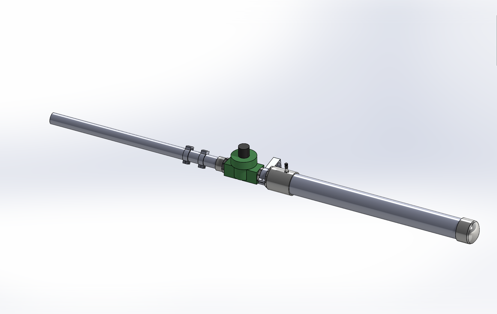

# Pneumatic Antenna Launcher

My design for a pneunatic antenna launcher.

Based on the many pre-existing designs on the web (see links at end). 
My goals were minimal component cost and simplicity, not necessarily maximum performance.

